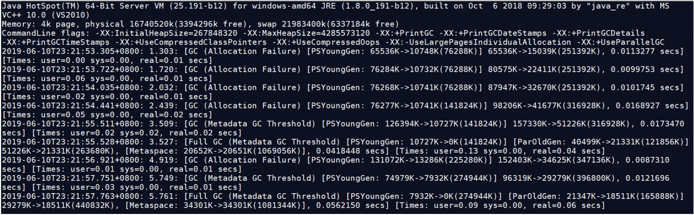
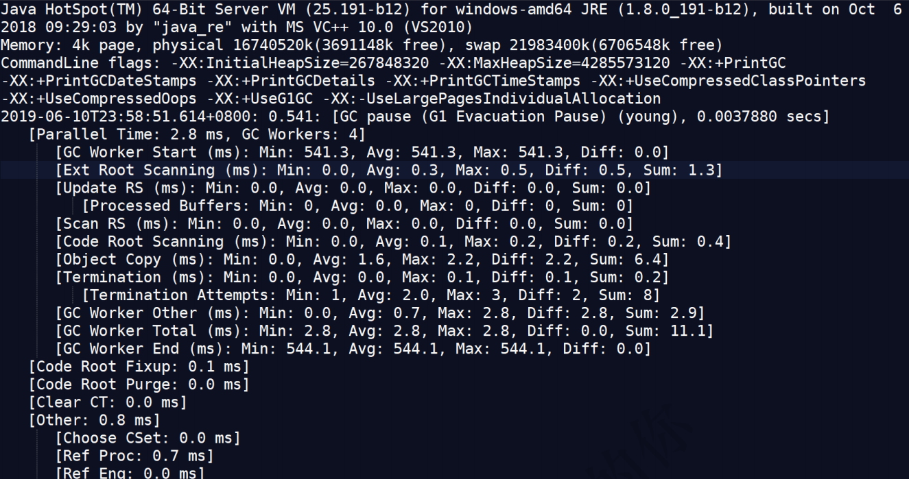
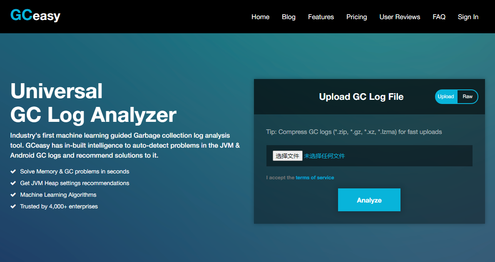
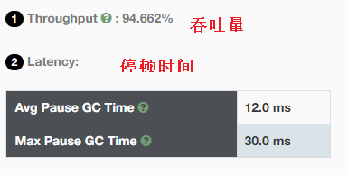
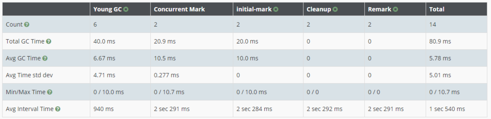
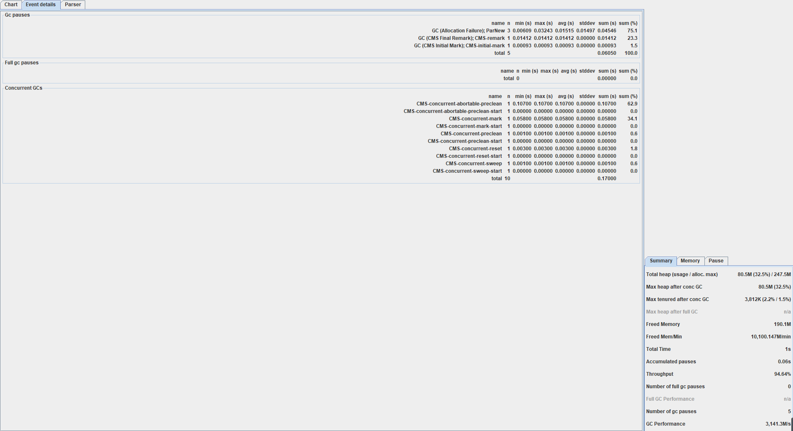
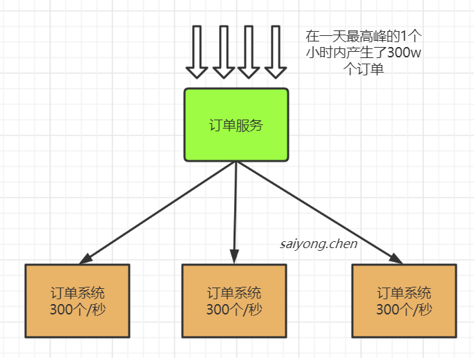
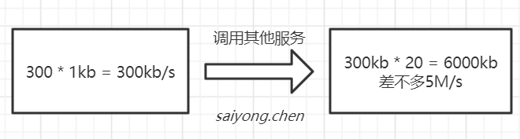
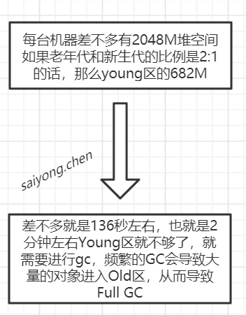

## 1. GC日志文件

当我们要对GC进行调优的时候，首先要拿到GC日志文件：

参数设置：

```
-XX:+PrintGCDetails -XX:+PrintGCTimeStamps -XX:+PrintGCDateStamps -Xloggc:gc.log
```


### 1.1 Parallel GC日志

【吞吐量优先】





解析：

```
2019-06-10T23:21:53.305+0800: 1.303:
[GC (Allocation Failure) [PSYoungGen: 65536K[Young区回收前]->10748K[Young区回收后] (76288K[Young区总大小])] 65536K[整个堆回收前]->15039K[整个堆回收后](251392K[整个堆总大小]), 0.0113277 secs] [Times: user=0.00 sys=0.00, real=0.01 secs]
```

**注意：如果回收的差值中间有出入，说明这部分空间是Old区释放出来的。**


### 1.2 CMS日志

【停顿时间优先】


参数设置：

```
-XX:+UseConcMarkSweepGC -Xloggc:cms-gc.log
```


### 1.3 G1日志

【停顿时间优先】


参数设置：

```
-XX:+UseG1GC -Xloggc:g1-gc.log
```





[G1日志格式](https://blogs.oracle.com/poonam/understanding-g1-gc-logs)解析：

```
-XX:+UseG1GC   # 使用了G1垃圾收集器

# 什么时候发生的GC，相对的时间刻，GC发生的区域young，总共花费的时间，0.00478s，
# It is a stop-the-world activity and all
# the application threads are stopped at a safepoint during this time.
2019-12-18T16:06:46.508+0800: 0.458: [GC pause (G1 Evacuation Pause) (young), 0.0047804 secs]

# 多少个垃圾回收线程，并行的时间
[Parallel Time: 3.0 ms, GC Workers: 4] 

# GC线程开始相对于上面的0.458的时间刻
[GC Worker Start (ms): Min: 458.5, Avg: 458.5, Max: 458.5, Diff: 0.0] 

# This gives us the time spent by each worker thread scanning the roots
# (globals, registers, thread stacks and VM data structures).
[Ext Root Scanning (ms): Min: 0.2, Avg: 0.4, Max: 0.7, Diff: 0.5, Sum: 1.7]

# Update RS gives us the time each thread spent in updating the Remembered Sets. [Update RS (ms): Min: 0.0, Avg: 0.0, Max: 0.0, Diff: 0.0, Sum: 0.0]

...
```


## 2. GC日志分析工具

### 2.1 gceasy：[官网](https://gceasy.io/)




打开GC日志文件：gc.log








### 2.2 GCViewer

[官网](https://github.com/chewiebug/GCViewer)


通过命令行运行，打开日志文件gc.log




## 3. G1调优与最佳指南

### 3.1 调优

1、是否选用G1垃圾收集器的判断依据，具体查看：[官方文档](https://docs.oracle.com/javase/8/docs/technotes/guides/vm/G1.html#use_cases)

```
1. 50%以上的堆被存活对象占用
2. 对象分配和晋升的速度变化非常大
2. 垃圾回收时间比较长
```


2、配置使用G1垃圾收集，并获取GC日志文件

```
-XX:+UseG1GC -Xloggc:g1-gc.log
```


3、使用GC日志文件分析吞吐量和响应时间

```
Throughput       Min Pause       Max Pause     Avg Pause       GC count
98.89%          0.00021s        0.01531s       0.00538s           12
```


4、然后按照要求不断将调整各种参数，获取gc日志分析

```
# 设置堆内存的大小
-XX:MetaspaceSize=100M
-Xms300M
-Xmx300M

# 设置最大停顿时间
-XX:MaxGCPauseMillis=20

启动并发GC时，堆内存占用百分比
-XX:InitiatingHeapOccupancyPercent=45

....
```


### 3.2 最佳指南

[官方建议](https://docs.oracle.com/javase/8/docs/technotes/guides/vm/gctuning/g1_gc_tuning.html#recommendations)

1. 不要手动设置新生代和老年代的大小，JVM会自己设置，只要设置整个堆的大小

2. 不断调优暂停时间目标，一般为100ms或者200ms，不建议设置的过短，导致G1收集的时候跟不上垃圾生产的速度

3. 使用`-XX:ConcGCThreads=n`来增加标记线程的数量

4. 适当增加堆内存的大小

5. MixedGC调优

   ```
   -XX:InitiatingHeapOccupancyPercent
   -XX:G1MixedGCLiveThresholdPercent
   -XX:G1MixedGCCountTarger
   -XX:G1OldCSetRegionThresholdPercent
   ```

   


## 4. 案例：高并发场景

假设我们有一个订单系统，每日可生产300w个订单。也就是说这个订单服务每天会在jvm中创建300w个订单对象。

假设现在我们整个订单服务有3台机器，也就是说每台机器分到100w个订单。

假设，这个300w个订单是，一天中最高峰的1个小时内产生的。那平均每台机器每秒是300个订单。





现在假设我们一个对象的大小为1kb，那么每秒将占用300kb的内存，同时也会调用其他服务产生对象假设其他服务为20个。那么就是在Young区每秒钟将被使用5M左右的空间。





假设每台机器都是4核8G的，除去其他的应用占用，分到java进程差不多3个G。然后加上什么方法区，栈啊之类的，分到堆差不多2个G。





解决方案：

1. 增大堆空间的大小
2. 调整Young区和Old的比例
3. 提高机器的配置，比如升级到8核16G
4. 增加机器数量，将服务部署到更多的机器上，来降低单台机器上的并发量


## 5. JVM性能优化指南

1、发现问题：

1. GC频繁
2. 死锁
3. OOM
4. 线程池不够用
5. CPU负载过高


2、排查问题

	1. 打印GC日志，通过日志工具，查看Minor/Major GC
 	2. 使用jstack查看线程堆栈信息
 	3. dump堆文件，使用MAT或者其他工具分析
 	4. 合理使用jdk自带的jconsole、jvisualve，阿里的Arthas等实时查看JVM的状态
 	5. 灵活应用jps，jinfo，jstat，jmap等常用命令


3、提出解决方案

1. 适当增加堆内存大小
2. 选择合适的垃圾收集器
3. 使用zk、redis实现分布式锁
4. 设置本地，nginx等缓存减少对后端服务器的访问
5. 后端代码优化即使释放资源
6. 合理设置线程池中的参数
7. 集群不是从而减少单节点的压力
8. 利用一些消息中间件，实现异步消息