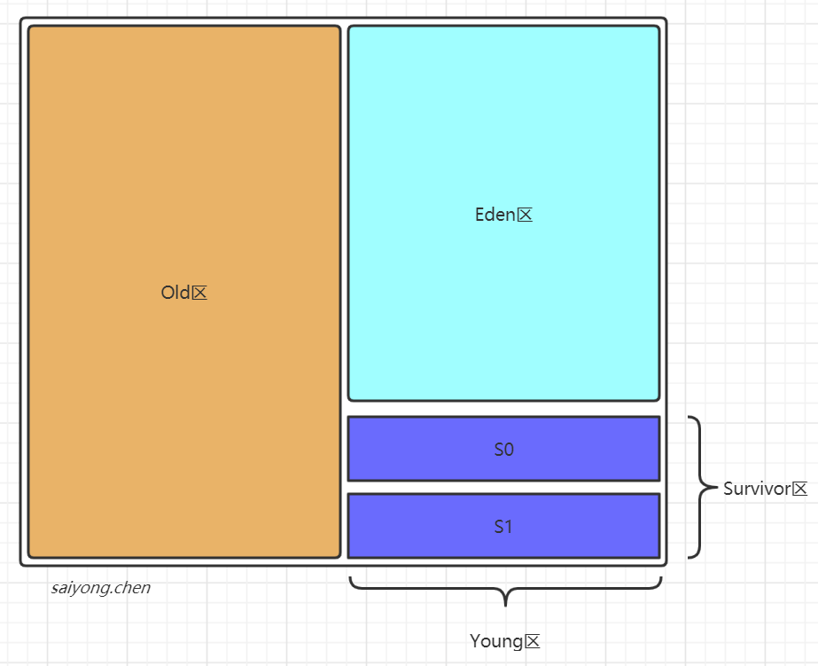
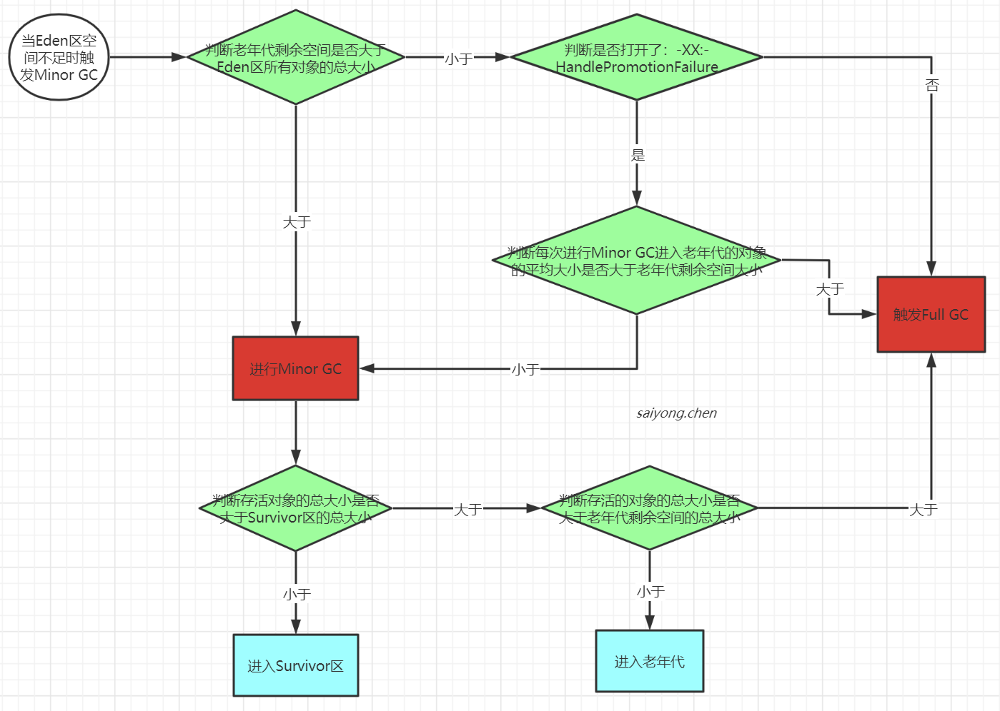
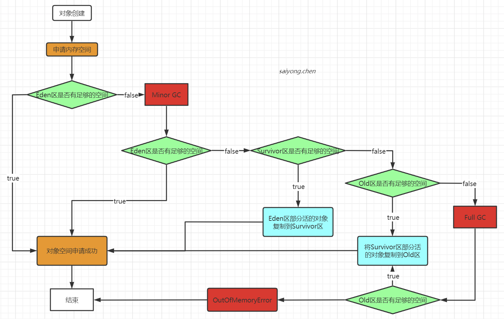

## Jvm内存模型

堆区分为两大块：Young区和Old区

Young区分为两大块：Eden区和Survivor区（s0+s1），Eden:s0:s1 = 8:1:1

### 1. Eden区

一般情况下，大部分的对象存活周期都极短，所以新创建的对象都会被分配到Eden区，一些特殊的对象会直接分配到Old区

> 比如：有三个对象A、B、C创建在Eden区，但是Eden区的内存空间肯定是有限的。加入Eden区被使用的容量已经到达了设置的临界值，这个时候就需要对Eden区内存空间进行清理，即垃圾手机，这样的GC我们成为Minor GC， Minor GC指的就是Young区的GC
>
> 经过GC之后，有些对象就会被清理掉，有些对象可能还活着，对于存货的对象需要复制到Survivor区，然后再清空Eden区中的这些对象

### 2. Survivor区

Survivor区有两块区域：s0和s1，这两块区域一样大，也可以叫From和To

在同一个时间点上，S0和S1只能有一个分区有数据，另一分区是空的。

> 接着上面的GC，当进行过一次GC后，还存活的对象中的年龄就会+1，并且Eden区所有存货的对象会被复制到To区，而From区中存活的对象有两个去处，一个是To区，一个是Old区。同时清空From区，然后交换两个区，To区变成From区，空的From区，变成To区。

### 3. Old区

Old区一般都是存放一些年龄比较大的对象，或者是对象比较大的对象。

什么样的对象会进入Old区呢？

1. 当对象的年龄到达15岁的时候，也就是经历过15次Young GC还存活的对象会进入垃圾回收。
2. 一些特别大的对象，会直接分配在Old区
3. 新生代垃圾回收之后，如果存活的对象过多，也会导致大量对象进入Old区
4. 动态年龄判断
5. 空间担保

#### 3.1 什么是动态年龄判断？

新生代GC过后，要转移存活对象进入空闲的那块survivor之前，会判断当前存活的对象所占比例是否大于survivor默认的50%空间，规则是从最小的年龄加起，直到加到某个年龄时，内存占比超过了50%，那么所有年龄大于等于这个年龄的对象就会被分配到老年代。

#### 3.2 什么空间担保机制？

在发生Minor GC之前，虚拟机会检查老年代最大可用的连续空间是否大于新生代所有对象的总空间，如果大于，就进行Minor GC。如果小于，则虚拟机会查看`HandlePromotionFailure`设置值是否允许担保失败。如果`HandlePromotionFailure=true`，那么会继续检查老年代最大可用连续空间是否大于以前每次进入老年代的对象的平均大小，如果大于，则尝试进行一次Minor GC，但这次Minor GC依然是有风险的；如果小于或者HandlePromotionFailure=false，则进行Full GC。

### 4 对象的内存空间申请

### 5. 常见问题

#### 5.1 为什么要分老年代和新生代？

这和垃圾回收有关系，在新生代中的对象，他们的特点就是创建之后很快就会被回收，所以需要一种垃圾回收算法

在老年代中的对象，他们的特点是需要长期存在，所以需要另一种垃圾回收算法

#### 5.2 如何理解Minor、Major和Full GC

- Minor GC：新生代的GC
- Major GC：老年代的GC
- Full GC：Minor + Major 

#### 5.3 为什么需要Survivor区？只有Eden区不可以吗？

首先我们的Java虚拟机针对新生代的垃圾回收，为了避免空间的碎片化问题，采用的算法是复制算法，当进行一次垃圾回收的时候，需要将存活的对象复制到另一个区域，保证存活对象之间的空间是连续的。然后清空之前的那个区域。

#### 5.4 为什么需要两个Survivor区？

为了提高空间的利用率。

