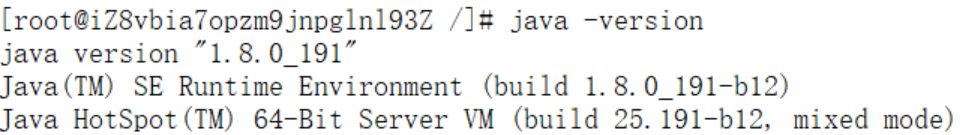
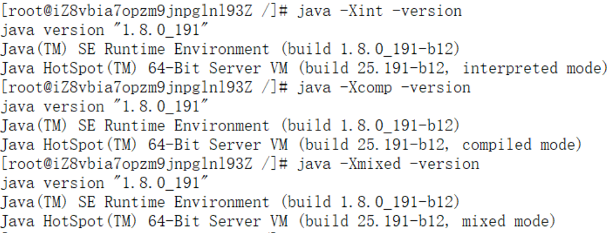
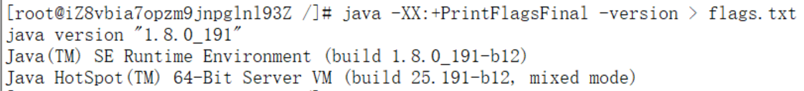
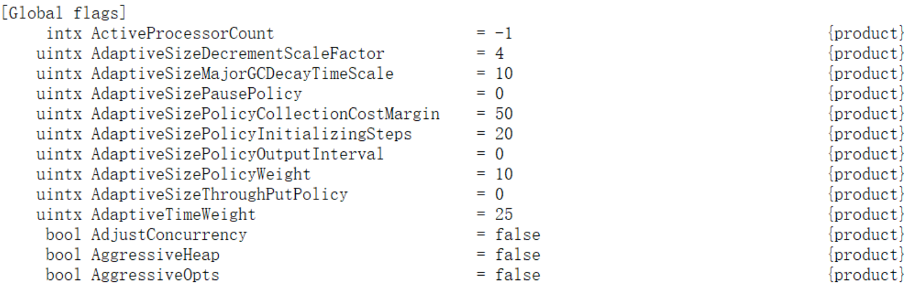

## 1. 标准参数

```
-version
-help
-server
-cp
```




## 2. -X参数

非标准参数，也就是在JDK各个版本中可能会变动

```
-Xint	//解释执行
-Xcomp	//第一次使用 编译成本地代码
-Xmixed	//混合模式，jvm自己来决定
```




## 3. -XX参数

使用的最多的参数类型

非标准化参数，相对不稳定，主要用于jvm调优和Debug

```
1、Boolean类型
	格式：-XX:[+/-]<name>				+/-：表示启用或者禁用name属性
	比如：-XX:+UseConCMarkSweepGC		表示启用CMS垃圾收集器
		 -XX:+UseG1GC				  表示启用G1垃圾收集器

2、非Boolean类型
	格式：-XX:<name>=<value>			表示设置name属性的值和value
	比如：-XX:MaxGCPauseMillis=500		表示设置最大的垃圾收集停顿时间
```


## 4. 其他参数

```
-Xms1000		等价于-XX:InitialHeapSize=1000
-Xmx1000		等价于-XX:MaxHeapSize=1000
-Xss100			等价于-XX:ThreadStackSize=100
```


## 5. 查看参数

```
java -XX:+PrintFlagsFinal -version > flags.txt 
```




查看flags.txt:





**说明：**

​	“`=`”表示默认值，“`:=`”表示被用户或者JVM修改后的值


## 6. 设置参数的方式

1. 在开发工具中设置，比如IDEA，或者Eclipse
2. 运行jar包的时候，`java -XX:UseG1GC xxx.jar`
3. web容器，比如tomcat，可以在脚本中进行设置
4. 通过jinfo实时调整某个java进程的参数（参数只有被标记为manageable的flags才可以被实时修改）


## 7. 常用参数的含义

| 参数                                                         | 含义                                                         | 说明                                                         |
| ------------------------------------------------------------ | ------------------------------------------------------------ | ------------------------------------------------------------ |
| -XX:CICompilerCount=3                                        | 最大并行编译数                                               | 如果设置大于1，虽然编译速度会提高，但是同样影响系<br/>统稳定性，会增加JVM崩溃的可能 |
| -XX:InitialHeapSize=100M                                     | 初始化堆大小                                                 | 简写-Xms100M                                                 |
| -XX:MaxHeapSize=100M                                         | 最大堆大小                                                   | 简写-Xmx100M                                                 |
| -XX:NewSize=20M                                              | 设置年轻代的大小                                             |                                                              |
| -XX:MaxNewSize=50M                                           | 年轻代最大大小                                               |                                                              |
| -XX:OldSize=50M                                              | 设置老年代大小                                               |                                                              |
| -XX:MetaspaceSize=50M                                        | 设置方法区大小                                               |                                                              |
| -XX:MaxMetaspaceSize=50M                                     | 方法区最大大小                                               |                                                              |
| -XX:+UseParallelGC                                           | 使用UseParallelGC                                            | 新生代，吞吐量优先                                           |
| -XX:+UseParallelOldGC                                        | 使用UseParallelOldGC                                         | 老年代，吞吐量优先                                           |
| -XX:+UseConcMarkSweepGC                                      | 使用CMS                                                      | 老年代，停顿时间优先                                         |
| -XX:+UseG1GC                                                 | 使用G1GC                                                     | 新生代，老年代，停顿时间优先                                 |
| -XX:NewRatio                                                 | 新老生代的比值                                               | 比如-XX:Ratio=4，则表示新生代:老年代=1:4，也就是新生代占整个堆内存的1/5 |
| -XX:SurvivorRatio                                            | 两个S区和Eden区的比值                                        | 比如-XX:SurvivorRatio=8，也就是(S0+S1):Eden=2:8，也就是一个S占整个新生代的1/10 |
| -XX:+HeapDumpOnOutOfMemoryError                              | 启动堆内存溢出打印                                           | 当JVM堆内存发生溢出时，也就是OOM，自动生成dump文件           |
| -XX:HeapDumpPath=heap.hprof                                  | 指定堆内存溢出打印目录                                       | 表示在当前目录生成一个heap.hprof文件                         |
| -XX:+PrintGCDetails <br/>-XX:+PrintGCTimeStamps <br /> -XX:+PrintGCDateStamps <br/>-Xloggc:$CATALINA_HOME/logs/gc.log | 打印出GC日志                                                 | 可以使用不同的垃圾收集器，对比查看GC情况                     |
| -Xss128k                                                     | 设置每个线程的堆栈大小                                       | 经验值是3000-5000最佳                                        |
| -XX:MaxTenuringThreshold=6                                   | 提升年老代的最大临界值                                       | 默认值为 15                                                  |
| -XX:InitiatingHeapOccupancyPercent                           | 启动并发GC周期时堆内存使用占比                               | G1之类的垃圾收集器用它来触发并发GC周期,基于整个堆的使用率,而不只是某一代内存的使用比. 值为 0 则表示”一直执行GC循环”. 默认值为 45. |
| -XX:G1HeapWastePercent                                       | 允许的浪费堆空间的占比                                       | 默认是10%，如果并发标记可回收的空间小于10%,则不会触发MixedGC。 |
| -XX:MaxGCPauseMillis=200ms                                   | G1最大停顿时间                                               | 暂停时间不能太小，太小的话就会导致出现G1跟不上垃 圾产生的速度。最终退化成Full GC。所以对这个参数的调优是一个持续的过程，逐步调整到最佳状态。 |
| -XX:ConcGCThreads=n                                          | 并发垃圾收集器使用的线程数量                                 | 默认值随JVM运行的平台不同而不同                              |
| -XX:G1MixedGCLiveThresholdPercent=65                         | 混合垃圾回收周期中要包括的旧区域设置                         | 占用率阈值，默认占用率为 65%                                 |
| -XX:G1MixedGCCountTarget=8                                   | 设置标记周期完成后，对存活数据上限为G1MixedGCLIveThresholdPercent 的旧区域执行混合垃圾回收的目标次数 | 默认8次混合垃圾回收，混合回收的目标是要控制在此目标次数以内  |
| -XX:G1OldCSetRegionThresholdPercent=1                        | 描述Mixed GC时，Old Region被加入到CSet中                     | 默认情况下，G1只把10%的Old Region加入到CSet中                |


