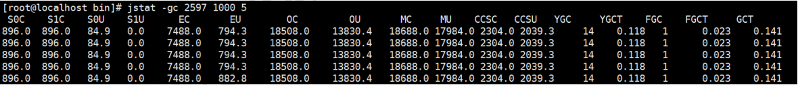

## 1. jps

查看java进程


## 2. jinfo

实时查看和调整jvm配置参数

1、查看参数

```
jinfo -flag MaxHeapSize PID
jinfo -flag UseG1GC PID
```


2、修改JVM参数

```
jinfo -flag [+/-]<name> PID
jinfo -flag <name>=<value> PID
```

注意：只有被标记为manageable的flag才可以被实时修改


3、查看曾经赋值过的一些参数

```
jinfo -flags PID
```


## 3. jstat

查看虚拟机性能统计信息

1、查看类装载信息

```
jstat -class PID 1000 10		//查看某个java进程的类装载信息，每1000毫秒输出一次，共输出10次
```


2、查看垃圾收集信息

```
jstat -gc PID 1000 10
```



- S0C：s0区的容量，以kb为单位
- S1C：s1区的容量，以kb为单位
- S0U：s0区的已经使用的容量，以kb为单位
- S1U：s1区的已经使用的容量，以kb为单位
- EC：Eden区的容量，以kb为单位
- EU：Eden区已经被使用的容量，以kb为单位
- OC：Old区的容量，以kb为单位
- OU：Old区已经被使用的容量，以kb为单位
- MC：元数据区的容量，以kb为单位
- MU：元数据区已经被使用的容量，以kb为单位
- YGC：迄今为止Young GC的次数
- YGCT：到目前为止Young GC花费的时间
- FGC：迄今为止Full GC的次数
- FGCT：到目前为止Young GC花费的时间
- GCT：到目前为止GC花费的总时间


## 4. jstack

查看线程堆栈信息

```
jstack PID
```


**案例：排查死锁**

1、编写DeadLockDemo

```java
public class DeadLockDemo {
	public static void main(String[] args)  {
        DeadLock d1  =new DeadLock(true);
        DeadLock d2=new DeadLock(false);
        Thread t1=new Thread(d1);
        Thread t2=new Thread(d2); 
        t1.start();
        t2.start();
	}
}

//定义锁对象
class MyLock{
	public static Object obj1=new Object();
	public static Object obj2=new Object();
}

//死锁代码
class DeadLock implements Runnable{ 
	private boolean flag;
	DeadLock(boolean flag){
        this.flag=flag;
 	}
   	public void run() {
        if(flag) {
           while(true) {
               synchronized(MyLock.obj1) {
                   System.out.println(Thread.currentThread().getName()+"----if 获得obj1锁");
                   synchronized(MyLock.obj2) {
                       System.out.println(Thread.currentThread().getName()+"--- -if获得obj2锁");
           			}
               }
           }    
        } else {
           while(true){
               synchronized(MyLock.obj2) {
                   System.out.println(Thread.currentThread().getName()+"----else 获得obj2锁");
                   synchronized(MyLock.obj1) {
                       System.out.println(Thread.currentThread().getName()+"----else 获得obj1锁");
                   } 
               }
       		}
        }
 	}
}
```


2、jstack分析


## 5. jmap

生成堆栈存储的快照


1、打印堆内存相关信息

```
-XX:+PrintFlagsFinal -Xms300m -Xmx=300m
jmap -heap PID
```


2、dump堆内存相关信息

```
jmap -dump:format=b,file=heap.hprof PID
```


3、设置在发生堆内存溢出的时候，自动dump

```
-XX:+HeapDumpOnOutOfMemoryError -XX:HeapDumpPath=heap.hprof
```

