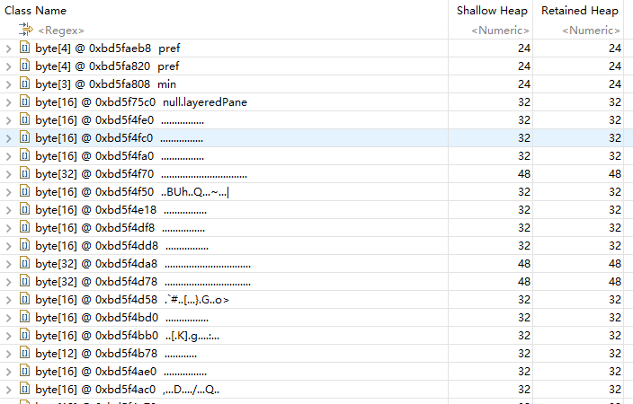

## 1. jconsole

JConsole工具是JDK自带的可视化监控工具。查看java应用程序的运行概况、监控堆信息、永久区使用 情况、类加载情况等。

使用：在命令行输入`jconsole`


## 2. jvisualvm


### 2.1 监控远端java进程

比如：监控远端Tomcat，演示部署在阿里云上的tomcat

1. 在jvisualvm中选中“远程”，右击"添加"
2. 填写主机名（ip地址）,比如：31.100.39.63
3. 右击主机”31.100.39.63“，添加”JMX"。也就是通过JMX技术具体监控远端服务器哪个java进程
4. 修改tomca配置，`bin/catalina.sh`

```
JAVA_OPTS="$JAVA_OPTS -Dcom.sun.management.jmxremote -Djava.rmi.server.hostname=31.100.39.63 -Dcom.sun.management.jmxremote.port=8998 -Dcom.sun.management.jmxremote.ssl=false -Dcom.sun.management.jmxremote.authenticate=true -Dcom.sun.management.jmxremote.access.file=../conf/jmxremote.access -Dcom.sun.management.jmxremote.password.file=../conf/jmxremote.password"
```

> 注意：端口不要和其他应用有冲突


5. 在`../conf`文件夹中添加两个文件`jmxremote.access`和`jmxremote.password`，并添加授权`chmod`

> jmxremote.access 文件
>
> ```
> guest readonly
> manager readwrite
> ```

> jmxremote.password 文件
>
> ```
> guest guest
> manager manager
> ```


6. 将连接服务器地址改为公网IP地址

```
hostname -i		查看输出情况
	172.26.225.240 172.17.0.1
vim /etc/hosts
	172.26.255.240 31.100.39.63
```


7. 设置阿里云安全策略和防火墙策略
8. 启动tomcat

```
./startup.sh
```


9. 查看tomcat启动日志以及端口监听

```
tail -f ../logs/catalina.out
lsof -i tcp:8080
```


10. 查看㐰监听情况，可以发现多开了几个端口

```
lsof -i：8998	得到PID
netsatat -antup | grep PID
```


11. 在JMX中输入8998端口，并输入用户名和密码


## 3. Arthas


**下载安装**

```
curl -O https://alibaba.github.io/arthas/arthas-boot.jar
java -jar arthas-boot.jar
# 然后可以选择一个Java进程
```


print usage

```
java -jar arthas-boot.jar -h
```


常用命令：具体查看[官方文档](https://arthas.aliyun.com/doc/)

```
version:查看arthas版本号
help:查看命名帮助信息
cls:清空屏幕
session:查看当前会话信息
quit:退出arthas客户端
---
dashboard:当前进程的实时数据面板
thread:当前JVM的线程堆栈信息
jvm:查看当前JVM的信息
sysprop:查看JVM的系统属性
---
sc:查看JVM已经加载的类信息
dump:dump已经加载类的byte code到特定目录
jad:反编译指定已加载类的源码
---
monitor:方法执行监控 
watch:方法执行数据观测
trace:方法内部调用路径，并输出方法路径上的每个节点上耗时
stack:输出当前方法被调用的调用路径
......
```


## 4. MAT

JAVA堆分析器，用于查找内存泄漏

[下载地址](https://www.eclipse.org/mat/downloads.php)


**使用：**

1、获取Dump文件

```
# 手动获取
jmap -dump:format=b,file=heap.hprof PID
# 自动获取
-XX:+HeapDumpOnOutOfMemoryError -XX:HeapDumpPath=heap.hprof
```


2、打开dump下来的文件


- **Histogram：（列出内存中的对象，对象的个数以及大小）**

  


```
class name：java类名
objects：类的对象的数量
shallow heap：一个对象内存消耗大小，不包含对其他对象的引用
Retained heap：是shallow heap的总和
```


> 右击类名--->List Objects--->with incoming references--->列出该类的实例




- **Leak Suspects：查找并分析内存泄漏的可能原因**

- **Top Consumers：列出大对象**


