## 1. 如何确定一个对象是垃圾？

### 1.1 引用计数法

对于某个对象而言，只要应用程序中持有该对象的引用，就说明该对象不是垃圾，如果一个对象没有任何指针对其引用，它就是垃圾。


**弊端：**如果AB两个对象相互持有对方的引用，就会导致这个两个对象永远不会被回收。


### 1.2 可达性分析

通过GC Root的对象，开始向下寻找，看看某个对象是否可达，如果某个对象不可达，那就表示它是垃圾。


可以作为GC Root的有：

	1. 类加载器
 	2. Thread
 	3. 虚拟机栈中的本地变量表
 	4. static成员
 	5. 常量引用
 	6. 本地方法栈


## 2. 垃圾收集算法

### 2.1 标记-清除

1、标记

找出内存中需要回收的对象，并且把它们标记出来


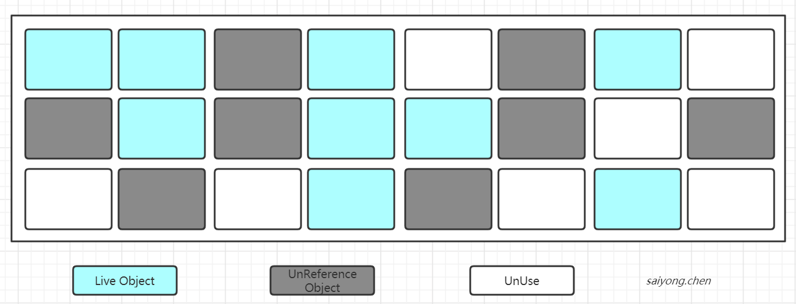


2、清除

清除被标记的对象，释放对应的内存空间


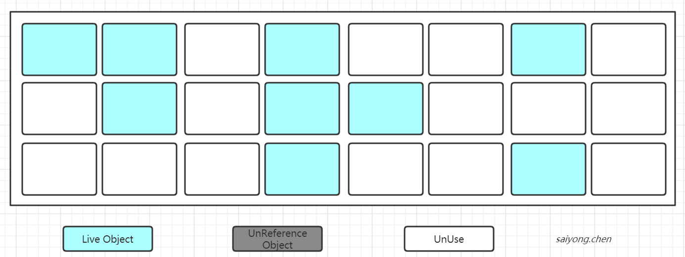


**缺点：**

1. 标记清除之后会导致产生大量不连续的内存碎片，空间碎片太多可能会导致以后在程序运行的过程中需要分配较大对象的时候，无法找到足够的连续的内存来存储，而不得不触发一次垃圾回收动作
2. 标记和清除两个过程比较耗时，效率低


### 2.2 复制

将内存划分为两块相等的区域，每次只使用其中的一块


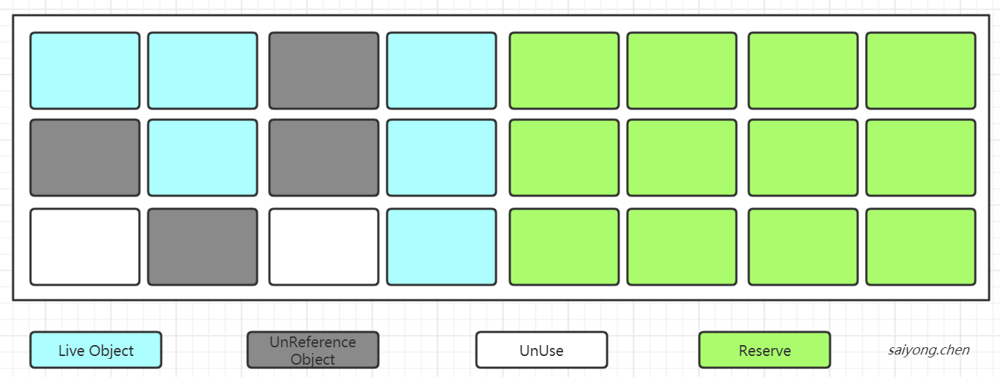


当其中的一块使用完了，就将还存活的对象复制到另一块空闲的区域上，然后把之前使用过的内存空间中的所有对象清除。


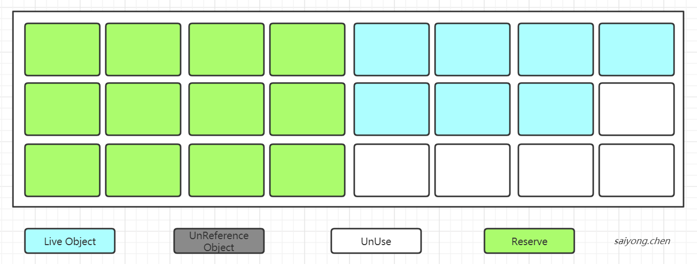


**缺点：**

- 空间利用率低


### 2.3 标记整理

标记的过程和标记-清除算法一样，但是后续整理的阶段就是将所有存活的对象都向一端移动，然后直接清除掉端边界意外的内存


整理阶段：


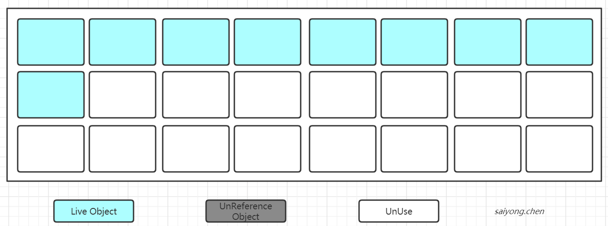


### 2.4 分代收集

Young区：复制算法

Old区：标记清除或者标记整理算法


## 3. 垃圾收集器

### 3.1 垃圾收集器的分类

- 串行收集器：Serial 、 Serial Old
  - 只能有一个垃圾回收线程执行，用户线程暂停。
  - 适用于内存比较小的嵌入式设备
- 并行收集器（吞吐量优先）：Parallel Scanvenge、Parallel Old
  - 多条垃圾线程并行工作，但此时用户线程仍然处于等待状态
  - 适用于科学计算，后台处理等交互场景
- 并发收集器（停顿时间优先）：CMS、G1
  - 用户线程和垃圾收集线程同时执行（不一定是并行的，可能是并发的）
  - 适用于相对时间有要求的场景，比如web


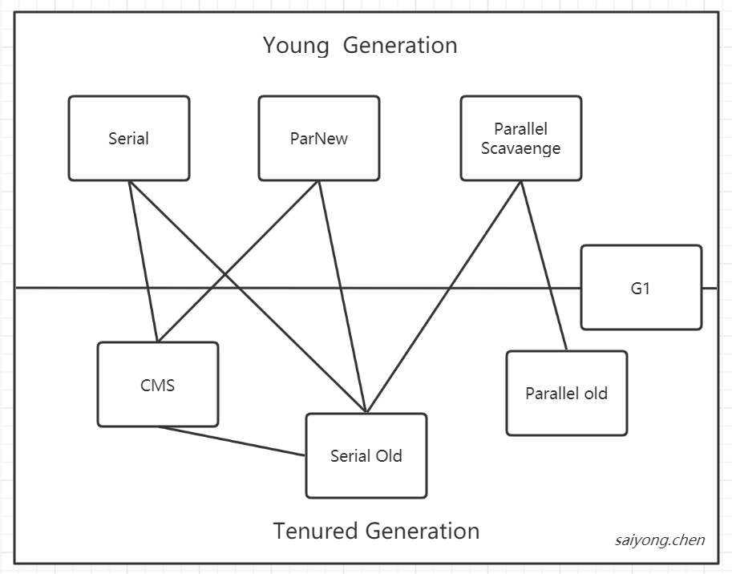


**吞吐量和停顿时间：**

- 吞吐量：运行用户代码时间 / （运行用户代码时间 + 垃圾收集时间）
- 停顿时间：垃圾收集器进行垃圾回收终端应用执行响应的时间

> 停顿时间越短越适合需要和用户交互的程序，良好的响应速度能提升用户体验
>
> 吞吐量可以高效的利用cpu，尽快的完成程序的运算任务，主要适合在后台运算而不需要太多交互的任务。


### 3.2 Serial收集器

Serial收集器是最早的收集器，在JDK1.3.1之前是虚拟机新生代收集的唯一选择。


它是一种单线程收集器，不仅意味着它只会使用一个cpu或者一条收集线程去完成垃圾收集工作，更重要的是它在进行垃圾收集的过程中需要暂停其他线程。


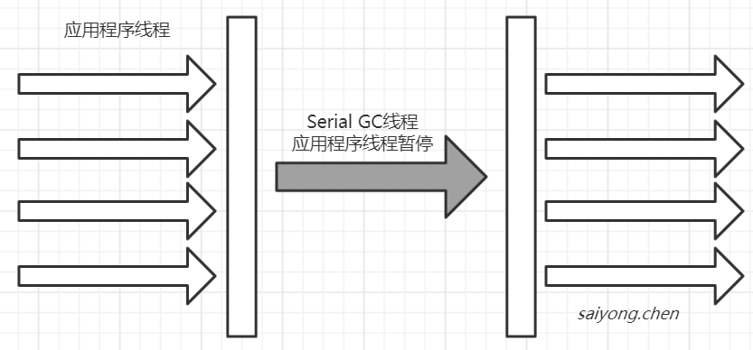


优点：简单、拥有很高的单线程收集效率

缺点：收集过程需要暂停所有线程

算法：复制算法

适用范围：新生代

应用：Client模式下新生代默认的收集器


### 3.3 ParNew收集器

可以理解为Serial收集器的多线程版本


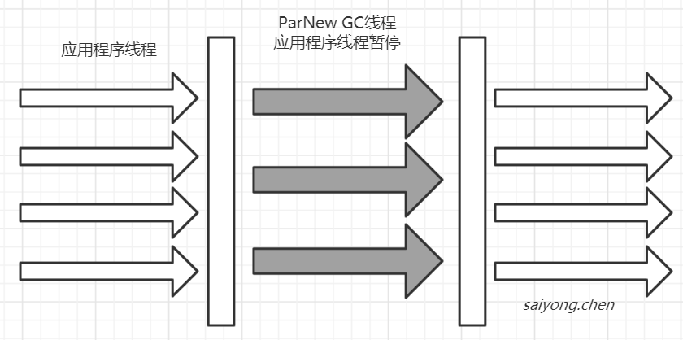


优点：在多CPU设备下，比Serial效率高

缺点：收集过程会暂停所有的应用程序线程，单Cpu时比Serial效率低

算法：复制算法

适用范围：新生代

应用：运行在Server模式下的虚拟机新生代首选的收集器


### 3.4 Parallel Scaven收集器

Parallel Scaven收集器也是一个新生代的收集器，也是使用复制算法的收集器，但是它是并行的多线程收集器。是ParNew的并行版本，更关注`系统的吞吐量`

> 比如虚拟机总共运行了100分钟，垃圾收集共花费了1分钟，那这个虚拟的的吞吐量 = （100 - 1） / 100 = 99%


JVM参数：

```
-XX:MaxGCPauseMillis   	//最值最大的垃圾收集停顿时间
-XX:GCTimeRatio			//直接设置吞吐量的大小
```


### 3.5 Serial Old收集器

Serial Old收集器是Serial的老年代版本，也是一个单线程收集器，和Serial收集器不同的是，它采用的是“标记-整理”算法


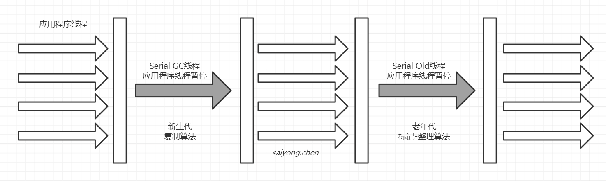


### 3.6 CMS收集器

CMS（Concurrent Mar Sweep）收集器关注`最短回收停顿时间`的收集器。

采用的“标记-清除”算法，整个过程分为4步：

1. 初始标记（CMS initial mark）：标记GC Root能关联到的对象，会Stop The world，特点速度快
2. 并发标记（CMS concurrent mark）：进行GC Roots Tracing
3. 重新标记（CMS remark）：修改并发标记因为用户程序变动的内容，会Stop The World
4. 并发清除（CMS concurrent sweep）


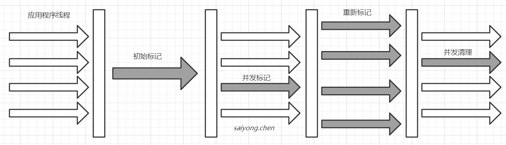


总的来说，整个过程并发标记和并发清理的线程是和用户线程一起工作的，也就是一起并发执行的。


优点：并发收集，低停顿

缺点：产生大量空间碎片，并发阶段会降低吞吐量


### 3.7 Parallel old收集器

Parallel Old收集器是Parallel Scavenge 收集器的老年代版本，使用多线程和“标记-整理”算法进行垃圾回收。和Parallel Scavenge一样关注吞吐量


### 3.8 G1收集器

JDK9默认的收集器，适用于新老年代。

使用G1收集器的时候，Java堆的内存布局与其他收集器有很大的差别，他会将整个Java堆划分成多个大小相等的独立的区域（Region），虽然还保留了新生代和老年的概念，但是新生代和老年代不再是物理隔离的了，他们都是一部分Region的集合（不需要要连续）。


收集过程：

1. 初始标记：标记一下GC Root能够关联的对象，并且修改TAMS的值，需要暂停用户线程
2. 并发标记：从GC Root进行可达性分析，找出存活的对象，与用户线程并发执行
3. 最终标记：修正在并发标记阶段因为用户程序的并发导致变动的数据，需要暂停用户线程
4. 筛选回收：对各个Region的回收价值和成本进行排序，根据用户所期望的GC停顿时间制定回收计划


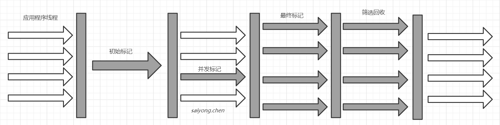


特点：

1. 并行与并发
2. 分代收集：仍然保留了分代的概念
3. 空间整合：整体属于“标记-整理”算法，不会导致空间碎片
4. 可预测的停顿时间：和CMS相比，可以设置一个垃圾收集的时间，收集的时间不会操作这个设定的值


## 4. 如何选择合适的垃圾收集器

1. 优点调整堆的大小让服务器自己选择
2. 如果内存小于100M，使用串行收集器
3. 如果是单核，并且没有停顿时间的要求，使用串行收集器或者让JVM自己选
4. 如果允许停顿时间超过1秒，选择并行收集器或者让JVM自己选
5. 对于响应时间有要求的，并且不能超过1秒的，使用并发收集器


## 5. 如何开启需要的来及收集器

```
1. 串行
	-XX:+UseSerialGC
	-XX:+UseSerialOldGC
2、并行
	-xx:UseParallelGC
	-xx:UseParallelOldGC
3、并发收集器
	-xx:UseConCMarkSweepGC
	-xx:UseG1GC
```

