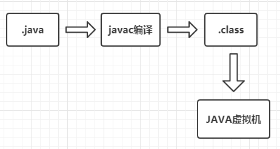
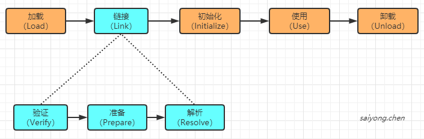
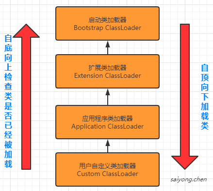

当我们编写好java代码运行的时候，首先需要将`.java`文件编译成字节码`.class`文件，然后将这个字节码文件加载到jvm中运行。





## 1. 类文件结构

```
ClassFile {
    u4             magic;
    u2             minor_version;
    u2             major_version;
    u2             constant_pool_count;
    cp_info        constant_pool[constant_pool_count-1];
    u2             access_flags;
    u2             this_class;
    u2             super_class;
    u2             interfaces_count;
    u2             interfaces[interfaces_count];
    u2             fields_count;
    field_info     fields[fields_count];
    u2             methods_count;
    method_info    methods[methods_count];
    u2             attributes_count;
    attribute_info attributes[attributes_count];
}
```

具体可以查看：[官方文档](https://docs.oracle.com/javase/specs/jvms/se8/html/jvms-4.html)  #The `class` File Format


## 2. 类加载机制

一个类的完整的生命周期：





而类的加载过程主要是：加载 -> 链接 -> 初始化


### 2.1 加载

就是将字节码`.class`文件通过加载器加载到Java虚拟机的过程。

主要分为3步：

1. 通过一个类的全限定名获取定义此类的二进制字节流
2. 将这个字节流所代表的的静态存储结构转换为方法区的运行时数据结构
3. 在java堆中生成一个代表这个类的`java.lang.Class`对象，作为对方法区中这些数据的访问入口


### 2.2 链接

#### 2.2.1 验证

主要是为了保证加载类的正确性

1. 文件格式的验证：验证字节流是否符合class文件格式的规范
2. 元数据验证：对字节码描述的信息进行语义分析
3. 字节码验证：通过数据流和控制流分析，确定程序予以是合法的、符合逻辑的
4. 符号引用验证：确保解析动作能正确执行


#### 2.2.2 准备

给类的静态变量（static修饰的变量）分配内存，并进行默认初始化


基本数据类型的默认值：


#### 2.2.3 解析

把类中的符号引用转换为直接引用


### 2.3 初始化

类初始化的情况：

1. 当遇到new、getstatic、pustatic或者invokestatic这4个字节码指令的时

2. 使用java.lang.reflect包的方法对类进行反射调用时

3. 初始化一个类，如果父类还没有初始化，对父类进行初始化

4. 当虚拟器启动的时候，对用户定义的主类（包含main方法），进行初始化

   

## 3. 类加载器

在加载阶段，将字节码文件加载到Java虚拟机需要借助类加载器来完成。也就是加载过程中的第一步。


### 3.1 分类

| 名称                    | 说明                                                         |
| ----------------------- | ------------------------------------------------------------ |
| Bootstrap ClassLoader   | 负责加载\$JAVA_HOME\$中, jre/lib/rt.jar 里面所有的class或者xbootclassoath选项指定的jar包 |
| Extension ClassLoader   | 负责加载java平台中扩展功能的一些jar包，包括\$JAVA_HOME\$中jre/lib/*.jar或 -Djava.ext.dirs指定目录下的jar包 |
| Application ClassLoader | 负责加载classpath中指定的jar包及    Djava.class.path 所指定目录下的类和 jar包 |
| Custom ClassLoader      | 通过java.lang.ClassLoader的子类自定义加载class，用户自定义的ClassLoader，如tomcat、jboss都会根据j2ee规范自行实现ClassLoader。 |


### 3.2 双亲委派机制

每个类都有属于自己的加载器，系统中的ClassLoader在协同工作的时候会按顺序自底向上进行加载，从Custom Cloader 到 Bootstrap ClassLoader 逐层检查，只要某个ClassLoader已经加载了，就表示已经加载了。这是就是双亲委派机制，为了保证所有的类只加载一次。




**好处：**

java类随着加载它的加载器一起具备了一种带有优先级的层次关系。比如，java中的Object类，它存放在rt.jar包中，无论哪个一个加载器都要加载它丢回委派给启动类加载器加载，因此Object在各种类加载环境中都是同一个类。但是如果不采用双亲委派的模式，那么各个加载器都自己加载的话，系统中会存在很多不同的Object类。


**破坏：**可以继承ClassLoader类，然后重写其中的loadClass方法。


