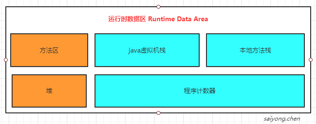
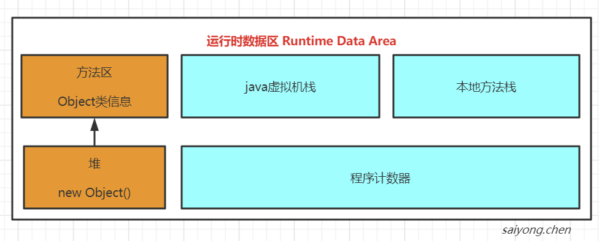
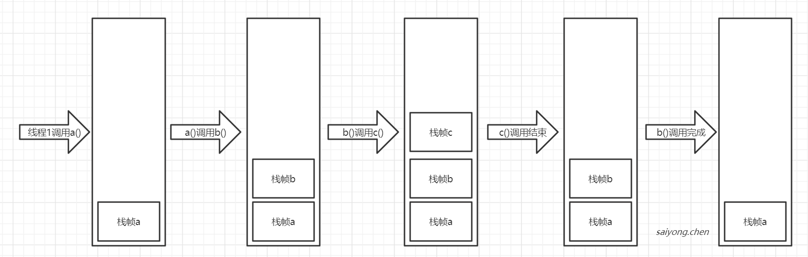
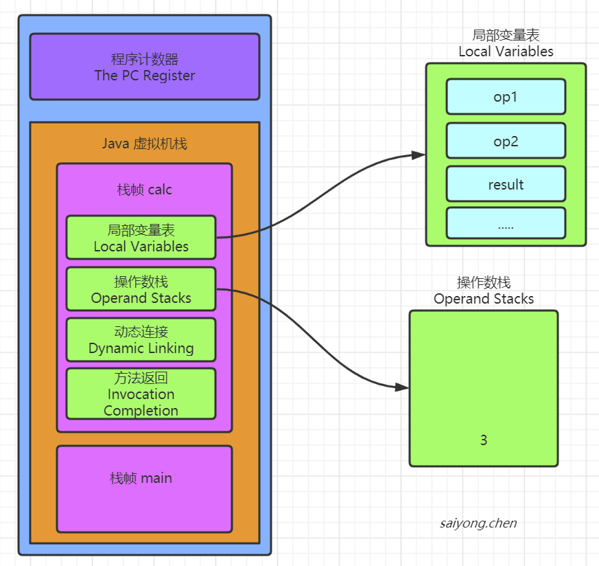
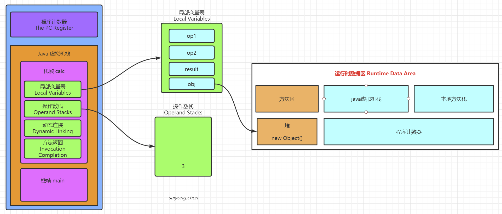

## 1. 运行时数据区

类文件通过加载器加载到Java虚拟机中的，需要将装在进来的内容（比如变量，常量、方法等）存储起来，存在java虚拟机中对应的空间。




具体可以查看：[官方文档](https://docs.oracle.com/javase/specs/jvms/se8/html/index.html)


### 1.1 方法区（Method Area）

方法区是各个线程共享的内存区域，在虚拟机启动时创建。用于存储已被虚拟机加载的类型，常量、静态变量、即使编译器编译后的代码等数据。

虽然Java虚拟机规范把方法区描述为堆的一部分，但是他有一个别名叫做Non-Heap（非堆），目的是为了和java堆区分开。


当方法区的内存无法满足分配需求的时候，会抛出`OutOfMemoryError`


说明：

1、在Jdk6或者7的时候就是永久代Perm Space， 在Jdk8的时候被改为了Meatespce，放在了堆外。


#### 1.1.1 方法区指向堆

```
private static Object obj = new Object();
```


### 1.2 堆（Heap）

java虚拟机管理内存中最大的一块，在虚拟机启动的时候创建，被所有线程共享。用于分配java对象实例和数组。


#### 1.2.1 堆指向方法区




### 1.3 java 虚拟机栈（Java Virtual Machine Stacks）

虚拟机栈是一个线程执行的区域，保存着一个线程中方法的调用状态。是线程私有的，随着线程的创建创建。

每一个被线程执行的方法，为该栈中的一个栈帧，即每个方法对应一个栈帧。


当调用一个方法的时候，就会向栈中压入一个栈帧。当一个方法调用完成后，就会把该栈帧从栈中弹出。





#### 1.3.1 栈帧

每个栈帧中有：

1. 局部变量表（Local Variables）：方法中定义的局部变量以及方法的参数存放在这张表中。局部变量表中的变量不可以直接使用，需要通过相关指令加载到操作数栈中作为操作数使用
2. 操作数栈（Operand stack）：通过压栈和出栈的方法存储操作数
3. 动态连接（Dynamic Linking）：每个栈帧都包含一个指向运行时常量池中该栈帧所属方法的引用，持有这个引用是为了支持方法调用过程中的动态连接
4. 方法返回地址（Return Address）：当一个方法开始执行后，只有两种方式可以推出，一种是遇到方法返回的字节码指令，一种是遇到异常，并且这个异常没有在方法体内得到处理


示例：

```java
class Person{
    
    private String name="sinclair";   
    private int age;
	private final double salary=100;
    private static String address;
   	private final static String hobby="Programming";
    
    public void say(){
       System.out.println("person say...");
    }
    
   	public static int calc(int op1,int op2){
        op1=3;
       	int result=op1+op2;
        return result;
 	}
    
   	public static void order(){}
    
	public static void main(String[] args){
        calc(1,2);
       order();
    }
}
```


将上述代码进行反编译：

```
Compiled from "Person.java"
class Person {
...          
 public static int calc(int, int);
 	Code:
      0: iconst_3     //将int类型常量3压入[操作数栈]
      1: istore_0     //将int类型值存入[局部变量0]
      2: iload_0      //从[局部变量0]中装载int类型值入栈
      3: iload_1      //从[局部变量1]中装载int类型值入栈
      4: iadd         //将栈顶元素弹出栈，执行int类型的加法，结果入栈
      【For example, the iadd instruction (§iadd) adds two int values together. It requires that the int values to be added be the top two values of the operand stack, pushed there by previous instructions. Both of the int values are popped from the operand stack. They are added, and their sum is pushed back onto the operand stack. Subcomputations may be nested on the operand stack, resulting in values that can be used by the encompassing computation.】
      5: istore_2     //将栈顶int类型值保存到[局部变量2]中
      6: iload_2      //从[局部变量2]中装载int类型值入栈
      7: ireturn      //从方法中返回int类型的数据
... 
}
```


如图：





#### 1.3.2 栈帧指向方法区

如果栈帧中有一个变量，类型为引用类型，比如Object obj = new Object()，这个时候就是典型的栈帧指向堆中的对象。




### 1.4 本地方法栈（Native Method Stacks）

如果当前线程执行的方法是Native类型的，这些方法就会在本地方法栈中执行。


### 1.5 程序计数器（The pc Register）

Java虚拟机的多线程是通过线程轮流切换，并抢占处理器执行时间的方式来实现的，在任意时刻，一个处理器只会执行一条线程中的指令。因此，为了线程切换后能够恢复到正确的执行位置，每条线程都有一个程序计数器来记录当前线程执行到程序的哪个位置（字节码指令地址）。是线程私有的。

