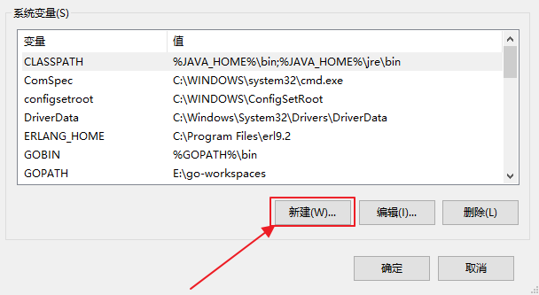
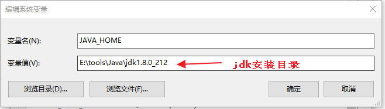

# 1. JRE

Java虚拟机（jvm）, 它是核心，但是要运行一个Java程序，核心有可能还不够，他还得需要一些相关的核心辅助工具。这个辅助工具我们把他们称为核心类库，这里面存放的程序所需要的最基本的和最核心的内容。

==JVM和核心类库就组成了JRE.==

有了JRE，我们就可以在计算机上面运行Java程序了。但是我们学习Java不是要运行的，我们要做开发的。

==总结：JRE只是负责运行Java程序的。==

# 2. jdk

jdk是提供给java开发人员使用的

==注意：JDK中包含了JRE。所以安装完JDK我们就不用安装JRE了。==

# 2. 下载jdk

官方网址：[www.oracle.com](http://www.oracle.com/) 。

# 3. 安装

## 3.1 window安装 双击.exe文件

## 3.2 安装完成后 jdk目录机构

# 4. 测试

- 点击bin目录下的.exe执行文件

- 通过命令行的方式运行

  - 打开命令行（必须在bin目录下）

    

  - 执行java指令

    

注意：

​	如果出现下面的问题，说明jdk安装有问题，需要重新安装：

​	

# 5. 配置环境变量

**需求：希望在任何的目录下都可以运行我们安装的jdk中bin目录下的程序**

在操作系统中有一个path变量，在这个变量中可以配置任何目录下可以直接运行的程序。把上面的应用程序路径放在path变量中。

## 5.1 path环境变量

>  path环境变量是系统环境变量中的一种.它用于保存一系列的路径.每个路径之间以分号隔开.这个路径记录的就是应用程序的路径。(.exe文件)
>
> 当在命令行运行一个可执行文件时,操作系统首先会在当前目录下查找是否存在该文件,如果不存在会继续在path环境变量中定义的路径下寻找这个文件.如果仍未找到.系统会报错.

## 5.2 永久性配置

配置完环境变量之后重新开一个命令行窗口（任意目录下），输入Java或者javac，如果有如下提示信息，则配置成功。

