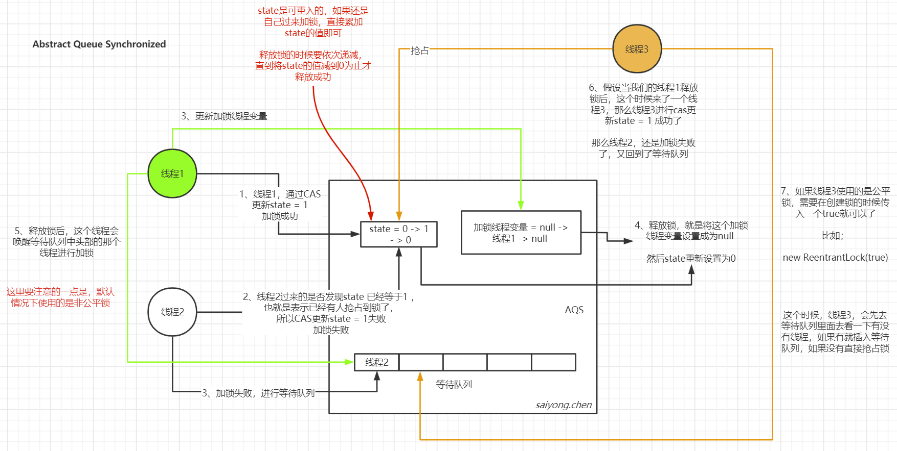
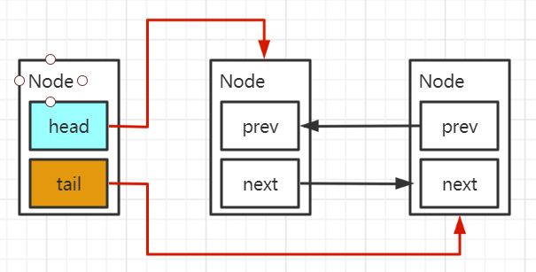
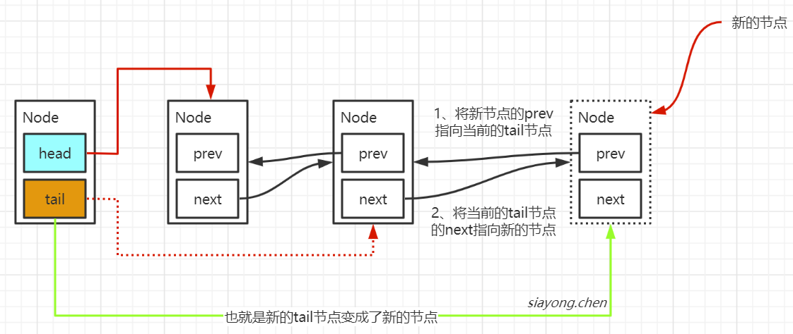
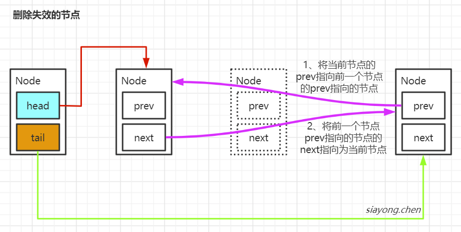

## 1. AQS简介

AQS，全称`AbstractQueuedSynchronizer`，它是一个同步工具也是Lock用来实现线程同步的核心组件。


AQS的两种功能：

1. 独占锁：每次只有一个线程持有锁，比如ReentrantLock
2. 共享锁：允许多个线程同时获取锁，并发访问共享资源，比如ReentrantReadWriteLock


### 1.1 AQS的原理图




### 1.2 AQS中的Node

AQS队列的内部是一个FIFO的双向链表，这种数据结构的特点就是每个节点（Node）都有两个指针，分别指向前一个节点和后一个节点。



其中每个节点都是由线程封装，当线程争抢锁失败后，就会将自己封装成一个Node节点加入到队列中去。


#### 1.2.1 Node源码

```java
static final class Node {
    //共享节点和独占节点
    static final Node SHARED = new Node();
    static final Node EXCLUSIVE = null;

    //节点等待状态具体常量
    static final int CANCELLED =  1;
    static final int SIGNAL    = -1;
    static final int CONDITION = -2;
    static final int PROPAGATE = -3;

    //等待状态
    volatile int waitStatus;

    //前一个节点和后一个节点
    volatile Node prev;
    volatile Node next;

    //当前线程
    volatile Thread thread;

    Node nextWaiter;

    //判断是否为共享节点
    final boolean isShared() {
        return nextWaiter == SHARED;
    }

    final Node predecessor() throws NullPointerException {
        Node p = prev;
        if (p == null)
            throw new NullPointerException();
        else
            return p;
    }

    Node() {    // Used to establish initial head or SHARED marker
    }

    Node(Thread thread, Node mode) {     // Used by addWaiter
        this.nextWaiter = mode;
        this.thread = thread;
    }

    Node(Thread thread, int waitStatus) { // Used by Condition
        this.waitStatus = waitStatus;
        this.thread = thread;
    }
}
```


#### 1.2.1 waitStatus

等待节点的状态，一共有5种取值：

- CANCELLED：表示节点已经失效
- SIGNAL：表示节点等待被唤醒
- CONDITION：表示当前节点在condition队列上
- PROPAGATE：共享模式，需要唤醒后面的节点
- 0：表示当前节点等待获取锁


### 1.3 AQS抢占锁的源码分析

#### 1.3.1 acquire(int)

这个方法是线程获取`独占锁`共享资源的顶层入口

```java
public final void acquire(int arg) {
    if (!tryAcquire(arg) &&
        acquireQueued(addWaiter(Node.EXCLUSIVE), arg))
        selfInterrupt();
}
```


**流程：**

1. 通过tryAcquire尝试获取锁，如果成功返回true，如果失败返回false
2. 通过addWaiter将该线程加入同步队列
3. acquireQueued，将Node作为参数，通过自旋尝试获取锁


#### 1.3.2 tryAcquire(int)

这个方法是尝试获取锁，如果成功返回true，否则返回false

```java
protected boolean tryAcquire(int arg) {
    throw new UnsupportedOperationException();
}
```

在AQS里，这个方法没有实现，具体的实现是子类同步器去实现的。对于为什么没有将这个方法没有设置为abstract的，可以查看[AbstractQueuedSynchronizer中的tryAcquire为什么没有设置为抽象方法](https://starrevolve.com/#/docs/java/%E5%B9%B6%E5%8F%91/AbstractQueuedSynchronizer%E4%B8%AD%E7%9A%84tryAcquire%E4%B8%BA%E4%BB%80%E4%B9%88%E6%B2%A1%E6%9C%89%E8%AE%BE%E7%BD%AE%E4%B8%BA%E6%8A%BD%E8%B1%A1%E6%96%B9%E6%B3%95)这篇文章。


#### 1.3.3 addWaiter(Node)

这个方法是把当前线程封装成一个Node节点，并将这个节点添加到同步等待队列的尾部

```java
private Node addWaiter(Node mode) {
    
    Node node = new Node(Thread.currentThread(), mode);
   
    Node pred = tail;
    if (pred != null) {
        node.prev = pred;
        if (compareAndSetTail(pred, node)) {
            pred.next = node;
            return node;
        }
    }
    enq(node);
    return node;
}
```


**流程：**

1. 传入一个mode，这个mode表示当前线程的状态，在`acquire`方法中调用的是`addWaiter(Node.EXCLUSIVE)`。这个EXCLUSIVE表示独占
2. 然后将当前线程封装成一个Node
3. 判断链表中的tail节点是否为空，如果不为空，通过cas的方式将节点添加到链表的尾部
4. 如果为空或者cas失败，调用`enq`方法





#### 1.3.4 enq（Node）

添加线程节点到同步队列

```java
private Node enq(final Node node) {
    
    for (;;) {
        Node t = tail;
        if (t == null) {
            if (compareAndSetHead(new Node()))
                tail = head;
        } else {
            node.prev = t;
            if (compareAndSetTail(t, node)) {
                t.next = node;
                return t;
            }
        }
    }
}
```


**流程：**

1. 通过不停自旋的方式添加节点，直到节点添加成功
2. 如果没有链表，通过cas的方式创建一个head节点，将他加入链表
3. 否则将节点添加到链表的尾部


#### 1.3.5 acquireQueued(Node, int)

当改过addWaiter方法成功将线程添加到链表后，就表示线程需要等待其他线程收释放锁，然后唤醒自己。

```java
final boolean acquireQueued(final Node node, int arg) {
    //标记是否拿到锁
    boolean failed = true;
    try {
        
        //标记是否被中断过
        boolean interrupted = false;
        
        //通过自旋的方式，判断当前线程是否可以去获得锁
        for (;;) {
            //拿到当前节点的前一个节点
            final Node p = node.predecessor();
            
            //如果前一个节点是head节点，就代表当前这个节点可以被唤醒去尝试抢占锁
            if (p == head && tryAcquire(arg)) {
                
                //如果抢占锁成功
                //将当前节点设置为head节点，删除其中prev的指向和线程变量的值
                setHead(node);
                
                //将原来的head节点的next指向为null，这样原来的head节点可以被回收了
                p.next = null; // help GC
                
                //表示成功获取到锁
                failed = false;
                
                //返回等待过程中是否被中断
                return interrupted;
            }
            
            //判断线程是否需要继续等待，并且在等待的过程中是否被中断过
            if (shouldParkAfterFailedAcquire(p, node) &&
                parkAndCheckInterrupt())
                //如果线程被中断过，需要修改interrupted的状态
                interrupted = true;
        }
    } finally {
        //如果在等待的过程中线程一直没有获取到锁
        //线程可能被中断了，或者超时了
        //就需要将他从同步等待队列中移除
        if (failed)
            cancelAcquire(node);
    }
}
```


#### 1.3.6 shouldParkAfterFailedAcquire(Node, Node)

判断前一个节点的状态，判断当前线程是否需要继续挂起等待

```java
private static boolean shouldParkAfterFailedAcquire(Node pred, Node node) {
    //拿到前一个节点的状态
    int ws = pred.waitStatus;

    //如果前一个状态为SIGNAL表示，当前节点需要继续等待被唤醒
    if (ws == Node.SIGNAL)

        return true;
    if (ws > 0) {

        //如果前一个节点的状态为失效了，那就要删除那个节点
        do {
            node.prev = pred = pred.prev;
        } while (pred.waitStatus > 0);
        pred.next = node;
    } else {
        //否者就需要将前一个节点设置为SIGNAL的状态
        compareAndSetWaitStatus(pred, ws, Node.SIGNAL);
    }

    //表示当前线程可能需要被唤醒
    return false;
}
```


**流程：**

1. 判断当前线程是否需要等待
2. 判断前一个节点是否已经失效，如果失效从链表中移除那个失效的节点
3. 如果前一个节点没有失效，通过cas的方式将状态修改为SIGNAL
4. 否者当前线程需要被唤醒





#### 1.3.7 parkAndCheckInterrupt

将当前线程设置为阻塞状态，并返回线程的中断状态

```java
private final boolean parkAndCheckInterrupt() {
    //这个会将当前线程的线程状态修改为waiting状态
    LockSupport.park(this);
    return Thread.interrupted();
}
```


### 1.4 AQS释放锁的源码分析

#### 1.4.1 release(int)

这是释放锁的顶层入口

```java
public final boolean release(int arg) {
    if (tryRelease(arg)) {
        Node h = head;
        if (h != null && h.waitStatus != 0)
            unparkSuccessor(h);
        return true;
    }
    return false;
}
```


**流程：**

1. 尝试释放锁
2. 如果锁释放成功，需要唤醒在等地啊中下一个等待的线程


#### 1.4.2 tryRelease(int)

```java
protected boolean tryRelease(int arg) {
    throw new UnsupportedOperationException();
}
```

tryRelease这个方法和tryAcquire这个方法一样，都需要子类同步器去自己实现释放的逻辑的。


#### 1.4.3 unparkSuccessor(Node)

```java
private void unparkSuccessor(Node node) {
   	//获取当前线程节点的状态
    int ws = node.waitStatus;
    
    //将当前线程的状态替换为0
    if (ws < 0)
        compareAndSetWaitStatus(node, ws, 0);

    //获取下一个线程，如果没有或者已经失效
    //从tail节点往前查找，需要被唤醒的节点
    Node s = node.next;
    if (s == null || s.waitStatus > 0) {
        s = null;
        for (Node t = tail; t != null && t != node; t = t.prev)
            if (t.waitStatus <= 0)
                s = t;
    }
    //如果有下一个节点，唤醒下一个节点的线程
    if (s != null)
        LockSupport.unpark(s.thread);
}
```

