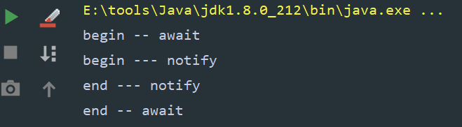

## 1. Condition

Condition就是JUC版本的wait和notify，可以让线程基于某个条件等待和唤醒。


示例代码：

```java
//await
public class ConditionAwaitDemo implements Runnable{

    public Lock lock;
    public Condition condition;

    public ConditionAwaitDemo(Lock lock, Condition condition) {
        this.lock = lock;
        this.condition = condition;
    }

    @Override
    public void run() {
        System.out.println("begin -- await");
        lock.lock();

        try {

            condition.await();
            System.out.println("end -- await");
        } catch (InterruptedException e) {
            e.printStackTrace();
        } finally {
            lock.unlock();
        }
    }
}

//notify
public class ConditionNotifyDemo implements Runnable{

    public Lock lock;
    public Condition condition;

    public ConditionNotifyDemo(Lock lock, Condition condition) {
        this.lock = lock;
        this.condition = condition;
    }

    @Override
    public void run() {
        System.out.println("begin --- notify");

        lock.lock();

        try {

            condition.signal();
            System.out.println("end --- notify");
        }finally {
            lock.unlock();
        }
    }
}


//test
public class ConditionDemo {

    public static void main(String[] args) {
        Lock lock = new ReentrantLock();
        Condition condition = lock.newCondition();

        Thread t1 = new Thread(new ConditionAwaitDemo(lock, condition));
        Thread t2 = new Thread(new ConditionNotifyDemo(lock, condition));

        t1.start();
        t2.start();
    }
}
```


结果：




### 1.1 阻塞线程源码分析

结合[AQS源码分析](https://starrevolve.com/#/docs/java/%E5%B9%B6%E5%8F%91/AQS%E6%BA%90%E7%A0%81%E5%88%86%E6%9E%90)和[Lock与ReentrantLock源码分析](https://starrevolve.com/#/docs/java/%E5%B9%B6%E5%8F%91/Lock%E4%B8%8EReentrantLock%E6%BA%90%E7%A0%81%E5%88%86%E6%9E%90)一起看

#### 1.1.1 await

```
public final void await() throws InterruptedException {
	//判断线程是否中断
    if (Thread.interrupted())
        throw new InterruptedException();
    
    //将新的节点添加到阻塞队列
    Node node = addConditionWaiter();
    
    //释放当前的锁资源，并获取线程的重入状态（次数）
    int savedState = fullyRelease(node);
    //线程中断标记
    int interruptMode = 0;
    
    //判断当前线程是否在同步队列中，只有不在同步队列中，才可以进行阻塞
    while (!isOnSyncQueue(node)) {
    	//调用park方法进入waiting状态，也就是说线程会阻塞在这里
    	//然后进行线程切换
        LockSupport.park(this);
        
        //这里线程被唤醒了
        //判断线程是否因为中断被唤醒的，并进行线程节点的转移
        if ((interruptMode = checkInterruptWhileWaiting(node)) != 0)
        	//如果是中断唤醒就直接break，如果不是就要判断一下是否在AQS队列中了
            break;
    }
    
    //竞争锁资源，并判断这个线程在唤醒之前没有被中断过
    if (acquireQueued(node, savedState) && interruptMode != THROW_IE)
    	//如果竞争锁成功，并且之前被中断过，将标记状态设置为 1
        interruptMode = REINTERRUPT;
        
        //判断节点有没有下个节点，如果有清除后续已经失效的节点
    if (node.nextWaiter != null) // clean up if cancelled
        unlinkCancelledWaiters();
        
        //判断是如果是中断的线程，是-1就需要抛出异常，如果是1就自己设置中断标记
    if (interruptMode != 0)
        reportInterruptAfterWait(interruptMode);
}
```


#### 1.1.2 addConditionWaiter

将线程添加到阻塞队列

```java
private Node addConditionWaiter() {
    //获取阻塞队列的最后一个节点
    Node t = lastWaiter;
    //判断阻塞队列是否存在
    if (t != null && t.waitStatus != Node.CONDITION) {
        unlinkCancelledWaiters();
        t = lastWaiter;
    }
    //创建一个新的节点，如果并再次判断队列是否存在，如果不存在添加到队列的头部，如果存在添加到队尾，最后返回这个节点
    Node node = new Node(Thread.currentThread(), Node.CONDITION);
    if (t == null)
        firstWaiter = node;
    else
        t.nextWaiter = node;
    lastWaiter = node;
    return node;
}
```


#### 1.1.1 fullyRelease

释放当前的锁

```java
final int fullyRelease(Node node) {
    boolean failed = true;
    try {
        //获取线程的重入状态
        int savedState = getState();
        //释放锁，并唤醒
        if (release(savedState)) {
            failed = false;
            return savedState;
        } else {
            throw new IllegalMonitorStateException();
        }
    } finally {
        if (failed)
            node.waitStatus = Node.CANCELLED;
    }
}
```


#### 1.1.4 isOnSyncQueue(Node)

```java
 final boolean isOnSyncQueue(Node node) {
     //判断节点是否是condition状态或者有没有前置节点
     //只要这两个条件满足一条，就可以进行阻塞
     if (node.waitStatus == Node.CONDITION || node.prev == null)
         return false;
     if (node.next != null) // If has successor, it must be on queue
         return true;

     return findNodeFromTail(node);
 }

//判断节点是否在AQS同步队列中,如果在AQS队列中就不能阻塞
private boolean findNodeFromTail(Node node) {
    Node t = tail;
    for (;;) {
        if (t == node)
            return true;
        if (t == null)
            return false;
        t = t.prev;
    }
}
```


#### 1.1.5 checkInterruptWhileWaiting

判断线程在等待的过程中是否被中断过，如果被中断过进入transferAfterCancelledWait方法

```java
private int checkInterruptWhileWaiting(Node node) {
    return Thread.interrupted() ?
        (transferAfterCancelledWait(node) ? THROW_IE : REINTERRUPT) :
    0;
}
```

- THROW_IE：表示线程在唤醒之前被中断
- REINTERRUPT：线程在被唤醒之后被中断


#### 1.1.6 transferAfterCancelledWait

```java
final boolean transferAfterCancelledWait(Node node) {
    //进行节点状态的替换，如果线程是处于阻塞状态中断的，将他转移到AQS队列中
    if (compareAndSetWaitStatus(node, Node.CONDITION, 0)) {
        enq(node);
        return true;
    }
 
    //判断在不在同步队列中，如果不在就需要让出cpu时间片
    while (!isOnSyncQueue(node))
        Thread.yield();
    
    return false;
}
```


### 1.2 唤醒线程源码分析

#### 1.2.1 signal

```java
public final void signal() {
    //判断是是否是唤醒自己
    if (!isHeldExclusively())
        throw new IllegalMonitorStateException();
    //拿到阻塞队列中第一个节点
    Node first = firstWaiter;
    if (first != null)
        doSignal(first);
}
```


#### 1.2.2 isHeldExclusively

这是一个接口，由具体的实现

```
protected boolean isHeldExclusively() {
throw new UnsupportedOperationException();
}
```


#### 1.2.1 doSignal

唤醒阻塞队列中的节点并添加到AQS同步队列

```java
private void doSignal(Node first) {
    do {
        //判断如果第一个节点线程后面有节点，取消后续节点的引用
        if ( (firstWaiter = first.nextWaiter) == null)
            lastWaiter = null;
        first.nextWaiter = null;
    } while (!transferForSignal(first) &&
             (first = firstWaiter) != null);
}
```


#### 1.2.4 transferForSignal

```java
final boolean transferForSignal(Node node) {
   	//修改节点的状态，如果修改失败 直接返回，在do-while中继续尝试唤醒后续节点
    if (!compareAndSetWaitStatus(node, Node.CONDITION, 0))
        return false;
   
    //修改成功，将节点添加到AQS队列
    Node p = enq(node);
    //获取节点状态
    int ws = p.waitStatus;
    //如果这个线程之出现了问题，那么就直接唤醒，不需要加入AQS队列中了
    if (ws > 0 || !compareAndSetWaitStatus(p, ws, Node.SIGNAL))
        LockSupport.unpark(node.thread);
    return true;
}
```

