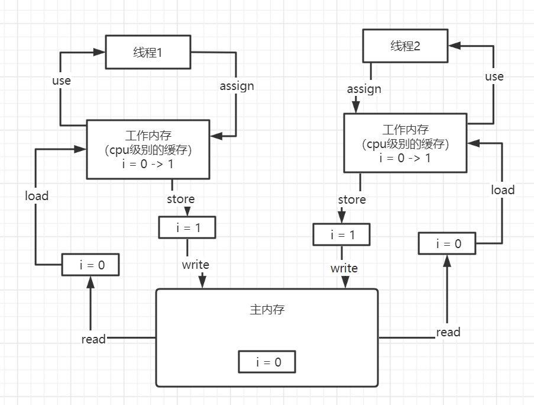
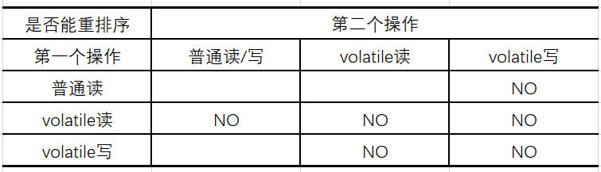
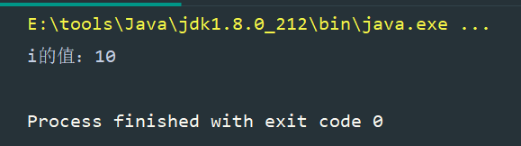
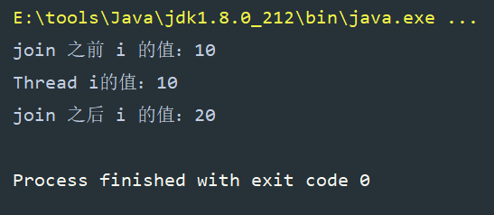

## 1. JMM（java内存模型）

为了避免因为指令重排或者缓存一致性问题，在不同的CPU架构中，都提供了不同的内存屏障指令。同时，在不同的操作系统中，也都实现封装了一个内存屏障的实现。


为了保证我们在写Java线程的时候，在不同的的操作系统和平台上都保证安全性，Java就提出了一个规范：JMM（Java Memory Model），java内存模型，它就是为了帮我们屏蔽不同操作系统和硬件的差异，让一套代码在不同的平台上都可以保证线程的安全性。

在java中的volatile，synchronized和Lock都遵循这一规范。


JMM将CPU的多级缓存抽象成了工作内存，也就是说在JMM的规范中，只有工作内存和主内存。

> 1. 所有的变量都存储在主内存中
> 2. 每个线程都有自己的工作内存
> 3. 在工作内存中保存了变量的副本拷贝
> 4. 线程对于变量的所有操作都在工作内存中进行，而且不能直接读写入工作内存
> 5. 线程之间无法直接访问对方工作内存中的变量，对于共享变量都需要线程自己与工作内存和主内存之间进行数据同步





## 2. happens-before原则

happens-before原则，就是表示前一个操作的结果对于后续操作是可见的。


### 2.1 程序的顺序性

一个线程中的每个操作，happens-before于该线程中的任意后续操作。也就是说单个线程中的代码指令的执行顺序经过优化，顺序不管怎么变化，对于结果来说是不变的。

伪代码示例：

```
int a = 1；	//A
int b = 2；	//B
int c = a + b;	//C
```

在这里A和B是允许指令重排的，但是C不允许。因为存在依赖关系。


### 2.2传递性

示例：

```
int a = 1；	//A
int b = 2；	//B
int c = a + b;	//C
```

表示：如果A happens-before B，B happens-before C 那么 A happens-before C。这就是传递性


### 2.3 volatile关键字

对于volatile修饰的变量的写操作，一定happens-before后续对于这个变量的读操作。这是因为volatile底层通过内存屏障防止了指令重排序，保证了数据的可见性。


volatile重排序规则表：




所以对于上一节开头部分代码的安全性问题的解决方案就是在修饰共享变量的时候，添加上`volatile`关键字，就能保证它的数据安全

```java
public static volatile boolean flag = false;
```


### 2.4 监视器规则

一个线程对于一个锁的释放操作，一定happens-before后续线程对这个锁的加锁操作

```java
int x = 10;
synchronized(this) {
	if(this.x < 12) {
        this.x = 12;
    }
}
```

上述代码中，如果有一个线程A进来执行完成代码块中的内容，这个时候x变量的值已经改成了12。那么后续线程进来的时候x的值就是12。


### 2.5 start规则

如果线程执行start操作，那么在线程start之前的所有操作happens-before这个线程中的任意操作

示例代码：

```java
public class StartDemo {

    public static int i = 0;

    public static void main(String[] args) {

        Thread t1 = new Thread(() -> {
            
            System.out.println("i的值：" + i);
        });

        // 修改共享变量的值
        i = 10;
        t1.start();
    }
}
```


结果：




### 2.6 join规则

如果一个线程A调用了另一个线程B的join方法，那么在这个线程B中的所有操作对于线程A调用join之后都是可见的。


示例代码：

```
public class StartDemo {

    public static int i = 0;

    public static void main(String[] args) throws InterruptedException {

        Thread t1 = new Thread(() -> {
            System.out.println("Thread i的值：" + i);
            i = 20;
        });

        i = 10;
        t1.start();
        
        System.out.println("join 之前 i 的值：" + i);
        t1.join();
        System.out.println("join 之后 i 的值：" + i);
    }
}
```


结果：



