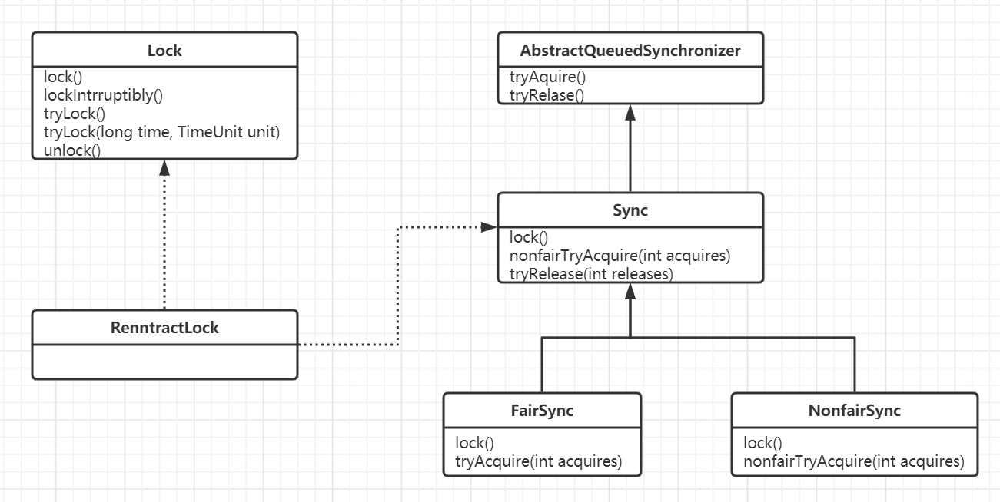
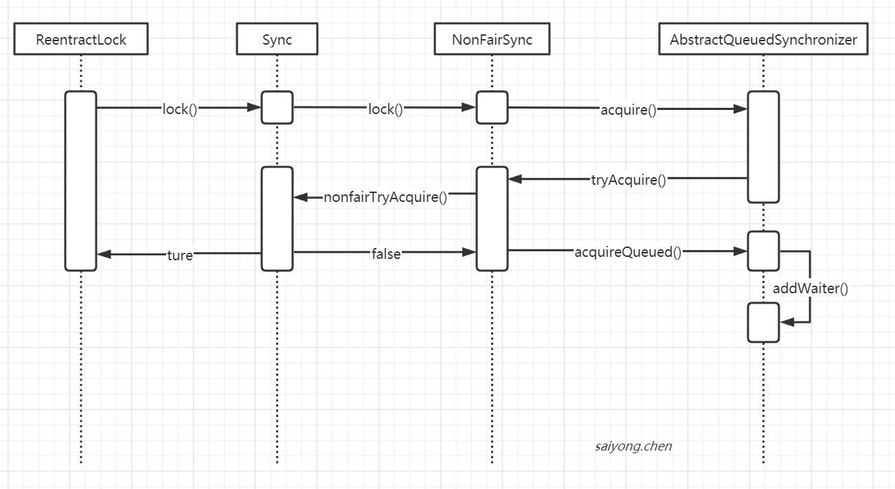

## 1. Lock

Lock（接口）是JUC中最核心的组件，和Synchronized一样，主要就是用来解决并发安全性的问题的。

> JUC（Java.util.concurrent并发包）里面包含了很多在并发场景中使用的组件。比如线程池、阻塞队列、计时器、同步器、并发集合等。


Lock是在java5以后加入的，在加入之前java的应用程序如果要处理多线程的并发安全问题就只能使用synchronized关键字。但是synchronized在有些场景中会存在一些局限性，它并不是适合所有的并发场景。


​	Lock本质上就是一个接口，它定义了释放锁和获得锁的规范。


### 1.1 synchronized的局限性

#### 1.1.1 只要有线程抢占到了锁，其他线程只能等待锁的释放

释放锁的三种情况：

1. 获取锁的线性执行完了同步代码块中的内容
2. 获取锁的线程调用了wait方法
3. 获取锁的线程在执行过程中发生了异常


#### 1.1.2 非公平锁，可能会导致一些线程一直处于饥饿状态

当同步代码块中的操作是非常耗时的，比如I/O或者需要等待其他的资源，这个时候当一个线程抢占到了锁。其他线程只有一直等待锁的释放。因为抢占锁时非公平的，可能会导致有的线程一直抢不到这个锁。


#### 1.1.3 在要求多线程进行读写操作的场景，读的操作也会相互冲突

比如当有多个线程进行读取文件的场景中，使用synchronized修饰了读和写操作的代码，不仅写和写之间、写和读之间相互阻塞，在读和读之间的操作也会相互阻塞。但我们不希望读和读之间的是相互冲突的，那样性能就太低了。


### 1.2 **Lock的常见实现：**

1. ReentrantLock：重入锁，它是唯一一个实现了Lock接口的类。表示线程在获得锁之后，再次获取锁的时候不需要阻塞，而是增加一次计数
2. ReentrantReadWriteLock：重入读写锁，它实现了ReadWirteLock接口，在这个类中维护了两个锁，一个是ReadLock，一个是WriteLock。读写锁适合读多写少的场景。让读和读之间不互斥。
3. StampedLock：JDK8引入的新的锁机制，可以认为是读写锁的一个改进版本。但是如果有大量的读线程存在可能会引起写线程的饥饿。


### 1.3 Lock中的接口方法

- lock()：如果锁可用就获取锁，如果锁不可用就阻塞直到锁的释放
- lockInterruptibly()：和lock方法相似，但是阻塞的线程可以中盾，抛出`java.lang.InterruptedException`
- tryLock()：尝试获取锁，如果成功就返回true，是非阻塞的
- tryLock(long timeout, TimeUnit timeunit)：带超时时间的出尝试获取锁
- unlock()：解锁


## 2. ReentrantLock

### 2.1 简介

和Synchronized一样都是支持重入的锁，但是比synchronized来说它更加的灵活。


类图：




- NofairSync：非公平锁的实现
- FairSync：公平锁的实现


**支持重入的目的：**

示例代码：

```java
public class ReentrantLock {
    
    Lock lock = new ReentrantLock();
    
    public void demo1() {
        lock.lock();
            
         demo2();
        
        lock.unlock();
    }
    
    public void demo2() {
         lock.lock();
            
         demo3();
        
        lock.unlock();
    }
}
```

在示例代码中，当线程获取了demo1的锁之后，这个时候再去调用demo2，demo2中使用的是同一把锁，如果当前线程如法获取同一把锁，就会导致线程的死锁。所以重入锁的目的就是为了避免线程的死锁。


### 2.2 ReentractLock加锁的时序图

非公平锁：




### 2.3 源码分析

结合[AQS源码分析](https://starrevolve.com/#/docs/java/%E5%B9%B6%E5%8F%91/AQS%E6%BA%90%E7%A0%81%E5%88%86%E6%9E%90)一起看

#### 2.3.1 公平锁的加锁方式

```java
//调用ReentractLock中的lock方法
public void lock() {
    sync.lock();
}

//调用Sync实现类FairSync中的lock方法
final void lock() {
    //抢占一把锁
    acquire(1);
}

//调用AQS中的acquire方法
public final void acquire(int arg) {
    if (!tryAcquire(arg) &&
        acquireQueued(addWaiter(Node.EXCLUSIVE), arg))
        selfInterrupt();
}

//调用FairSync中的tryAcquire方法
protected final boolean tryAcquire(int acquires) {
    final Thread current = Thread.currentThread();
    //获取加锁的状态
    int c = getState();
    
    //判断有没有加过锁了
    if (c == 0) { 
        //如果没有加过锁
        //判断当前节点是否有前置节点，如果有前置节点表示加锁失败，需要加入等待队列
        //如果没有等待队列，需要通过cas的方式修改state的值，修改成功表示加锁成功，修改失败需要加入等待队列
        if (!hasQueuedPredecessors() &&
            compareAndSetState(0, acquires)) {
            //设置当前持有锁的线程
            setExclusiveOwnerThread(current);
            return true;
        }
    }
    //如果加过锁了，判断加锁的线程是不是自己，如果是自己，重入
    else if (current == getExclusiveOwnerThread()) {
        int nextc = c + acquires;
        if (nextc < 0)
            throw new Error("Maximum lock count exceeded");
        setState(nextc);
        return true;
    }
    
    //否则加锁失败
    return false;
}
```


#### 2.3.2 非公平锁的加锁方式

```java
//调用ReentractLock中的lock方法
public void lock() {
    sync.lock();
}

//调用NonfairSync中的lock方法
final void lock() {
    //这里会进行一次加锁，不管AQS是否有等待队列
    if (compareAndSetState(0, 1))
        setExclusiveOwnerThread(Thread.currentThread());
    else
        acquire(1);
}

//调用AQS中的acquire方法
public final void acquire(int arg) {
    if (!tryAcquire(arg) &&
        acquireQueued(addWaiter(Node.EXCLUSIVE), arg))
        selfInterrupt();
}

//调用NonfairSync中的tryAcquire方法
protected final boolean tryAcquire(int acquires) {
    return nonfairTryAcquire(acquires);
}

//调用sync中的nonfairTryAcquire方法
final boolean nonfairTryAcquire(int acquires) {
    final Thread current = Thread.currentThread();
    int c = getState();
    if (c == 0) {
        //这里和公平锁不一样的地方就是没有判断，是否有等待队列，直接尝试加锁
        if (compareAndSetState(0, acquires)) {
            setExclusiveOwnerThread(current);
            return true;
        }
    }
    else if (current == getExclusiveOwnerThread()) {
        int nextc = c + acquires;
        if (nextc < 0) // overflow
            throw new Error("Maximum lock count exceeded");
        setState(nextc);
        return true;
    }
    return false;
}
```

