## 1. 多线程对于共享变量来带的安全性问题

我们知道线程的合适使用可以提高程序的处理性能，一般的处理方式有两种：

1. 利用多核CPU以及超线程技术来实现线程的并行执行
2. 利用线程的异步化执行

但是会带来一定的问题，举个例子：

```java
public class IncrDemo implements Runnable{

    int count = 0;

    public static void main(String[] args) throws InterruptedException {
        IncrDemo incr = new IncrDemo();
        Thread t1 = new Thread(incr);
        Thread t2 = new Thread(incr);
        t1.start();
        t2.start();
        t1.join();
        t2.join();

        System.out.println(incr.count);

    }


    @Override
    public void run() {
        for (int i = 0; i < 10000; i++) {
            count++;
        }
    }
}

```

按照预期上述代码的结果是20000，但是我们运行后发现有的时候结果小于20000。

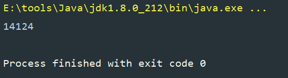


### 1.1 问题的原因

这是因为多线程的一个安全性问题，那就是`count++`的操作它并不是原子性的。

**那什么是原子性呢？**

我们将上述代码反编译成java变成指令，进行分析


> 分析流程：
>
> 1. 访问字段count的值
> 2. 将值放入操作数栈
> 3. 进行加加操作，然后将结果放入操作数栈
> 4. 再将结果将值复制给count


我们知道一个CPU的核心在同一时刻只能执行一个线程，如果线程的数量远远大于CPU核心数，就会发生线程切换。这个切换动作可以发生在任何一条CPU指令完成之前。


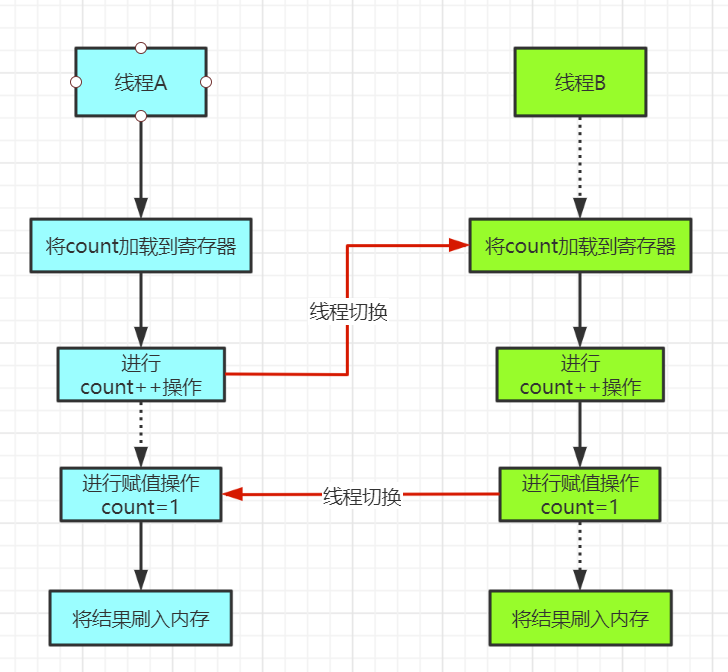

从上图，我们可以看到线程A在执行++操作的时候发生了线程切换，然后当线程B赋值完成后，又切换回了线程A继续执行，这就是因为线程切换带来的原子性问题。


### 1.2 解决方案

使用synchronized将这个count++的操作，包起来，让他们保证是原子的。

```java
synchronized (IncrDemo.class) {
    count++;
}    
```


## 2. 同步锁Synchronized

为了保证原子性，在java中提供了Synchronized这个关键字。

Synchronized有三种方式来加锁，不同的方法代表锁的控制粒度：

1. 修饰静态方法
2. 修饰代码块
3. 修饰实例方法

### 2.1 Synchronized的原理

那么Synchronized到底帮我们做了什么，怎么解决原子性问题的？它又是如何实现锁的，锁的信息又存储在什么地方？


其实synchronized获取锁，就是获取一个`monitor`监视器对象，所有的java对象都携带这个monitor。


我们可以通过字节码来查看：

1、编写一个示例代码：

```java
public class MonitorDemo {

    public static void main(String[] args) {
        synchronized (MonitorDemo.class) {
            
        }
    }
}
```


2、查看字节码指令：


这里我们可以看到字节码指令中出现了`monitorenter`和`monitorexit`两个新的指令，我们可以把它们理解为一个monitor监视器。

> monitorenter：表示一个线程获取了一个对象监视器
>
> monitorexit：表示一个线程释放了一个对象监视器，同时其他线程可以去尝试获取这个监视器


**使用synchronized的加锁流程：**

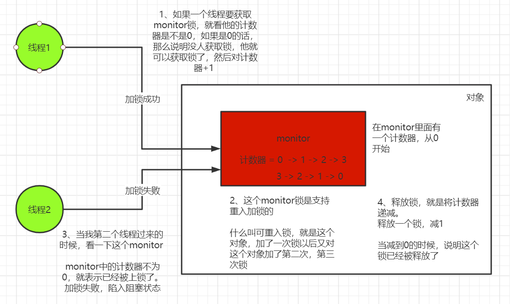


#### 2.1.1 Markword对象头

对于锁的信息存储在什么地方，就需要引出一个概念。那就是对象头！它就是一个对象，在JVM中的布局或者是存储的形式


在Hotspot虚拟机中，对象头，在内存中的存储布局可以分为三个区域：对象头（header）、实例数据（Instance Data）、对齐填充（Padding）


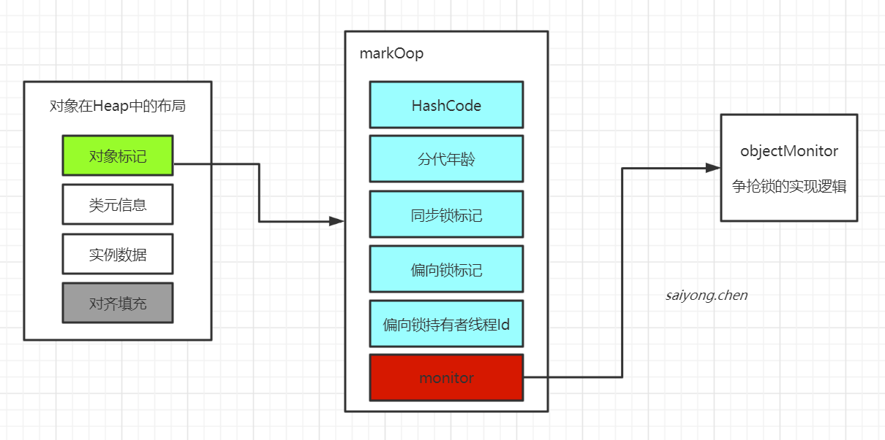


- 对象标记：占用4个自己，用于存储一些类的标记位，比如：hash值，轻量级锁的标记位、偏向锁的标记位等
- 类元信息：class对象的类型指针，jdk1.8默认开启指针压缩，为4个字节。如果需要关闭指针压缩，需要在运行的时候修改JVM参数（-XX:-UseCompressdOops），修改后的长度为8字节。其指向的位置是对象对应的class类的内存地址
- 对象实际数据：包括对象的所有成员变量，大小由成员变量决定。
- 对齐填充：这段并非为必须，仅仅起到了占位符的作用。由于Hotspot虚拟机的内存管理系统要求对象起始地址必须是8字节的整数倍，所以对象头正好是8字节的倍数。因此如果对象的实例数据不是8的整数倍，就需要通过对齐填充来补充。


#### 2.1.2 通过ClassLayout打印对象头

1、导包

```xml
<dependency>
    <groupId>org.openjdk.jol</groupId>
    <artifactId>jol-core</artifactId>
    <version>0.9</version>
</dependency>
```


2、编写代码

```java
public class MarkWordDemo {

    Object o = new Object();

    public static void main(String[] args) {
        MarkWordDemo demo = new MarkWordDemo();
        System.out.println(ClassLayout.parseInstance(demo).toPrintable());
    }
}
```


3、打印结果

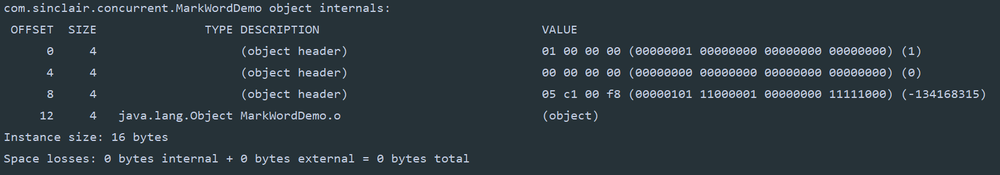


### 2.2 Synchronized锁的升级

我们都知道使用锁能够实现数据的安全性，但是会带来性能的下降。

但是大多数情况下，加锁的代码可能并不存在线程的竞争，有时还会只被一个线程获得，为此在JDK1.6以后，jvm为了较少获得锁和释放锁带来的开销，对synchronized关键字进行了优化，引入了偏向锁、轻量级锁的概念。

所以现在在synchronized中存在四种锁的状态：

1. 无锁
2. 偏向锁
3. 轻量级锁
4. 重量级锁

锁的状态根据竞争的激烈程度从低到高不断升级。


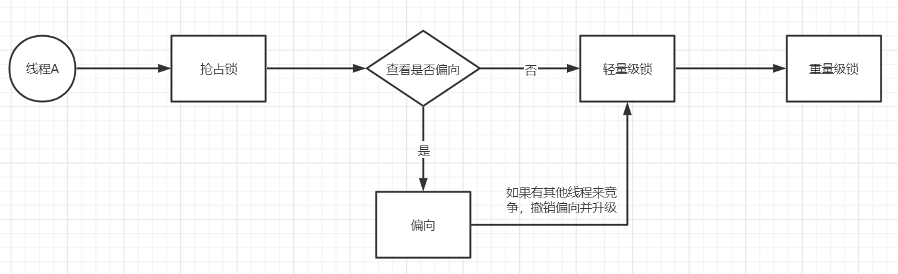


在Mrakword中的变化：

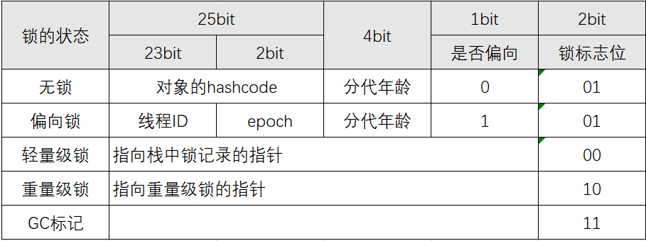


#### 2.2.1 偏向锁

在大部分情况下，锁不仅不存在多线程的竞争，还总是被同一个线程多次获得，为了让线程获取锁的代价更低，就引入了偏向锁。

当只有一个线程访问加了锁的代码块时，会在对象头中存储这个线程的ID，后续这个线程进入这段加了锁的代码块时，就不需要再次加锁和释放锁。而是比较对象头里面是否存储了指向当前锁的偏向锁。


**注意：偏向锁默认是延迟开启的**

但是我们可以通过一个参数设置：

```java
-XX:BiasedLockingStartupDelay=0
```


然后使用classlayout演示：

1、编写代码

```java
public class MarkWordDemo {

    Object o = new Object();

    public static void main(String[] args) {
        MarkWordDemo demo = new MarkWordDemo();
        System.out.println("----------加锁之前----------");
        System.out.println(ClassLayout.parseInstance(demo).toPrintable());


        System.out.println("----------加锁之后----------");
        synchronized (demo) {
            System.out.println(ClassLayout.parseInstance(demo).toPrintable());
        }
    }
}
```


2、查看运行结果

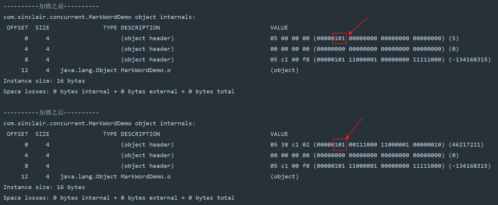


**偏向锁的加锁逻辑：**

1. 当获取锁的对象，首先会在Markword中判断是否处于偏向状态

2. 如果是处于`可偏向`状态，就会通过`CAS加锁`的操作，修改偏向锁的id设置为当前线程

   - 如果cas设置成功，表示锁对象获得了偏向锁

   - 如果cas失败，就说明其他线程获得了偏向锁，这个时候需要撤销已经获得偏向锁的线程的偏向，将锁升级为轻量级锁

3. 如果是处于偏向的状态，需要检查markword中的偏向是否是当前线程

   - 如果是当前线程，不需要再获取锁，直接执行代码块中的代码

   - 如果不是当前线程，就需要撤销偏向锁的偏向，并将锁升级为轻量级锁


#### 2.2.2 轻量级锁

我们可以使用classlayout看到对象头中的变化：

1、编写代码

```java
public class MarkWordDemo {

    Object o = new Object();

    public static void main(String[] args) {
        MarkWordDemo demo = new MarkWordDemo();
        System.out.println("----------加锁之前----------");
        System.out.println(ClassLayout.parseInstance(demo).toPrintable());


        System.out.println("----------加锁之后----------");
        synchronized (demo) {
            System.out.println(ClassLayout.parseInstance(demo).toPrintable());
        }
    }
}
```


2、输出的结果

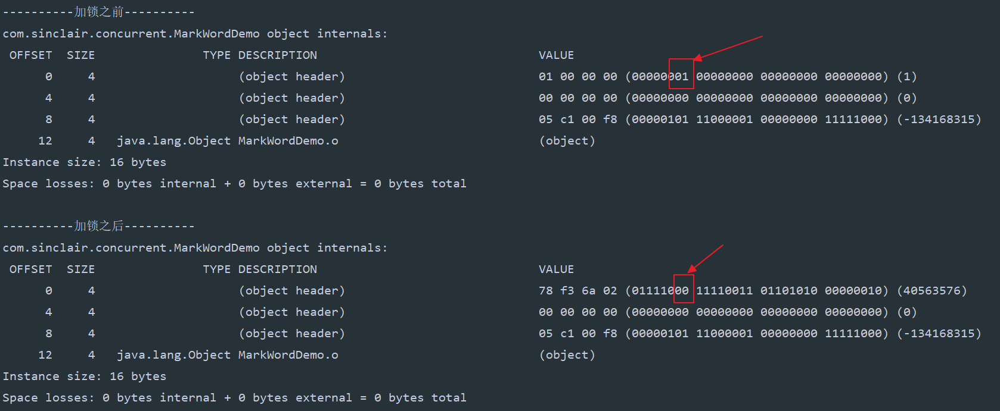


**轻量级锁的加锁逻辑：**

1. 当锁升级为轻量级锁的时候，会在自己的栈帧中创建一个锁记录 LockRecord
2. 将锁对象的对象头中的markword的信息复制到刚刚创建的锁记录中
3. 然后将这个锁记录中的owner指向这个锁对象
4. 最后将锁对象头中的markword替换为指向刚刚创建的锁记录的指针


**如图：**


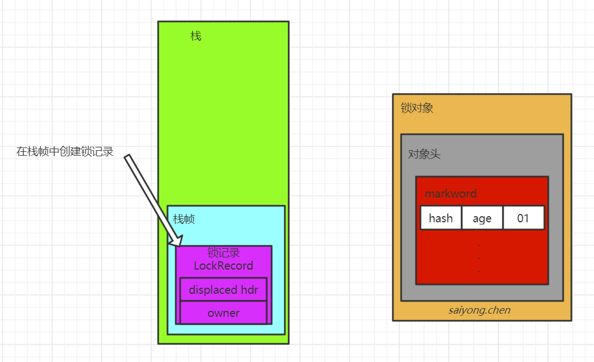


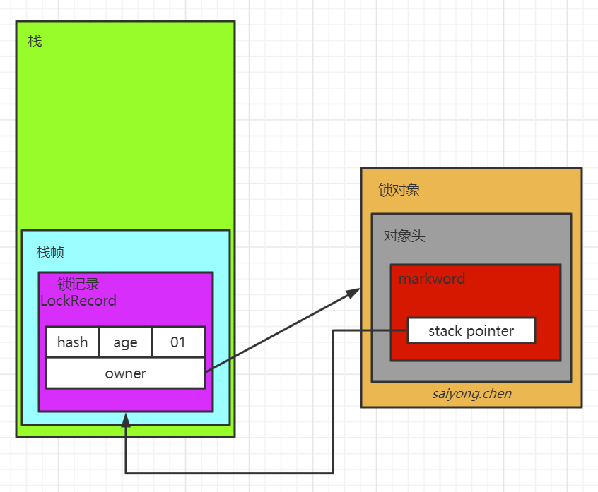


#### 2.2.3 自旋锁

在轻量级加锁的过程中用到了自旋锁。


自旋锁就是当一个线程过来竞争锁的时候，发现已经有一个线程获取到了锁，这个时候它会自己原地循环等待，而不是直接将线程阻塞。当之前获取锁的那个线程释放锁的时候，它就可以直接获取锁了。但是线程在原地等待的时候也会消耗CPU的资源。


一般自旋锁用于那些加锁的代码块执行的时间都很短的场景下，通过这个原地等待的过程反而可以提升锁的性能。

当然自旋锁不会一直自旋下去，这样反而会浪费性能。一般默认自旋10次。如果自旋10次后没有获得锁，这个时候线程会进入阻塞状态，同时锁升级为重量级锁。


#### 2.2.4 重量级锁

重量级锁意味着当前锁的竞争较为激烈，其他没有获得锁的线程只能阻塞等待唤醒。


使用classlayout查看：

1、编写代码

```java
public class MarkWordDemo {

    Object o = new Object();

    public static void main(String[] args) {
        MarkWordDemo demo = new MarkWordDemo();

        Thread t1 = new Thread(() -> {
            synchronized (demo) {
                System.out.println("----------t1 is locking----------");
                System.out.println(ClassLayout.parseInstance(demo).toPrintable());
            }
        });

        t1.start();

        synchronized (demo) {
            System.out.println("----------main is locking----------");
            System.out.println(ClassLayout.parseInstance(demo).toPrintable());
        }
    }
}
```


2、查看结果

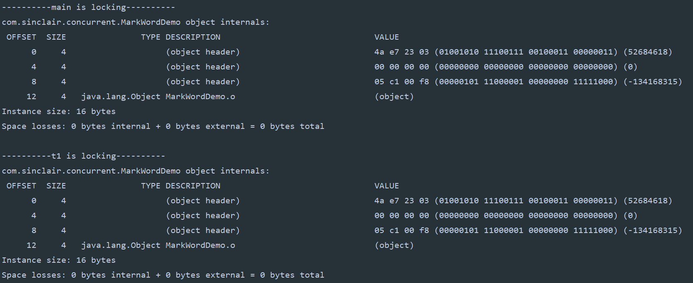


### 2.3 synchronized与Object中的wait、notify和notifyAll的结合

这个三个方法需要在synchronized修改修饰的作用域中调用，主要的目的是为了实现不同线程之间的通信。


## 3. CAS

CAS，全称：Compare and swap，就是比较交换的意思。他可以保证在多线性的环境下保证只有一个线程能执行成功。


我们使用`Atomic`包下的`AtomicInteger`的`incrementAndGet()`方法来分析它的具体流程：

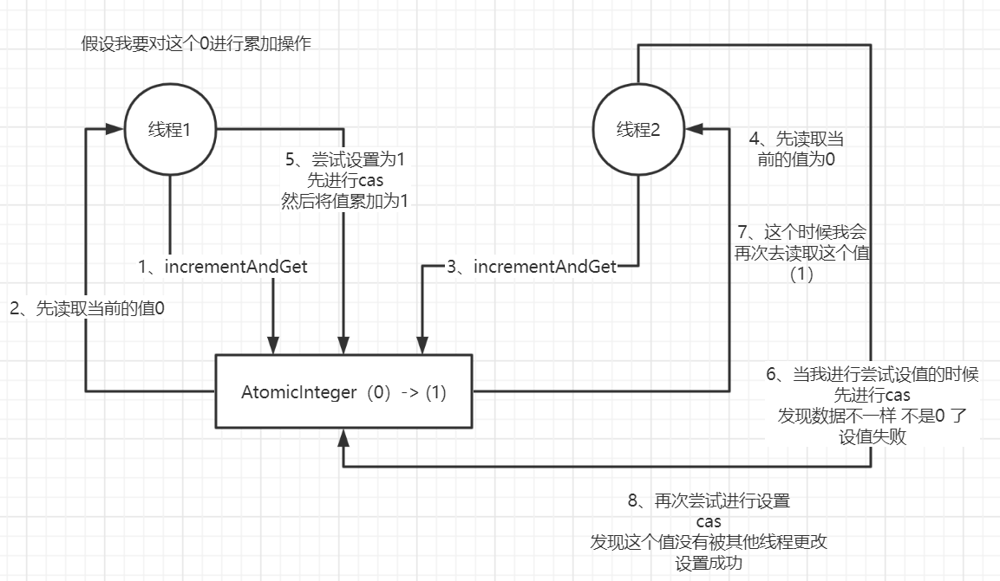

