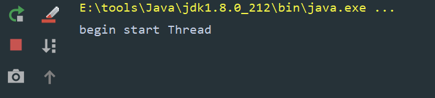
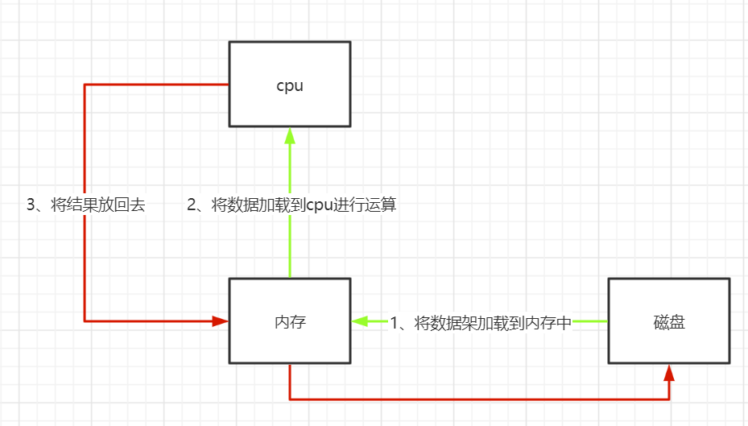
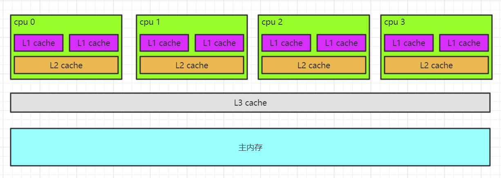
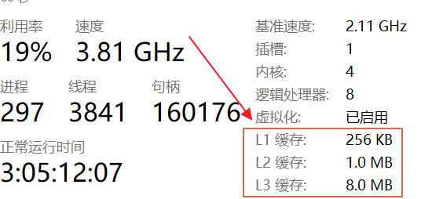
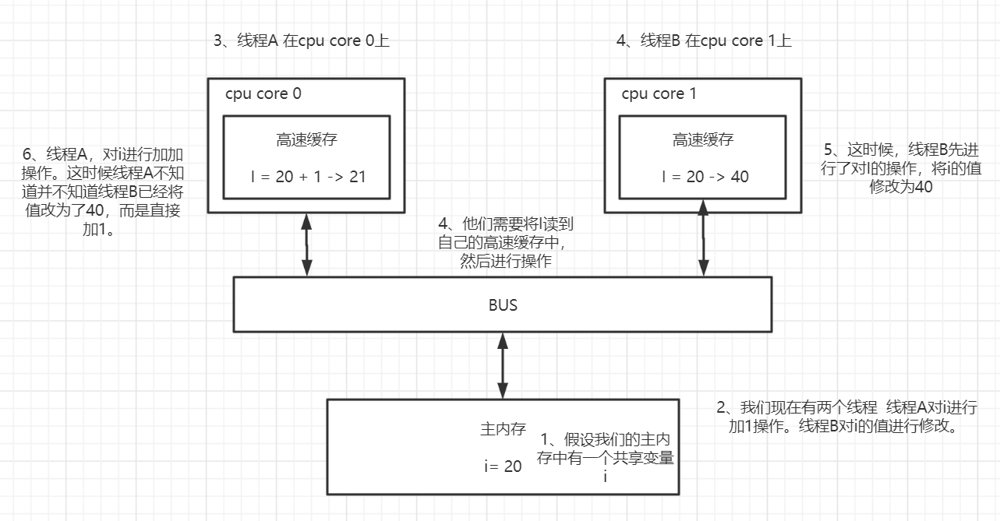
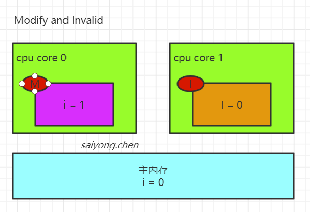
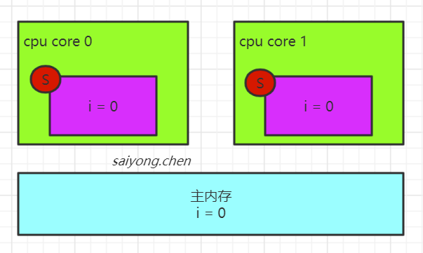
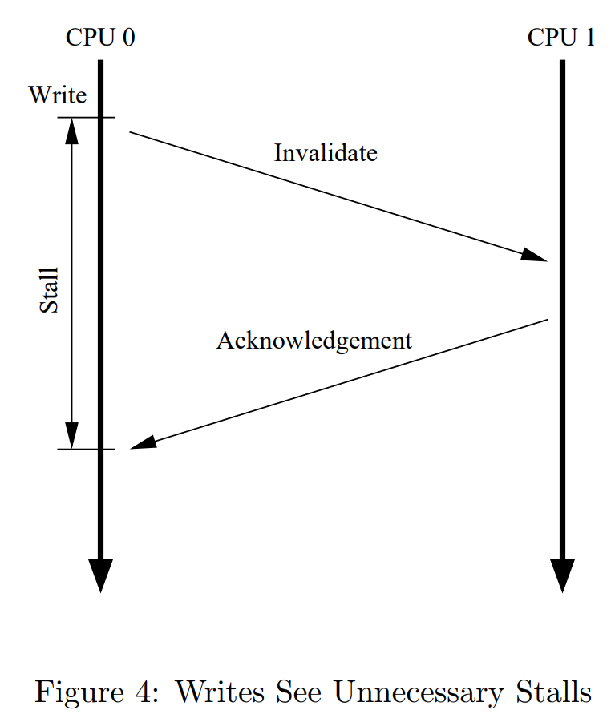
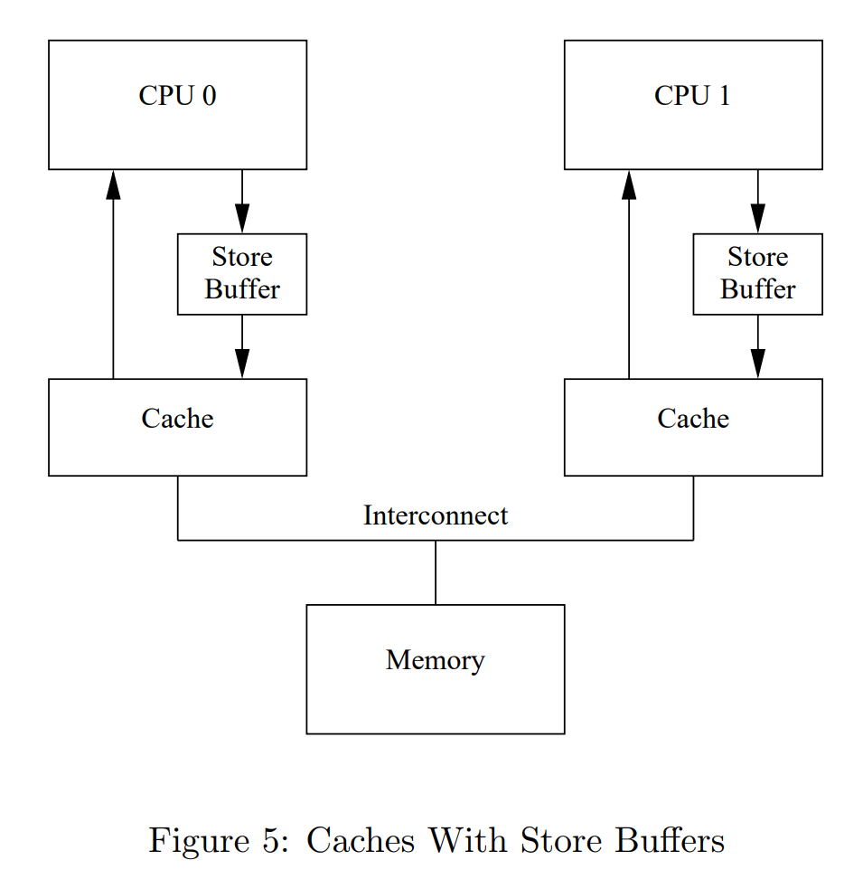
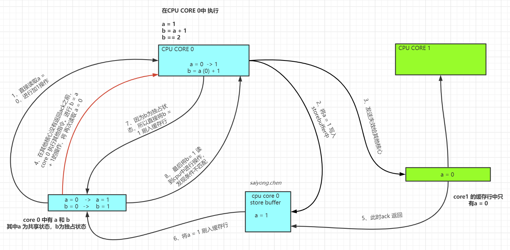

## 1. 可见性

针对共享变量还会一个问题，那就是可见性问题。首先我们可以通过一段代码来查看这个问题：

```java
public class VolatileDemo implements Runnable{

    public static int i = 0;
    public static boolean flag = false;

    public static void main(String[] args) throws InterruptedException {

       new Thread(new VolatileDemo()).start();
       System.out.println("begin start Thread");
       Thread.sleep(1000);

       flag = true;
    }

    @Override
    public void run() {
        while(!flag) {
            i++;
        }

        System.out.println("Thread is end");
    }
}
```


当我们执行这段代码的时候，发现程序一直在执行，并没有停止




也就是说明flag这个共享变量，虽然在main线程中修改了，但是对于新开辟出来的Thread线程它是不可见的。


### 1.1 从硬件层面了解可见性

我们知道一台计算机是由CPU、内存以及I/O设备组成的。这三者之间的速度是非常大的，CPU是最快的，内存次之，I/O最慢。


计算机的是利用CPU来进行数据运算的，而且CPU只能对内存中的数据进行运算。对于磁盘中的数据，先要将数据加载到内存中，然后再将数据加载到内存中进行运算，运算结束后还要将结果放回去。





所以计算机的计算效率取决于最慢的设备，所以在计算机的发展过程中为了提升计算的性能，CPU从单核升级到了多核，同时为了平衡三者之间的速度差异，从硬件、操作系统和编译器等很多方面都做了很多的优化。

1. cpu添加了高速缓存
2. 操作系统添加了进程、线程。
3. 编译器和cpu对指令进行优化

每一种优化都会带来相应的问题。


其实可见性问题就是因为多核CPU的多级缓存引起的，


#### 1.1.1 多核CPU的多级缓存

为了平衡CPU和其他设备之间的速度差异，所以在CPU设计层面添加了缓存行，如果要进行数据运算的话，可以CPU会先从缓存行中读取数据，如果高速缓存中没有，才会去内存中加载。


对于主流的计算机平台，CPU的缓存行（cache line）分为L1、L2和L3三级。



其实你也可以在自己的电脑中看到这三级缓存：

如我的电脑是windows的，通过`任务管理器`中的`性能`页面中看到：



从上面我们可以看到L1最小，L3最大，但速度L1是最快的，L3是最慢的。


#### 1.1.2 多级缓存导致的缓存一致性问题

有了多级缓存之后，CPU在计算的时候会先将数据缓存在CPU的高速缓存中。但是由于我们现在的CPU是多核的，同时在多线程的环境下每个线程可能运行在不同的核心中。那么每个CPU核心都有一份数据，那么对于共享变量可能在每个cpu核心缓存的值可能是不一样的。




从上图中我们看到，两个cpu缓存中`i`的值是不一样的。


#### 1.1.3 缓存一致性协议（MESI）

解决缓存不一致的问题，主要有两种方式：

1. 总线锁：在多核CPU的环境下，只要有一个核心对共享变量进行操作的时候，就发出一个lock信号，让其他核心无法通过总线访问到共享数据，显然这种效率很低并且不适用。
2. 缓存锁：保证多个cpu核心缓存中的同一份数据时一致的。而缓存锁的机制就是使用缓存一致性协议。


常见的缓存一致性协议有MSI、MESI、MOSI等。其中最常见的就是MESI。


MESI就是表示缓存行的四种状态，分别是：

- M（Modify）：表示共享数据只缓存在当前CPU核心的缓存中，并且是被修改的状态，也就是缓存的数据和主内存中的数据不一致

- I（Invalid）：表示缓存已经失效

  

- E（Exclusive）：表示缓存是独占的状态，数据只缓存在当前CPU缓存中，并且没有被修改

  

- S（Shared）：表示数据被多个CPU缓存，并且各个缓存中的数据和主内存中的数据一致

  


> CPU的读请求，也就是从高速缓存中读取数据，对于在缓存中处于M，E，S状态下的数据，都是可以直接读取的，对于处于I状态下的数据，只能从主内存中读取数据。
>
> CPU的写请求，只有对于缓存中处于M和E状态下的数据是可写的，对于处于S状态下的数据，需要将其他CPU核心中的缓存设置为I状态才可以。


## 2. 有序性

CPU在使用MESI协议解决缓存一致性问题的同时还会带来一个问题，那就是CPU缓存行修改共享数据状态是通过消息来通信的。如果一个CPU核心需要修改一个在多个核心缓存行中都存在的一个共享变量的时候，需要将其他核心缓存中的这个数据设置为失效。也就是需要发送一个失效的消息给其他核心，然后等待他们的ACK，这个过程它是阻塞的。


图片出至于：[Memory Barriers: a Hardware View for Software Hackers](http://www.puppetmastertrading.com/images/hwViewForSwHackers.pdf)




为了避免阻塞导致的资源浪费，cpu引入了一个叫`Store Buffer`的东西。


图片出至于：[Memory Barriers: a Hardware View for Software Hackers](http://www.puppetmastertrading.com/images/hwViewForSwHackers.pdf)




**引入storebuffer后，修改共享变量的逻辑：**

1. 某个cpu核心修改一个共享变量的时候，先将这个修改完成的值存到storebuffer中
2. 然后向其他核心发出一个失效的消息。
3. 在等待其他核心返回ack的这个期间这个cpu可以去执行其他的指令，
4. 等所有的cpu核心都恢复ack之后，再将这个修改后的变量刷到缓存行中。


那么就会导致一个问题：有序性问题。



这其实也可以说是另一种可见性问题。因为已经进行了修改操作，仅仅只是因为其他的核心没有返回ack。导致cpu 核心执行了其他的指令（指令重排），而原来的那个变量的最新数据没有刷到缓存行中，如果后续指令再次使用这个变量的时候，读到的依旧是以前的数据，新的数据依旧不可见。


示例代码：

```java
public class SeqDemo {

    public static int a, b;
    public static int x, y;

    public static void main(String[] args) throws InterruptedException {
        int i = 0;
        for (;;) {
            i++;

            a = 0; b = 0; x = 0; y = 0;

            Thread t1 = new Thread(() -> {
                a = 1;
                x = b;

                x = b;
                a = 1;
            });
            Thread t2 = new Thread(() -> {
                b = 1;
                y = a;

                y = a;
                b = 1;
            });

            t1.start();
            t2.start();
            t1.join();
            t2.join();

            String result = "第：" + i + " 次 ( " + x + " , " + y + " )";
            if (x == 0 && y == 0) {
                System.out.println(result);
                break;
            }
        }
    }
}
```


结果：


### 2.1 内存屏障

CPU为了提高性能对其不断优化导致了有序性问题，在CPU层面无法被解决，因为CPU只是一个运算工具，它只接收指令并执行指令，并不清楚当前执行代码的整个逻辑中是否存在不能优化的的问题。


因此在CPU层面提供了内存屏障（[Memory Barriers: a Hardware View for Software Hackers](http://www.puppetmastertrading.com/images/hwViewForSwHackers.pdf)）指令，既然在硬件层面无法解决这样的问题，那就提供指令调用，在软件层面让工程师自己在适当的地方插入内存屏障，保证程序符合逻辑的执行。简单来说就是通过这些指令让store buffer中的数据刷到缓存行中，保证其他线程访问这一共享变量可见。


主要有三种：

- Stroe Memory Barrier（读屏障）：表示告诉处理器，在这个屏障之前所有已经存在Store Buffer中的缓存，全部刷到主内存中。保证这个指令之前的结果对于这个指令之后的操作是可见的。
- Load Memory Barrier（写屏障）：表示告诉处理器，在这个屏障之后的读操作都在这个指令之后操作。配合写屏障，保证写屏障之前的更新操作对于读屏障之后的读操作是可见的。
- Full Memory Barrier（全屏障）：表示这个屏障之前的读写操作，相对于这个指令之后的读写操作是可见的

