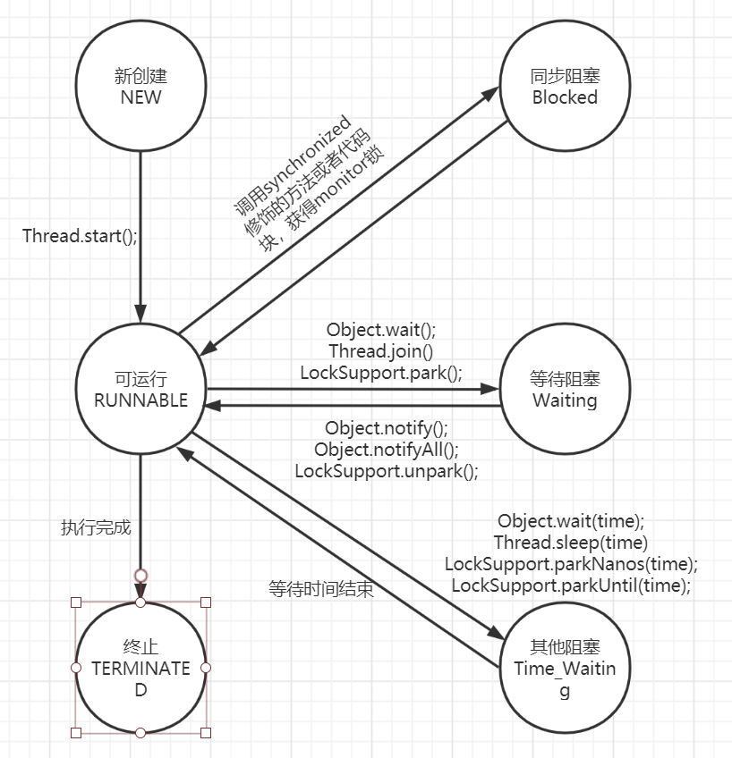
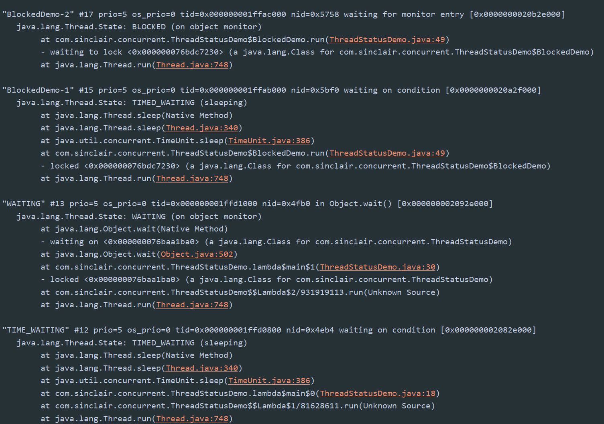

## 1. 进程与线程

### 1.1 进程

本质上就是一个正在执行的程序，程序运行时系统会创建一个进程，并且给每个进程分配独立的内存地址空间保证每个进程地址之间不会相互干扰。同时，CPU对进程做时间片的切换是时，保证进程切换过程中仍然要从进程切换之前运行的位置开始执行。所以一个进程通常还会包括程序计数器、堆栈指针。


进程，可以让操作系统从宏观层面实现多应用并发。而并发的实现就是通过cpu时间片不断切换执行的。

对于单核CPU来说，在任一时刻只会有一个进程被CPU调度

### 1.2 线程

有了进程以后，为什么还会发明线程？

1. 在多核CPU中，利用线程可以实现真正意义上的并行执行
2. 在一个应用进程中，会存在很多个同时执行的任务，如果其中一个任务被阻塞了，将导致其他不依赖该任务的任务也会被阻塞。但是可以通过创建不同的任务的线程去处理，可以提升程序处理的实时性
3. 线程可以认为是轻量级的进程，所以线程的创建、销毁比进程更快


## 2. 在java中如何使用线程

### 2.1 继承Thread类

Thread类本质上是实现了Runnable接口的一个实例，代表一个线程的示例。启动线程的唯一方法就是通过Thread类的`start()`方法

```java
//继承Thread类，重写run方法
public class ThreadDemo extends Thread {
    
    public static void main(String[] args) {
        ThreadDemo myThread = new ThreadDemo();
        myThread.start();
    }
    
    public void run() {
        System.out.println("Thread extends Thread is running...");
    }
}
```


**为什么启动线程是调用`start`方法，而不是调用`run`方法？**

因为线程的start方法在底层做了很多的事情，通过JVM向操作系统申请创建新的线程，当新的线程创建好以后，等到该线程抢占到CPU时间片的时候会回调run方法。


### 2.2 实现Runnable接口

如果自己的类已经继承另一类了，那就没有办法在继承Thread类了，只能实现Runnable接口

```java
public class ThreadDemo implements Runnable {
	public void run() {
		System.out.println("Thread implements Runnable is running...")
	}
}
```


### 2.3 实现Callable接口，通过FutureTask 包装器来创建线程

有的时候我们可能需要让一个线程在执行完成以后，提供一个返回值给到当前的线程。然后主线程再依赖这个值进行后续的逻辑处理。那么这个时候就需要用到带返回值的线程了。

```java
public class CallableDemo implements Callable<String> {
	public static void main(String[] args) throws ExecutionException, InterruptedException {
        ExecutorService executorService = Executors.newFixedThreadPool(1);
        
        CallableDemo callableDemo = new CallableDemo();
        
        Future<String> future = executorService.submit(callableDemo);
        System.out.println(future.get());
        executorService.shutdown();
    }
    
    public String call() throws Exception {
        int a = 1;
        int b = 2;
        System.out.println(a+b);
        return "结果：" + (a+b);
	}
}
```


在java的官方文档中，使用线程其实只有两种方式：继承Thread类和实现Runnable接口，其余的任何方式，本质上都是这两种方式的包装形式。


## 3. 线程的生命周期

线程在运行的过程中，会存在几种不同的状态，在java中的状态一共有6种：

- NEW：初始状态，线程刚刚被构建，还没有调用start()方法
- RUNNABLE：运行状态，在java线程中把操作系统的就绪和运行两种状态，统一称为“运行中”
- BLOCKED：阻塞状态，表示线程进入等待状态。也就是线程因为某种原因放弃了CPU的使用权
  - 等待阻塞：运行的线程执行wait方法，jvm会将当前线程放到等待队列
  - 同步阻塞：运行的线程在获取对象的同步锁时，若该同步锁被其他线程抢占，那么jvm会把当前线程放到等待队列
  - 其他阻塞：运行的线程执行Thread.sleep()方法或者join()方法，或者发出了I/O请求时，jvm会把当前线程设置为阻塞状态，当以上方法结束时，则线程恢复
- WAITING：等待状态
- TIME_WAITING：超时等待，超时以后会恢复
- TERMINATED：终止状态，表示当前线程执行完毕





**使用代码查看具体的状态**

1、编写示例：

```java
public class ThreadStatusDemo {
    public static void main(String[] args) {
        
       	//TIME_WAITING
        new Thread(() -> {
            while(true) {
                try {
                    TimeUnit.SECONDS.sleep(100);
                } catch (Exception e) {
                    e.printStackTrace();
                }
            }
        }, "TIME_WAITING").start();
        
        //WAITING
        new Thread(() -> {
            while(true) {
            	 synchronized (ThreadStatusDemo.class) {
                     try {
                         ThreadStatusDemo.class.wait();
                     } catch (InterruptedException e) {
                         e.printStackTrace();
                     }
                 }    
            }
        }, "WAITING").start();
        
        
        //Blocked
       new Thread(new BlockedDemo(), "BlockedDemo-1").start();
       new Thread(new BlockedDemo(), "BlockedDemo-2").start();
    }
    
    static class BlockedDemo extends Thread {
        public void run() {
            synchronized (Blocked.class) {
                while(true) {
                    try {
                        TimeUnit.SECONDS.sleep(100);
					}catch (InterruptedException e) {
                         e.printStackTrace();
                    }
                }
            }
        }
    }
}
```


2、运行程序后，使用jps获取当前程序的pid


3、通过jstack pid 查看当前线程的运行状态




## 4. 线程的终止

**如何正确的停止一个线程呢？**

我们知道Thread提供了很多停止线程的方法，比如stop、suspend等，这些方法可以终止一个线程或者挂起一个线程，但是一般我们不建议使用。


**为什么不建议使用？**

假设你有一个线程正在写文件还没有写完，这个时候如果你执行stop方法终止一个线程，就会导致文件数据的不完整。


### 4.1 一个线程正常情况下执行结束

当我们通过start()方法启动一个线程的时候，本质上就是执行这个线程的run方法。那么在这个run方法正常执行完之前，线程就会一直处于运行状态。直到run方法执行完成，那么这个线程就会被正常的终止和销毁


### 4.2 interrupt方法

那么如果我们要在线程执行的过程中人为的去干预：

- 线程中存在无限循环执行，比如while(true)循环
- 线程中存在一些阻塞的操作，比如sleep、wait、join等

如果需要中途干预就需要在程序的运行过程中感知到变化，比如while(true)就需要在有一个可以结束的条件。


在java中提供了一个interrupt方法，这个方法可以实现线程中断的操作，主要是通知线程你可以中断了，但是线程什么时候中断，取决于该线程自己。

```java
public class InterruptDemo {
	private static int i;
	public static void main(String[] args) {
		Thread t1 = new Thread(() -> {
			//判断是否中断，如果中断输出结果
			while(!Thread.currentThread().isInterrupted()) {
				i++;
			}
			System.out.println("i:" + i);
		}, "InterruptDemo");
		t1.start();
		TimeUnit.SECONDS.sleep(1);
		// 中断程序
		t1.interrupt();
	}
}
```


### 4.3 中断处于阻塞状态下的程序

如果我们想要中断一个正处于阻塞状态下的程序，比如wait，sleep，join等操作，该怎么办？

其实每当我们书写上述的代码的时候，都会要求我们捕获或者抛出一个InterruptedException异常，也就是处于阻塞状态下，如果要求该线程终止，就会通过InterruptedException来体现

```java
public class InterruptDemo {
	private static int i;
	public static void main(String[] args) {
		Thread t1 = new Thread(() -> {
			//判断是否中断，如果中断输出结果
			while(!Thread.currentThread().isInterrupted()) {
				try {
					TimeUnit.SECONDS.sleep(1);
				} catch (InterruptedException e) {
					e.printStackTrace();
				}
			}
			System.out.println("i:" + i);
		}, "InterruptDemo");
		t1.start();
		TimeUnit.SECONDS.sleep(1);
		// 中断程序
		t1.interrupt();
        System.out.println(t1.isInterrupted());
	}
}
```


> 注意：
>
> 这个异常如果不做处理的话，程序会继续往下执行，如果需要中断程序的话，需要在catch代码块中再次中断
>
> ```java
> Thread.currentThread().interrupt();
> ```
>
> 因为当捕获到这个异常后，会将中断状态进行复位。
>
> 除了异常会复位以外，还可以通过调用thread.interrupted()方法进行复位。


**为什么Object.wai()、Thread.sleep()和Thread.join()方法会抛出InterruptedException异常？**

我们发现它们有一个共同点，就是属于阻塞方法。而阻塞方法的释放取决于一些外部的事件。但是阻塞方法可能等不到外部的事件导致资源无法被释放，这个时候它允许一个线程请求自己来停止它正在做的事情。

如果外部线程调用了interrupt方法，当前处于阻塞中的线程会被唤醒，然后抛出InterruptedException，就是该线程告诉调用者，这个方法执行被中断了，它会尝试停止正在做的事情并提前返回。

