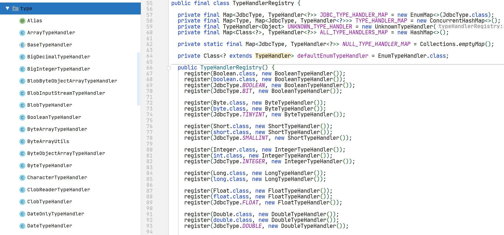
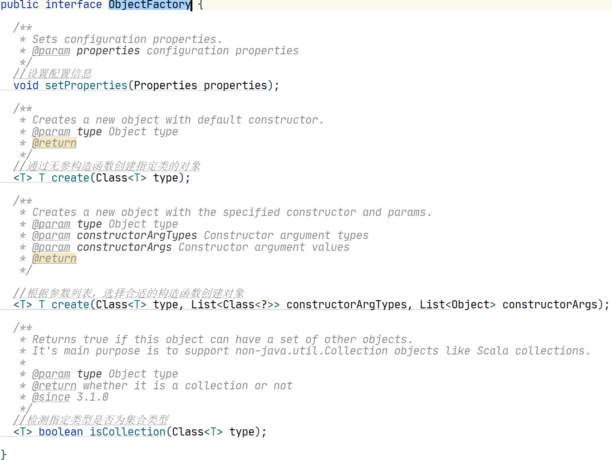
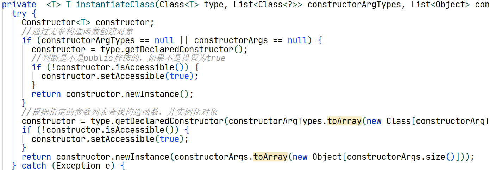

## 1、全局配置文件

Mybatis的全局配置文件包括了它的行为设置和属性信息。

[Mybatis全局配置文件官方文档](https://mybatis.org/mybatis-3/zh/configuration.html)

>- configuration（配置）
>  - properties（属性）
>  - settings（设置）
>  - typeAliases（类型别名）
>  - typeHandlers（类型处理器）
>  - objectFactory（对象工厂）
>  - plugins（插件）
>  - environments（环境配置）
>    - environment（环境变量）
>      - transactionManager（事务管理器）
>      - dataSource（数据源）
>  - databaseIdProvider（数据库厂商标识）
>  - mappers（映射器）


### 1.1 configuration

这个是整个配置文件的根标签，实际上也对应着Mybatis中最重要的一个配置类Configuration。


### 1.2 properties

用来配置参数信息，比如最常见的数据库连接信息。一般我们为了避免将数据库连接信息写死在xml配置文件中，会将这些参数值放在properties文件中，然后用properties标签引入进来。

```xml
<?xml version="1.0" encoding="UTF-8" ?>
<!DOCTYPE configuration PUBLIC "-//mybatis.org//DTD Config 3.0//EN" 
"http://mybatis.org/dtd/mybatis-3-config.dtd">
<configuration>
    <!-- 引入一个属性文件    -->
    <properties resource="db.properties"></properties>
    
    <environments default="development">
        <environment id="development">
            <transactionManager type="JDBC"/><!-- 单独使用时配置成MANAGED没有事务    -->
            <dataSource type="POOLED">
                <property name="driver" value="${jdbc.driver}"/>
                <property name="url" value="${jdbc.url}"/>
                <property name="username" value="${jdbc.username}"/>
                <property name="password" value="${jdbc.password}"/>
            </dataSource>
        </environment>
    </environments>
    
    <mappers>
        <mapper resource="mapper/UserMapper.xml"/> 
    </mappers>
</configuration>
```


### 1.3 settings

用来改变Mybatis运行时行为，这是非常重要的一个设置。

具体参数如下：

| 设置名                           | 描述                                                         | 有效值                                                       | 默认值                                                |
| :------------------------------- | :----------------------------------------------------------- | :----------------------------------------------------------- | :---------------------------------------------------- |
| cacheEnabled                     | 全局性地开启或关闭所有映射器配置文件中已配置的任何缓存。     | true \| false                                                | true                                                  |
| lazyLoadingEnabled               | 延迟加载的全局开关。当开启时，所有关联对象都会延迟加载。 特定关联关系中可通过设置 `fetchType` 属性来覆盖该项的开关状态。 | true \| false                                                | false                                                 |
| aggressiveLazyLoading            | 开启时，任一方法的调用都会加载该对象的所有延迟加载属性。 否则，每个延迟加载属性会按需加载（参考 `lazyLoadTriggerMethods`)。 | true \| false                                                | false （在 3.4.1 及之前的版本中默认为 true）          |
| multipleResultSetsEnabled        | 是否允许单个语句返回多结果集（需要数据库驱动支持）。         | true \| false                                                | true                                                  |
| useColumnLabel                   | 使用列标签代替列名。实际表现依赖于数据库驱动，具体可参考数据库驱动的相关文档，或通过对比测试来观察。 | true \| false                                                | true                                                  |
| useGeneratedKeys                 | 允许 JDBC 支持自动生成主键，需要数据库驱动支持。如果设置为 true，将强制使用自动生成主键。尽管一些数据库驱动不支持此特性，但仍可正常工作（如 Derby）。 | true \| false                                                | False                                                 |
| autoMappingBehavior              | 指定 MyBatis 应如何自动映射列到字段或属性。 NONE 表示关闭自动映射；PARTIAL 只会自动映射没有定义嵌套结果映射的字段。 FULL 会自动映射任何复杂的结果集（无论是否嵌套）。 | NONE, PARTIAL, FULL                                          | PARTIAL                                               |
| autoMappingUnknownColumnBehavior | 指定发现自动映射目标未知列（或未知属性类型）的行为。`NONE`: 不做任何反应`WARNING`: 输出警告日志（`'org.apache.ibatis.session.AutoMappingUnknownColumnBehavior'` 的日志等级必须设置为 `WARN`）`FAILING`: 映射失败 (抛出 `SqlSessionException`) | NONE, WARNING, FAILING                                       | NONE                                                  |
| defaultExecutorType              | 配置默认的执行器。SIMPLE 就是普通的执行器；REUSE 执行器会重用预处理语句（PreparedStatement）； BATCH 执行器不仅重用语句还会执行批量更新。 | SIMPLE REUSE BATCH                                           | SIMPLE                                                |
| defaultStatementTimeout          | 设置超时时间，它决定数据库驱动等待数据库响应的秒数。         | 任意正整数                                                   | 未设置 (null)                                         |
| defaultFetchSize                 | 为驱动的结果集获取数量（fetchSize）设置一个建议值。此参数只可以在查询设置中被覆盖。 | 任意正整数                                                   | 未设置 (null)                                         |
| defaultResultSetType             | 指定语句默认的滚动策略。（新增于 3.5.2）                     | FORWARD_ONLY \| SCROLL_SENSITIVE \| SCROLL_INSENSITIVE \| DEFAULT（等同于未设置） | 未设置 (null)                                         |
| safeRowBoundsEnabled             | 是否允许在嵌套语句中使用分页（RowBounds）。如果允许使用则设置为 false。 | true \| false                                                | False                                                 |
| safeResultHandlerEnabled         | 是否允许在嵌套语句中使用结果处理器（ResultHandler）。如果允许使用则设置为 false。 | true \| false                                                | True                                                  |
| mapUnderscoreToCamelCase         | 是否开启驼峰命名自动映射，即从经典数据库列名 A_COLUMN 映射到经典 Java 属性名 aColumn。 | true \| false                                                | False                                                 |
| localCacheScope                  | MyBatis 利用本地缓存机制（Local Cache）防止循环引用和加速重复的嵌套查询。 默认值为 SESSION，会缓存一个会话中执行的所有查询。 若设置值为 STATEMENT，本地缓存将仅用于执行语句，对相同 SqlSession 的不同查询将不会进行缓存。 | SESSION \| STATEMENT                                         | SESSION                                               |
| jdbcTypeForNull                  | 当没有为参数指定特定的 JDBC 类型时，空值的默认 JDBC 类型。 某些数据库驱动需要指定列的 JDBC 类型，多数情况直接用一般类型即可，比如 NULL、VARCHAR 或 OTHER。 | JdbcType 常量，常用值：NULL、VARCHAR 或 OTHER。              | OTHER                                                 |
| lazyLoadTriggerMethods           | 指定对象的哪些方法触发一次延迟加载。                         | 用逗号分隔的方法列表。                                       | equals,clone,hashCode,toString                        |
| defaultScriptingLanguage         | 指定动态 SQL 生成使用的默认脚本语言。                        | 一个类型别名或全限定类名。                                   | org.apache.ibatis.scripting.xmltags.XMLLanguageDriver |
| defaultEnumTypeHandler           | 指定 Enum 使用的默认 `TypeHandler` 。（新增于 3.4.5）        | 一个类型别名或全限定类名。                                   | org.apache.ibatis.type.EnumTypeHandler                |
| callSettersOnNulls               | 指定当结果集中值为 null 的时候是否调用映射对象的 setter（map 对象时为 put）方法，这在依赖于 Map.keySet() 或 null 值进行初始化时比较有用。注意基本类型（int、boolean 等）是不能设置成 null 的。 | true \| false                                                | false                                                 |
| returnInstanceForEmptyRow        | 当返回行的所有列都是空时，MyBatis默认返回 `null`。 当开启这个设置时，MyBatis会返回一个空实例。 请注意，它也适用于嵌套的结果集（如集合或关联）。（新增于 3.4.2） | true \| false                                                | false                                                 |
| logPrefix                        | 指定 MyBatis 增加到日志名称的前缀。                          | 任何字符串                                                   | 未设置                                                |
| logImpl                          | 指定 MyBatis 所用日志的具体实现，未指定时将自动查找。        | SLF4J \| LOG4J(deprecated since 3.5.9) \| LOG4J2 \| JDK_LOGGING \| COMMONS_LOGGING \| STDOUT_LOGGING \| NO_LOGGING | 未设置                                                |
| proxyFactory                     | 指定 Mybatis 创建可延迟加载对象所用到的代理工具。            | CGLIB \| JAVASSIST                                           | JAVASSIST （MyBatis 3.3 以上）                        |
| vfsImpl                          | 指定 VFS 的实现                                              | 自定义 VFS 的实现的类全限定名，以逗号分隔。                  | 未设置                                                |
| useActualParamName               | 允许使用方法签名中的名称作为语句参数名称。 为了使用该特性，你的项目必须采用 Java 8 编译，并且加上 `-parameters` 选项。（新增于 3.4.1） | true \| false                                                | true                                                  |
| configurationFactory             | 指定一个提供 `Configuration` 实例的类。 这个被返回的 Configuration 实例用来加载被反序列化对象的延迟加载属性值。 这个类必须包含一个签名为`static Configuration getConfiguration()` 的方法。（新增于 3.2.3） | 一个类型别名或完全限定类名。                                 | 未设置                                                |
| shrinkWhitespacesInSql           | 从SQL中删除多余的空格字符。请注意，这也会影响SQL中的文字字符串。 (新增于 3.5.5) | true \| false                                                | false                                                 |
| defaultSqlProviderType           | Specifies an sql provider class that holds provider method (Since 3.5.6). This class apply to the `type`(or `value`) attribute on sql provider annotation(e.g. `@SelectProvider`), when these attribute was omitted. | A type alias or fully qualified class name                   | Not set                                               |
| nullableOnForEach                | Specifies the default value of 'nullable' attribute on 'foreach' tag. (Since 3.5.9) | true \| false                                                | false                                                 |


案例：

```xml
</settings>
    <!-- 打印查询语句  -->
    <setting name="logImpl" value="STDOUT_LOGGING" /> 

    <!-- 控制全局缓存（二级缓存），默认 true-->
    <setting name="cacheEnabled" value="false"/>

    <!-- 延迟加载的全局开关。当开启时，所有关联对象都会延迟加载。默认 false  --> 
    <setting name="lazyLoadingEnabled" value="true"/>

    <!-- 当开启时，任何方法的调用都会加载该对象的所有属性。默认 false，可通过select标签的 fetchType来覆盖-->
    <setting name="aggressiveLazyLoading" value="true"/>

    <!--  Mybatis 创建具有延迟加载能力的对象所用到的代理工具，默认JAVASSIST --> 
    <!--<setting name="proxyFactory" value="CGLIB" />-->

    <!-- STATEMENT级别的缓存，使一级缓存，只针对当前执行的这一statement有效    --> 
    <!--
        <setting name="localCacheScope" value="STATEMENT"/> 
    -->
    <setting name="localCacheScope" value="SESSION"/> 
</settings>
```


### 1.4 typeAliases

类型的别名，重要用来简化类名全路径。比如我们的参数类型和返回类型都需要用到我们的Bean。我们可以为这些Bean单独创建，也可以指定一个package，自动转换。然后我们就可以在其他地方使用这个别名了，比如在映射文件中。

```xml
<typeAliases>
    <typeAlias alias="user" type="com.sinclair.mybatis.User" /> 
</typeAliases>
```


在Mybatis中还有许多预先定义好的类型别名。在TypeAliasRegistry中。

```java
public TypeAliasRegistry() {
    registerAlias("string", String.class);

    registerAlias("byte", Byte.class);
    registerAlias("long", Long.class);
    registerAlias("short", Short.class);
    registerAlias("int", Integer.class);
    registerAlias("integer", Integer.class);
    registerAlias("double", Double.class);
    registerAlias("float", Float.class);
    registerAlias("boolean", Boolean.class);

    registerAlias("byte[]", Byte[].class);
    registerAlias("long[]", Long[].class);
    registerAlias("short[]", Short[].class);
    registerAlias("int[]", Integer[].class);
    registerAlias("integer[]", Integer[].class);
    registerAlias("double[]", Double[].class);
    registerAlias("float[]", Float[].class);
    registerAlias("boolean[]", Boolean[].class);

    registerAlias("_byte", byte.class);
    registerAlias("_long", long.class);
    registerAlias("_short", short.class);
    registerAlias("_int", int.class);
    registerAlias("_integer", int.class);
    registerAlias("_double", double.class);
    registerAlias("_float", float.class);
    registerAlias("_boolean", boolean.class);

    registerAlias("_byte[]", byte[].class);
    registerAlias("_long[]", long[].class);
    registerAlias("_short[]", short[].class);
    registerAlias("_int[]", int[].class);
    registerAlias("_integer[]", int[].class);
    registerAlias("_double[]", double[].class);
    registerAlias("_float[]", float[].class);
    registerAlias("_boolean[]", boolean[].class);

    registerAlias("date", Date.class);
    registerAlias("decimal", BigDecimal.class);
    registerAlias("bigdecimal", BigDecimal.class);
    registerAlias("biginteger", BigInteger.class);
    registerAlias("object", Object.class);

    registerAlias("date[]", Date[].class);
    registerAlias("decimal[]", BigDecimal[].class);
    registerAlias("bigdecimal[]", BigDecimal[].class);
    registerAlias("biginteger[]", BigInteger[].class);
    registerAlias("object[]", Object[].class);

    registerAlias("map", Map.class);
    registerAlias("hashmap", HashMap.class);
    registerAlias("list", List.class);
    registerAlias("arraylist", ArrayList.class);
    registerAlias("collection", Collection.class);
    registerAlias("iterator", Iterator.class);

    registerAlias("ResultSet", ResultSet.class);
}
```


### 1.5 typeHandler

由于Java类型和数据库的JDBC类型不是一一对应的，比如String和varchar。所以我们需要将java对象转换为数据库中的值，或者把数据库中的值转化为java对象。这个转换就需要使用TypeHandler。

在Mybatis中内置了很多的TypeHandler（在type包下），他们都继承至BaseTypeHandler，并且都在TypeHandlerRegister中进行注册。




我们也可以自定一些类型转换的规则：

第一步，编写一个MyTypeHandler继承至BaseTypeHandler，并且实现4个抽象方法。

| 从Java类型转换为JDBC类型            | 从JDBC类型转换为Java雷子那个                                 |
| ----------------------------------- | ------------------------------------------------------------ |
| setNonNullParameter()：设置非空参数 | getNullableResult()：获取空结果集（根据列名），一般都使用这个 |
|                                     | getNullableResult()：获取空结果集（根据下标值）              |
|                                     | getNullableResult()：存储过程用的                            |


比如我们在获取或者设置String类型的时候，做一些处理：

```java
public class MyTypeHandler extends BaseTypeHandler<String> {

    @Override
    public void setNonNullParameter(PreparedStatement preparedStatement, int i, String parameter, JdbcType jdbcType) throws SQLException {
        System.out.println("----setNonUnllParameter:" + parameter);
        preparedStatement.setString(i, parameter);
    }

    @Override
    public String getNullableResult(ResultSet resultSet, String columnName) throws SQLException {

        String name = resultSet.getString(columnName);
        if ("zhangsan".equals(name)) {
            return name + "666";
        }

        return name;
    }

    @Override
    public String getNullableResult(ResultSet resultSet, int columnIndex) throws SQLException {
        String name = resultSet.getString(columnIndex);
        if ("zhangsan".equals(name)) {
            return name + "666";
        }

        return name;
    }

    @Override
    public String getNullableResult(CallableStatement callableStatement, int columnIndex) throws SQLException {
        String name = callableStatement.getString(columnIndex);
        if ("zhangsan".equals(name)) {
            return name + "666";
        }

        return name;
    }
}
```


第二步，在配置文件中注册MyTypeHandler

```xml
<typeHandlers>
    <typeHandler handler="com.sinclair.mybatis.MyTypeHandler"></typeHandler>
</typeHandlers>
```


第三部，在我们需要的字段上使用

插入值的时候，从java类型转换为JDBC类型的时候，在字段的属性中指定typeHandler

```xml
<insert id="insertUser" parameterType="com.sinclair.mybatis.User">
	insert into t_user(id, real_name, user_name)
    values(#{id, jdbcType=INTEGER}, #{realName, typeHandler=com.sinclair.mybatis.MyTypeHandler},
    #{userName,  typeHandler=com.sinclair.mybatis.MyTypeHandler})
</insert>
```


返回值的时候，从JDBC类型转换为Java类型，在resultMap的列上指定typeHandler

```xml
<result column="user_name", property="userName", jdbcType="VARCHAR", typeHandler="com.sinclair.mybatis.MyTypeHandler"></result>
```


### 1.6 objectFactory

当我们把数据库返回的结果集转化为实体类的时候，需要创建对象的实例。由于我们不知道需要处理的类型是什么，有哪些属性，所以不能通过new的方式去创建，只能通过反射来创建。

在Mybatis中，它提供了一个工厂类的接口ObjectFactory，专门用来创建对象的实例。其中分装了4个方法：




ObjectFactory有一个默认的实现类DefaultObjectFactory，创建对象的方法最终都会调用instantiateClass()这个方法：（通过反射）




如果我们有一些特殊的需求，可以自定义一个自己的工厂类，也就是继承这个默认的DefaultObjectFactory，实现create方法。


### 1.7 plugins

插件是Mybatis的一个非常强大的机制。和很多其他框架一样，Mybatis预留了插件的接口，可以让Mybatis更容易扩展。

根据[Mybatis插件官方文档](https://mybatis.org/mybatis-3/zh/configuration.html#plugins)，插件可以拦截以下4个对象中的一些方法：

| 类（接口）       | 方法                                                         |
| ---------------- | ------------------------------------------------------------ |
| Executor         | update, query, flushStatements, commit, rollback, getTransaction, close, isClosed |
| ParameterHandler | getParameterObject, setParameters                            |
| ResultSetHandler | handleResultSets, handleOutputParameters                     |
| StatementHandler | prepare, parameterize, batch, update, query                  |


具体可以查看[Mybatis插件原理与如何自定义插件]()


### 1.8 environments

enviroments标签是用来管理数据库的环境，比如我们可以有开发环境、测试环境、生产环境等的数据库等。可以在不同的环境中使用不同的数据库地址或者类型。

```xml
<environments default="development">
    <environment id="development">
        <transactionManager type="JDBC"/><!-- 单独使用时配置成MANAGED没有事务 -->
        <dataSource type="POOLED">
            <property name="driver" value="${jdbc.driver}"/>
            <property name="url" value="${jdbc.url}"/>
            <property name="username" value="${jdbc.username}"/>
            <property name="password" value="${jdbc.password}"/>
        </dataSource>
    </environment>
</environments>
```


#### 1.8.1 environment

一个environment标签就是一个数据源，代表一个数据库


#### 1.8.2 transactionManager

数据管理器。

- 如果配置的是JDBC，则会使用Connection对象的commit()、rollback()、close()管理事务。
- 如果配置成MANAGED，则会把事务交给容器来管理，比如JBOSS、Weblogic
- 如果是使用Spring+Mybatis，则不需要配置，因为会直接在applicationContext.XML中配置数据源，覆盖Mybatis的配置。


#### 1.8.3 dataSource

数据源，一个数据源就对应一个数据库。在java中，它是对应数据库连接的一个抽象。

一般数据源都会包含连接池管理的功能，所以很多时候也把DataSource直接称为连接池。


### 1.9 mappers

用于配置映射文件。目的是为了让Mybatis启动的时候扫描这些映射文件，创建映射关系。


四种配置映射文件的方式：

1、使用相对类路径的资源引用：(resource)

```xml
<mappers>
	<mapper resource="UserMapper.xml"/>
</mappers>
```


2、使用绝对路径：

```xml
<mappers>
    <mapper resource="file:///app/sale/mappers/UserMapper.xml"/>
</mappers>
```


3、使用映射器接口实现类完全限定类名：

```xml
<mappers>
    <mapper resource="com.sinclair.mybatis.mapper.UserMapper"/>
</mappers>
```


4、将包内的映射器接口全部注册为映射器：

```xml
<mappers>
    <mapper resource="com.sinclair.mybatis.mapper"/>
</mappers>
```


## 2、映射文件

[映射文件官方文档](https://mybatis.org/mybatis-3/zh/sqlmap-xml.html)

- cache – 该命名空间的缓存配置。
- cache-ref – 引用其它命名空间的缓存配置。
- resultMap – 描述如何从数据库结果集中加载对象，是最复杂也是最强大的元素。
- sql – 可被其它语句引用的可重用语句块。
- insert – 映射插入语句。
- update – 映射更新语句。
- delete – 映射删除语句。
- select – 映射查询语句。


### 2.1 cache

用于是否开启二级缓存


### 2.2 cache-ref

其他命名空间缓存配置的引用


### 2.3 resultMap

用于描述如何从数据结果集中加载对象：

```xml
<resultMap id="baseRusultMap" type="Employee">
	<id column="emp_id" jdbcType="INTEGER" property="empId"/>
    <result column="emp_name" jdbcType="VARCHAR" property="empName"/>
    <result column="gender" jdbcType="CHAR" property="gender"/>
    <result column="email" jdbcType="VARCHAR" property="email"/>
</resultMap>
```


### 2.4 sql

可以被其他语句引用的可重复的语句块

```xml
<sql id="baseColumn">
	emp_id, emp_name, gender, email
</sql>
```


### 2.5 增删改查标签

常用的正删改查操作提供的对应的处理标签。

具体可以查看[Mybatis映射文件官方文档](https://mybatis.org/mybatis-3/zh/sqlmap-xml.html)

