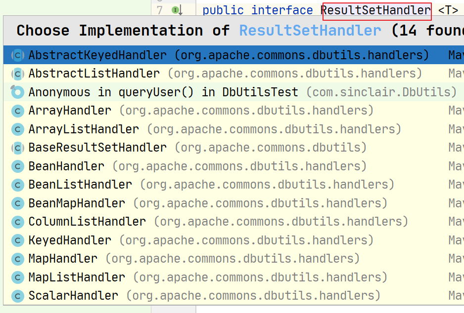
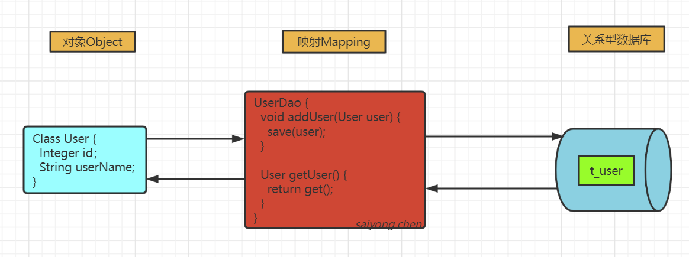

## 1、使用JDBC连接数据库

在Java程序中连接数据库，最原始的方式就是使用JDBC的API。


具体步骤：

1. 在pom.xml中引入MySQL驱动依赖
2. 使用Class.forName注册驱动
3. 获取一个Connection连接
4. 创建一个Statement对象
5. 使用execute()执行SQL语句，获取ResultSet结果集
6. 遍历结果集，给pojo属性赋值
7. 关闭所有资源


示例代码：

```java
//注册JDBC驱动
Class.forName("com.mysql.jdbc.Driver");

//打开连接
conn = DriverManager.getConnection(
    "jdbc:mysql://localhost:3306/mybatisdb?charactherEncoding=utf8",
    "root",
    "123456");

//执行SQL
stmt= conn.createStatement();
String sql = "select id, user_name, real_name, password, age from t_user where id = 1";
ResultSet rs = stmt.executeQuery(sql);

//获取结果集
while (rs.next()) {

    Integer id = rs.getInt("id");
    String userName = rs.getString("user_name");
    String realName = rs.getString("real_name");
    String passsword = rs.getString("passsword");

    user.setId(id);
    user.setUserName(userName);
    user.setRealName(realName);
    user.setPassword(passsword);

    System.out.println(user);
}
```


以上就是我们使用原始的JDBC去操作数据库的方式，当然这仅仅只是一个查询。如果我们项目中的业务非常复杂，表也非常的多，操作数据库的增删改查方法非常多，那么这种方式会导致的问题就是：

1. 相同的代码会出现很多次
2. 资源消耗比较大，要不停的打开和关闭资源
3. 处理结果集繁琐
4. SQL语句和代码耦合在一起


## 2、优化JDBC

### 2.1 优化资源管理方面的代码

首先我们可以创建一个工具类：

```java
public class MyDBUtils {
    
    private static final String JDBC_URL = "jdbc:mysql://localhost:3306/mybatisdb?charactherEncoding=utf8";
    private static final String JDBC_USER = "root";
    private static final String JDBC_PASSWORD = "123456";
    
    private static Connection conn;

    /**
     * 获取连接
     * @return
     * @throws Exception
     */
    public static Connection getConnection() throws Exception {
        if (conn == null) {
            try {
                conn = DriverManager.getConnection(JDBC_URL, JDBC_USER, JDBC_PASSWORD);
            } catch (SQLException throwables) {
                throwables.printStackTrace();
                throw new Exception();
            }
        }
        return conn;
    }

    /**
     * 关闭资源
     * @param conn
     * @param stmt
     * @param rs
     */
    public static void close(Connection conn, Statement stmt, ResultSet rs) {
        if (rs != null) {
            try {
                rs.close();
            } catch (SQLException throwables) {
                throwables.printStackTrace();
            }
        }

        if (stmt != null) {
            try {
                stmt.close();
            } catch (SQLException throwables) {
                throwables.printStackTrace();
            }
        }

        if (conn != null) {
            try {
                conn.close();
            } catch (SQLException throwables) {
                throwables.printStackTrace();
            }
        }
    }
    
    public static void close(Connection conn, Statement stmt) {
        close(conn, stmt, null);
    }
    
    public static void close(Connection conn) {
        close(conn, null);
    }
}
```


### 2.2 解决SQL耦合的问题

```java
/**
* 执行更新操作
* @param sql
* @param parameters
* @return
* @throws Exception
*/
public static Integer update(String sql, Object ... parameters) throws Exception {

    conn = getConnection();
    PreparedStatement ps = conn.prepareStatement(sql);
    if (parameters != null & parameters.length > 0) {
        for (int i = 0; i < parameters.length; i++) {
            ps.setObject(i+1, parameters[i]);
        }
    }
    int i = ps.executeUpdate();
    close(conn, ps);
    return i;
}
```


### 2.3 优化结果集

```java
/**
* 查询
* @param sql
* @param clazz
* @param parameters
* @param <T>
* @return
* @throws Exception
*/
public static <T> List<T> query(String sql, Class clazz, Object ... parameters) throws Exception {
    conn = getConnection();
    PreparedStatement ps = conn.prepareStatement(sql);
    if (parameters != null & parameters.length > 0) {
        for (int i = 0; i < parameters.length; i++) {
            ps.setObject(i+1, parameters[i]);
        }
    }

    ResultSet rs = ps.executeQuery();
    ResultSetMetaData metaData = rs.getMetaData();
    List<T> list = new ArrayList<>();
    while (rs.next()) {
        int columnCount = metaData.getColumnCount();
        Object instance = clazz.newInstance();
        for (int i = 0; i < columnCount; i++) {
            String columnName = metaData.getColumnName(i);
            Object columnValue = rs.getObject(columnName);
            setFieldValueForColumn(instance, columnName, columnValue);
        }
    }
    return list;
}

/**
* 根据字段名赋值
* @param instance
* @param columnName
* @param columnValue
*/
private static void setFieldValueForColumn(Object instance, String columnName, Object columnValue) {
    Class<?> clazz = instance.getClass();
    try {
        Field field = clazz.getDeclaredField(columnName);
        field.setAccessible(true);
        field.set(instance, columnValue);
        field.setAccessible(false);
    } catch (Exception e) {
        if (columnName.contains("_")) {
            Pattern compile = Pattern.compile("_(\\w)");
            columnName = columnName.toLowerCase();
            Matcher matcher = compile.matcher(columnName);
            StringBuffer sb = new StringBuffer();
            while (matcher.find()) {
                matcher.appendReplacement(sb, matcher.group(1).toUpperCase());
            }
            matcher.appendTail(sb);
            setFieldValueForColumn(instance, sb.toString(), columnValue);
        }
    }
}
```


## 3、Apache DbUtils

我们自己去优化的JDBC还是非常粗糙的，我们可以使用Apache的DbUtils

[官网地址](https://commons.apache.org/proper/commons-dbutils/)

Apache的DbUtils解决的最核心的问题就是结果集的映射，可以把ResultSet封装成JavaBean


在DbUtils提供了一个QueryRunner类，它对数据库的增删改查进行了封装，我们如果要操作数据库只要使用它即可。

### 3.1 初始化QueryRunner

QueryRunner初始化需要一个DataSource对象，这样也解决了资源管理的问题。

```java
private static final String PROPERTIES_PATH = "druid.properties";

private static DruidDataSource dataSource;
private static QueryRunner queryRunner;

public void init(){

    Properties properties = new Properties();
    InputStream in = DbUtils.class.getClassLoader().getResourceAsStream(PROPERTIES_PATH);
    try {
        properties.load(in);
    } catch (IOException e) {
        e.printStackTrace();
    }
    dataSource = new DruidDataSource();
    dataSource.configFromPropety(properties);
    queryRunner = new QueryRunner(dataSource);
}
```


### 3.2 DataSource配置信息：

```properties
druid.username=root
druid.password=123456
druid.url=jdbc:mysql://localhost:3306/mybatisdb?charactherEncoding=utf8
druid.minIdle=10
druid.maxActive=30
```


### 3.3 基本使用

对于ResultSet结果集的处理是通过ResultSetHandler来处理的，我们可以自己实现这个接口。

```java
/**
* 查询所有用户信息
* @throws SQLException
*/
public void queryUser() throws SQLException {
    DbUtilsTest.init();
    QueryRunner queryRunner = DbUtilsTest.getQueryRunner();

    String sql = "select * from t_user";
    List<User> list = queryRunner.query(sql, new ResultSetHandler<List<User>>() {
        @Override
        public List<User> handle(ResultSet resultSet) throws SQLException {

            List<User> list = new ArrayList<>();
            while (resultSet.next()) {
                User user = new User();
                user.setId(resultSet.getInt("id"));
                user.setUserName(resultSet.getString("user_name"));
                user.setRealName(resultSet.getString("real_name"));
                user.setPassword(resultSet.getString("password"));
                list.add(user);
            }

            return list;
        }
    });

    for (User user : list) {
        System.out.println(user);
    }
}
```


也可以使用DbUtils中的实现类



```java
/**
* 使用ResultHandle的实现类处理查询结果集
* @throws SQLException
*/
public void queryUserByBeanListHandle() throws SQLException {
    DbUtilsTest.init();
    QueryRunner queryRunner = DbUtilsTest.getQueryRunner();

    String sql = "select * from t_user";
    List<User> list = queryRunner.query(sql, new BeanListHandler<User>(User.class));

    for (User user : list) {
        System.out.println(user);
    }
}
```

就这样我们可以通过Apache DbUtils方便的实现我们对数据库的简单操作。


## 4、Spring JDBC

在Spring框架中也封装了对JDBC的操作，JdbcTemplate。这个类是JDBC核心包的中心类，简化了JDBC的操作，同时可以避免常见的异常。它是线程安全的。


### 4.1 首先要进行配置

资源管理直接交给JdbcTemplate，不需要我们手动的关闭和打开。

```java
@Configuration
@Component
public class SpringConfig {

    @Bean
    public DataSource dataSource(){
        DruidDataSource dataSource = new DruidDataSource();
        dataSource.setUsername("root");
        dataSource.setPassword("123456");
        dataSource.setUrl("dbc:mysql://localhost:3306/mybatisdb?charactherEncoding=utf8");

        return dataSource;
    }

    @Bean
    public JdbcTemplate jdbcTemplate(DataSource dataSource){
        JdbcTemplate jdbcTemplate = new JdbcTemplate();
        jdbcTemplate.setDataSource(dataSource);

        return jdbcTemplate;
    }
}
```


### 4.2 CRUD操作

对于处理结果集，在JDBCTemplate中有一个RowMapper接口，可以把结果集转换成Java对象。如果我们重复的编写，也可以直接自定义成一个类，然后在需要的地方传入即可。

```java
@Repository
public class UserDao {

    @Autowired
    private JdbcTemplate jdbcTemplate;

    public void addUser() {
        int count = jdbcTemplate.update("insert into " +
                        "t_user(user_name, real_name) values(?, ?)",
                "zhangsan", "张三");

        System.out.println(count);
    }

    public void queryUser1() {
        String sql = "select * from t_user";
        List<User> list = jdbcTemplate.query(sql, new RowMapper<User>() {
            @Override
            public User mapRow(ResultSet resultSet, int i) throws SQLException {

                User user = new User();
                user.setId(resultSet.getInt("id"));
                user.setRealName(resultSet.getString("real_name"));
                user.setUserName(resultSet.getString("user_name"));
                user.setPassword(resultSet.getString("password"));

                return user;
            }
        });


        for (User user : list) {
            System.out.println(user);
        }
    }


    public void queryUser2() {
        String sql = "select * from t_user";
        List<User> list = jdbcTemplate.query(sql, new BeanPropertyRowMapper(User.class));

        for (User user : list) {
            System.out.println(user);
        }
    }
}
```


### 4.3 总结

对于DBUtils和Spring JDBC，都可以帮我们解决了一些问题：

1. 无论是QueryRunner和JdbcTemplate，都可以传入一个数据源进行初始化，不需要我们自己去手动的关闭和创建
2. 对于数据库的操作也进行了封装
3. 可以帮助我们进行结果集的映射


但同样还是存在一些缺点：

1. SQL语句是写死在代码中的
2. 对于SQL语句的参数需要按照顺序使用占位符替换，不能自动映射
3. 可以把结果集映射成实体，但是不能将实体映射成数据库中的记录
4. 查询没有缓存


## 5、Hibernate

### 5.1 ORM框架的介绍

ORM(Object Relational Mapping)，也就是对象与关系的映射，对象就是我们程序中的对象，而关系就是对象与数据库中数据的关系。也就是说ORM框架可以帮我们解决对象与关系的相互映射。




### 5.2 Hibernate的使用

#### 5.2.1 创建项目

创建一个maven项目，并添加hibernate相关依赖

```xml
<dependency>
    <groupId>mysql</groupId>
    <artifactId>mysql-connector-java</artifactId>
    <version>8.0.11</version>
</dependency>
<dependency>
    <groupId>org.springframework.boot</groupId>
    <artifactId>spring-boot-starter-data-jpa</artifactId>
    <version>2.2.5.RELEASE</version>
</dependency>
```


#### 5.2.2 配置文件

hibernate配置文件：

```xml
<?xml version="1.0" encoding="UTF-8"?> 
<!DOCTYPE hibernate-configuration PUBLIC
       "-//Hibernate/Hibernate Configuration DTD 3.0//EN"
       "http://www.hibernate.org/dtd/hibernate-configuration-3.0.dtd"> 
<hibernate-configuration>
    <session-factory>
        <property name="hibernate.connection.driver_class"> 
            com.mysql.cj.jdbc.Driver
        </property>
        
        <property name="hibernate.connection.url"> 
            jdbc:mysql://localhost:3306/mybatisdb? 
            characterEncoding=utf8&amp;serverTimezone=UTC
        </property>
        
        <property name="hibernate.connection.username">root</property> 
        <property name="hibernate.connection.password">123456</property> 
        
        <property name="hibernate.dialect">
            org.hibernate.dialect.MySQLDialect 
        </property>
        
        <property name="hibernate.show_sql">true</property>
        <property name="hibernate.format_sql">true</property>
        <property name="hibernate.hbm2ddl.auto">update</property> 
        
        <mapping resource="User.hbm.xml"/>
    </session-factory> 
</hibernate-configuration>
```


创建实体类的hbm的xml映射文件：user.hbm.xml

```xml
<?xml version="1.0" encoding="UTF-8"?> 
<!DOCTYPE hibernate-mapping PUBLIC
       '-//Hibernate/Hibernate Mapping DTD 3.0//EN'
       'http://hibernate.sourceforge.net/hibernate-mapping-3.0.dtd'> 
<hibernate-mapping>
    <class name="com.sinclair.hibernate.User" table="t_user"> 
        <id name="id" />
        <property name="userName" column="user_name"></property> 
        <property name="realName" column="real_name"></property> 
    </class>
</hibernate-mapping>
```


#### 5.2.3 CRUD操作

```java
public class HibernateTest {

    public static void main(String[] args) {
        //获取配置信息
        //创建sessionfactory，打开session，获取事务对象
        //开启事务，把对象提交到数据库，最后提交事务，关闭session
        Configuration configuration = new Configuration();
        configuration.configure();
        SessionFactory factory = configuration.buildSessionFactory();
        Session session = factory.openSession();
        Transaction transaction = session.getTransaction();
        transaction.begin();
        User user = new User();
        user.setId(666);
        user.setAge("18");
        user.setRealName("zhangsan");
        user.setUserName("zhangsan");
        session.save(user);
        transaction.commit();
        session.close();
    }
}
```


### 5.3 hibernate的总结

Hibernate出现可以大大简化我们的日常开发工作：

1. 可以根据数据库方言自定义生成SQL语句，具有很好的移植性
2. 可以自动管理连接资源
3. 实现了实体类和关系型数据库的完全映射
4. 提供了缓冲机制


但是Hibernate在处理一些复杂业务的时候会存在一些问题：

1. 比如使用API中的get()、save()、update()方法的时候，实际操作的是表中所有的字段。没有办法指定部分字段，不够灵活
2. 由于是自定义生成的SQL语句，无法对SQL进行优化
3. 不支持动态SQL，无法根据条件生成SQL语句


## 6、Mybatis

[Mybatis](https://mybatis.org/mybatis-3/zh/index.html)是一款"半自动化"的ORM框架，可以很好的解决Hibernate的缺点，相对于Hibernate的”全自动化“来说，它支持自定义SQL、存储过程和高级映射。主要解决SQL和对象的映射问题。并且SQL和代码是分离的。


### 6.1 Mybatis的使用

#### 6.1.1 创建项目

创建一个maven项目，并且引入相关依赖：

```xml
<dependency>
    <groupId>org.mybatis</groupId>
    <artifactId>mybatis</artifactId>
    <version>3.5.4</version>
</dependency>
<dependency>
    <groupId>mysql</groupId>
    <artifactId>mysql-connector-java</artifactId>
    <version>8.0.11</version>
</dependency>
```


#### 6.1.2 添加配置文件

全局配置文件：

```xml
<?xml version="1.0" encoding="UTF-8" ?>
<!DOCTYPE configuration PUBLIC "-//mybatis.org//DTD Config 3.0//EN" 
"http://mybatis.org/dtd/mybatis-3-config.dtd">
<configuration>
    <properties resource="db.properties"></properties>
    <settings>
        <!-- 打印查询语句 -->
        <setting name="logImpl" value="STDOUT_LOGGING" />
        
        <!-- 控制全局缓存（二级缓存），默认true-->
        <setting name="cacheEnabled" value="false"/>
        
        <!-- 延迟加载的全局开关。当开启时，所有关联对象都会延迟加载。默认false  -->
        <setting name="lazyLoadingEnabled" value="true"/>
        
        <!-- 当开启时，任何方法的调用都会加载该对象的所有属性。默认false，可通过select标签的fetchType来覆盖-->
        <setting name="aggressiveLazyLoading" value="true"/>
        
        <!--  Mybatis 创建具有延迟加载能力的对象所用到的代理工具，默认JAVASSIST --> 
        <!--<setting name="proxyFactory" value="CGLIB" />-->
        
        <!-- STATEMENT级别的缓存，使一级缓存，只针对当前执行的这一statement有效    --> 
        <!--
               <setting name="localCacheScope" value="STATEMENT"/> 
       -->
        <setting name="localCacheScope" value="SESSION"/>
    </settings>
    
    <typeAliases>
        <typeAlias alias="user" type="com.sinclair.mybatis.User" />
    </typeAliases>
    
    <environments default="development">
        <environment id="development">
            <transactionManager type="JDBC"/><!-- 单独使用时配置成MANAGED没有事务    -->
            <dataSource type="POOLED">
                <property name="driver" value="${jdbc.driver}"/>
                <property name="url" value="${jdbc.url}"/>
                <property name="username" value="${jdbc.username}"/>
                <property name="password" value="${jdbc.password}"/>
            </dataSource>
        </environment>
    </environments>
    
    <mappers>
        <mapper resource="mapper/UserMapper.xml"/>
    </mappers>
</configuration>
```


db.properties数据库配置文件：

```properties
jdbc.driver=com.mysql.jdbc.Driver
jdbc.url=jdbc:mysql://localhost:3306/mybatisdb?characterEncoding=utf-8&serverTimezone=UTC
jdbc.username=root 
jdbc.password=123456
```


User.Mapping映射文件：

```xml
<?xml version="1.0" encoding="UTF-8"?>
<!DOCTYPE mapper PUBLIC "-//mybatis.org//DTD Mapper 3.0//EN" 
"http://mybatis.org/dtd/mybatis-3-mapper.dtd">
<mapper namespace="com.sinclair.mybatis.UserMapper">
    <resultMap id="BaseResultMap" type="user">
        <id property="id" column="id" jdbcType="INTEGER"/>
        <result property="userName" column="user_name" jdbcType="VARCHAR" />
        <result property="realName" column="real_name" jdbcType="VARCHAR" />
        <result property="password" column="password" jdbcType="VARCHAR"/>
        <result property="age" column="age" jdbcType="INTEGER"/>
        <result property="dId" column="d_id" jdbcType="INTEGER"/>
    </resultMap>
    
    <select id="selectUserById" resultMap="BaseResultMap" statementType="PREPARED">
        select * from t_user where id = #{id} 
    </select>
    
    <!-- $只能用在自定义类型和map上 -->
    <select id="selectUserByBean"  parameterType="user" resultMap="BaseResultMap">
        select * from t_user where user_name = '${userName}' 
    </select>
    
    <select id="selectUserList" resultMap="BaseResultMap" > 
        select * from t_user
    </select> 
</mapper>
```


#### 6.1.3 编程式使用

```java
public void test1() throws Exception{ 
    // 1.获取配置文件
    InputStream in = Resources.getResourceAsStream("mybatis-config.xml"); 
    // 2.加载解析配置文件并获取SqlSessionFactory对象
    SqlSessionFactory factory = new SqlSessionFactoryBuilder().build(in); 
    // 3.根据SqlSessionFactory对象获取SqlSession对象
    SqlSession sqlSession = factory.openSession(); 
    // 4.通过SqlSession中提供的API方法来操作数据库 
    List<User> list = sqlSession.selectList("com.sinclair.mybatis.UserMapper.selectUserList"); 
    for (User user : list) {
        System.out.println(user); 
    }
    // 5.关闭会话
    sqlSession.close(); 
}
```


#### 6.1.4 代理方式使用

声明一个DAO接口文件：

接口全路径必须与映射文件中namespace保持一致，同时方法名也需要和statment id保持一致。

```java
public interface UserMapper {
   public List<User> selectUserList(); 
}
```


使用：

```java
public void test2() throws Exception{ 
    // 1.获取配置文件
    InputStream in = Resources.getResourceAsStream("mybatis-config.xml"); 
    // 2.加载解析配置文件并获取SqlSessionFactory对象
    SqlSessionFactory factory = new SqlSessionFactoryBuilder().build(in); 
    // 3.根据SqlSessionFactory对象获取SqlSession对象
    SqlSession sqlSession = factory.openSession(); 
    // 4.通过SqlSession中提供的API方法来操作数据库
    UserMapper mapper = sqlSession.getMapper(UserMapper.class); 
    List<User> list = mapper.selectUserList();
    for (User user : list) {
        System.out.println(user); 
    }
    // 5.关闭会话
    sqlSession.close(); 
}
```


### 6.2 Mybatis的特点

1. 使用连接池对连接进行管理
2. SQL与代码分离
3. 可以进行结果集映射
4. 可以进行参数映射和使用动态SQL
5. 可以提取重复的SQL，并使用
6. 有缓存管理
7. 可以自定义插件
