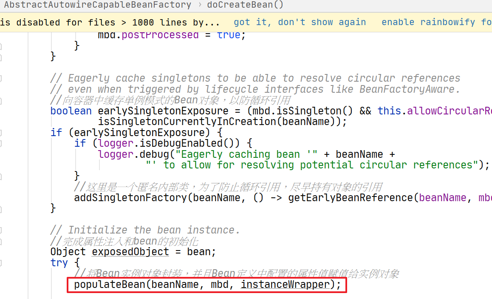

## 1、属性注入的入口

在AbstractAutowireCapableBeanFactory.doCreateBean()方法中，我们首先完成了Bean对象的实例化。完成实例化后，就需要进行属性的注入，同样在这个方法中：




## 2、将Bean属性设置到生成的实例对象上

调用AbstractAutowireCapableBeanFactory.populateBean()方法：

```java
/**
 * 将Bean属性设置到生成的实例对象上
 */
protected void populateBean(String beanName, RootBeanDefinition mbd, @Nullable BeanWrapper bw) {
   if (bw == null) {
      if (mbd.hasPropertyValues()) {
         throw new BeanCreationException(
               mbd.getResourceDescription(), beanName, "Cannot apply property values to null instance");
      }
      else {
         // Skip property population phase for null instance.
         return;
      }
   }

   // Give any InstantiationAwareBeanPostProcessors the opportunity to modify the
   // state of the bean before properties are set. This can be used, for example,
   // to support styles of field injection.
   boolean continueWithPropertyPopulation = true;

   if (!mbd.isSynthetic() && hasInstantiationAwareBeanPostProcessors()) {
      for (BeanPostProcessor bp : getBeanPostProcessors()) {
         if (bp instanceof InstantiationAwareBeanPostProcessor) {
            InstantiationAwareBeanPostProcessor ibp = (InstantiationAwareBeanPostProcessor) bp;
            if (!ibp.postProcessAfterInstantiation(bw.getWrappedInstance(), beanName)) {
               continueWithPropertyPopulation = false;
               break;
            }
         }
      }
   }

   if (!continueWithPropertyPopulation) {
      return;
   }

   //获取容器在解析Bean定义资源时为BeanDefiniton中设置的属性值
   PropertyValues pvs = (mbd.hasPropertyValues() ? mbd.getPropertyValues() : null);

   //使用自动装配模型完成注入，实现了在不使用注解的方式完成注入
   //可以在配置信息的时候使用autowire属性来指定
   //获取注入的方式，然后进行对比是通过name来注入的还是通过type来完成注入的
   if (mbd.getResolvedAutowireMode() == RootBeanDefinition.AUTOWIRE_BY_NAME ||
         mbd.getResolvedAutowireMode() == RootBeanDefinition.AUTOWIRE_BY_TYPE) {

      //将属性值对象封装成一个可变的属性值对象
      MutablePropertyValues newPvs = new MutablePropertyValues(pvs);

      // Add property values based on autowire by name if applicable.
      //根据Bean名称进行autowiring自动装配处理
      if (mbd.getResolvedAutowireMode() == RootBeanDefinition.AUTOWIRE_BY_NAME) {
         autowireByName(beanName, mbd, bw, newPvs);
      }

      // Add property values based on autowire by type if applicable.
      //根据Bean类型进行autowiring自动装配处理
      if (mbd.getResolvedAutowireMode() == RootBeanDefinition.AUTOWIRE_BY_TYPE) {
         autowireByType(beanName, mbd, bw, newPvs);
      }

      pvs = newPvs;
   }


   //通过Bean后置处理器完成属性注入，基于注解
   boolean hasInstAwareBpps = hasInstantiationAwareBeanPostProcessors();
   boolean needsDepCheck = (mbd.getDependencyCheck() != RootBeanDefinition.DEPENDENCY_CHECK_NONE);

   if (hasInstAwareBpps || needsDepCheck) {
      if (pvs == null) {
         pvs = mbd.getPropertyValues();
      }
      PropertyDescriptor[] filteredPds = filterPropertyDescriptorsForDependencyCheck(bw, mbd.allowCaching);
      if (hasInstAwareBpps) {
         for (BeanPostProcessor bp : getBeanPostProcessors()) {
            if (bp instanceof InstantiationAwareBeanPostProcessor) {
               InstantiationAwareBeanPostProcessor ibp = (InstantiationAwareBeanPostProcessor) bp;
               pvs = ibp.postProcessPropertyValues(pvs, filteredPds, bw.getWrappedInstance(), beanName);
               if (pvs == null) {
                  return;
               }
            }
         }
      }
      if (needsDepCheck) {
         checkDependencies(beanName, mbd, filteredPds, pvs);
      }
   }

   if (pvs != null) {
      //对属性进行注入
      applyPropertyValues(beanName, mbd, bw, pvs);
   }
}
```


## 3、通过指定的自动装配模型来完成属性的注入

AutoWireMode自动装配模型，有四种模式：

```java
//默认装配模式
public static final int AUTOWIRE_NO = AutowireCapableBeanFactory.AUTOWIRE_NO;

//使用set方法，通过name装配
public static final int AUTOWIRE_BY_NAME = AutowireCapableBeanFactory.AUTOWIRE_BY_NAME;

//使用set方法，通过type装配
public static final int AUTOWIRE_BY_TYPE = AutowireCapableBeanFactory.AUTOWIRE_BY_TYPE;

//使用构造器注入
public static final int AUTOWIRE_CONSTRUCTOR = AutowireCapableBeanFactory.AUTOWIRE_CONSTRUCTOR;

//这种已经废弃了
public static final int AUTOWIRE_AUTODETECT = AutowireCapableBeanFactory.AUTOWIRE_AUTODETECT;
```


### 3.1 通过name对属性进行注入

```java
/**
 * 根据名称对属性进行自动依赖注入
 *
 */
protected void autowireByName(
      String beanName, AbstractBeanDefinition mbd, BeanWrapper bw, MutablePropertyValues pvs) {

   //对Bean对象中非简单属性(不是简单继承的对象，如8种原始类型，字符串，URL等都是简单属性)进行处理
   String[] propertyNames = unsatisfiedNonSimpleProperties(mbd, bw);
   for (String propertyName : propertyNames) {
       
      //如果Spring IOC容器中包含指定名称的Bean
      if (containsBean(propertyName)) {
          
         //调用getBean方法向IOC容器索取指定名称的Bean实例，迭代触发属性的初始化和依赖注入
         Object bean = getBean(propertyName);
          
         //向可变属性值对象中添加这个属性名和注入bean的关系
         pvs.add(propertyName, bean);
          
         //给注入的依赖bean添加依赖关系
         registerDependentBean(propertyName, beanName);
         if (logger.isDebugEnabled()) {
            logger.debug("Added autowiring by name from bean name '" + beanName +
                  "' via property '" + propertyName + "' to bean named '" + propertyName + "'");
         }
      }
      else {
         if (logger.isTraceEnabled()) {
            logger.trace("Not autowiring property '" + propertyName + "' of bean '" + beanName +
                  "' by name: no matching bean found");
         }
      }
   }
}
```


### 3.2 通过type对属性进行注入

```java
/**
 * 根据类型对属性进行自动依赖注入
 *
 */
protected void autowireByType(
      String beanName, AbstractBeanDefinition mbd, BeanWrapper bw, MutablePropertyValues pvs) {

   //获取用户定义的类型转换器
   TypeConverter converter = getCustomTypeConverter();
   if (converter == null) {
      converter = bw;
   }

   //存放解析的要注入的属性
   Set<String> autowiredBeanNames = new LinkedHashSet<>(4);
    
   //对Bean对象中非简单属性(不是简单继承的对象，如8中原始类型，字符
   //URL等都是简单属性)进行处理
   String[] propertyNames = unsatisfiedNonSimpleProperties(mbd, bw);
   for (String propertyName : propertyNames) {
      try {
         //获取指定属性名称的属性描述器
         PropertyDescriptor pd = bw.getPropertyDescriptor(propertyName);
          
         // Don't try autowiring by type for type Object: never makes sense,
         // even if it technically is a unsatisfied, non-simple property.
         //不对Object类型的属性进行autowiring自动依赖注入
         if (Object.class != pd.getPropertyType()) {
             
            //获取属性的setter方法
            MethodParameter methodParam = BeanUtils.getWriteMethodParameter(pd);
             
            // Do not allow eager init for type matching in case of a prioritized post-processor.
            //检查指定类型是否可以被转换为目标对象的类型
            boolean eager = !PriorityOrdered.class.isInstance(bw.getWrappedInstance());
             
            //创建一个要被注入的依赖描述
            DependencyDescriptor desc = new AutowireByTypeDependencyDescriptor(methodParam, eager);
             
            //根据容器的Bean定义解析依赖关系，返回所有要被注入的Bean对象
            Object autowiredArgument = resolveDependency(desc, beanName, autowiredBeanNames, converter);
            if (autowiredArgument != null) {
               //为属性赋值所引用的对象
               pvs.add(propertyName, autowiredArgument);
            }
            for (String autowiredBeanName : autowiredBeanNames) {
                
               //给注入的依赖bean添加依赖关系
               registerDependentBean(autowiredBeanName, beanName);
               if (logger.isDebugEnabled()) {
                  logger.debug("Autowiring by type from bean name '" + beanName + "' via property '" +
                        propertyName + "' to bean named '" + autowiredBeanName + "'");
               }
            }
            //释放已自动注入的属性
            autowiredBeanNames.clear();
         }
      }
      catch (BeansException ex) {
         throw new UnsatisfiedDependencyException(mbd.getResourceDescription(), beanName, propertyName, ex);
      }
   }
}
```


## 4、通过Bean后置处理器完成属性的注入

比如我们使用@Autowired注解，就是使用的这种方式进行属性注入的。

调用AutowiredAnnotationBeanPostProcessor.postProcessPropertyValues()方法

```java
//处理类中的属性
@Override
public PropertyValues postProcessPropertyValues(
      PropertyValues pvs, PropertyDescriptor[] pds, Object bean, String beanName) throws BeanCreationException {

   //获取指定类中autowire相关注解的元信息
   InjectionMetadata metadata = findAutowiringMetadata(beanName, bean.getClass(), pvs);
   try {
      //对Bean的属性进行自动注入
      metadata.inject(bean, beanName, pvs);
   }
   catch (BeanCreationException ex) {
      throw ex;
   }
   catch (Throwable ex) {
      throw new BeanCreationException(beanName, "Injection of autowired dependencies failed", ex);
   }
   return pvs;
}
```


### 4.1 获取给定类的autowire相关注解元信息

调用findAutowiringMetadata()方法

```java
private InjectionMetadata findAutowiringMetadata(String beanName, Class<?> clazz, @Nullable PropertyValues pvs) {
   // Fall back to class name as cache key, for backwards compatibility with custom callers.
   String cacheKey = (StringUtils.hasLength(beanName) ? beanName : clazz.getName());
    
   // Quick check on the concurrent map first, with minimal locking.
   //首先从容器中查找是否有给定类的autowire相关注解元信息
   InjectionMetadata metadata = this.injectionMetadataCache.get(cacheKey);
   if (InjectionMetadata.needsRefresh(metadata, clazz)) {
      synchronized (this.injectionMetadataCache) {
         metadata = this.injectionMetadataCache.get(cacheKey);
         if (InjectionMetadata.needsRefresh(metadata, clazz)) {
            if (metadata != null) {
               //解析给定类autowire相关注解元信息
               metadata.clear(pvs);
            }
            //解析给定类autowire相关注解元信息
            metadata = buildAutowiringMetadata(clazz);
            //将得到的给定类autowire相关注解元信息存储在容器缓存中
            this.injectionMetadataCache.put(cacheKey, metadata);
         }
      }
   }
   return metadata;
}
```


### 4.2 解析给定类autowire相关注解元信息

调用buildAutowiringMetadata()方法

```java
private InjectionMetadata buildAutowiringMetadata(final Class<?> clazz) {
   //创建一个存放注解元信息的集合
   LinkedList<InjectionMetadata.InjectedElement> elements = new LinkedList<>();
   Class<?> targetClass = clazz;

   //递归遍历当前类及其所有基类，解析全部注解元信息
   do {
      //创建一个存储当前正在处理类注解元信息的集合
      final LinkedList<InjectionMetadata.InjectedElement> currElements = new LinkedList<>();

      //利用JDK反射机制获取给定类中所有的声明字段，获取字段上的注解信息
      ReflectionUtils.doWithLocalFields(targetClass, field -> {
          
         //获取给定字段上的注解
         AnnotationAttributes ann = findAutowiredAnnotation(field);
         if (ann != null) {
             
            //如果给定字段是静态的(static)，则直接遍历下一个字段
            if (Modifier.isStatic(field.getModifiers())) {
               if (logger.isWarnEnabled()) {
                  logger.warn("Autowired annotation is not supported on static fields: " + field);
               }
               return;
            }
            //判断注解的required属性值是否有效
            boolean required = determineRequiredStatus(ann);
             
            //将当前字段元信息封装，添加在返回的集合中
            currElements.add(new AutowiredFieldElement(field, required));
         }
      });

      //利用JDK反射机制获取给定类中所有的声明方法，获取方法上的注解信息
      ReflectionUtils.doWithLocalMethods(targetClass, method -> {
         Method bridgedMethod = BridgeMethodResolver.findBridgedMethod(method);
         if (!BridgeMethodResolver.isVisibilityBridgeMethodPair(method, bridgedMethod)) {
            return;
         }
         //获取给定方法上的所有注解
         AnnotationAttributes ann = findAutowiredAnnotation(bridgedMethod);
         if (ann != null && method.equals(ClassUtils.getMostSpecificMethod(method, clazz))) {
             
            //如果方法是静态的，则直接遍历下一个方法
            if (Modifier.isStatic(method.getModifiers())) {
               if (logger.isWarnEnabled()) {
                  logger.warn("Autowired annotation is not supported on static methods: " + method);
               }
               return;
            }
             
            //如果方法的参数列表为空
            if (method.getParameterCount() == 0) {
               if (logger.isWarnEnabled()) {
                  logger.warn("Autowired annotation should only be used on methods with parameters: " +
                        method);
               }
            }
             
            //判断注解的required属性值是否有效
            boolean required = determineRequiredStatus(ann);
             
            //获取当前方法的属性描述符，即方法是可读的(readable)getter方法，还是可写的(writeable)setter方法
            PropertyDescriptor pd = BeanUtils.findPropertyForMethod(bridgedMethod, clazz);
             
            //将方法元信息封装添加到返回的元信息集合中
            currElements.add(new AutowiredMethodElement(method, required, pd));
         }
      });

      //将当前类的注解元信息存放到注解元信息集合中
      elements.addAll(0, currElements);
      //获取给定类的父类
      targetClass = targetClass.getSuperclass();
   }
   //如果给定类有基类，并且基类不是Object，则递归获取其基类的元信息
   while (targetClass != null && targetClass != Object.class);

   return new InjectionMetadata(clazz, elements);
}
```


### 4.3 获取给定对象的相关注解属性

调用findAutowiredAnnotation()方法：

```java
private final Set<Class<? extends Annotation>> autowiredAnnotationTypes = new LinkedHashSet<>();


public AutowiredAnnotationBeanPostProcessor() {
    //后置处理器将处理@Autowire注解
    this.autowiredAnnotationTypes.add(Autowired.class);
    //后置处理器将处理@Value注解
    this.autowiredAnnotationTypes.add(Value.class);
    try {
        //后置处理器将处理javax.inject.Inject JSR-330注解
        this.autowiredAnnotationTypes.add((Class<? extends Annotation>)
                                          ClassUtils.forName("javax.inject.Inject", AutowiredAnnotationBeanPostProcessor.class.getClassLoader()));
        logger.info("JSR-330 'javax.inject.Inject' annotation found and supported for autowiring");
    }
    catch (ClassNotFoundException ex) {
        // JSR-330 API not available - simply skip.
    }
}

@Nullable
private AnnotationAttributes findAutowiredAnnotation(AccessibleObject ao) {
   if (ao.getAnnotations().length > 0) {
      //遍历所有autowire相关的注解:@Autowire、@Value以及JSR-330等
      for (Class<? extends Annotation> type : this.autowiredAnnotationTypes) {
         //获取给定对象上的指定类型的注解
         AnnotationAttributes attributes = AnnotatedElementUtils.getMergedAnnotationAttributes(ao, type);
         if (attributes != null) {
            return attributes;
         }
      }
   }
   return null;
}
```


## 5、对属性注入

上面的方法，只是完成了所有注入属性的获取。将获取到的属性封装到PropertyValues对象中。

调用AbstractAutowireCapableBeanFactory.applyPropertyValues()将属性注入到实例化好的Bean中

```java
/**
 * 解析并注入依赖属性的过程
 *
 */
protected void applyPropertyValues(String beanName, BeanDefinition mbd, BeanWrapper bw, PropertyValues pvs) {
   if (pvs.isEmpty()) {
      return;
   }

   //封装属性值
   MutablePropertyValues mpvs = null;
   List<PropertyValue> original;

   if (System.getSecurityManager() != null) {
      if (bw instanceof BeanWrapperImpl) {
         //设置安全上下文，JDK安全机制
         ((BeanWrapperImpl) bw).setSecurityContext(getAccessControlContext());
      }
   }

   if (pvs instanceof MutablePropertyValues) {
      mpvs = (MutablePropertyValues) pvs;
      //属性值已经转换
      if (mpvs.isConverted()) {
         // Shortcut: use the pre-converted values as-is.
         try {
            //为实例化对象设置属性值
            bw.setPropertyValues(mpvs);
            return;
         }
         catch (BeansException ex) {
            throw new BeanCreationException(
                  mbd.getResourceDescription(), beanName, "Error setting property values", ex);
         }
      }
      //获取属性值对象的原始类型值
      original = mpvs.getPropertyValueList();
   }
   else {
      original = Arrays.asList(pvs.getPropertyValues());
   }

   //获取用户自定义的类型转换
   TypeConverter converter = getCustomTypeConverter();
   if (converter == null) {
      converter = bw;
   }

   //创建一个Bean定义属性值解析器，将Bean定义中的属性值解析为Bean实例对象的实际值
   BeanDefinitionValueResolver valueResolver = new BeanDefinitionValueResolver(this, beanName, mbd, converter);

   // Create a deep copy, resolving any references for values.
   //为属性的解析值创建一个深拷贝，将拷贝的数据注入到实例对象中
   List<PropertyValue> deepCopy = new ArrayList<>(original.size());
   boolean resolveNecessary = false;
   for (PropertyValue pv : original) {
      //属性值不需要转换
      if (pv.isConverted()) {
         deepCopy.add(pv);
      }
      //属性值需要转换
      else {
         String propertyName = pv.getName();
         //原始的属性值，即转换之前的属性值
         Object originalValue = pv.getValue();
         //转换属性值，例如将引用转换为IOC容器中实例化对象引用
         Object resolvedValue = valueResolver.resolveValueIfNecessary(pv, originalValue);
         //转换之后的属性值
         Object convertedValue = resolvedValue;
         //属性值是否可以转换
         boolean convertible = bw.isWritableProperty(propertyName) &&
               !PropertyAccessorUtils.isNestedOrIndexedProperty(propertyName);
         if (convertible) {
            //使用用户自定义的类型转换器转换属性值
            convertedValue = convertForProperty(resolvedValue, propertyName, bw, converter);
         }
         // Possibly store converted value in merged bean definition,
         // in order to avoid re-conversion for every created bean instance.
         //存储转换后的属性值，避免每次属性注入时的转换工作
         if (resolvedValue == originalValue) {
            if (convertible) {
               //设置属性转换之后的值
               pv.setConvertedValue(convertedValue);
            }
            deepCopy.add(pv);
         }
         // 属性是可转换的，且属性原始值是字符串类型
         // 且属性的原始类型值不是动态生成的字符串
         // 且属性的原始值不是集合或者数组类型
         else if (convertible && originalValue instanceof TypedStringValue &&
               !((TypedStringValue) originalValue).isDynamic() &&
               !(convertedValue instanceof Collection || ObjectUtils.isArray(convertedValue))) {
            pv.setConvertedValue(convertedValue);
            //重新封装属性的值
            deepCopy.add(pv);
         }
         else {
            resolveNecessary = true;
            deepCopy.add(new PropertyValue(pv, convertedValue));
         }
      }
   }
   if (mpvs != null && !resolveNecessary) {
      //标记属性值已经转换过
      mpvs.setConverted();
   }

   // Set our (possibly massaged) deep copy.
   //进行属性依赖注入
   try {
      bw.setPropertyValues(new MutablePropertyValues(deepCopy));
   }
   catch (BeansException ex) {
      throw new BeanCreationException(
            mbd.getResourceDescription(), beanName, "Error setting property values", ex);
   }
}
```