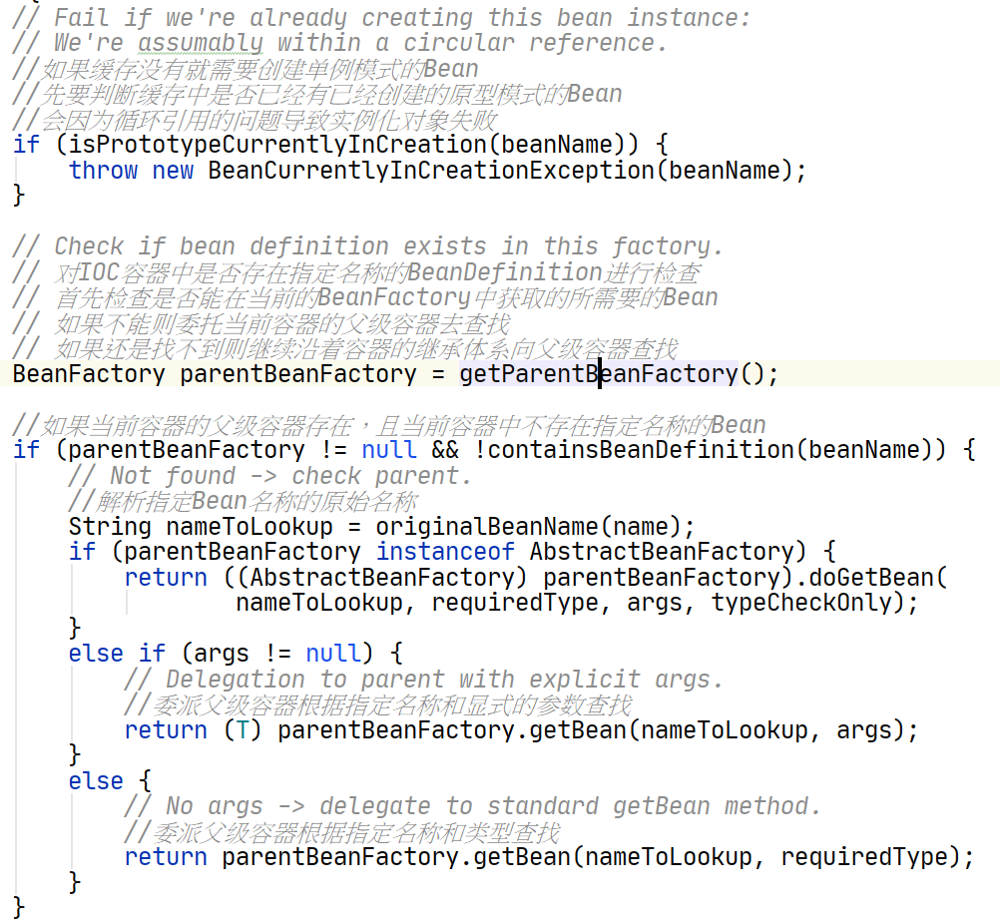
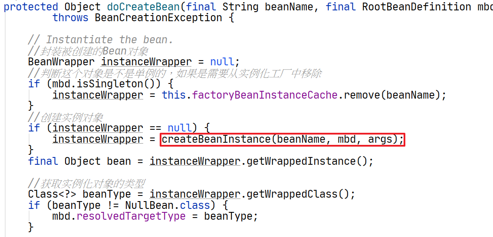

## 1、什么时候实例化对象

当Spirng IOC容器完成了Bean定义信息的定位、载入和注册之后，IOC容器中已经保存了Bean定义信息，就可以通过Bean的定义信息实例化Bean了。


**那么Bean什么时候会被实例化？**

- 当用户第一次调用BeanFactory.getBean()方法的时候
- 当给Bean配置了lazy-init=false属性时候，在容器初始化的时候会实例化Bean


## 2、实例化bean的入口：

```java
//---------------------------------------------------------------------
// Implementation of BeanFactory interface
//---------------------------------------------------------------------
@Override
public Object getBean(String name) throws BeansException {
    return doGetBean(name, null, null, false);
}

@Override
public <T> T getBean(String name, @Nullable Class<T> requiredType) throws BeansException {
    return doGetBean(name, requiredType, null, false);
}

@Override
public Object getBean(String name, Object... args) throws BeansException {
    return doGetBean(name, null, args, false);
}

/**
*
* 获取IOC容器中指定名称、类型和参数的Bean
*/
public <T> T getBean(String name, @Nullable Class<T> requiredType, @Nullable Object... args)
    throws BeansException {
    //doGetBean才是真正向IoC容器获取被管理Bean的过程
    return doGetBean(name, requiredType, args, false);
}
```


## 3、向IOC容器获取Bean

调用AbstractBeanFactory.doGetBean()方法获取bean实例对象，如果没有示例对象会创建

```java
/**
*
* 真正实现向IOC容器获取Bean的功能，也是触发依赖注入功能的地方
*
*/
@SuppressWarnings("unchecked")
protected <T> T doGetBean(final String name, @Nullable final Class<T> requiredType,
                          @Nullable final Object[] args, boolean typeCheckOnly) throws BeansException {

    //根据指定的名称获取被管理Bean的名称
    //如果指定的是别名，将别名转换为规范的Bean名称
    final String beanName = transformedBeanName(name);
    Object bean;

    // Eagerly check singleton cache for manually registered singletons.
    //先从缓存中取是否已经有被创建过的单态类型的Bean
    //对于单例模式的Bean整个IOC容器中只创建一次，不需要重复创建
    Object sharedInstance = getSingleton(beanName);

    //IOC容器创建单例模式Bean实例对象
    //如果指定名称的Bean在容器中已有单例模式的bean对象
    //直接返回已经创建的Bean对象
    if (sharedInstance != null && args == null) {
        if (logger.isDebugEnabled()) {

            if (isSingletonCurrentlyInCreation(beanName)) {
                logger.debug("Returning eagerly cached instance of singleton bean '" + beanName +
                             "' that is not fully initialized yet - a consequence of a circular reference");
            }
            else {
                logger.debug("Returning cached instance of singleton bean '" + beanName + "'");
            }
        }

        //获取给定Bean的实例对象，主要是完成FactoryBean的相关处理
        //注意：BeanFactory是管理容器中Bean的工厂，而FactoryBean是创建对象的工厂Bean，两者之间有区别
        bean = getObjectForBeanInstance(sharedInstance, name, beanName, null);
    }

    else {
        // Fail if we're already creating this bean instance:
        // We're assumably within a circular reference.
        //如果缓存没有就需要创建单例模式的Bean
        //先要判断缓存中是否已经有已经创建的原型模式的Bean
        //会因为循环引用的问题导致实例化对象失败
        if (isPrototypeCurrentlyInCreation(beanName)) {
            throw new BeanCurrentlyInCreationException(beanName);
        }

        // Check if bean definition exists in this factory.
        // 对IOC容器中是否存在指定名称的BeanDefinition进行检查
        // 首先检查是否能在当前的BeanFactory中获取的所需要的Bean
        // 如果不能则委托当前容器的父级容器去查找
        // 如果还是找不到则继续沿着容器的继承体系向父级容器查找
        BeanFactory parentBeanFactory = getParentBeanFactory();

        //如果当前容器的父级容器存在，且当前容器中不存在指定名称的Bean
        if (parentBeanFactory != null && !containsBeanDefinition(beanName)) {
            // Not found -> check parent.
            //解析指定Bean名称的原始名称
            String nameToLookup = originalBeanName(name);
            if (parentBeanFactory instanceof AbstractBeanFactory) {
                return ((AbstractBeanFactory) parentBeanFactory).doGetBean(
                    nameToLookup, requiredType, args, typeCheckOnly);
            }
            else if (args != null) {
                // Delegation to parent with explicit args.
                //委派父级容器根据指定名称和显式的参数查找
                return (T) parentBeanFactory.getBean(nameToLookup, args);
            }
            else {
                // No args -> delegate to standard getBean method.
                //委派父级容器根据指定名称和类型查找
                return parentBeanFactory.getBean(nameToLookup, requiredType);
            }
        }

        //创建的Bean是否需要进行类型验证，一般不需要
        if (!typeCheckOnly) {
            //向容器标记指定的Bean已经被创建
            markBeanAsCreated(beanName);
        }

        try {
            //根据指定Bean名称获取其父级的Bean定义
            //主要解决Bean继承时子类合并父类公共属性问题
            final RootBeanDefinition mbd = getMergedLocalBeanDefinition(beanName);
            checkMergedBeanDefinition(mbd, beanName, args);

            // Guarantee initialization of beans that the current bean depends on.
            //获取当前Bean所有依赖Bean的名称
            String[] dependsOn = mbd.getDependsOn();

            //如果当前Bean有依赖Bean
            if (dependsOn != null) {
                for (String dep : dependsOn) {
                    if (isDependent(beanName, dep)) {
                        throw new BeanCreationException(mbd.getResourceDescription(), beanName,
                                                        "Circular depends-on relationship between '" + beanName + "' and '" + dep + "'");
                    }
                    //递归调用getBean方法，获取当前Bean的依赖Bean
                    registerDependentBean(dep, beanName);

                    //先实例化依赖Bean
                    //然后把被依赖Bean注册给当前被依赖的Bean
                    getBean(dep);
                }
            }

            // Create bean instance.
            //创建单例模式Bean的实例对象
            if (mbd.isSingleton()) {
                //这里使用了一个匿名内部类，创建Bean实例对象，并且注册给所依赖的对象
                sharedInstance = getSingleton(beanName, () -> {
                    try {
                        //创建一个指定Bean实例对象，如果有父级继承，则合并子类和父类的定义
                        return createBean(beanName, mbd, args);
                    }
                    catch (BeansException ex) {
                        // Explicitly remove instance from singleton cache: It might have been put there
                        // eagerly by the creation process, to allow for circular reference resolution.
                        // Also remove any beans that received a temporary reference to the bean.
                        //显式地从容器单例模式Bean缓存中清除实例对象
                        destroySingleton(beanName);
                        throw ex;
                    }
                });
                //获取给定Bean的实例对象
                bean = getObjectForBeanInstance(sharedInstance, name, beanName, mbd);
            }

            //IOC容器创建原型模式Bean实例对象
            else if (mbd.isPrototype()) {
                // It's a prototype -> create a new instance.
                //原型模式(Prototype)是每次都会创建一个新的对象
                Object prototypeInstance = null;
                try {
                    //回调beforePrototypeCreation方法，默认的功能是注册当前创建的原型对象
                    beforePrototypeCreation(beanName);
                    //创建指定Bean对象实例
                    prototypeInstance = createBean(beanName, mbd, args);
                }
                finally {
                    //回调afterPrototypeCreation方法，默认的功能告诉IOC容器指定Bean的原型对象不再创建
                    afterPrototypeCreation(beanName);
                }
                //获取给定Bean的实例对象
                bean = getObjectForBeanInstance(prototypeInstance, name, beanName, mbd);
            }

            //要创建的Bean既不是单例模式，也不是原型模式，则根据Bean定义资源中
            //配置的生命周期范围，选择实例化Bean的合适方法，这种在Web应用程序中
            //比较常用，如：request、session、application等生命周期
            else {
                String scopeName = mbd.getScope();
                final Scope scope = this.scopes.get(scopeName);
                //Bean定义资源中没有配置生命周期范围，则Bean定义不合法
                if (scope == null) {
                    throw new IllegalStateException("No Scope registered for scope name '" + scopeName + "'");
                }
                try {
                    //这里又使用了一个匿名内部类，获取一个指定生命周期范围的实例
                    Object scopedInstance = scope.get(beanName, () -> {
                        beforePrototypeCreation(beanName);
                        try {
                            return createBean(beanName, mbd, args);
                        }
                        finally {
                            afterPrototypeCreation(beanName);
                        }
                    });

                    //获取给定Bean的实例对象
                    bean = getObjectForBeanInstance(scopedInstance, name, beanName, mbd);
                }
                catch (IllegalStateException ex) {
                    throw new BeanCreationException(beanName,
                                                    "Scope '" + scopeName + "' is not active for the current thread; consider " +
                                                    "defining a scoped proxy for this bean if you intend to refer to it from a singleton",
                                                    ex);
                }
            }
        }
        catch (BeansException ex) {
            cleanupAfterBeanCreationFailure(beanName);
            throw ex;
        }
    }

    // Check if required type matches the type of the actual bean instance.
    //对创建的Bean实例对象进行类型检查
    if (requiredType != null && !requiredType.isInstance(bean)) {
        try {
            T convertedBean = getTypeConverter().convertIfNecessary(bean, requiredType);
            if (convertedBean == null) {
                throw new BeanNotOfRequiredTypeException(name, requiredType, bean.getClass());
            }
            return convertedBean;
        }
        catch (TypeMismatchException ex) {
            if (logger.isDebugEnabled()) {
                logger.debug("Failed to convert bean '" + name + "' to required type '" +
                             ClassUtils.getQualifiedName(requiredType) + "'", ex);
            }
            throw new BeanNotOfRequiredTypeException(name, requiredType, bean.getClass());
        }
    }
    return (T) bean;
}
```


## 4、 先尝试能否获取到单实例对象

调用DefaultSingletonBeanRegistry.getSingleton()方法，从单实例IOC容器中，通过beanName获取单实例

```java
//用于缓存单例对象的容器
private final Map<String, Object> singletonObjects = new ConcurrentHashMap<>(256);

/**
*
* 获取单实例对象
*/
@Nullable
protected Object getSingleton(String beanName, boolean allowEarlyReference) {
    Object singletonObject = this.singletonObjects.get(beanName);
    if (singletonObject == null && isSingletonCurrentlyInCreation(beanName)) {
        synchronized (this.singletonObjects) {
            singletonObject = this.earlySingletonObjects.get(beanName);
            if (singletonObject == null && allowEarlyReference) {
                ObjectFactory<?> singletonFactory = this.singletonFactories.get(beanName);
                if (singletonFactory != null) {
                    singletonObject = singletonFactory.getObject();
                    this.earlySingletonObjects.put(beanName, singletonObject);
                    this.singletonFactories.remove(beanName);
                }
            }
        }
    }
    return singletonObject;
}
```

 

## 5、如果能获取单实例

调用AbstractBeanFactory.getObjectForBeanInstance()方法：

这里主要是处理这个单实例是不是一个工厂Bean，如果是一个工厂Bean，通过这个工厂Bean实例化对象。

```java
/**
*
* 获取给定Bean的实例对象，主要是完成FactoryBean的相关处理
*
*/
protected Object getObjectForBeanInstance(
    Object beanInstance, String name, String beanName, @Nullable RootBeanDefinition mbd) {

    // Don't let calling code try to dereference the factory if the bean isn't a factory.
	//如果这个Bean不是一个工厂bean，不要让调用代码尝试获取这个工厂的引用
    if (BeanFactoryUtils.isFactoryDereference(name) && !(beanInstance instanceof FactoryBean)) {
        throw new BeanIsNotAFactoryException(transformedBeanName(name), beanInstance.getClass());
    }

    // Now we have the bean instance, which may be a normal bean or a FactoryBean.
    // If it's a FactoryBean, we use it to create a bean instance, unless the
    // caller actually wants a reference to the factory.
	//如果它是一个工厂Bean，我们应该使用它创建一个bean的实例
    //除非调用者想要的是一个工厂的引用
    
    //如果不是工厂bean，直接返回
    if (!(beanInstance instanceof FactoryBean) || BeanFactoryUtils.isFactoryDereference(name)) {
        return beanInstance;
    }

    //使用工厂Bean创建一个Bean的实例对象
    Object object = null;
    if (mbd == null) {
        //从工厂Bean对象缓存中，通过指定名称的工厂Bean获取单实例对象
        object = getCachedObjectForFactoryBean(beanName);
    }

    //如果工厂bean缓存中没有这个单实例对象
    //让工厂Bean生产给定名称的Bean对象实例
    if (object == null) {
        // Return bean instance from factory.
        //将这个单实例对象，强转成工厂Bean
        FactoryBean<?> factory = (FactoryBean<?>) beanInstance;

        // Caches object obtained from FactoryBean if it is a singleton.
        //如果从工厂Bean中获取的缓存对象是单例的

        //判断beanDefinitionMap中是否存在这个beanName的Bean的定义信息
        //从容器中获取指定名称的Bean定义信息
        if (mbd == null && containsBeanDefinition(beanName)) {
            mbd = getMergedLocalBeanDefinition(beanName);
        }

        //如果从容器得到Bean定义信息，并且Bean定义信息不是虚构的，
        boolean synthetic = (mbd != null && mbd.isSynthetic());

        //调用FactoryBeanRegistrySupport类的getObjectFromFactoryBean方法，
        //使用工厂Bean去实例化bean，并放入工厂Bean缓存中
        object = getObjectFromFactoryBean(factory, beanName, !synthetic);
    }
    return object;
}
```


### 5.1 从factoryBeanObjectCache获取对象

调用FactoryBeanRegistrySupport.getCachedObjectForFactoryBean()方法，获取实例化的对象

```java
/** Cache of singleton objects created by FactoryBeans: FactoryBean name --> object */
//通过FactoryBean创建单实例对象的缓存
private final Map<String, Object> factoryBeanObjectCache = new ConcurrentHashMap<>(16);

protected Object getCachedObjectForFactoryBean(String beanName) {
    return this.factoryBeanObjectCache.get(beanName);
}
```


### 5.2 如果缓存中没有，通过工厂Bean实例化一个Bean的实例

调用FactoryBeanRegistrySupport.getObjectFromFactoryBean()方法：

```java
/**
*
* 通过工厂Bean创建Bean实例对象
*
*/
protected Object getObjectFromFactoryBean(FactoryBean<?> factory, String beanName, boolean shouldPostProcess) {
    //工厂Bean是单态模式，并且单实例对象容器中存在这个beanName的实例
    //实例化一个bean，并将这个实例化后的Bean对象放到factoryBeanObjectCache中
    if (factory.isSingleton() && containsSingleton(beanName)) {
        //多线程同步，以防止数据不一致
        synchronized (getSingletonMutex()) {

            //为防止数据不一致，还是先从缓存中获取一下
            Object object = this.factoryBeanObjectCache.get(beanName);

            //工厂Bean缓存中没有指定名称的实例对象，则生产该实例对象
            if (object == null) {
                //调用工厂Bean的getObject方法生产指定Bean的实例对象
                object = doGetObjectFromFactoryBean(factory, beanName);
                // Only post-process and store if not put there already during getObject() call above
                // (e.g. because of circular reference processing triggered by custom getBean calls)
                Object alreadyThere = this.factoryBeanObjectCache.get(beanName);
                if (alreadyThere != null) {
                    object = alreadyThere;
                }
                else {
                    //判断是否应该通过后置处理器增强
                    if (shouldPostProcess) {
                        try {
                            object = postProcessObjectFromFactoryBean(object, beanName);
                        }
                        catch (Throwable ex) {
                            throw new BeanCreationException(beanName,
                                                            "Post-processing of FactoryBean's singleton object failed", ex);
                        }
                    }
                    //将生产的实例对象添加到Bean工厂缓存中
                    this.factoryBeanObjectCache.put(beanName, object);
                }
            }
            return object;
        }
    }
    //如果bean不是单例的，则直接调用工厂Bean的去实例化一个Bean对象，并返回
    else {
        Object object = doGetObjectFromFactoryBean(factory, beanName);
        if (shouldPostProcess) {
            try {
                object = postProcessObjectFromFactoryBean(object, beanName);
            }
            catch (Throwable ex) {
                throw new BeanCreationException(beanName, "Post-processing of FactoryBean's object failed", ex);
            }
        }
        return object;
    }
}
```


调用doGetObjectFromFactoryBean()方法：

```java
/**
* 从工厂Bean中获取实例化对象
*
*/
private Object doGetObjectFromFactoryBean(final FactoryBean<?> factory, final String beanName)
    throws BeanCreationException {

    Object object;
    try {
        if (System.getSecurityManager() != null) {
            AccessControlContext acc = getAccessControlContext();
            try {
                //实现PrivilegedExceptionAction接口的匿名内置类
                //根据JVM检查权限，然后决定BeanFactory创建实例对象
                object = AccessController.doPrivileged((PrivilegedExceptionAction<Object>) () ->
                                                       factory.getObject(), acc);
            }
            catch (PrivilegedActionException pae) {
                throw pae.getException();
            }
        }
        else {
            //调用BeanFactory接口实现类的创建对象方法
            object = factory.getObject();
        }
    }
    catch (FactoryBeanNotInitializedException ex) {
        throw new BeanCurrentlyInCreationException(beanName, ex.toString());
    }
    catch (Throwable ex) {
        throw new BeanCreationException(beanName, "FactoryBean threw exception on object creation", ex);
    }

    // Do not accept a null value for a FactoryBean that's not fully
    // initialized yet: Many FactoryBeans just return null then.
    //创建出来的实例对象为null，或者因为单态对象正在创建而返回null
    if (object == null) {
        if (isSingletonCurrentlyInCreation(beanName)) {
            throw new BeanCurrentlyInCreationException(
                beanName, "FactoryBean which is currently in creation returned null from getObject");
        }
        object = new NullBean();
    }
    return object;
}
```


## 6、如果不能获取单实例对象

### 6.1 需要沿着容器的继承体系，去父容器中寻找



如果没有，就需要去创建一个Bean的实例了。


## 7、创建Bean的实例

### 7.1 在创建Bean实例之前，需要先创建并注册这个Bean的所有依赖Bean

调用DefaultSingletonBeanRegistry.registerDependentBean()

```java
/**
* 	给当前这个bean添加与依赖bean的关系
* 	1.给bean的依赖集合中添加依赖bean
* 	2.给依赖bean的被依赖bean的集合中添加被依赖的bean
*
*/
public void registerDependentBean(String beanName, String dependentBeanName) {
    // A quick check for an existing entry upfront, avoiding synchronization...
    //处理Bean名称，将别名转换为规范的Bean名称
    String canonicalName = canonicalName(beanName);

    //通过bean名称获取依赖bean的集合
    //如果集合存在，且集合中有依赖的bean直接返回
    Set<String> dependentBeans = this.dependentBeanMap.get(canonicalName);
    if (dependentBeans != null && dependentBeans.contains(dependentBeanName)) {
        return;
    }

    // 如果集合不存在，向容器中添加依赖集合和对应的依赖bean
    // No entry yet -> fully synchronized manipulation of the dependentBeans Set
    // 多线程同步，保证容器内数据的一致性
    // 先从容器中：bean名称-->全部依赖Bean名称集合找查找给定名称Bean的依赖Bean
    synchronized (this.dependentBeanMap) {

        //获取给定名称Bean的所有依赖Bean的集合
        // 如果集合不存在创建集合，并存放在容器中
        dependentBeans = this.dependentBeanMap.get(canonicalName);
        if (dependentBeans == null) {
            //为Bean设置依赖Bean信息
            dependentBeans = new LinkedHashSet<>(8);
            this.dependentBeanMap.put(canonicalName, dependentBeans);
        }

        //将Bean所依赖的Bean的名字添加到集合中
        dependentBeans.add(dependentBeanName);
    }

    //依赖Bean的容器中查找被依赖的Bean集合
    //如果这个集合不存在，创建，并添加到容器中
    synchronized (this.dependenciesForBeanMap) {
        Set<String> dependenciesForBean = this.dependenciesForBeanMap.get(dependentBeanName);
        if (dependenciesForBean == null) {
            dependenciesForBean = new LinkedHashSet<>(8);
            this.dependenciesForBeanMap.put(dependentBeanName, dependenciesForBean);
        }

        //将被依赖的Bean的名称添加到这个集合中
        dependenciesForBean.add(canonicalName);
    }
}
```


### 7.2 开始创建一个Bean实例对象

调用AbstractAutowireCapableBeanFactory.createBean()方法：

```java
/**
* 创建Bean实例对象
*/
@Override
protected Object createBean(String beanName, RootBeanDefinition mbd, @Nullable Object[] args)
    throws BeanCreationException {

    if (logger.isDebugEnabled()) {
        logger.debug("Creating instance of bean '" + beanName + "'");
    }
    RootBeanDefinition mbdToUse = mbd;

    // Make sure bean class is actually resolved at this point, and
    // clone the bean definition in case of a dynamically resolved Class
    // which cannot be stored in the shared merged bean definition.
    //判断需要创建的Bean是否可以实例化，即是否可以通过当前的类加载器加载
    Class<?> resolvedClass = resolveBeanClass(mbd, beanName);
    if (resolvedClass != null && !mbd.hasBeanClass() && mbd.getBeanClassName() != null) {
        mbdToUse = new RootBeanDefinition(mbd);
        mbdToUse.setBeanClass(resolvedClass);
    }

    // Prepare method overrides.
    //校验和准备Bean中的方法覆盖
    try {
        mbdToUse.prepareMethodOverrides();
    }
    catch (BeanDefinitionValidationException ex) {
        throw new BeanDefinitionStoreException(mbdToUse.getResourceDescription(),
                                               beanName, "Validation of method overrides failed", ex);
    }

    try {
        // Give BeanPostProcessors a chance to return a proxy instead of the target bean instance.
        //如果Bean配置前后处理器，则试图返回一个需要创建Bean的代理对象
        Object bean = resolveBeforeInstantiation(beanName, mbdToUse);
        if (bean != null) {
            return bean;
        }
    }
    catch (Throwable ex) {
        throw new BeanCreationException(mbdToUse.getResourceDescription(), beanName,
                                        "BeanPostProcessor before instantiation of bean failed", ex);
    }

    try {
        //创建Bean的入口
        Object beanInstance = doCreateBean(beanName, mbdToUse, args);
        if (logger.isDebugEnabled()) {
            logger.debug("Finished creating instance of bean '" + beanName + "'");
        }
        return beanInstance;
    }
    catch (BeanCreationException ex) {
        // A previously detected exception with proper bean creation context already...
        throw ex;
    }
    catch (ImplicitlyAppearedSingletonException ex) {
        // An IllegalStateException to be communicated up to DefaultSingletonBeanRegistry...
        throw ex;
    }
    catch (Throwable ex) {
        throw new BeanCreationException(
            mbdToUse.getResourceDescription(), beanName, "Unexpected exception during bean creation", ex);
    }
}
```


### 7.4 调用doCreateBean()方法中的createBeanInstance()方法：




调用createBeanInstance()方法

```java
/**
 * 创建Bean的实例对象
 *
 */
protected BeanWrapper createBeanInstance(String beanName, RootBeanDefinition mbd, @Nullable Object[] args) {
   // Make sure bean class is actually resolved at this point.
   //检查确认Bean是可实例化的
   Class<?> beanClass = resolveBeanClass(mbd, beanName);

   //使用工厂方法对Bean进行实例化
   if (beanClass != null && !Modifier.isPublic(beanClass.getModifiers()) && !mbd.isNonPublicAccessAllowed()) {
      throw new BeanCreationException(mbd.getResourceDescription(), beanName,
            "Bean class isn't public, and non-public access not allowed: " + beanClass.getName());
   }

    //获取instanceSupplier属性
    //代替工厂方法（包含静态工厂）或者构造器创建
   Supplier<?> instanceSupplier = mbd.getInstanceSupplier();
   if (instanceSupplier != null) {
      return obtainFromSupplier(instanceSupplier, beanName);
   }

   if (mbd.getFactoryMethodName() != null)  {
      //调用工厂方法实例化
      return instantiateUsingFactoryMethod(beanName, mbd, args);
   }

   // Shortcut when re-creating the same bean...
   //使用容器的自动装配方法进行实例化
   boolean resolved = false;
   boolean autowireNecessary = false;
   if (args == null) {
      synchronized (mbd.constructorArgumentLock) {
         if (mbd.resolvedConstructorOrFactoryMethod != null) {
            resolved = true;
            autowireNecessary = mbd.constructorArgumentsResolved;
         }
      }
   }
   if (resolved) {
      if (autowireNecessary) {
         //配置了自动装配属性，使用容器的自动装配实例化
         //容器的自动装配是根据参数类型匹配Bean的构造方法
         return autowireConstructor(beanName, mbd, null, null);
      }
      else {
         //否则使用默认的无参构造方法实例化
         return instantiateBean(beanName, mbd);
      }
   }

   // Need to determine the constructor...
   //使用Bean的构造方法进行实例化
   Constructor<?>[] ctors = determineConstructorsFromBeanPostProcessors(beanClass, beanName);
   if (ctors != null ||
         mbd.getResolvedAutowireMode() == RootBeanDefinition.AUTOWIRE_CONSTRUCTOR ||
         mbd.hasConstructorArgumentValues() || !ObjectUtils.isEmpty(args))  {
      //使用容器的自动装配特性，调用匹配的构造方法实例化
      return autowireConstructor(beanName, mbd, ctors, args);
   }

   // No special handling: simply use no-arg constructor.
   //使用默认的无参构造方法实例化
   return instantiateBean(beanName, mbd);
}
```


### 7.5 使用无参构造方法实例化对象

调用instantiateBean()方法：

```java
/**
 * 使用默认的无参构造方法实例化Bean对象
 *
 */
protected BeanWrapper instantiateBean(final String beanName, final RootBeanDefinition mbd) {
   try {
      Object beanInstance;
      final BeanFactory parent = this;
      //获取系统的安全管理接口，JDK标准的安全管理API
      if (System.getSecurityManager() != null) {
         //这里是一个匿名内置类，根据实例化策略创建实例对象
         beanInstance = AccessController.doPrivileged((PrivilegedAction<Object>) () ->
               getInstantiationStrategy().instantiate(mbd, beanName, parent),
               getAccessControlContext());
      }
      else {
         //获取实例化策略，通过策略将实例化对象
         beanInstance = getInstantiationStrategy().instantiate(mbd, beanName, parent);
      }
      BeanWrapper bw = new BeanWrapperImpl(beanInstance);
      initBeanWrapper(bw);
      return bw;
   }
   catch (Throwable ex) {
      throw new BeanCreationException(
            mbd.getResourceDescription(), beanName, "Instantiation of bean failed", ex);
   }
}
```


### 7.6 获取实例化策略

调用getInstantiationStrategy()方法：

```java
/** Strategy for creating bean instances */
//创建bean对象的策略，默认使用Cglib的方式
private InstantiationStrategy instantiationStrategy = new CglibSubclassingInstantiationStrategy();

protected InstantiationStrategy getInstantiationStrategy() {
   return this.instantiationStrategy;
}
```


### 7.7 使用实例化策略，创建对象

调用SimpleInstantiationStrategy.instantiate()方法：

```java
//使用初始化策略实例化Bean对象
@Override
public Object instantiate(RootBeanDefinition bd, @Nullable String beanName, BeanFactory owner) {
   // Don't override the class with CGLIB if no overrides.
   //如果Bean定义中没有方法覆盖，则就不需要CGLIB父类类的方法
   if (!bd.hasMethodOverrides()) {
      Constructor<?> constructorToUse;
      synchronized (bd.constructorArgumentLock) {
         //获取对象的构造方法或工厂方法
         constructorToUse = (Constructor<?>) bd.resolvedConstructorOrFactoryMethod;
         //如果没有构造方法且没有工厂方法
         if (constructorToUse == null) {
            //使用JDK的反射机制，判断要实例化的Bean是否是接口
            final Class<?> clazz = bd.getBeanClass();
            if (clazz.isInterface()) {
               throw new BeanInstantiationException(clazz, "Specified class is an interface");
            }
            try {
               if (System.getSecurityManager() != null) {
                  //这里是一个匿名内置类，使用反射机制获取Bean的构造方法
                  constructorToUse = AccessController.doPrivileged(
                        (PrivilegedExceptionAction<Constructor<?>>) () -> clazz.getDeclaredConstructor());
               }
               else {
                  constructorToUse = clazz.getDeclaredConstructor();
               }
               bd.resolvedConstructorOrFactoryMethod = constructorToUse;
            }
            catch (Throwable ex) {
               throw new BeanInstantiationException(clazz, "No default constructor found", ex);
            }
         }
      }
      //使用BeanUtils实例化，通过反射机制调用”构造方法.newInstance(arg)”来进行实例化
      return BeanUtils.instantiateClass(constructorToUse);
   }
   else {
      // Must generate CGLIB subclass.
      //使用CGLIB来实例化对象
      return instantiateWithMethodInjection(bd, beanName, owner);
   }
}
```

至此一个单利的Bean对象创建成功，后续要进行属性的注入和通过处理器进行增强。


## 8、 使用Bean的构造方法进行实例化

### 8.1 获取构造器

调用AbstractAutowireCapableBeanFactory.determineConstructorsFromBeanPostProcessors()方法：

```java
protected Constructor<?>[] determineConstructorsFromBeanPostProcessors(@Nullable Class<?> beanClass, String beanName)
      throws BeansException {

   if (beanClass != null && hasInstantiationAwareBeanPostProcessors()) {
      for (BeanPostProcessor bp : getBeanPostProcessors()) {
         if (bp instanceof SmartInstantiationAwareBeanPostProcessor) {
            SmartInstantiationAwareBeanPostProcessor ibp = (SmartInstantiationAwareBeanPostProcessor) bp;
            //这个方式最终还是通过调用bean后置处理器的实现类来完成的
             Constructor<?>[] ctors = ibp.determineCandidateConstructors(beanClass, beanName);
            if (ctors != null) {
               return ctors;
            }
         }
      }
   }
   return null;
}
```


### 8.2  使用Bean后置处理器选择合适的构造方法

这里我们调用AutowiredAnnotationBeanPostProcessor.determineCandidateConstructors()方法来实现：

```java
//为自动依赖注入装配Bean选择合适的构造方法
@Override
@Nullable
public Constructor<?>[] determineCandidateConstructors(Class<?> beanClass, final String beanName)
      throws BeanCreationException {

   // Let's check for lookup methods here..
   if (!this.lookupMethodsChecked.contains(beanName)) {
      try {
         ReflectionUtils.doWithMethods(beanClass, method -> {
            Lookup lookup = method.getAnnotation(Lookup.class);
            if (lookup != null) {
               Assert.state(beanFactory != null, "No BeanFactory available");
               LookupOverride override = new LookupOverride(method, lookup.value());
               try {
                  RootBeanDefinition mbd = (RootBeanDefinition) beanFactory.getMergedBeanDefinition(beanName);
                  mbd.getMethodOverrides().addOverride(override);
               }
               catch (NoSuchBeanDefinitionException ex) {
                  throw new BeanCreationException(beanName,
                     "Cannot apply @Lookup to beans without corresponding bean definition");
               }
            }
         });
      }
      catch (IllegalStateException ex) {
         throw new BeanCreationException(beanName, "Lookup method resolution failed", ex);
      }
      this.lookupMethodsChecked.add(beanName);
   }

   //首先从容器的缓存中查找是否有指定Bean的构造方法
   // Quick check on the concurrent map first, with minimal locking.
   Constructor<?>[] candidateConstructors = this.candidateConstructorsCache.get(beanClass);
   if (candidateConstructors == null) {
      // Fully synchronized resolution now...
      //线程同步以确保容器中数据一致性
      synchronized (this.candidateConstructorsCache) {
         candidateConstructors = this.candidateConstructorsCache.get(beanClass);
         if (candidateConstructors == null) {
            Constructor<?>[] rawCandidates;
            try {
               //通过JDK反射机制，获取指定类的中所有声明的构造方法
               rawCandidates = beanClass.getDeclaredConstructors();
            }
            catch (Throwable ex) {
               throw new BeanCreationException(beanName,
                     "Resolution of declared constructors on bean Class [" + beanClass.getName() +
                     "] from ClassLoader [" + beanClass.getClassLoader() + "] failed", ex);
            }
            //存放候选构造方法的集合
            List<Constructor<?>> candidates = new ArrayList<Constructor<?>>(rawCandidates.length);
            
            //autowire注解中required属性指定的构造方法
            Constructor<?> requiredConstructor = null;
            
            //默认的构造方法
            Constructor<?> defaultConstructor = null;
            
            //主构造方法
            Constructor<?> primaryConstructor = BeanUtils.findPrimaryConstructor(beanClass);
            int nonSyntheticConstructors = 0;
            
            //遍历所有的构造方法，检查是否添加了autowire注解，以及是否指定了required属性
            for (Constructor<?> candidate : rawCandidates) {
               if (!candidate.isSynthetic()) {
                  nonSyntheticConstructors++;
               }
               else if (primaryConstructor != null) {
                  continue;
               }
               
               //获取指定类中所有关于autowire的注解(Annotation)
               AnnotationAttributes ann = findAutowiredAnnotation(candidate);
               
               //如果指定类中没有antowire的注解
               if (ann == null) {
                  Class<?> userClass = ClassUtils.getUserClass(beanClass);
                  if (userClass != beanClass) {
                     try {
                        Constructor<?> superCtor =
                              userClass.getDeclaredConstructor(candidate.getParameterTypes());
                        ann = findAutowiredAnnotation(superCtor);
                     }
                     catch (NoSuchMethodException ex) {
                        // Simply proceed, no equivalent superclass constructor found...
                     }
                  }
               }
               
               //如果指定类中有关于antowire的注解
               if (ann != null) {
                  //如果antowire注解中指定了required属性
                  if (requiredConstructor != null) {
                     throw new BeanCreationException(beanName,
                           "Invalid autowire-marked constructor: " + candidate +
                           ". Found constructor with 'required' Autowired annotation already: " +
                           requiredConstructor);
                  }
                  
                  //获取autowire注解中required属性值
                  boolean required = determineRequiredStatus(ann);
                  
                  //如果获取到autowire注解中required的属性值
                  if (required) {
                     
                     //如果候选构造方法集合不为空
                     if (!candidates.isEmpty()) {
                        throw new BeanCreationException(beanName,
                              "Invalid autowire-marked constructors: " + candidates +
                              ". Found constructor with 'required' Autowired annotation: " +
                              candidate);
                     }
                     
                     //当前的构造方法就是required属性所配置的构造方法
                     requiredConstructor = candidate;
                  }
                  
                  //将当前的构造方法添加到候选构造方法集合中
                  candidates.add(candidate);
               }
               
               //如果autowire注解的参数列表为空
               else if (candidate.getParameterCount() == 0) {
                  defaultConstructor = candidate;
               }
            }
            
            //如果候选构造方法集合不为空
            if (!candidates.isEmpty()) {
               
               // Add default constructor to list of optional constructors, as fallback.
               //如果所有的构造方法都没有配置required属性，且有默认构造方法
               if (requiredConstructor == null) {
                  if (defaultConstructor != null) {
                     
                     //将默认构造方法添加到候选构造方法列表
                     candidates.add(defaultConstructor);
                  }
                  else if (candidates.size() == 1 && logger.isWarnEnabled()) {
                     logger.warn("Inconsistent constructor declaration on bean with name '" + beanName +
                           "': single autowire-marked constructor flagged as optional - " +
                           "this constructor is effectively required since there is no " +
                           "default constructor to fall back to: " + candidates.get(0));
                  }
               }
               
               //将候选构造方法集合转换为数组
               candidateConstructors = candidates.toArray(new Constructor<?>[candidates.size()]);
            }
            else if (rawCandidates.length == 1 && rawCandidates[0].getParameterCount() > 0) {
               candidateConstructors = new Constructor<?>[] {rawCandidates[0]};
            }
            else if (nonSyntheticConstructors == 2 && primaryConstructor != null && defaultConstructor != null) {
               candidateConstructors = new Constructor<?>[] {primaryConstructor, defaultConstructor};
            }
            else if (nonSyntheticConstructors == 1 && primaryConstructor != null) {
               candidateConstructors = new Constructor<?>[] {primaryConstructor};
            }
            else {
               
               //如果候选构造方法集合为空，则创建一个空的数组
               candidateConstructors = new Constructor<?>[0];
            }
            
            //将类的候选构造方法集合存放到容器的缓存中
            this.candidateConstructorsCache.put(beanClass, candidateConstructors);
         }
      }
   }
   
   //返回指定类的候选构造方法数组，如果没有返回null
   return (candidateConstructors.length > 0 ? candidateConstructors : null);
}
```


### 8.3 确定构造器，创建对象

调用ConstructorResolver.autowireConstructor()方法：

```java
public BeanWrapper autowireConstructor(final String beanName, final RootBeanDefinition mbd,
      @Nullable Constructor<?>[] chosenCtors, @Nullable final Object[] explicitArgs) {

   //创建一个BeanWrapperImpl对象，并完成初始化
   BeanWrapperImpl bw = new BeanWrapperImpl();
   this.beanFactory.initBeanWrapper(bw);

   Constructor<?> constructorToUse = null;
   ArgumentsHolder argsHolderToUse = null;
   Object[] argsToUse = null;


   //确定构造参数
   //判断有没有通过getBean()的方式传入了，如果已经传入直接使用
   if (explicitArgs != null) {
      argsToUse = explicitArgs;
   }
   else {
      //如果没有尝试从缓存中获取
      Object[] argsToResolve = null;
      synchronized (mbd.constructorArgumentLock) {

         //从bean定义信息中获取构造函数或者工厂方法
         constructorToUse = (Constructor<?>) mbd.resolvedConstructorOrFactoryMethod;
         if (constructorToUse != null && mbd.constructorArgumentsResolved) {
            // Found a cached constructor...
            //如果有构造函数，从bean定义信息中获取准备好的参数
            argsToUse = mbd.resolvedConstructorArguments;
            if (argsToUse == null) {
               argsToResolve = mbd.preparedConstructorArguments;
            }
         }
      }
      //解析这个从Bean定义信息中获取的参数
      if (argsToResolve != null) {
         argsToUse = resolvePreparedArguments(beanName, mbd, bw, constructorToUse, argsToResolve);
      }
   }

   //如果没有构造函数
   if (constructorToUse == null) {
      // Need to resolve the constructor.
      //需要解析构造函数
      boolean autowiring = (chosenCtors != null ||
            mbd.getResolvedAutowireMode() == RootBeanDefinition.AUTOWIRE_CONSTRUCTOR);
      ConstructorArgumentValues resolvedValues = null;

      int minNrOfArgs;
      if (explicitArgs != null) {
         minNrOfArgs = explicitArgs.length;
      }
      else {
         ConstructorArgumentValues cargs = mbd.getConstructorArgumentValues();
         resolvedValues = new ConstructorArgumentValues();
         minNrOfArgs = resolveConstructorArguments(beanName, mbd, bw, cargs, resolvedValues);
      }

      // Take specified constructors, if any.
      Constructor<?>[] candidates = chosenCtors;
      if (candidates == null) {
         Class<?> beanClass = mbd.getBeanClass();
         try {
            candidates = (mbd.isNonPublicAccessAllowed() ?
                  beanClass.getDeclaredConstructors() : beanClass.getConstructors());
         }
         catch (Throwable ex) {
            throw new BeanCreationException(mbd.getResourceDescription(), beanName,
                  "Resolution of declared constructors on bean Class [" + beanClass.getName() +
                  "] from ClassLoader [" + beanClass.getClassLoader() + "] failed", ex);
         }
      }
      //排序构造函数
      AutowireUtils.sortConstructors(candidates);
      int minTypeDiffWeight = Integer.MAX_VALUE;
      Set<Constructor<?>> ambiguousConstructors = null;
      LinkedList<UnsatisfiedDependencyException> causes = null;

      //迭代所有构造器
      for (Constructor<?> candidate : candidates) {
         //获取构造函数参数类型
         Class<?>[] paramTypes = candidate.getParameterTypes();

         if (constructorToUse != null && argsToUse.length > paramTypes.length) {
            // Already found greedy constructor that can be satisfied ->
            // do not look any further, there are only less greedy constructors left.
            break;
         }
         if (paramTypes.length < minNrOfArgs) {
            continue;
         }

         //参数持有者对象，用来保存参数
         ArgumentsHolder argsHolder;
         if (resolvedValues != null) {
            try {
               String[] paramNames = ConstructorPropertiesChecker.evaluate(candidate, paramTypes.length);
               if (paramNames == null) {
                  ParameterNameDiscoverer pnd = this.beanFactory.getParameterNameDiscoverer();
                  if (pnd != null) {
                     paramNames = pnd.getParameterNames(candidate);
                  }
               }

               //根据构造函数和参数创建ArgumentHolder对象
               argsHolder = createArgumentArray(beanName, mbd, resolvedValues, bw, paramTypes, paramNames,
                     getUserDeclaredConstructor(candidate), autowiring);
            }
            catch (UnsatisfiedDependencyException ex) {
               if (this.beanFactory.logger.isTraceEnabled()) {
                  this.beanFactory.logger.trace(
                        "Ignoring constructor [" + candidate + "] of bean '" + beanName + "': " + ex);
               }
               // Swallow and try next constructor.
               if (causes == null) {
                  causes = new LinkedList<>();
               }
               causes.add(ex);
               continue;
            }
         }
         else {
            // Explicit arguments given -> arguments length must match exactly.
            if (paramTypes.length != explicitArgs.length) {
               continue;
            }

            //根据explicitArgs创建ArgumentsHolder对象
            argsHolder = new ArgumentsHolder(explicitArgs);
         }

         //isLenientConstructorResolution()：判断在宽松还是严格模式下解析构造函数
         //typeDiffWeight：类型差异权重
         int typeDiffWeight = (mbd.isLenientConstructorResolution() ?
               argsHolder.getTypeDifferenceWeight(paramTypes) : argsHolder.getAssignabilityWeight(paramTypes));

         // Choose this constructor if it represents the closest match.
         //选择当前最接近的匹配规则作为构造函数
         if (typeDiffWeight < minTypeDiffWeight) {
            constructorToUse = candidate;
            argsHolderToUse = argsHolder;
            argsToUse = argsHolder.arguments;
            minTypeDiffWeight = typeDiffWeight;
            ambiguousConstructors = null;
         }
         else if (constructorToUse != null && typeDiffWeight == minTypeDiffWeight) {
            if (ambiguousConstructors == null) {
               ambiguousConstructors = new LinkedHashSet<>();
               ambiguousConstructors.add(constructorToUse);
            }
            ambiguousConstructors.add(candidate);
         }
      }

      //没有构造函数或者工厂方法，抛出异常
      if (constructorToUse == null) {
         if (causes != null) {
            UnsatisfiedDependencyException ex = causes.removeLast();
            for (Exception cause : causes) {
               this.beanFactory.onSuppressedException(cause);
            }
            throw ex;
         }
         throw new BeanCreationException(mbd.getResourceDescription(), beanName,
               "Could not resolve matching constructor " +
               "(hint: specify index/type/name arguments for simple parameters to avoid type ambiguities)");
      }
      else if (ambiguousConstructors != null && !mbd.isLenientConstructorResolution()) {
         throw new BeanCreationException(mbd.getResourceDescription(), beanName,
               "Ambiguous constructor matches found in bean '" + beanName + "' " +
               "(hint: specify index/type/name arguments for simple parameters to avoid type ambiguities): " +
               ambiguousConstructors);
      }

      if (explicitArgs == null) {
         argsHolderToUse.storeCache(mbd, constructorToUse);
      }
   }

   try {
      //获取实例化策略
      final InstantiationStrategy strategy = beanFactory.getInstantiationStrategy();
      Object beanInstance;

      if (System.getSecurityManager() != null) {
         final Constructor<?> ctorToUse = constructorToUse;
         final Object[] argumentsToUse = argsToUse;

         //使用策略创建bean对象
         beanInstance = AccessController.doPrivileged((PrivilegedAction<Object>) () ->
               strategy.instantiate(mbd, beanName, beanFactory, ctorToUse, argumentsToUse),
               beanFactory.getAccessControlContext());
      }
      else {
         //使用策略创建bean对象
         beanInstance = strategy.instantiate(mbd, beanName, this.beanFactory, constructorToUse, argsToUse);
      }

      //设置到beanWrapper中，返回
      bw.setBeanInstance(beanInstance);
      return bw;
   }
   catch (Throwable ex) {
      throw new BeanCreationException(mbd.getResourceDescription(), beanName,
            "Bean instantiation via constructor failed", ex);
   }
}
```
