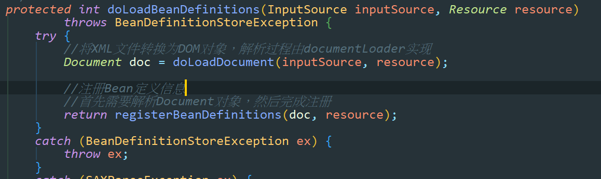

## 1、开始注册Bean定义信息



当完成Document对象的转换后，就要开始尽心Document对象的解析，并向容器中注册Bean定义信息。


调用registerBeanDefinitions()方法：

```java
public int registerBeanDefinitions(Document doc, Resource resource) throws BeanDefinitionStoreException {
    //得到BeanDefinitionDocumentReader来对xml格式的BeanDefinition解析
    BeanDefinitionDocumentReader documentReader = createBeanDefinitionDocumentReader();

    //获得容器中注册的Bean数量
    int countBefore = getRegistry().getBeanDefinitionCount();

    //解析过程入口，这里使用了委派模式，BeanDefinitionDocumentReader只是个接口,
    //具体的解析实现过程有实现类DefaultBeanDefinitionDocumentReader完成
    documentReader.registerBeanDefinitions(doc, createReaderContext(resource));

    //统计解析的Bean数量
    return getRegistry().getBeanDefinitionCount() - countBefore;
}
```


## 2、创建Document对象解析器

```java
/**
* 创建BeanDefinitionDocumentReader对象，解析Document对象
*
*/
protected BeanDefinitionDocumentReader createBeanDefinitionDocumentReader() {
    return BeanDefinitionDocumentReader.class.cast(BeanUtils.instantiateClass(this.documentReaderClass));
}
```


## 3、解析入口

```java
/**
* 根据Spring DTD对Bean的定义规则解析Bean定义Document对象
*
*/
@Override
public void registerBeanDefinitions(Document doc, XmlReaderContext readerContext) {
    //获得XML描述符
    this.readerContext = readerContext;
    logger.debug("Loading bean definitions");
    //获得Document的根元素
    Element root = doc.getDocumentElement();

    //开始解析
    doRegisterBeanDefinitions(root);
}
```


## 4、开始解析

```java
protected void doRegisterBeanDefinitions(Element root) {

    //具体的解析过程由BeanDefinitionParserDelegate实现，
    //BeanDefinitionParserDelegate中定义了Spring Bean定义XML文件的各种元素
    BeanDefinitionParserDelegate parent = this.delegate;
    this.delegate = createDelegate(getReaderContext(), root, parent);

    if (this.delegate.isDefaultNamespace(root)) {
        String profileSpec = root.getAttribute(PROFILE_ATTRIBUTE);
        if (StringUtils.hasText(profileSpec)) {
            String[] specifiedProfiles = StringUtils.tokenizeToStringArray(
                profileSpec, BeanDefinitionParserDelegate.MULTI_VALUE_ATTRIBUTE_DELIMITERS);
            if (!getReaderContext().getEnvironment().acceptsProfiles(specifiedProfiles)) {
                if (logger.isInfoEnabled()) {
                    logger.info("Skipped XML bean definition file due to specified profiles [" + profileSpec +
                                "] not matching: " + getReaderContext().getResource());
                }
                return;
            }
        }
    }

    //在解析Bean定义之前，进行自定义的解析，增强解析过程的可扩展性
    //目前没有实现
    preProcessXml(root);

    //从Document的根元素开始进行Bean定义的Document对象
    parseBeanDefinitions(root, this.delegate);

    //在解析Bean定义之后，进行自定义的解析，增加解析过程的可扩展性
    //目前没有实现
    postProcessXml(root);

    this.delegate = parent;
}
```


调用parseBeanDefinitions()方法：从根元素开始解析

```java
/**
* 使用Spring的Bean规则从Document的根元素开始进行Bean定义的解析
*/
protected void parseBeanDefinitions(Element root, BeanDefinitionParserDelegate delegate) {
    //Bean定义的Document对象使用了Spring默认的XML命名空间
    if (delegate.isDefaultNamespace(root)) {

        //获取Bean定义的Document对象根元素的所有子节点，然后遍历解析
        NodeList nl = root.getChildNodes();
        for (int i = 0; i < nl.getLength(); i++) {
            Node node = nl.item(i);

            //获得Document节点是XML元素节点
            if (node instanceof Element) {
                Element ele = (Element) node;

                //Bean定义的Document的元素节点使用的是Spring默认的XML命名空间
                if (delegate.isDefaultNamespace(ele)) {

                    //使用Spring的Bean规则解析元素节点
                    parseDefaultElement(ele, delegate);
                }
                else {
                    //没有使用Spring默认的XML命名空间，则使用用户自定义的解//析规则解析元素节点
                    delegate.parseCustomElement(ele);
                }
            }
        }
    }
    else {

        //Document的根节点没有使用Spring默认的命名空间，则使用用户自定义的
        //解析规则解析Document根节点
        delegate.parseCustomElement(root);
    }
}
```


### 4.1 分配解析规则

```java
//使用Spring的Bean规则解析Document元素节点
private void parseDefaultElement(Element ele, BeanDefinitionParserDelegate delegate) {
    //如果元素节点是<Import>导入元素，进行导入解析
    if (delegate.nodeNameEquals(ele, IMPORT_ELEMENT)) {
        importBeanDefinitionResource(ele);
    }
    //如果元素节点是<Alias>别名元素，进行别名解析
    else if (delegate.nodeNameEquals(ele, ALIAS_ELEMENT)) {
        processAliasRegistration(ele);
    }
    //元素节点既不是导入元素，也不是别名元素，即普通的<Bean>元素，
    //按照Spring的Bean规则解析元素
    else if (delegate.nodeNameEquals(ele, BEAN_ELEMENT)) {
        processBeanDefinition(ele, delegate);
    }
    else if (delegate.nodeNameEquals(ele, NESTED_BEANS_ELEMENT)) {
        // recurse
        doRegisterBeanDefinitions(ele);
    }
}
```


### 4.2 import元素解析

```java
/**
* 解析<Import>导入元素，从给定的导入路径加载Bean定义资源到Spring IoC容器中
*/
protected void importBeanDefinitionResource(Element ele) {

    //获取给定的导入元素的location属性
    String location = ele.getAttribute(RESOURCE_ATTRIBUTE);

    //如果导入元素的location属性值为空，则没有导入任何资源，直接返回
    if (!StringUtils.hasText(location)) {
        getReaderContext().error("Resource location must not be empty", ele);
        return;
    }

    // Resolve system properties: e.g. "${user.dir}"
    //使用系统变量值解析location属性值
    location = getReaderContext().getEnvironment().resolveRequiredPlaceholders(location);

    Set<Resource> actualResources = new LinkedHashSet<>(4);

    // Discover whether the location is an absolute or relative URI
    //标识给定的导入元素的location是否是绝对路径
    boolean absoluteLocation = false;
    try {
        absoluteLocation = ResourcePatternUtils.isUrl(location) || ResourceUtils.toURI(location).isAbsolute();
    }
    catch (URISyntaxException ex) {
        // cannot convert to an URI, considering the location relative
        // unless it is the well-known Spring prefix "classpath*:"
        //给定的导入元素的location不是绝对路径
    }

    // Absolute or relative?
    //如果给定的导入元素的location是绝对路径
    if (absoluteLocation) {
        try {
            //使用资源读入器加载给定路径的Bean定义资源
            int importCount = getReaderContext().getReader().loadBeanDefinitions(location, actualResources);
            if (logger.isDebugEnabled()) {
                logger.debug("Imported " + importCount + " bean definitions from URL location [" + location + "]");
            }
        }
        catch (BeanDefinitionStoreException ex) {
            getReaderContext().error(
                "Failed to import bean definitions from URL location [" + location + "]", ele, ex);
        }
    }
    else {
        // No URL -> considering resource location as relative to the current file.
        //给定的导入元素的location是相对路径
        try {
            int importCount;
            //将给定导入元素的location封装为相对路径资源
            Resource relativeResource = getReaderContext().getResource().createRelative(location);

            //判断封装的相对路径资源是否存在
            if (relativeResource.exists()) {
                //使用资源读入器加载Bean定义资源
                importCount = getReaderContext().getReader().loadBeanDefinitions(relativeResource);
                actualResources.add(relativeResource);
            }

            //封装的相对路径资源不存在
            else {
                //获取Spring IOC容器资源读入器的基本路径
                String baseLocation = getReaderContext().getResource().getURL().toString();

                //根据Spring IOC容器资源读入器的基本路径加载给定导入路径的资源
                importCount = getReaderContext().getReader().loadBeanDefinitions(
                    StringUtils.applyRelativePath(baseLocation, location), actualResources);
            }
            if (logger.isDebugEnabled()) {
                logger.debug("Imported " + importCount + " bean definitions from relative location [" + location + "]");
            }
        }
        catch (IOException ex) {
            getReaderContext().error("Failed to resolve current resource location", ele, ex);
        }
        catch (BeanDefinitionStoreException ex) {
            getReaderContext().error("Failed to import bean definitions from relative location [" + location + "]",
                                     ele, ex);
        }
    }
    Resource[] actResArray = actualResources.toArray(new Resource[actualResources.size()]);

    //在解析完<Import>元素之后，发送容器导入其他资源处理完成事件
    getReaderContext().fireImportProcessed(location, actResArray, extractSource(ele));
}
```


### 4.3 Alias元素解析

```java
/**
* 解析<Alias>别名元素，为Bean向Spring IoC容器注册别名
*/
protected void processAliasRegistration(Element ele) {
    //获取<Alias>别名元素中name的属性值
    String name = ele.getAttribute(NAME_ATTRIBUTE);

    //获取<Alias>别名元素中alias的属性值
    String alias = ele.getAttribute(ALIAS_ATTRIBUTE);

    //进行校验
    boolean valid = true;
    //<alias>别名元素的name属性值为空
    if (!StringUtils.hasText(name)) {
        getReaderContext().error("Name must not be empty", ele);
        valid = false;
    }
    //<alias>别名元素的alias属性值为空
    if (!StringUtils.hasText(alias)) {
        getReaderContext().error("Alias must not be empty", ele);
        valid = false;
    }
    if (valid) {
        try {
            //向容器的资源读入器注册别名
            getReaderContext().getRegistry().registerAlias(name, alias);
        }
        catch (Exception ex) {
            getReaderContext().error("Failed to register alias '" + alias +
                                     "' for bean with name '" + name + "'", ele, ex);
        }

        //在解析完<Alias>元素之后，发送容器别名处理完成事件
        getReaderContext().fireAliasRegistered(name, alias, extractSource(ele));
    }
}
```


### 4.4 bean元素解析

```java
/**
* 解析Bean定义资源Document对象的普通元素
*/
protected void processBeanDefinition(Element ele, BeanDefinitionParserDelegate delegate) {

    // BeanDefinitionHolder是对BeanDefinition的封装，即Bean定义的封装类
    //对Document对象中<Bean>元素的解析由BeanDefinitionParserDelegate实现
    //这里标签已经解析完成了，都封装在了Holder中
    BeanDefinitionHolder bdHolder = delegate.parseBeanDefinitionElement(ele);

    if (bdHolder != null) {
        bdHolder = delegate.decorateBeanDefinitionIfRequired(ele, bdHolder);
        try {
            // Register the final decorated instance.
            //向Spring IOC容器注册解析得到的Bean定义信息，这是Bean定义向IOC容器注册的入口
            BeanDefinitionReaderUtils.registerBeanDefinition(bdHolder, getReaderContext().getRegistry());
        }
        catch (BeanDefinitionStoreException ex) {
            getReaderContext().error("Failed to register bean definition with name '" +
                                     bdHolder.getBeanName() + "'", ele, ex);
        }

        // Send registration event.
        //在完成向Spring IOC容器注册解析得到的Bean定义之后，发送注册事件
        getReaderContext().fireComponentRegistered(new BeanComponentDefinition(bdHolder));
    }
}
```


## 5、解析Bean元素，将其封装成BeanDefinitionHolder

调用BeanDefinitionParserDelegate.parseBeanDefinitionElement()方法：

```java
/**
* 解析<Bean>元素的入口
*/
@Nullable
public BeanDefinitionHolder parseBeanDefinitionElement(Element ele) {
    return parseBeanDefinitionElement(ele, null);
}

/**
* 解析Bean定义资源文件中的<Bean>元素
* 这个方法中主要处理<Bean>元素的id，name和别名属性
*
*/
@Nullable
public BeanDefinitionHolder parseBeanDefinitionElement(Element ele, @Nullable BeanDefinition containingBean) {
    //获取<Bean>元素中的id属性值
    String id = ele.getAttribute(ID_ATTRIBUTE);
    
    //获取<Bean>元素中的name属性值
    String nameAttr = ele.getAttribute(NAME_ATTRIBUTE);

    //获取<Bean>元素中的alias属性值
    List<String> aliases = new ArrayList<>();

    //将<Bean>元素中的所有name属性值存放到别名中
    if (StringUtils.hasLength(nameAttr)) {
        String[] nameArr = StringUtils.tokenizeToStringArray(nameAttr, MULTI_VALUE_ATTRIBUTE_DELIMITERS);
        aliases.addAll(Arrays.asList(nameArr));
    }

    String beanName = id;
    //如果<Bean>元素中没有配置id属性时，将别名中的第一个值赋值给beanName
    if (!StringUtils.hasText(beanName) && !aliases.isEmpty()) {
        beanName = aliases.remove(0);
        if (logger.isDebugEnabled()) {
            logger.debug("No XML 'id' specified - using '" + beanName +
                         "' as bean name and " + aliases + " as aliases");
        }
    }

    //检查<Bean>元素所配置的id或者name的唯一性，containingBean标识<Bean>
    //元素中是否包含子<Bean>元素
    if (containingBean == null) {
        //检查<Bean>元素所配置的id、name或者别名是否重复
        checkNameUniqueness(beanName, aliases, ele);
    }

    //对<Bean>元素中配置的Bean定义信息，将其封装成BeanDefinition
    AbstractBeanDefinition beanDefinition = parseBeanDefinitionElement(ele, beanName, containingBean);
    if (beanDefinition != null) {
        if (!StringUtils.hasText(beanName)) {
            try {
                if (containingBean != null) {
                    //如果<Bean>元素中没有配置id、别名或者name，且没有包含子元素
                    //<Bean>元素，为解析的Bean生成一个唯一beanName
                    beanName = BeanDefinitionReaderUtils.generateBeanName(
                        beanDefinition, this.readerContext.getRegistry(), true);
                }
                else {
                    //如果<Bean>元素中有配置id、别名或者name，且包含了子元素
                    //<Bean>元素，为解析的Bean使用别名向IOC容器注册
                    beanName = this.readerContext.generateBeanName(beanDefinition);

                    // Register an alias for the plain bean class name, if still possible,
                    // if the generator returned the class name plus a suffix.
                    // This is expected for Spring 1.2/2.0 backwards compatibility.
                    //为解析的Bean使用别名注册时，为了向后兼容
                    //Spring1.2/2.0，给别名添加类名后缀
                    String beanClassName = beanDefinition.getBeanClassName();
                    if (beanClassName != null &&
                        beanName.startsWith(beanClassName) && beanName.length() > beanClassName.length() &&
                        !this.readerContext.getRegistry().isBeanNameInUse(beanClassName)) {
                        aliases.add(beanClassName);
                    }
                }
                if (logger.isDebugEnabled()) {
                    logger.debug("Neither XML 'id' nor 'name' specified - " +
                                 "using generated bean name [" + beanName + "]");
                }
            }
            catch (Exception ex) {
                error(ex.getMessage(), ele);
                return null;
            }
        }
        String[] aliasesArray = StringUtils.toStringArray(aliases);
        
        //最后封装成BeanDefinitionHolder
        return new BeanDefinitionHolder(beanDefinition, beanName, aliasesArray);
    }
    //当解析出错时，返回null
    return null;
}
```


## 6、封装BeanDefinition

调用parseBeanDefinitionElement()方法：

```java
/**
* 详细对<Bean>元素中配置的Bean定义其他属性进行解析
* 由于上面的方法中已经对Bean的id、name和别名等属性进行了处理
* 该方法中主要处理除这三个以外的其他属性数据
*
*/
@Nullable
public AbstractBeanDefinition parseBeanDefinitionElement(
    Element ele, String beanName, @Nullable BeanDefinition containingBean) {
    //记录解析的<Bean>元素
    this.parseState.push(new BeanEntry(beanName));

    //这里只读取<Bean>元素中配置的class名字，然后载入到BeanDefinition中去
    //只是记录配置的class名字，不做实例化，对象的实例化在依赖注入时完成
    String className = null;
    if (ele.hasAttribute(CLASS_ATTRIBUTE)) {
        className = ele.getAttribute(CLASS_ATTRIBUTE).trim();
    }
    
    //如果<Bean>元素中配置了parent属性，则获取parent属性的值
    String parent = null;
    if (ele.hasAttribute(PARENT_ATTRIBUTE)) {
        parent = ele.getAttribute(PARENT_ATTRIBUTE);
    }

    try {
        //根据<Bean>元素配置的class名称和parent属性值创建BeanDefinition
        //为载入Bean定义信息做准备
        AbstractBeanDefinition bd = createBeanDefinition(className, parent);

        //对当前的<Bean>元素中配置的一些属性进行解析和设置，如配置的单态(singleton)属性等
        parseBeanDefinitionAttributes(ele, beanName, containingBean, bd);

        //为<Bean>元素解析的Bean设置description信息
        bd.setDescription(DomUtils.getChildElementValueByTagName(ele, DESCRIPTION_ELEMENT));

        //对<Bean>元素的meta(元信息)属性解析
        parseMetaElements(ele, bd);
        //对<Bean>元素的lookup-method属性解析
        parseLookupOverrideSubElements(ele, bd.getMethodOverrides());
        //对<Bean>元素的replaced-method属性解析
        parseReplacedMethodSubElements(ele, bd.getMethodOverrides());

        //解析<Bean>元素的构造方法设置
        parseConstructorArgElements(ele, bd);
        //解析<Bean>元素的<property>设置
        parsePropertyElements(ele, bd);
        //解析<Bean>元素的qualifier属性
        parseQualifierElements(ele, bd);

        //为当前解析的Bean设置所需的资源和依赖对象
        bd.setResource(this.readerContext.getResource());
        bd.setSource(extractSource(ele));

        return bd;
    }
    catch (ClassNotFoundException ex) {
        error("Bean class [" + className + "] not found", ele, ex);
    }
    catch (NoClassDefFoundError err) {
        error("Class that bean class [" + className + "] depends on not found", ele, err);
    }
    catch (Throwable ex) {
        error("Unexpected failure during bean definition parsing", ele, ex);
    }
    finally {
        this.parseState.pop();
    }

    //解析<Bean>元素出错时，返回null
    return null;
}
```

也就是说到这里位置，并没有实例化Bean对象，只是封装并创建了BeanDefinition对象。这个对象中封装了配置文件中配置的<Bean>的所有信息。


## 7、解析property元素

```java
/**
* 	解析<Bean>元素中的<property>子元素
*/
public void parsePropertyElements(Element beanEle, BeanDefinition bd) {
    //获取<Bean>元素中所有的子元素
    NodeList nl = beanEle.getChildNodes();
    for (int i = 0; i < nl.getLength(); i++) {
        Node node = nl.item(i);
        //如果子元素是<property>子元素，则调用解析<property>子元素方法解析
        if (isCandidateElement(node) && nodeNameEquals(node, PROPERTY_ELEMENT)) {
            parsePropertyElement((Element) node, bd);
        }
    }
}

/**
* 	解析<property>元素
* 
*/
public void parsePropertyElement(Element ele, BeanDefinition bd) {
    //获取<property>元素的名字
    String propertyName = ele.getAttribute(NAME_ATTRIBUTE);
    if (!StringUtils.hasLength(propertyName)) {
        error("Tag 'property' must have a 'name' attribute", ele);
        return;
    }
    this.parseState.push(new PropertyEntry(propertyName));
    try {
        //如果一个Bean中已经有同名的property存在，则不进行解析，直接返回。
        //即如果在同一个Bean中配置同名的property，则只有第一个起作用
        if (bd.getPropertyValues().contains(propertyName)) {
            error("Multiple 'property' definitions for property '" + propertyName + "'", ele);
            return;
        }
        //解析获取property的值
        Object val = parsePropertyValue(ele, bd, propertyName);
        //根据property的名字和值创建property实例
        PropertyValue pv = new PropertyValue(propertyName, val);
        //解析<property>元素中的属性
        parseMetaElements(ele, pv);
        pv.setSource(extractSource(ele));
        bd.getPropertyValues().addPropertyValue(pv);
    }
    finally {
        this.parseState.pop();
    }
}
```


### 7.1 解析property元素中的值

```java
/**
*  解析获取property值
*/
@Nullable
public Object parsePropertyValue(Element ele, BeanDefinition bd, @Nullable String propertyName) {
    String elementName = (propertyName != null) ?
        "<property> element for property '" + propertyName + "'" :
    "<constructor-arg> element";

    // Should only have one child element: ref, value, list, etc.
    //获取<property>的所有子元素，只能是其中一种类型:ref,value,list,etc等
    NodeList nl = ele.getChildNodes();
    Element subElement = null;
    for (int i = 0; i < nl.getLength(); i++) {
        Node node = nl.item(i);
        //子元素不是description和meta属性
        if (node instanceof Element && !nodeNameEquals(node, DESCRIPTION_ELEMENT) &&
            !nodeNameEquals(node, META_ELEMENT)) {
            // Child element is what we're looking for.
            if (subElement != null) {
                error(elementName + " must not contain more than one sub-element", ele);
            }
            else {
                //当前<property>元素包含有子元素
                subElement = (Element) node;
            }
        }
    }

    //判断property的属性值是ref还是value，不允许既是ref又是value
    boolean hasRefAttribute = ele.hasAttribute(REF_ATTRIBUTE);
    boolean hasValueAttribute = ele.hasAttribute(VALUE_ATTRIBUTE);
    if ((hasRefAttribute && hasValueAttribute) ||
        ((hasRefAttribute || hasValueAttribute) && subElement != null)) {
        error(elementName +
              " is only allowed to contain either 'ref' attribute OR 'value' attribute OR sub-element", ele);
    }

    //如果属性是ref，创建一个ref的数据对象RuntimeBeanReference
    //这个对象封装了ref信息
    if (hasRefAttribute) {
        String refName = ele.getAttribute(REF_ATTRIBUTE);
        if (!StringUtils.hasText(refName)) {
            error(elementName + " contains empty 'ref' attribute", ele);
        }
        //一个指向运行时所依赖对象的引用
        RuntimeBeanReference ref = new RuntimeBeanReference(refName);
        //设置这个ref的数据对象是被当前的property对象所引用
        ref.setSource(extractSource(ele));
        return ref;
    }

    //如果属性是value，创建一个value的数据对象TypedStringValue
    //这个对象封装了value信息
    else if (hasValueAttribute) {
        //一个持有String类型值的对象
        TypedStringValue valueHolder = new TypedStringValue(ele.getAttribute(VALUE_ATTRIBUTE));
        //设置这个value数据对象是被当前的property对象所引用
        valueHolder.setSource(extractSource(ele));
        return valueHolder;
    }

    //如果当前<property>元素还有子元素
    else if (subElement != null) {
        //解析<property>的子元素
        return parsePropertySubElement(subElement, bd);
    }
    else {
        // Neither child element nor "ref" or "value" attribute found.
        //propery属性中既不是ref，也不是value属性，解析出错返回null
        error(elementName + " must specify a ref or value", ele);
        return null;
    }
}
```


### 7.2 解析property元素中的子元素

不同的元素使用调用不同的解析规则方法：

```java
/**
* 解析<property>元素中ref,value或者集合等子元素
*/
@Nullable
public Object parsePropertySubElement(Element ele, @Nullable BeanDefinition bd, @Nullable String defaultValueType) {
    //如果<property>没有使用Spring默认的命名空间，则使用用户自定义的规则解析内嵌元素
    if (!isDefaultNamespace(ele)) {
        return parseNestedCustomElement(ele, bd);
    }
    
    //如果子元素是bean，则使用解析<Bean>元素的方法解析
    else if (nodeNameEquals(ele, BEAN_ELEMENT)) {
        BeanDefinitionHolder nestedBd = parseBeanDefinitionElement(ele, bd);
        if (nestedBd != null) {
            nestedBd = decorateBeanDefinitionIfRequired(ele, nestedBd, bd);
        }
        return nestedBd;
    }
    
    //如果子元素是ref，ref中只能有以下3个属性：bean、local、parent
    else if (nodeNameEquals(ele, REF_ELEMENT)) {
        // A generic reference to any name of any bean.
        //可以不再同一个Spring配置文件中，具体请参考Spring对ref的配置规则
        String refName = ele.getAttribute(BEAN_REF_ATTRIBUTE);
        boolean toParent = false;
        if (!StringUtils.hasLength(refName)) {
            // A reference to the id of another bean in a parent context.
            //获取<property>元素中parent属性值，引用父级容器中的Bean
            refName = ele.getAttribute(PARENT_REF_ATTRIBUTE);
            toParent = true;
            if (!StringUtils.hasLength(refName)) {
                error("'bean' or 'parent' is required for <ref> element", ele);
                return null;
            }
        }
        if (!StringUtils.hasText(refName)) {
            error("<ref> element contains empty target attribute", ele);
            return null;
        }
        //创建ref类型数据，指向被引用的对象
        RuntimeBeanReference ref = new RuntimeBeanReference(refName, toParent);
        //设置引用类型值是被当前子元素所引用
        ref.setSource(extractSource(ele));
        return ref;
    }
    
    //如果子元素是<idref>，使用解析ref元素的方法解析
    else if (nodeNameEquals(ele, IDREF_ELEMENT)) {
        return parseIdRefElement(ele);
    }
    
    //如果子元素是<value>，使用解析value元素的方法解析
    else if (nodeNameEquals(ele, VALUE_ELEMENT)) {
        return parseValueElement(ele, defaultValueType);
    }
    
    //如果子元素是null，为<property>设置一个封装null值的字符串数据
    else if (nodeNameEquals(ele, NULL_ELEMENT)) {
        // It's a distinguished null value. Let's wrap it in a TypedStringValue
        // object in order to preserve the source location.
        TypedStringValue nullHolder = new TypedStringValue(null);
        nullHolder.setSource(extractSource(ele));
        return nullHolder;
    }
    
    //如果子元素是<array>，使用解析array集合子元素的方法解析
    else if (nodeNameEquals(ele, ARRAY_ELEMENT)) {
        return parseArrayElement(ele, bd);
    }
    
    //如果子元素是<list>，使用解析list集合子元素的方法解析
    else if (nodeNameEquals(ele, LIST_ELEMENT)) {
        return parseListElement(ele, bd);
    }
    
    //如果子元素是<set>，使用解析set集合子元素的方法解析
    else if (nodeNameEquals(ele, SET_ELEMENT)) {
        return parseSetElement(ele, bd);
    }
    
    //如果子元素是<map>，使用解析map集合子元素的方法解析
    else if (nodeNameEquals(ele, MAP_ELEMENT)) {
        return parseMapElement(ele, bd);
    }
    
    //如果子元素是<props>，使用解析props集合子元素的方法解析
    else if (nodeNameEquals(ele, PROPS_ELEMENT)) {
        return parsePropsElement(ele);
    }
    
    //既不是ref，又不是value，也不是集合，则子元素配置错误，返回null
    else {
        error("Unknown property sub-element: [" + ele.getNodeName() + "]", ele);
        return null;
    }
}
```


## 8、解析list元素

调用parseListElement()方法，解析property中的list子元素：

```java
/**
* 解析<list>集合子元素
*/
public List<Object> parseListElement(Element collectionEle, @Nullable BeanDefinition bd) {
    //获取<list>元素中的value-type属性，即获取集合元素的数据类型
    String defaultElementType = collectionEle.getAttribute(VALUE_TYPE_ATTRIBUTE);
    
    //获取<list>集合元素中的所有子节点
    NodeList nl = collectionEle.getChildNodes();
    
    //Spring中将List封装为ManagedList
    ManagedList<Object> target = new ManagedList<>(nl.getLength());
    target.setSource(extractSource(collectionEle));
    
    //设置集合目标数据类型
    target.setElementTypeName(defaultElementType);
    target.setMergeEnabled(parseMergeAttribute(collectionEle));
    
    //具体的<list>元素解析
    parseCollectionElements(nl, target, bd, defaultElementType);
    return target;
}

//具体解析<list>集合元素，<array>、<list>和<set>都使用该方法解析
protected void parseCollectionElements(
    NodeList elementNodes, Collection<Object> target, @Nullable BeanDefinition bd, String defaultElementType) {
    //遍历集合所有节点
    for (int i = 0; i < elementNodes.getLength(); i++) {
        Node node = elementNodes.item(i);
        
        //节点不是description节点
        if (node instanceof Element && !nodeNameEquals(node, DESCRIPTION_ELEMENT)) {
            //将解析的元素加入集合中，递归调用下一个子元素
            target.add(parsePropertySubElement((Element) node, bd, defaultElementType));
        }
    }
}
```


## 9、向容器中注册BeanDefinition

当Document对象解析完成后，会得到一个封装了BeanDefinition的BeanDefinitionHolder对象，然后就需要向容器中注册这个Bean的定义信息了。

调用BeanDefinitionReaderUtils.registerBeanDefinition()方法进行注册：

```java
/**
* 将BeanDefinition注册到容器中
*
*/
public static void registerBeanDefinition(
    BeanDefinitionHolder definitionHolder, BeanDefinitionRegistry registry)
    throws BeanDefinitionStoreException {

    // Register bean definition under primary name.
    //获取解析的BeanDefinition的名称
    String beanName = definitionHolder.getBeanName();

    //向IOC容器注册BeanDefinition
    registry.registerBeanDefinition(beanName, definitionHolder.getBeanDefinition());

    // Register aliases for bean name, if any.
    //如果解析的BeanDefinition有别名，向容器为其注册别名
    String[] aliases = definitionHolder.getAliases();
    if (aliases != null) {
        for (String alias : aliases) {
            registry.registerAlias(beanName, alias);
        }
    }
}
```


最终调用的是DefaultListableBeanFactory.registerBeanDefinition()方法，同时BeanDefinition也是存在这里的：

```java
/** Map of bean definition objects, keyed by bean name */
//存储BeanDefinition的容器，通过bean名字存储bean定义信息
private final Map<String, BeanDefinition> beanDefinitionMap = new ConcurrentHashMap<>(256);


// 将beanDefinition注册到容器中
// 也就是将beanDefinition存放入beanDefinitionMap中
@Override
public void registerBeanDefinition(String beanName, BeanDefinition beanDefinition)
    throws BeanDefinitionStoreException {

    Assert.hasText(beanName, "Bean name must not be empty");
    Assert.notNull(beanDefinition, "BeanDefinition must not be null");

    //校验解析的BeanDefiniton
    if (beanDefinition instanceof AbstractBeanDefinition) {
        try {
            ((AbstractBeanDefinition) beanDefinition).validate();
        }
        catch (BeanDefinitionValidationException ex) {
            throw new BeanDefinitionStoreException(beanDefinition.getResourceDescription(), beanName,
                                                   "Validation of bean definition failed", ex);
        }
    }

    BeanDefinition oldBeanDefinition;

    oldBeanDefinition = this.beanDefinitionMap.get(beanName);

    if (oldBeanDefinition != null) {
        if (!isAllowBeanDefinitionOverriding()) {
            throw new BeanDefinitionStoreException(beanDefinition.getResourceDescription(), beanName,
                                                   "Cannot register bean definition [" + beanDefinition + "] for bean '" + beanName +
                                                   "': There is already [" + oldBeanDefinition + "] bound.");
        }
        else if (oldBeanDefinition.getRole() < beanDefinition.getRole()) {
            // e.g. was ROLE_APPLICATION, now overriding with ROLE_SUPPORT or ROLE_INFRASTRUCTURE
            if (this.logger.isWarnEnabled()) {
                this.logger.warn("Overriding user-defined bean definition for bean '" + beanName +
                                 "' with a framework-generated bean definition: replacing [" +
                                 oldBeanDefinition + "] with [" + beanDefinition + "]");
            }
        }
        else if (!beanDefinition.equals(oldBeanDefinition)) {
            if (this.logger.isInfoEnabled()) {
                this.logger.info("Overriding bean definition for bean '" + beanName +
                                 "' with a different definition: replacing [" + oldBeanDefinition +
                                 "] with [" + beanDefinition + "]");
            }
        }
        else {
            if (this.logger.isDebugEnabled()) {
                this.logger.debug("Overriding bean definition for bean '" + beanName +
                                  "' with an equivalent definition: replacing [" + oldBeanDefinition +
                                  "] with [" + beanDefinition + "]");
            }
        }
        this.beanDefinitionMap.put(beanName, beanDefinition);
    }
    else {
        if (hasBeanCreationStarted()) {
            // Cannot modify startup-time collection elements anymore (for stable iteration)
            //注册的过程中需要线程同步，以保证数据的一致性
            synchronized (this.beanDefinitionMap) {
                this.beanDefinitionMap.put(beanName, beanDefinition);
                List<String> updatedDefinitions = new ArrayList<>(this.beanDefinitionNames.size() + 1);
                updatedDefinitions.addAll(this.beanDefinitionNames);
                updatedDefinitions.add(beanName);
                this.beanDefinitionNames = updatedDefinitions;
                if (this.manualSingletonNames.contains(beanName)) {
                    Set<String> updatedSingletons = new LinkedHashSet<>(this.manualSingletonNames);
                    updatedSingletons.remove(beanName);
                    this.manualSingletonNames = updatedSingletons;
                }
            }
        }
        else {
            // Still in startup registration phase
            this.beanDefinitionMap.put(beanName, beanDefinition);
            this.beanDefinitionNames.add(beanName);
            this.manualSingletonNames.remove(beanName);
        }
        this.frozenBeanDefinitionNames = null;
    }

    //检查是否有同名的BeanDefinition已经在IOC容器中注册
    if (oldBeanDefinition != null || containsSingleton(beanName)) {
        //重置所有已经注册过的BeanDefinition的缓存
        resetBeanDefinition(beanName);
    }
}
```

到此为止IOC容器中已经建立了所有的Bean定义信息，这些定义信息已经可以被使用、检索。这些被注册的Bean定义信息，真是IOC控制反转的基础。
