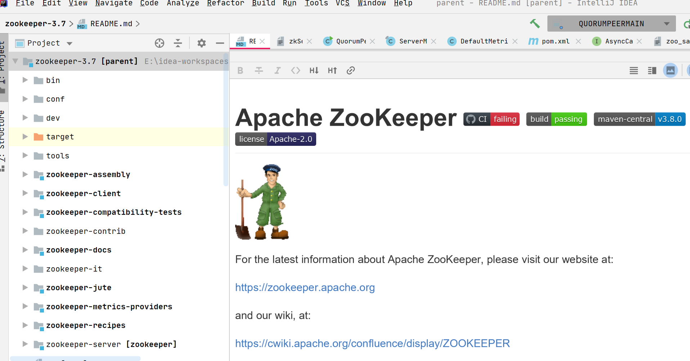
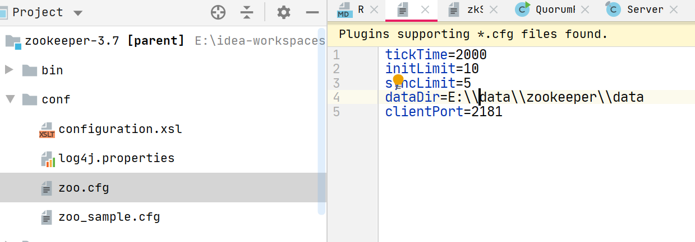
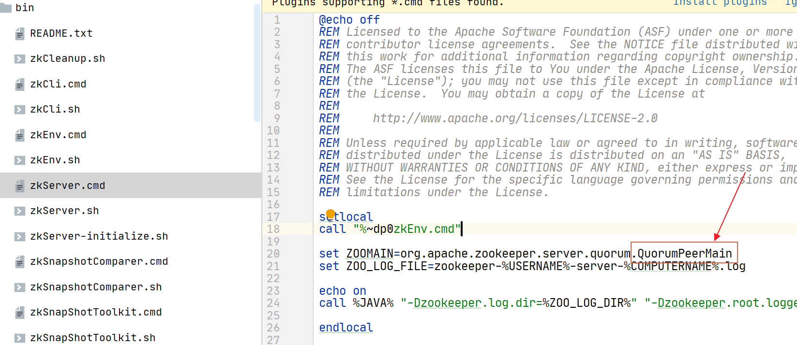
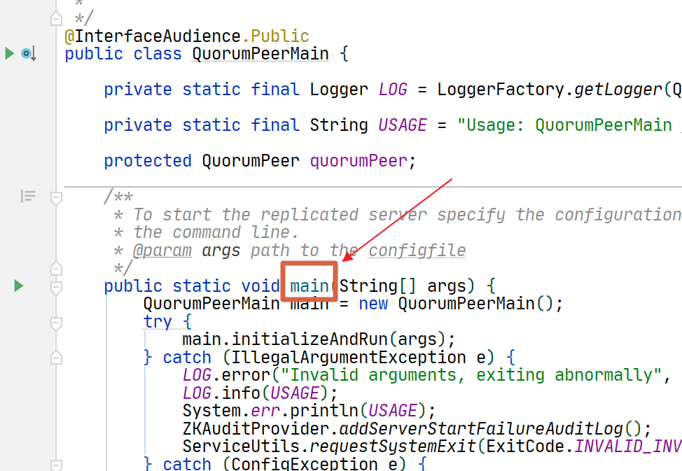
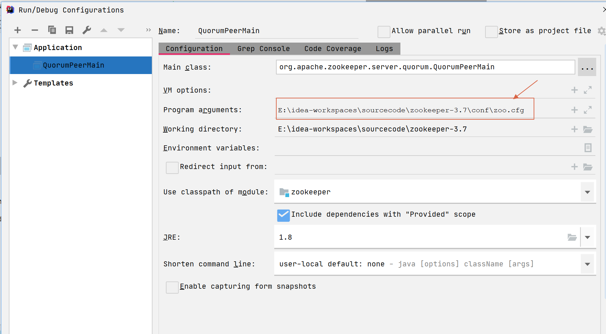
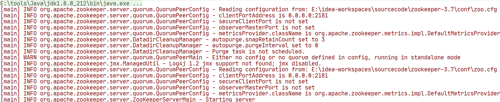
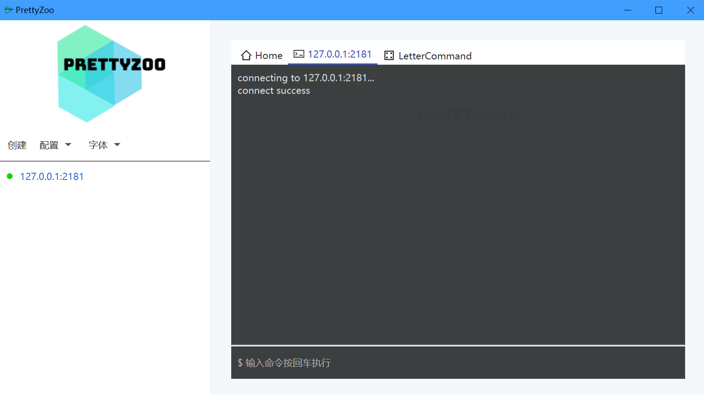
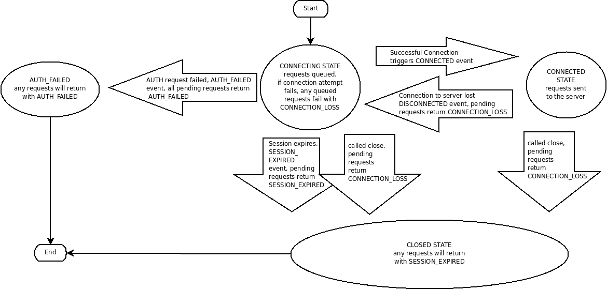
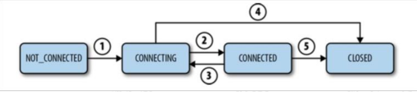
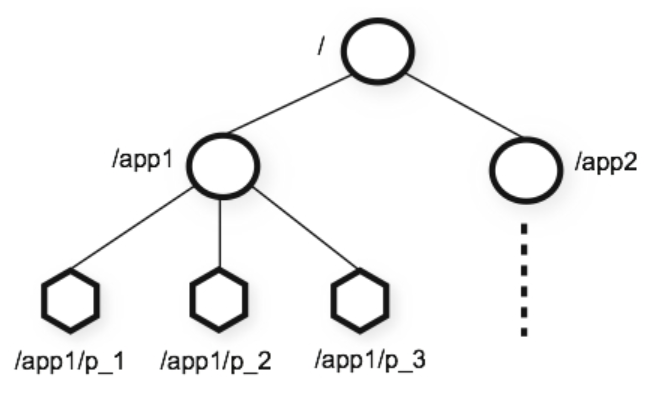

## 1. 什么是zookeeper

zookeeper是一个分布式协调系统，之前是Apache Hadoop的子项目，现在是Apache的顶级项目。


### 1.1 应用场景

- 命名服务
- 配置管理
- 数据同步
- leader选举
- 消息队列
- 通知系统


### 1.2 常见使用zookeeper的项目

-  [Apache Druid](https://druid.apache.org/)

-  [Apache Dubbo](http://dubbo.apache.org/)

-  [Apache HBase](https://hbase.apache.org/)

-  [Apache Kafka](https://kafka.apache.org/)

-  [Apache Pulsar](https://pulsar.apache.org/)
-  [Apache Spark](https://spark.apache.org/)
-  [Apache Solr](https://lucene.apache.org/solr/)

具体详情[zookeeper官网](https://zookeeper.apache.org/doc/r3.7.1/zookeeperUseCases.html)


## 2. 使用zookeeper源码启动服务

### 2.1. 去github上拉取源码

[zookeeper github地址](https://github.com/apache/zookeeper/tree/branch-3.7)


### 2.2.  使用idea导入项目




### 2.3. 使用maven构建

```
mvn clean install -DskipTests
```


### 2.4. 添加zoo.cfg配置文件




### 2.5. 导入日志包

在zookeeper-server的pom文件中，导入：

```xml
<dependency>
    <groupId>org.slf4j</groupId>
    <artifactId>slf4j-simple</artifactId>
    <version>1.7.25</version>
    <scope>compile</scope>
</dependency>
```


### 2.6. 修改启动类

我们查看到zkServer.cmd中，启动zookeeper调用的是QuorumPeerMain这个类




我们找到这个类，发现里面有个main方法，那这个就是启动类了。




配置一下启动类，添加配置文件：




### 2.7. 启动




## 3. 使用可视化客户端连接

### 3.1. prettyZoo




## 4. zookeeper 会话和数据模型

### 4.1 [zookeeper session](https://zookeeper.apache.org/doc/current/zookeeperProgrammers.html#ch_zkSessions)



#### 4.1.1 会话流程



1. 客户端初始化连接，状态转换为CONNECTING(1)
2. 客户端与服务端成功建立连接，状态转换为CONNECTED(2)
3. 客户端丢失了与服务端的连接，或者没有接收到服务端的响应，状态转为CONNECTING(3)
4. 客户端连接上了其他的服务端，或者之前的服务端，状态转换为CONNECTED(2)
5. 会话过期（服务端负责声明会话过期），状态转为CLOSED(5)
6. 客户端也可以主动关闭会话，状态转换为CLOSED(4)


### 4.2 数据模型

[Data model]()


## 5. 基本操作

```shell
#帮助
help

#创建节点
create /studyzk
create /studyzk/test
create /studyzk/demo

#在节点上存储数据
create /studyzk 12
create /studyzk/demo simple

#获取Znode
ls /
ls /studyzk

#获取节点上的数据
get /studyzk
get /studyzk/demo

#修改节点上的数据
set /studyzk 20
set /studyzk/demo coding

#删除节点，注意的是当节点下有子节点的时，不能直接删除该节点
delete /studyzk/test
deleteall /studyzk
```


## 6. 节点状态

[zookeeper Stat Structure](https://zookeeper.apache.org/doc/current/zookeeperProgrammers.html#sc_zkStatStructure)


### 6.1 事务相关

| 状态  | 描述                                                         |
| ----- | ------------------------------------------------------------ |
| czxid | 表示当前节点被创建时的事务id                                 |
| mzxid | 表示当前节点被最后一次更新时的事务id                         |
| pzxid | 表示该节点的子节点最后一次被修改时的事务id。只有子节点变化才会影响pzxid，子节点的数据变化不会影响pzxid |


#### 6.1.1 zxid

zxid是zookeeper中的事务id，为8字节的整形数，也就是64个比特位，前32位为epoch，后32位用于计数。


**zxid的初始值:：**

```shell
# zxid的初始值为0
00000000 00000000 00000000 00000000 00000000 00000000 00000000 00000000
```


**每次的事务请求都会在后面32为上+1，也就是当进行了10次事务请求后的数据为：**

```shell
00000000 00000000 00000000 00000000 00000000 00000000 00000000 00001010 
```


**每进行一次leader选举，前32位的值就会+1，并把后面的32位清零，则zxid变为：**

```shell
00000000 00000000 00000000 00000001 00000000 00000000 00000000 00000000
```


**若一直没有进行leader选举，同时一直在发生事务请求，则后面32位会一直增加，极限值是：**

```shell
00000000 00000000 00000000 00000000 11111111 11111111 11111111  11111111
```


**此时再发生事务请求，则把前面的32位+1，变成：**

```shell
00000000 00000000 00000000 00000001 00000000 00000000 00000000 00000000
```


### 6.2 时间相关

| 状态  | 描述                       |
| ----- | -------------------------- |
| ctime | 当前节点的创建时间         |
| mtime | 当前节点最后一次修改的时间 |


### 6.3 版本相关

zookeeper的版本和我们使用的乐观锁类似

| 状态        | 描述                                         |
| ----------- | -------------------------------------------- |
| dataVersion | 当前节点的数据被修改的次数，也就是数据的版本 |
| cversion    | 子节点的版本号                               |
| aversion    | acl的版本号                                  |


### 6.4 其他

| 状态           | 描述                                                         |
| -------------- | ------------------------------------------------------------ |
| numChildren    | 当前节点子节点的数量                                         |
| dataLength     | 当前节点保存的数据长度                                       |
| ephemeralOwner | 当前节点是否为临时节点，如果为临时节点则该值为 sessionid，否则为0 |

