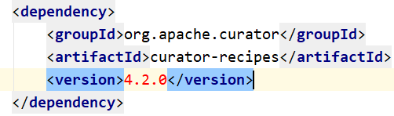
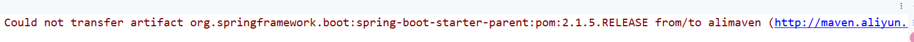
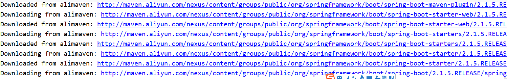

# 问题：pom.xml中dependency突然变成红色，所有相关代码都找不到依赖，就像这样：



reimport会报错，无法下载：


```
Could not transfer artifact org.springframework.boot:spring-boot-starter-parent:pom:2.1.5.RELEASE from/to alimaven (http://maven.aliyun.com/nexus/content/groups/public/): sun.security.validator.ValidatorException: PKIX path building failed: sun.security.provider.certpath.SunCertPathBuilderException: unable to find valid certification path to requested target
```

用IDEA创建的Spring Boot工程，这个依赖能错？

conf/settings.xml检查过了没什么问题。
难道是aliyun的镜像仓库里面没有这个包导致下载不到？肯定不可能，不然谁还敢用aliyun maven仓库？用GAV方式搜索包也确实存在。
https://maven.aliyun.com/mvn/search

PKIX这个错误是什么？

```
PKIX path building failed: sun.security.provider.certpath.SunCertPathBuilderException: unable to find valid certification path to requested target
```

访问HTTPS需要证书……

在IDEA Terminal里面执行：

```
mvn clean && mvn compile -Dmaven.wagon.http.ssl.insecure=true -Dmaven.wagon.http.ssl.allowall=true -Dmaven.wagon.http.ssl.ignore.validity.dates=true
```

老老实实用HTTP链接下载：


下载完了还是红色？
View —— Tool Windows —— Maven 打开Maven窗口
Maven窗口的左上角刷新按钮：Reimport All Maven Projects

OK，没有红色了，代码也正常了。