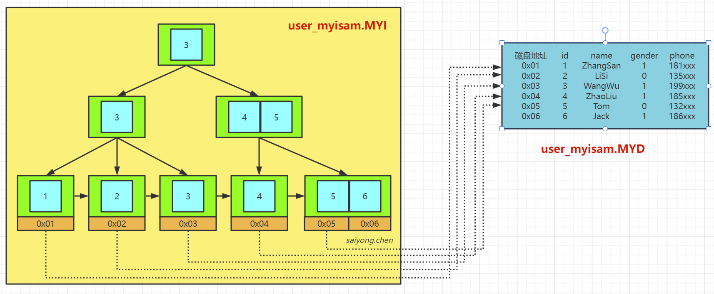

## 1、 MySQL数据存储文件

我们知道MySQL是一个支持插件式存储引擎的数据库。在MySQL中，每个表在创建的时候都会指定它所使用的存储引擎。而我们最常关注的是MyISAM和InnoDB这两个存储引擎。


首先在MySQL中数据都是以文件的形式存放在磁盘中的，我们可以找到这个数据目录的地址。

```sql
SHOW VARIABLES LIKE 'datadir';
```


在这里我们新建了一个test的数据库，然后我们在这个库里面新建了两张表，一张user_innodb，一张user_myisam。只要我们进入对应的test文件夹目录就会看到我们新建的这两张表对应的文件，Innodb的表有两个文件（.frm和.idb）,MyISAM的表有三个文件（.frm、.MYD和.MYI）


这里面会有一个相同格式的文件，.frm。这个文件是MySQL中表结构定义的文件，不管你建表的时候使用什么存储引擎都会生成这个文件。


## 2、MyISAM

在MyISAM中的另外两个文件，.MYD是数据文件，用来存放表里面的数据的。.MYI是索引文件，用来存放索引。也就是说，索引和表数据时两个独立的文件。


**那么是如何根据索引查找数据的呢？**

MYISAM的B+树里面，叶子节点存放的是数据文件对应的磁盘地址。所以从索引文件.MYI中找到对应的键值后，会找到.MYD数据文件从中获取相应的数据记录。




## 3、InnoDB

