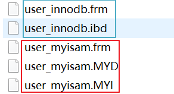

## 1、 MySQL数据存储文件

我们知道MySQL是一个支持插件式存储引擎的数据库。在MySQL中，每个表在创建的时候都会指定它所使用的存储引擎。而我们最常关注的是MyISAM和InnoDB这两个存储引擎。


首先在MySQL中数据都是以文件的形式存放在磁盘中的，我们可以找到这个数据目录的地址。

```sql
SHOW VARIABLES LIKE 'datadir';
```


在这里我们新建了一个test的数据库，然后我们在这个库里面新建了两张表，一张user_innodb，一张user_myisam。只要我们进入对应的test文件夹目录就会看到我们新建的这两张表对应的文件，Innodb的表有两个文件（.frm和.idb）,MyISAM的表有三个文件（.frm、.MYD和.MYI）



这里面会有一个相同格式的文件，.frm。这个文件是MySQL中表结构定义的文件，不管你建表的时候使用什么存储引擎都会生成这个文件。


## 2、MyISAM

在MyISAM中的另外两个文件，.MYD是数据文件，用来存放表里面的数据的。.MYI是索引文件，用来存放索引。也就是说，索引和表数据时两个独立的文件。


**那么是如何根据索引查找数据的呢？**

MYISAM的B+树里面，叶子节点存放的是数据文件对应的磁盘地址。所以从索引文件.MYI中找到对应的键值后，会找到.MYD数据文件从中获取相应的数据记录。


上图为主键索引。那么辅助索引会不会有什么不同？

在MyISAM中辅助索引也是在.MYI这个文件中，和主键索引索引的方式没有什么区别，同样是在索引文件中找到对应的磁盘地址，然后到数据文件中获取数据。


## 3、InnoDB

对于InnoDB为存储引擎的表，它只有两个文件一个就是表结构文件（.frm）还有一个就是（.ibd）。因为在InnoDB中。数据是以主键为索引来组织存储的，所以索引和数据都在一个文件中，也就是在（.ibd）这个文件中。数据都是存放在叶子节点上。


在InnoDB中，它组织数据的方式叫做（聚集）索引组织表，所以主键索引都是聚集索引，非主键都是非聚集索引。

**聚集索引：**索引键值的逻辑顺序和表数据行的物理存储顺序是一致的。


**普通索引是如何存储和检索数据的？**

在InnoDB中，主键索引和辅助索引是由主次之分的。辅助索引存储的是辅助索引和主键值。如果通过辅助索引检索数据，最后还是回到主键索引上获取最终的数据。就是会进行回表。


**如果一种表没有主键怎么办？**

1. 如果我们定义了主键，那么InnoDB就会选择主键做为聚集索引
2. 如果没有显示定义主键，那么InnoDB就会选择第一个不包含Null值的唯一索引作为主键索引
3. 如果没有这样的唯一索引，那么InnoDB就会选择内置的一个长6字节的ROWID字段作为隐藏的聚集索引，它会随着行记录的写入而递增
