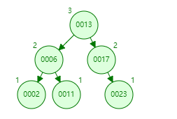
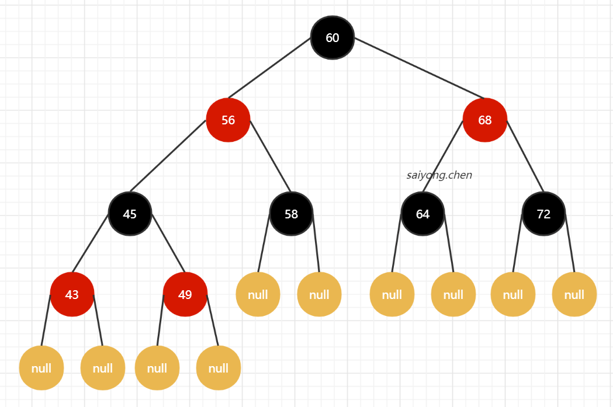

## 1、什么是索引

在维基百科中对数据库索引的定义：

`数据库索引，是数据库管理系统（DBMS）中一个排序的数据结构、以协助快速查询、更新数据库表中数据`

**如何理解上述的定义？**

假设我们有一张User表，我们对其建了一个索引index：user(id)

表中的数据是以文件的形式存放在磁盘上面的，每一行数据都有它的一个磁盘地址。如果表中的数据量过大，并且没有索引，当我们查找一条数据的时候，就要一条一条的去检索，也就是遍历才能找到存在表中的那条数据。

但是如果我们对这张表建立了索引，我们就可以通过索引去检索表中的数据，因为索引是一种专门用来快速检索的数据结构，类似与一本书的目录，当我们想看某个章节的内容时，只需要通过目录就能找到对应的页码内容，同样索引也是一样。

### 1.1 索引的类型

在InnoDB中，索引有三种类型：

- 普通（Normal）：也叫非唯一性索引，是最普通的索引，没有任何限制
- 唯一（Unique）：要求键值不能重复。主键（primay key）也是一种特殊的唯一性索引，但是主键索引多了一个限制条件，键值不能为空
- 全文（Fulltext）：针对比较大的数据，比如我们存放的消息内容有几kb的数据。如果要解决like查询效率低额问题，就可以创建全文索引。需要注意的是，只有文本类型的字段才可以创建全文索引，比如char，varchar，text等

## 2、索引的存储模型推演

现在我们知道索引是一种数据结构，那么它到底是用了一种什么样的数据结构存储数据，才能实现高效的数据检索的呢？

### 2.1 二分查找

二分查找是一种思想，它也叫折半查找。一般用于数据已经排序好的场景，做等值查询或比较查询的时候效率比较高。

比如：现在有一份1~100的数据，然后我们猜一个数据，比如23。

- 第一次猜的时候，猜50，大了
- 第二次猜25，大了
- 第三次猜13，小了
- 第四次猜19，小了
- ....

类似于上面那样，每次都能将候选的数据缩小了一半，直到找到对应的数据。

但是使用这个方式会有一个问题，当在更新数据的，比如在表中间插入一条数据的时候，就需要挪动大量的数据。这样的话，随着数据量的增大，效率也会越来越低，所以一般适用于静态数据。

如果了为了支持频繁的更新修改等操作，可以选用链表。但是链表的查询效率又不够高。

### 2.2 二叉查找树

那么有没有一种可以使用二分查找的链表的？

二分查找树（BST ，Binary Search Tree）

**二叉查找树的特点：**

- 左边的子节点都小于父节点
- 右边的子节点都大于父节点

类似于上图那样，当数据投影到一个平面后，就是一个有序的线性表。

但是它存在一个问题，就是查询效率取决于树的深度。我们可以通过[二叉查找树动态演示](https://www.cs.usfca.edu/~galles/visualization/BST.html)，这个网站动态演示一下。我们有序的依次插入数据：2、6、11、13、17、23。

他就会变成上图的那个样子，那么这样一般我们称为斜树。它就变成了一个链表，那就不能实现快速检索的目的了。造成它这个斜树的原因就是左边没有节点，也就是左右树深不一样。不够平衡！

### 2.3 平衡二叉树

平衡二叉树（AVL Tree，Balanced Binary Search Tree），这是一种左右子节点的树深差不会超过1的树。就是当边的子节点树深为2的时候，右边子节点的树深只能是1或者3。

现在我们还是按照顺序一次插入数据：

#### 2.3.1 那么平衡二叉树是如何保证左右平衡的呢？

如图，当我们插入2和6以后，再插入11的时候，如果按照二叉树的定义肯定在右边。但是根据平衡二叉树的概念，如果放入右边那么右边的树深就是3而左边的树深是0，他们之间的差距大于1，就违反了平衡二叉树的定义了。所以当插入11的时候会把6提上去，这种右-右型，我们称为左旋。

同理，当我们分别依次插入11,6和2的时候，就会变成左-左型，称为右旋

所以为了保持平衡，AVL树在进行插入和更新操作的时候执行了一系列的计算和调整。

#### 2.3.2 平衡二叉树作为索引如何查询数据？

首先在平衡二叉树中每个节点的大小都应该是一个固定的值。那么作为索引应该存储什么内容？

- 存储索引的键值，比如当在某张表的id字段上创建了一个索引，可以通过where条件可以通过索引找到这个键值
- 存储数据的磁盘地址，索引的作用就是为了查找数据存放的地址
- 存储左右子节点的引用，这样可以找到下一个节点。

​	首先，索引的数据时放在硬盘上的，当我们用树的结构来存储索引的时候，访问一个节点就要和磁盘发生一次IO。在InnoDB中操作磁盘的最小单位是页（或叫一个磁盘块），大小是16kb（16384个字节）。

​	那么，一个树的节点就是16k的大小。

​	如果我们一个 节点只存储一个键值+地址+引用。可能是用了十几个或者几十个字节，远远达不到16k的容量，所以每当访问一个节点的时候，都会浪费大量空间，而且如果索引树很深，从索引中找到我们需要的数据，就需要访问更多的节点，那就意味着需要和磁盘交互的次数就会大大增加，从而消耗更多的时间。

​	比如上图，当我们需要查找23的时候，就需要和磁盘交互3次。如果我们有几百万的数据的时候呢？

​	**解决方案:**

1. 让节点存储更多的数据
2. 增加节点的指针数量，也就是可以拥有更多的分叉。分叉越多，树的深度就会减少，IO也会减少。

​	

### 2.4 多路平衡二叉树

多路平衡二叉树（Balanced Tree），又叫B树。和AVL树一样，B树在枝节点和叶子节点存储数据。

特点就是分叉路数（Degree）永远比关键字数多1。关键字就是你在该节点存储的数据。如图：

查找规则：（如果我们要在这张表中查找15）

- 15<17，走左边
- 15>12，走右边
- 在磁盘7中命中15，IO次数为3

B树是如何实现一个节点存储多个关键字，还能保持平衡的呢？和AVL树有什么区别？

[B树动态演示](https://www.cs.usfca.edu/~galles/visualization/BTree.html)

  

首先要设置Degree路数，比如我们设置为3，然后我们插入数据1、2、3，当1、2插入完毕以后，插入3的时候，如果我们还是将3这个关键字放在第一个磁盘块上，根据多路平衡二叉树的定义，这里的路数要为4。但是现在我们的路数为3，所以这个时候要进行分裂。将2往上提，1和3为2的子节点。

如果我们要删除一个关键字，那么就会触发合并的操作。当我们插入4和5的时候，就会触发分裂和合并：

在这里我们又看到了在更新索引的时候会触发索引结构的调整，所以一般我们不建议在频繁更新的列上建立索引。

### 2.5 B+ 树

在MySQL中InnoDB引擎使用的是B树的改良版B+树。

B+树的特点：

- 关键字数量和路数相等
- 枝节点不存储数据，只有叶子节点存储数据
- 每个叶子节点增加了一个指向相邻叶子节点的指针，同时它的最后一个叶子节点会指向第一个叶子节点，形成一个有序的链表结构
- 根据左闭右开的方式来检索数据

**B+树的好处是什么？**

假设我们每一条数据的大小为1k，一个叶子节点可以存储16k，那么就可以存储16条数据。而枝节点是不存储完整数据的，只存储对应的键值+指针。那么可以存储多少呢？假设我们的索引是bigint类型，长度为8字节，指针在Innodb中的大小是6字节，总共是14字节。那么就是16384/14=1170个对应的键值+指针。当我们的树深为2时，可以存储的数据为1170 x 1170 x 16 = 21902400条数据。

也就是说如果有一张2000w左右的表，建立索引后，通过索引查找数据最多只需要进行3次IO就能找到对应的数据。

所以在InnoDB中B+ 树的树深一般在1~3层，它就能满足千万级的数据存储。

如果我们进行范围查询的时候，比如要查询从22到60的数据，当找到22之后，只需要顺着节点和指针顺序遍历就可以一次性访问到所有的数据节点，这样就极大地提高了区间查询效率。

总结：

1. 和B树相比，每个节点可以存储更多的关键字，更多的路数
2. 全表或者范围查询的时候只需要依次遍历叶子节点
3. 每次都需要大叶子节点拿取数据，IO次数稳定，效率稳定

### 2.6 为什么不用红黑树

红黑数也是BST树，但不是严格的平衡。

有5个约束：

- 节点分别为红色或者黑色
- 根节点必须是黑色
- 叶子节点都是黑色的Null节点
- 红色节点的两个叶子节点都是黑色的（不允许两个相邻的红色节点）
- 从任意接点出发，到其每个叶子节点的路径中都包含相同数量的黑色节点

**为什么不使用红黑树？**

1. 只有两路
2. 不够平衡
3. 树深

