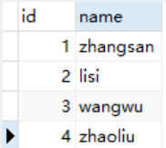
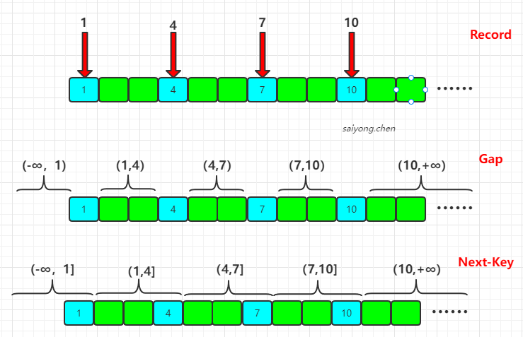
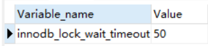
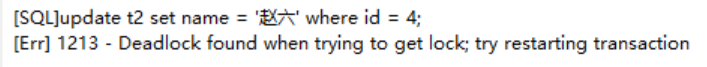
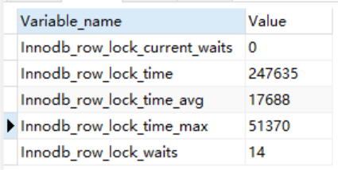
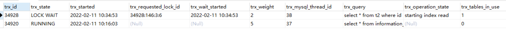
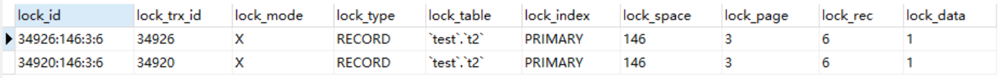
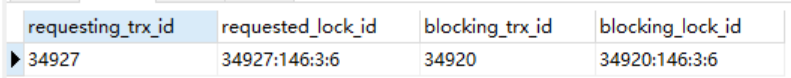

## 1、简介

在[MySQL官网](https://dev.mysql.com/doc/refman/5.7/en/innodb-locking.html)，把锁分为了8类。我们把前面的两个行级别的锁（shared and Exclusive Locks）和两个表级别的锁（Intention Locks）称为锁的基本模式。把后面三个Record Locks、Gap Locks 、Next-key Locks称为锁的算法，也就是分别在什么情况下锁定什么范围。


## 2、MySQL InnoDB中的锁分类

在MySQL中，我们一般按照**锁的粒度**进行分类，分为行锁和表锁。InnoDB它是既有行级别的锁，又有表级别的锁。

- 行锁：锁住表里面的一行数据
- 表锁：锁住的是一张表


**行锁分类：**

- 共享锁
- 排他锁


**表锁分类：**

- 意向共享锁
- 意向排他锁


### 2.1 表锁和行锁的区别：

- 从锁的粒度来看，表锁>行锁
- 从加锁效率来看，表锁>行锁
- 从并发性能来看，表锁<函索


**为什么表锁的加锁效率比行锁高？**

因为当进行加锁的时候，表锁直接锁住一张表就好了，但是行锁要先去检索到这条数据，然后再进行加锁。


**为什么表锁的并发性能比行锁底？**

当我们锁住一张表以后，其他的事务就都不能操作这张表了，如果我们锁住的是表里面的一条数据，其他事务就可以操作表里面的其他没有被锁住的数据了。


### 2.2 共享锁

共享锁（Shared Locks）是一个行级别的锁，当我们的一个事务给一行数据加上这个锁以后，其他事务是可以继续读这行数据的，所以又称为读锁。但是加锁以后，不能再去写这行数据，会导致死锁。


加共享锁的方式：

`select ...... lock in share mode;`


### 2.3 排他锁

排他锁（Exclusive Locks）也是一个行级别的锁，它是用来操作数据的，又叫写锁。当我们一个数据获取了一行数据的排他锁，其他事务就能再操作这一行数据了。


**排他锁的加锁方式：**

- 自动加排他锁：当我们操作数据的时候，包括增删改查，都会默认加上一个排他锁
- 手工加锁：使用`FORE UPDATE`


### 2.4 意向锁

意向锁，是数据库自己维护的。当我们给一行数据加共享锁的时候，数据库会自动在这张表上加一个意向共享锁。当我们给一行数据加排他锁的时候，数据库会自动给这张表加一个意向排他锁。


那么这两个锁存在的意义是什么呢？


## 3. 行锁的原理

当一个事务锁住了一行数据的时候，其他事务不能操作这一行数据，那它到底是锁住了这一行数据，还是锁住了某个字段，还是锁住了别的什么东西？


现在我们分别测试，有三张表，表t1没有索引，表t2有主键索引，表t3有唯一索引。


### 3.1 没有索引加锁

t1的表结构：



| Transaction1                              | Transaction2                                                 |
| ----------------------------------------- | ------------------------------------------------------------ |
| begin;                                    |                                                              |
| select * from t1 WHERE id = 1 for UPDATE; |                                                              |
|                                           | select * from t1 where id=3 for update;  <font color='red'>//blocked</font> |
|                                           | insert into `t1` (`id`, `name`) values (5, '5');  <font color='red'>//blocked</font> |


我们手动开启两个事务Transaction1和Transaction2，在第一个事务中，我们通过where id = 1来锁住第一行数据。

然后在第二个事务中，首先尝试给id = 3的记录进行加锁，发现被阻塞了。然后我们尝试使用第二个事务去插入一条数据，发现也被阻塞了。那么就表示我们第一个事务进行加锁的时候，是锁住的整张表。


### 3.2 主键索引加锁

t2的表结构和t1相同，唯一的区别是我们在id这个字段上创建了主键索引。

| Transaction1                              | Transaction2                                                 |
| ----------------------------------------- | ------------------------------------------------------------ |
| begin;                                    |                                                              |
| select * from t2 WHERE id = 1 for UPDATE; |                                                              |
|                                           | select * from t2 where id=1 for update;  <font color='red'>//blocked</font> |
|                                           | select * from t2 where id=3 for update;  <font color='green'>//ok</font> |

同样我们手动开启两个事务，然后我们发现当我们使用相同的id=1进行加锁的时候，是阻塞的。当我们使用不同的id进行加锁的时候，可以加锁成功。那么就表示锁定的不是一行数据，可能是锁定了id这个字段。


### 3.3 唯一索引加锁

我们使用t3看看，加锁是不是锁住的字段。t3的表结构和上面的t2相同，区别在于我们在name字段上创建了一个唯一索引。

| Transaction1                                      | Transaction2                                                 |
| ------------------------------------------------- | ------------------------------------------------------------ |
| begin;                                            |                                                              |
| select * from t3 where name='zhaoliu' for update; |                                                              |
|                                                   | select * from t3 where name='zhaoliu' for update;  <font color='red'>//blocked</font> |
|                                                   | select * from t3 where id = 4 for update; <font color='red'>//blocked</font> |

当我们使用第一个事务对name='zhaoliu'进行加锁的时候，第二个事务同样加锁，毫无疑问是互斥的。我们又使用第二个事务对这一行数据的id=4进行加锁的时候，发现又被阻塞了，那么就表示锁住的不是字段。


**4.3.1 那么在InnoDB中的行锁到底锁住的是什么？**

InnoDB的行锁锁住的是索引。


**4.3.2 为什么对一张没有索引的表进行加锁的时候，锁住的是整张表呢？**

1. 如果一张表我们定义了主键索引，那么InnoDB会选择主键作为聚集索引
2. 如果没有显示定义主键索引，则InnoDB会选择一个不包含null值的唯一索引作为主键索引。
3. 如果没有唯一索引，InnoDB会选择内置6字节长的ROWID作为隐藏的聚集索引，它会随着行记录的写入而递增。

所以当进行加锁的时候，查询到没有索引，会进行全表扫描，然后把每一个隐藏的聚集索引都锁住。


**4.3.3 为什么对唯一索引加锁的时候，主键索引也锁住了？**

在InnoDB中我们通过一个普通索引进行检索数据的时候会进行回表，因为普通索引存储的是这个索引和主键的值。当我们通过这个索引检索的时候，获取到这行数据的主键索引，然后通过主键索引获取整行数据。那么其实加锁也是一样的，当我们对这个索引进行加锁的时候，也会找到主键索引，然后也锁定。


## 4. 锁的算法

### 4.1 三种锁算法的范围

建立一张新的表t4，只有一个id字段，并且将id设置为主键索引。在表中插入4条数据：1，4，7, 10

首先需要知道这三种算法的范围：




因为我们使用的是主键索引，所以上图的划分标准就是主键索引的值。

我们把数据库中存在的主键值，叫做Record，记录。那么上图就是有4个Record。

根据主键，这些将Record隔开的不存在的数据区间，叫Gap，间隙，它是一个左开右开的区间。

间隙(Gap)和右边的记录(Record)的数据区间，叫做Next-key，临键区间，它是一个左开右闭的区间。


### 4.2 记录锁

当我们对唯一性索引（包括唯一索引和主键索引）进行等值查询的时候，会精准的匹配到一条记录，这个时候使用的锁就是记录锁。

使用不同的key进行加锁的时候，不会发生冲突，这里它只锁住了Record。


### 4.3 间隙锁

当我们查询的数据不存在，没有命中任何一个Record的时候，无论是等值查询还是范围查询，它都使用的是间隙锁。

示例：

```sql
select * from t4 where id > 4 and id < 7;
select * from t4 where id = 6;
```


### 4.4 临键锁

当我们使用了范围查询，不仅仅命中了Record记录，还包含了Gap间隙，那么这种情况就是临键锁，它是MySQL中默认的行锁算法。


**锁的退化：**

当我们进行唯一性索引等值查询到一条记录的时候，退化成记录锁。

当没有查询到任何记录的时候，退化成间隙锁。


### 4.5 隔离级别的实现

- Read Uncommited：不加锁

- Serializable：所有的select语句都会被隐式的转化为select ...... in share mode，会和update和delete互斥

- Repeatable Read：
  - 普通的select使用快照读（snapshot read），底层是通过MVCC来实现的
  - 加锁的select（select ... in share mode / select ... for update）以及update和delete等语句使用当前读（current read），底层通过记录锁、间隙锁和临键锁实现的
- Read Commited：
  - 普通的select使用的是快照读，底层是MVCC实现的。
  - 加锁的select使用的是记录锁。


## 5. 死锁

### 5.1 锁的释放和阻塞

**锁什么时候被释放？**

- 事务结束的时候（commit、rollback）；
- 客户端断开连接


**如果一个事务一直没有释放锁，其他事务会被阻塞多久？会不会永远等待下去？**

如果是，在并发访问比较高的情况下，大量事务因为无法立即获得锁而被挂起，会占用大量的计算机资源，严重影响性能，甚至会拖垮数据库


在MySQL中有一个参数可以控制获取锁的等待时间，默认是50秒

```sql
show VARIABLES like 'innodb_lock_wait_timeout';
```




但是对于死锁，肯定是不会获得锁的，那么会不会也需要等待这50秒？


### 5.2 死锁的发生和检测

示例：

| Transaction1                              | Transaction2                 |
| ----------------------------------------- | ---------------------------- |
| Begin；                                   |                              |
| select * from t2 where id = 1 for update  |                              |
|                                           | begin;                       |
|                                           | delete from t2 where id = 4; |
| update t2 set name = '赵六' where id = 4; |                              |
|                                           | delete from t2 where id = 1; |

我们发现当第一个事务发现死锁后，就会立即退出。第二个事务就立刻获得了锁，不需要等待。




**为什么会检测到死锁呢？**

在MySQL InnoDB中有一个算法（wait-for graph）可以在死锁发生的时候检测到。


**死锁发生的条件？**

1. 同一时刻只能有一个事务持有这把锁
2. 其他事务需要在这把锁释放后才能获得锁，不可以强行剥夺
3. 当多个事务形成环路时，发生死锁


### 5.3 查看锁日志

在SHOW STATUS命令中，包含了一些行锁的信息

```sql
show status like 'innodb_row_lock_%';
```




- Innodb_row_lock_current_waits：当前等待锁定的数量
- Innodb_row_lock_time：从系统启动到现在锁定的总时间，单位ms
- Innodb_row_lock_time_avg：每次等待平均花费的时间
- Innodb_row_lock_time_max：从启动启动到现在等待最长的一次所花的时间
- Innodb_row_lock_waits：从系统启动到现在总共等待的次数


在InnoDB中还提供了3张表来分析事务和锁的情况：

```sql
select * from information_schema.INNODB_TRX;  -- 当前运行的所有事务，还有具体的语句
```




```sql
select * from information_schema.INNODB_LOCKS;  -- 当前出现的锁
```




```sql
select * from information_schema.INNODB_LOCK_WAITS;  -- 锁等待的对应关系
```




找到了持有锁的事务之后我们可以将长时间不释放锁的对应线程kill掉，也就是在`INNODB_TRX`表中的`trx_mysql_thread_id`

例如：

```sql
 kill 37；
```


### 5.4 避免死锁的发生

上述使用kill的方式并不好，我们应当在在程序编写的过程中避免死锁。

1. 在操作多张表时，尽量使用相同的顺序来访问，避免形成等待环路
2. 批量操作单张表数据的时候，先对数据进行排序，避免形成等待环路
3. 申请足够级别的锁，如果是操作表数据，就申请排他锁
4. 尽量使用索引来访问数据，避免没有where条件的操作，避免锁表
5. 尽量将大的事务化为小事务
6. 使用等值查询，尽量避免范围查询命中记录，避免间隙锁对并发造成影响

