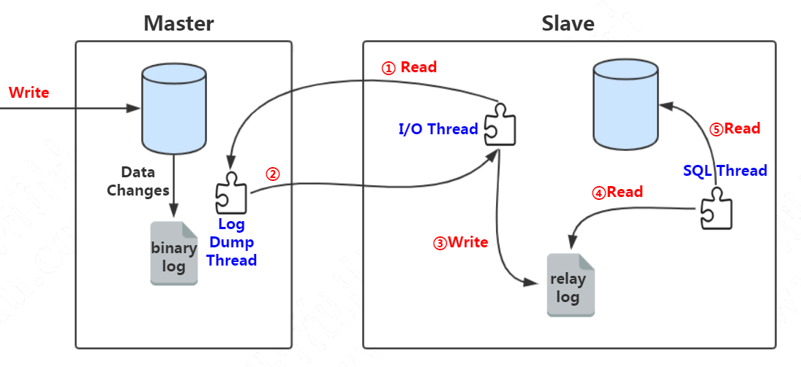
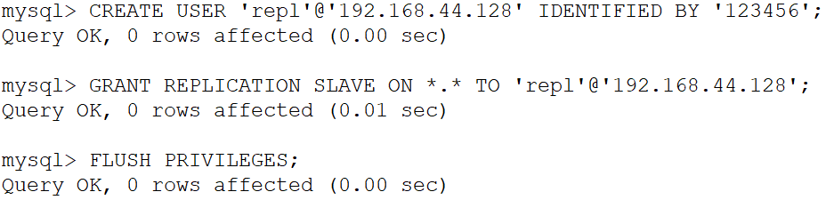
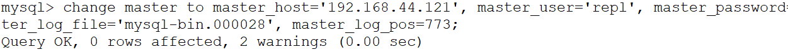

版本：MySQL5.7

主从同步原理：


准备两台机器
master 192.168.44.121
slave 192.168.44.128

如果用clone的方式得到两个MySQL服务，需要注意的地方：
不同机器的UUID不能重复，否则IO线程不能启动：

```
find / -name auto.cnf
vim /var/lib/mysql/auto.cnf
```

把里面的UUID随便改掉一位。

重启服务命令：

```
service mysqld restart
```

## 121 主节点配置

### 配置文件开启binlog

/etc/my.cnf文件

[mysqld]下面增加几行配置：

```
log-bin=/var/lib/mysql/mysql-bin
binlog-format=ROW
server_id=1
```

### 创建给slave使用的用户

在121主节点创建给slave 128节点访问的用户（发放通行证）
连接到MySQL：

```
mysql -uroot -p123456;
```

执行SQL：

```mysql
CREATE USER 'repl'@'192.168.44.128' IDENTIFIED BY '123456';
GRANT REPLICATION SLAVE ON *.* TO 'repl'@'192.168.44.128';
FLUSH PRIVILEGES;
```

如果有多个slave节点，使用同一个用户，也可以把IP设置成通配符的方式，例如192.168.44.*



### 获取binlog名字和position

接下来要获取最新的binlog文件名和position

```mysql
show master status;
```

记住file名字和position，后面会用到。
这个时候master不要发生写操作，否则position和file可能会变化。

## slave节点配置

### 配置文件

[mysqld]下面增加几行配置：

```
log-bin=/var/lib/mysql/mysql-bin
binlog-format=ROW
server_id=2
```

### 开启主从同步

连接到MySQL：

```
mysql -uroot -p123456;
```

file和pos是从主节点获取的

```mysql
change master to master_host='192.168.44.121', master_user='repl', master_password='123456', master_log_file='mysql-bin.000028', master_log_pos=773;
```



### 查看从节点状态

```mysql
show slave status\G;
```

注意，主从同步成功的标志：
IO线程和SQL线程都是成功运行的：

```
Slave_IO_Running: Yes
Slave_SQL_Running: Yes
```

现在可以在master节点上面做任意对于库表的修改操作，slave会自动同步。
不要直接操作slave。

如果IO线程not running：

```
stop slave;                                                      
SET GLOBAL SQL_SLAVE_SKIP_COUNTER=1;
start slave;                                                      
show slave status\G  
```

很多同学在安装的时候遇到了各种各样的问题：
1、防火墙没关
2、配置文件 _ 写成了 -
3、用来测试同步的表名用了关键字


