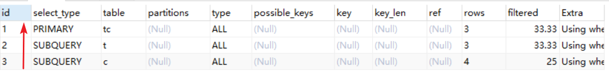
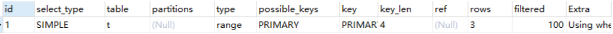

## 1、 慢查询日志 Slow Query Log

我们的服务每天都会执行很多的SQL语句，那么我们怎么知道有哪些SQL语句执行比较慢呢？

[Slow Query Log官方文档](https://dev.mysql.com/doc/refman/5.7/en/slow-query-log.html)


### 1.1 打开慢日志开关

开启慢日志是有代价的，所以它默认是关闭的：

```sql
show variables like 'slow_query%';
```


查看执行超过多长时间的SQL才会记录到慢日志，默认是10s

```sql
show variables like '%long_query%';
```


可以直接动态修改的参数：（重启后失效）

```sql
set @@global.slow_query_log=1; --  1 开启，0 关闭，重启后失效
set @@global.long_query_time=3; --  mysql  默认的慢查询时间是 10 秒，另开一个窗口后才会查到最新值
```


也可以通过修改配置文件修改：（my.conf）

```properties
slow_query_log=ON 
long_query_time=2
slow_query_log_file=/var/lib/mysql/localhost-slow.log
```


### 1.2 慢日志分析

**1.获取日志内容**

```sql
show global status like 'slow_queries'; -- 查看有多少慢查询 
show variables like '%slow_query%'; -- 获取慢日志目录
```


**2.分析日志**

在MySQL中提供了一个工具mysqldumpslow可以用来分析慢日志，在MySQL的bin目录

[mysqldumpslow官方文档](https://dev.mysql.com/doc/refman/5.7/en/mysqldumpslow.html)

```shell
mysqldumpslow --help
```


例如：查询用时最多的20条慢SQL：

```shell
mysqldumpslow -s t -t 20 -g 'select' /var/lib/mysql/localhost-slow.log
```


- Count：代表这个SQL执行了多少次
- Time：表示执行的时间，括号中表示的是累计数
- Lock：表示锁定的时间
- Rows：返回记录数


## 2、 Show Profile

可以用来查看SQL语句执行的时候使用的资源，比如CPU、IO的消耗情况

[show profile官方文档](https://dev.mysql.com/doc/refman/5.7/en/show-profile.html)


**1、查看是否开启**

```sql
select @@profiling;
set @@profiling=1;
```


**2、查看profile统计**

```sql
show profiles;
```


**3、查看最后一个SQL的执行详细信息，从中找出耗时较多的环节：**

```sql
show profile;
```


其中4.4E-5，表示小数点左移5位，代表0.000044秒


4、根据ID查看执行详细信息：

```sql
show profile for query 1;
```


## 3、其他命令

### 3.1 show processlist运行线程

用于显示用户运行线程，可以根据ID，kill掉它们。

[show processlist官方文档](https://dev.mysql.com/doc/refman/5.7/en/show-processlist.html)

```sql
show processlist;
```


也可以像查表一样查询，反正两者的效果是一样的：

```sql
select * from information_schema.`PROCESSLIST`;
```


- id：线程的唯一标识，可以通过它kill掉该线程
- User：启动这个线程的用户，普通用户只能看到自己的线程
- Host：哪个IP端口发起的连接
- db：操作的数据库
- Command：线程的命令，[Conmmand官方文档](https://dev.mysql.com/doc/refman/5.7/en/thread-commands.html)
- Time：操作持续时间，单位秒
- State：线程状态，[State官方文档](https://dev.mysql.com/doc/refman/5.7/en/general-thread-states.html)
- Info：SQL语句的前00个字符，如果要查看完整的SQL乬，用`show full processlist`


### 3.2 show status 服务器运行状态

用于查看MySQL服务器运行状态（重启后会清空），有sessin和global两种作用域

[show status官方文档](https://dev.mysql.com/doc/refman/5.7/en/show-status.html)


可以用like带通配符过滤。

```sql
SHOW GLOBAL STATUS LIKE 'com_select'; -- 查看select次数
```


### 3.3 show engine 存储引擎运行信息

用来显示村粗引擎当前的运行信息，包括事务持有的表锁、行锁信息、事务的锁等待情况、线程信号量等待、文件IO情况、buffer pool统计信息

```sql
show engine  innodb status;
```


如果需要将监控信息输出到错误日志error log中（每15秒一次），可以开启输出：

```sql
show variables like  'innodb_status_output%'; -- 开启输出：
SET GLOBAL innodb_status_output=ON; 
SET GLOBAL innodb_status_output_locks=ON;
```


## 4、Explain执行计划

用来模拟优化器执行 SQL 查询语句的过程，知道 MySQL 是怎么处理一条 SQL 语句的。

[Explain官方文档](https://dev.mysql.com/doc/refman/5.7/en/explain-output.html)


我们首先创建三张表，一张课程表、一张老师表、一张老师联系方式表（没有任何索引）

```sql
DROP TABLE  IF EXISTS course; 
CREATE TABLE `course` ( 
`cid` int(3) DEFAULT NULL,
`cname` varchar(20) DEFAULT NULL, 
`tid` int(3) DEFAULT NULL
) ENGINE=InnoDB DEFAULT CHARSET=utf8mb4;
 
DROP TABLE IF EXISTS teacher;
CREATE TABLE `teacher` ( 
`tid` int(3) DEFAULT NULL,
`tname` varchar(20) DEFAULT NULL, 
`tcid` int(3) DEFAULT NULL
) ENGINE=InnoDB DEFAULT CHARSET=utf8mb4; 

DROP TABLE IF EXISTS teacher_contact;
CREATE TABLE `teacher_contact` ( 
`tcid` int(3) DEFAULT NULL,
`phone` varchar(200) DEFAULT NULL
) ENGINE=InnoDB DEFAULT CHARSET=utf8mb4;

INSERT  INTO `course` VALUES ('1', 'mysql', '1');
INSERT  INTO `course` VALUES ('2', 'jvm', '1');
INSERT  INTO `course` VALUES ('3', 'juc', '2');
INSERT  INTO `course` VALUES ('4', 'spring', '3');

INSERT  INTO `teacher` VALUES ('1', 'zhangsan', '1');
INSERT  INTO `teacher` VALUES ('2', 'lisi', '2');
INSERT  INTO `teacher` VALUES ('3', 'wangwu', '3');

INSERT INTO `teacher_contact` VALUES ('1', '13688888888');
INSERT INTO `teacher_contact` VALUES ('2', '18166669999');
INSERT INTO `teacher_contact` VALUES ('3', '17722225555');
```


然后我们执行一条Explain语句：

```sql
EXPLAIN SELECT * from course;
```


### 4.1 id

id是查询顺序的编号


#### 4.1.1 id值不同

```sql
-- 查询 mysql 课程的老师手机号
EXPLAIN SELECT
	tc.phone
FROM
	teacher_contact tc
WHERE
	tcid = (
		SELECT
			tcid
		FROM
			teacher t
		WHERE
			t.tid = (
				SELECT
					c.tid
				FROM
					course c
				WHERE
					c.cname = 'mysql'
			)
	);
```




id值不同的时候，先查询id值大的（<font color='red'>先大后小</font>）。这里先查课程表，然后查老师表，最后查老师联系方式表。


#### 4.1.2 id值相同

```sql
-- 查询课程ID为2，或者联系表ID为3的老师
EXPLAIN SELECT
	t.tname,
	c.cname,
	tc.phone
FROM
	teacher t,
	course c,
	teacher_contact tc
WHERE
	t.tid = c.tid
AND t.tcid = tc.tcid
AND (c.cid = 2 OR tc.tcid = 3);
```


当id值相同时，表的查询顺序是<font color='red'>从上往下</font>顺序执行。这里依次查询的时候teacher表3条数据，course表4条数据，最后teacher_contact表3条数据。


当teacher表插入三条数据后：

```sql
INSERT INTO `teacher` VALUES (4, 'zhaoliu', 4);
INSERT INTO `teacher` VALUES (5, 'tom', 5);
INSERT INTO `teacher` VALUES (6, 'jack', 6);
COMMIT;

-- （备份）恢复语句
DELETE FROM  teacher where tid in (4,5,6); 
COMMIT;
```


然后我们再次执行上面的Explain执行计划：


这里我们发现id还是同样都是1，但是查询顺序变成了teacher_contact表3条数据，然后是teacher表6条数据，最后是course表3条数据。


**为什么当数据量不同的时候，表的顺序会发生变化呢？**

这是由笛卡尔积决定的。

假如我们有三张表a，b，c，分别有2,3,4条数据，如果做三张表联合查询的时候，当查询顺序是a -> b -> c的时候，它的笛卡尔积是2 x 3 x 4 = 6 x 4 = 24。但是当它的执行顺序反过来的时候，就变成了4 x 3 x 2 = 12 x 2 = 24。而MySQL要把查询的结果，包括中间结果和最终结果都要保存到内存中，所以MySQL会优先选择数据量比较小的顺序进行查询。也就是选择第一种方式，这就是为什么当数据量发生变化的时候，表的查询顺序会发生变化。


#### 4.1.3 既有相同，又有不同

那就是ID不同的先大后小，ID相同的从上往下。


### 4.2 select type 查询类型

查询类型有很多，例举一些常见的


#### 4.2.1 SIMPLE

简单查询，不包含子查询，不包含关联查询union

```sql
EXPLAIN SELECT * from course;
```


#### 4.2.2 PRIMARY、SUBQUERY

```
-- 查询 mysql 课程的老师手机号
EXPLAIN SELECT
	tc.phone
FROM
	teacher_contact tc
WHERE
	tcid = (
		SELECT
			tcid
		FROM
			teacher t
		WHERE
			t.tid = (
				SELECT
					c.tid
				FROM
					course c
				WHERE
					c.cname = 'mysql'
			)
	);
```


- PRIMARY：子查询SQL语句中的主查询，也就是最外面的那层
- SUBQUERY：子查询SQL语句中的内层查询


#### 4.2.3 DERIVED、UNION、UNION RESULT

```sql
-- 查询 ID  为 1 或 2 的老师教授的课程 
EXPLAIN SELECT
	cr.cname
FROM
	(
		SELECT
			*
		FROM
			course
		WHERE
			tid = 1
		UNION
			SELECT
				*
			FROM
				course
			WHERE
				tid = 2
	) cr;
```


- DERIVED：衍生查询，表示在得到最终查询结果前会用到临时表。
- UNION：用到了Union查询
- UNION RESULT：主要是显示哪些表之间存在UNION查询，<union2,3>表示id=2和id=3的查询存在union。


### 4.3 type连接类型

在常用的连接类型中：system > const > eq_ref  > ref > range > index > all。

这里并没有例举全部的类型，具体可以查看官方文档。同时所有的连接中，上面的性能最好，越往下性能越差。


#### 4.3.1 const

主键索引或者唯一索引，并且只能查到一条数据。

```sql
DROP TABLE IF EXISTS single_data;

CREATE TABLE single_data (
	id INT (3) PRIMARY KEY,
	content VARCHAR (20)
);

INSERT INTO single_data VALUES	(1, 'a');

EXPLAIN SELECT
	*
FROM
	single_data a
WHERE
	id = 1;
```


#### 4.3.2 system

是const的一种特例，只有一行满足条件。例如只有一条数据的系统表

```sql
EXPLAIN SELECT * FROM  mysql.proxies_priv;
```


#### 4.3.3 eq_ref

通常出现在多表的join查询，表示对于前表的每一个结果，都只能匹配到后表的一行结果。一般是唯一性索引的查询（union或primary key）。

eq_ref是除了const之外最好的访问类型。


给teacher_contact表添加主键索引

```sql
ALTER TABLE teacher_contact ADD PRIMARY KEY(tcid);
```


给teacher表添加普通索引：

```sql
ALTER TABLE teacher ADD INDEX idx_tcid(tcid);
```


执行Explain查询语句：

```sql
EXPLAIN select t.tcid from teacher t,teacher_contact tc where t.tcid = tc.tcid;
```


以上三种system、const、eq_ref，都是可遇不可求的，基本上很难优化到这种级别


#### 4.3.4 ref

查询用到了非唯一性索引，或者关联操作只使用了索引的最左前缀


例如：使用tcid长的普通索引查询：

```sql
explain SELECT * FROM teacher where tcid = 3;
```


#### 4.3.5 range

索引范围扫描。如果是where后面试betweent、and、<、>、>=、<=、in这些，type的类型都是range。


首先给teacher表添加个普通索引，如果不加就会全表扫描，就是all

```sql
ALTER TABLE teacher add INDEX idx_tid(tid);
```


执行索引范围查询：

```sql
EXPLAIN  SELECT * FROM teacher t WHERE t.tid < 3;
-- 或
EXPLAIN SELECT * FROM teacher t WHERE tid BETWEEN 1 AND 2;
```


in查询也是range：

```sql
EXPLAIN SELECT * FROM teacher_contact t WHERE tcid in (1,2,3);
```




#### 4.3.6 index

Full Index Scan，查询全部索引中的数据（比不走索引要快）

```sql
EXPLAIN SELECT tid from teacher;
```


#### 4.3.7 all

Full Table Scan，如果没有用到索引或者没有索引。表示全表扫描

```sql
EXPLAIN SELECT * from teacher;
```


**一般来说，最少要保证查询能达到range级别，最好能达到ref级别。**

**而ALL或者INDEX都是需要优化的。**


### 4.4 possible key、key

- possible key：可能会用到的索引，一般有一个或者多个
- key：实际用到的索引，如果值为null就表示没有用到索引


**如果possible key为空，key可能会有值吗？**

在之前的user_innodb上添加一个联合索引：

```sql
ALTER TABLE user_innodb DROP INDEX  comidx_name_phone;
ALTER TABLE user_innodb add INDEX comidx_name_phone (name,phone);
```


执行计划：

```dwl
explain select phone from user_innodb where phone='126';
```


答案是有可能的（这里是覆盖索引）


### 4.5 key_len

索引的长度（使用的是字节），和索引字段的类型、长度有关


### 4.6 rows

MySQL认为扫描了多少行才能返回请求数据，是一个预估值。一般来说行数越少越好。


### 4.7 filtered

表示存储引擎返回的数据在server层过滤后，剩下多少满足查询的记录数量的比例，这是一个百分比。


### 4.8 extra

执行计划额外给出的信息说明


#### 4.8.1 using index

用到了覆盖索引，不需要回表

```sql
EXPLAIN SELECT tid from teacher;
```


#### 4.8.2 using where

使用了where过滤，表示存储引擎返回的数据并不是所有的都满足查询条件，需要在server层进行过滤

```sql
EXPLAIN SELECT * FROM teacher_contact t WHERE tcid in (1,2,3);
```


#### 4.8.3 using index condition

索引条件下推，可以查看[索引的创建、使用以及原则](https://starrevolve.com/#/docs/%E6%95%B0%E6%8D%AE%E5%BA%93/mysql/%E7%B4%A2%E5%BC%95%E7%9A%84%E5%88%9B%E5%BB%BA%E3%80%81%E4%BD%BF%E7%94%A8%E4%BB%A5%E5%8F%8A%E5%8E%9F%E5%88%99?id=_24-%e7%b4%a2%e5%bc%95%e6%9d%a1%e4%bb%b6%e4%b8%8b%e6%8e%a8)中，索引下推的章节内容。


#### 4.8.4 using filesort

不能使用索引排序，用到了额外的排序。一般需要优化

```sql
EXPLAIN select * from user_innodb where name='zhangsan' ORDER BY id;
```


这里是由order by引起的。


#### 4.8.5 using temporary

用到了临时表


1、distinct 非索引列

```sql
EXPLAIN SELECT DISTINCT(tid) from teacher;
```


2、group by 非索引列

```sql
EXPLAIN select tname  from teacher group by tname;
```


3、使用join的时候，group任意列

```sql
EXPLAIN select t.tid from teacher t join course c on t.tid = c.tid group by t.tid;
```


### 总结

通过Explain来模拟优化器执行SQL查询语句后，分析出了什么问题，然后对SQL语句进行具体的优化。比如如何用到索引，怎么减少锁的阻塞等等。


## 5、SQL与索引优化

当我们的SQL语句比较复杂的时候，比如有多个关联和子查询的时候，就要分析SQL语句有没有改写的空间。


举个例子：

```sql
-- 大偏移量的 limit
select * from user_innodb limit 900000,10; 
-- 改成先过滤 ID，再 limit
SELECT * FROM user_innodb WHERE id >= 900000 LIMIT 10;
```


最后附上，[MySQL官方优化建议文档](https://dev.mysql.com/doc/refman/5.7/en/optimization.html)

