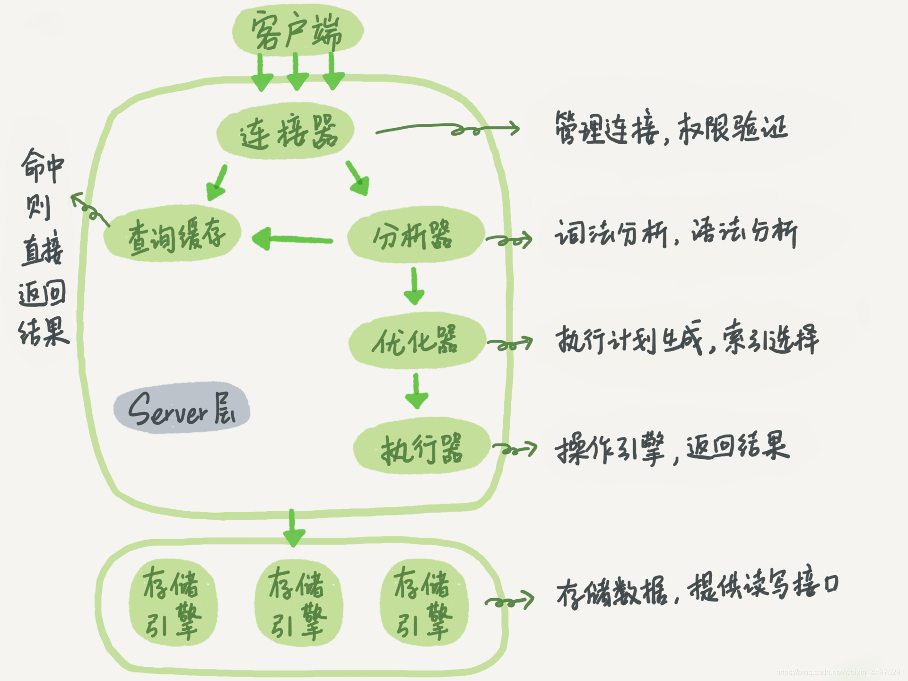
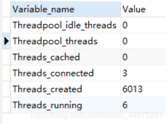
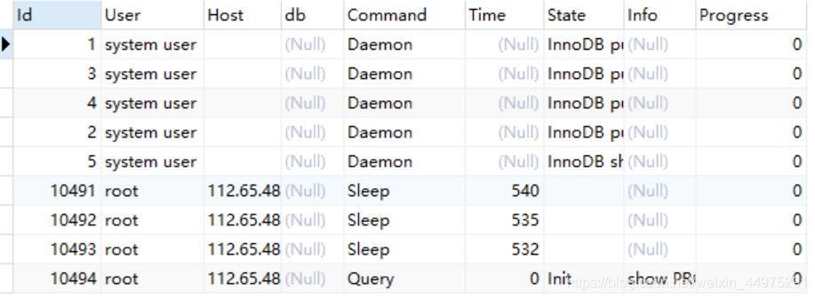
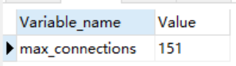
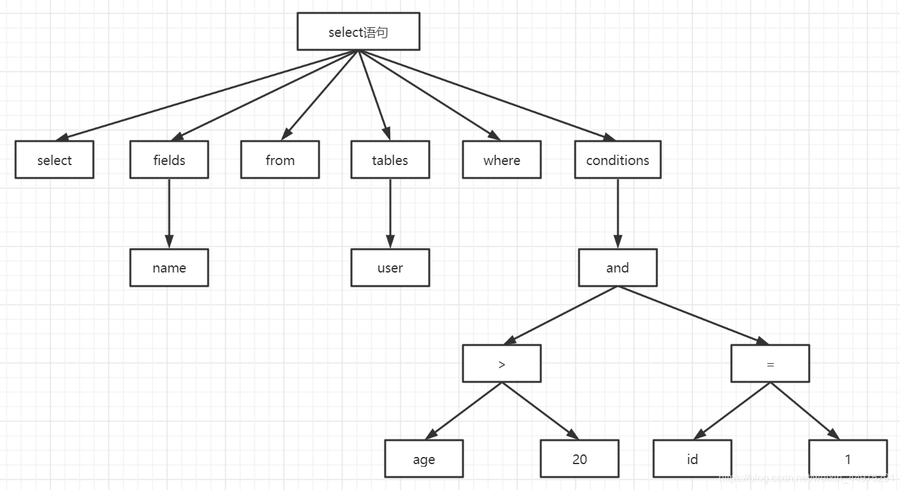

# 前言
如果我们要执行一条查询语句，那么它到底在MySQL中是如何执行的呢？

先给出MySQL的逻辑架构图。（来自：极客时间-MySQL实战45讲）

从上图我们知道，如果我们要使用MySQL首先第一步肯定是和它建立连接。

## 1. 连接器
连接器负责跟客户端建立连接、获取权限、维持和管理连接。

**建立连接**
```sql
mysql -hip地址 -P端口 -u用户名 -p
```
当我们在客户端输完命令就可以在交互对话中输入密码了。一般我们不建议直接将密码写在-p后面，这样会导致密码泄露。

- 如果用户名或密码不对，你就会收到一个"Access denied for user"的错误，然后客户端程序结束执行。
- 如果用户名密码认证通过，连接器会到权限表里面查出你拥有的权限。之后，这个连接里面的权限判断逻辑，都将依赖于此时读到的权限。 

这就意味着，一个用户成功建立连接后，即使你用管理员账号对这个用户的权限做了修改，也不会影响已经存在连接的权限。修改完成后，只有再新建的连接才会使用新的权限设置。

建立连接就需要知道MySQL都支持哪些通信协议应该如何建立连接等等。
MySQL是支持多种通信协议的，可以使用同步和异步的方式，支持长连接和短连接。

### 1.1 通信协议
- **Unix Socket**
在Linux系统中，我们如果想要通过客户端连接mysql，在输入连接命令的时候没有携带-h，这个时候就是通过socket来连接，不用通过网络协议。
- **TCP/IP 协议**
如果在输入连接命令的时候携带了-h这个时候就使用到了TCP/IP网络协议。一般我们的连接模块都是通过这种方式来连接的。比如mysql-conector-jav-x.x.jar。

### 1.2 通信类型：
- **同步**
  * 同步通信受限于被调用方的性能，也就是说应用操作数据库线程会阻塞，等待数据返回
  * 一般只能一对一，很难做到一对多

- **异步**
  * 异步可以避免线程的阻塞，但是不能节省SQL的运行时间
  * 如果异步存在并发，每执行一个SQL都需要创建一个连接，这样就会给服务器带来大量的资源消耗。如果要使用异步，就一定要使用连接池，来避免这种创建连接带来的资源消耗。

所以一般我们连接数据库都是用同步的方式

### 1.3 连接方式
- **长连接**
  * 长连接可以保持打开，减少服务器创建和释放连接所带来的消耗。后面的程序访问还可以继续使用这个连接。
  * 一般我们会在连接池中使用长连接。但是保持长连接会导致内存的开销。上时间不活动的连接，也会被MySQL服务器也会断开。
  * 如果长连接太多，可能会导致内存占用太大，被系统强行杀掉OOM。
- **短连接**
  * 短连接就是操作完成后，马上close掉
  * 频繁的创建和释放连接是非常消耗系统资源的

**查看超时时间**
```sql
show global variables like 'wait_timeout'; - 非交互式超时间，如 JDBC 程序
show global variables like 'interactive_timeout'; - 交互式超时间，如数据库工具
```
这两个默认的时间都为28800，即8小时。

如果一个连接的空闲时间超过了上面设置的哪个超时时间，就会被mysql断开连接。当断开的连接再次请求的话。就会报错，这个时候就需要重新连接！

上面我们说道，当长连接太多，可能会导致OOM。那么应该如何解决？

 1. 定期断开长连接
 2. 如果使用的是5.7或更新的版本，每当执行一个较为大的操作后，可以执行mysql_reset_connection来重新初始化连接。

**查看MySQL有多少个连接**
```sql
show global status like 'Thread%';
```
 
 1. Threads_cached：缓存中的线程连接数
 2. Threads_connected：当前打开的连接数
 3. Threads_created：为处理连接创建的连接数
 4. Threads_running：非睡眠状态的连接数，一般指并发连接数

**查询所有线程的状态**
```sql
show processlist;
```


**查询最大连接数**
在5.7的版本中最大的默认连接数是151个，可以修改最大值为16384（2^14）
```sql
show variables like 'max_connections';
```


**show参数说明**

- 级别：默认为session级别，如果要设置为全局需要添加上global

**set参数说明**
- 动态修改，重启失效。如果要永久生效，可以在配置文件中进行参数修改
```sql
set global max_connections=1000; #将最大连接数设置为1000
```

### 1.4 通信方式
**分类**
- 单工
	* 在两台计算机系统中，数据的传输是单向的。
- 半双工
  * 在两台计算机系统中，数据的传输是双向的。你可以给我发，我也可以给你发。但是同一时间只能有一方发送和接收，
- 双工
	*数据传输是双向的，可以两台设备可以同时进行发送或者接收

MySQL采用的是半双工的这种方式，那么客户端给服务端发送数据，要么服务端给客户端发送数据。同时在一次连接中，数据不能分成很多个小块发送，不管多大都是一次性发送的。服务端也同样，再返回数据的时候也是一次性发送的。

## 2. 查询缓存
在MySQL内部带了一个缓存模块，当连接建立完成后，就来到了这里。查询缓存！
这里的数据是以kv的形式存储在内存中的，k是sql语句，v是查询结果。可以加快数据的读取速度。MySQL拿到语句后，会先到查询缓存中看一下之前是不是执行过这条语句。如果之前执行过，通过sql语句来命中这条数据，将结果返回。

但是一般来说是不建议使用这个缓存模块的，因为只要当我们对一张表中的某个数据进行增删改的时候，这个查询缓存就会被清除。这样对于更新频繁的表达来说，他的缓存命中率是非常低的。

而且在8.0以后，这个模块已经被删除了。在之前的版本中，也是不推荐使用的。默认是关闭的。
## 3. 分析器
如果没有命中查询缓存，就要开始真正执行查询语句了。首先，MySQL 需要知道你要做什么，因此需要对 SQL 语句做解析和预处理。如果SQL语句出现任何问题报错，都是在里返回。
### 3.1 解析器
#### 3.1.1 词法解析
词法解析就是将一条完整的SQL语句打碎成一个个单词。比如如下的SQL语句：
```sql
select * from t where id = 1;
```
将会被打碎成8个符号，从哪里开始到哪里结束。

#### 3.1.3 语法解析
这里会对SQL进行语法分析，比如单引号有没有闭合之类的。然后再根据MySQL定义的语法规则生成解析树。
比如下面这条select查询语句：
```sql
select name from user where age > 10 and id = 1;
```
就会被生成如图所示的解析树：


### 3.2 预处理
如果这条SQL的单词和语法都没有错误，但是MySQL中没有这张表或者没有这个字段怎么办呢？
在MySQL中提供了预处理，就是为了检查解析器没有办法处理的这一类的问题，检查表或者字段是否存在等等。

## 4. 优化器
经过了分析器，MySQL就知道了这个SQL语句要干什么了，这个时候就会找优化器，优化器的目的就是根据解析树生成不同的执行计划，然后选择最优的执行计划，MySQL里面使用的基于开销的优化器，哪种计划开销最小，就用哪种。

**查询开销**
```sql
show status like 'Last_query_cost';
```

**什么是执行计划？**
比如我们有下面这一段SQL：
```sql
select * from t1 join t2 where t1.id = 10 and t2.id=20
```
- 第一种：先从表t1里面取出id=10，再根据id值关联到t2表，再判断t2里面的id=20
- 第二种：先从表t2里面取出id=20的值，再根据值关联到表t1，再判断t1里面的id=10
虽然这两种方法的执行获取的结果是一样的，但是执行的效率会有所不同，而优化器就是决定选着使用哪种方案

**优化器如何得到执行计划？**
首先开启优化器追踪：（默认是关闭的）
```sql
show variables like 'optimizer_trace';
set optimizer_trace='enabled=on';
```
开启优化器追踪会小号性能，因为它需要将优化分析的结果写到表中，所以不要随意打开。

打开优化器追踪后，可以随意的执行一条sql语句，这个时候会将优化器分析的结果记录到系统表中，我们可以使用下面的语句查询：
```sql
select * from information_schema.optimizer_trace\G
```
会得到json类型的数据，主要分成三部分：准备阶段、优化阶段和执行阶段

分析完记得关闭。

## 5. 执行器
MySQL通过分析器知道你要做什么，通过优化器知道该怎么做，就会进入执行器调用存储引擎的接口，开始执行语句。

**那么执行器使用来干什么的呢？**
首先开始执行的时候，要先判断你对查询的表有没有对应的权限，如果没有就会返回灭有权限的错误。
```sql
select * from t where id = 10;

Error 1142(42000): SELECT command denied to user 'b'@'localhost' for table 't'
```
如果有权限，就打开表继续执行。打开表的时候，执行器就会根据表设置的引擎，去使用对应的引擎提供的接口。

拿上面的SQL语句来说，他的执行流程大概是这个样子的：

 1. 调用存储引擎接口取到这个表的的第一行，判断id是不是等于10如果不是跳过，乳沟是则将结果存在结果集中。
 2. 调用存储引擎接口取到“下一行”，重复相同的判断逻辑，知道取到这个表的最后一行。
 3. 执行器将上述遍历过程中所有满足条件的行的结果集返回给客户端。

当我们开启慢查询日值的时候，会在日志中会看到一个rows_examined
的字段，表示这个语句在执行中扫描了多少行，这个值就是在每次调用引擎获取数据行的时候累加的。我们在Explain中也能看到一个rows的字段，不能代表最终的执行行数。

## 6. 存储引擎
我们上面说到，当获取到所有的结果集后才会返回，那么这些数据是放在什么样的结构中的呢？
在MySQL中支持多种存储引擎，他们是可以替换的，我们把这种方式叫做插件式存储引擎。为什么要搞这么多的存储引擎呢？因为不同的存储引擎，他们存储数据的结构是不一样的。

**查看已经存在表的库的存储引擎**
```sql
show table status from '库名';
```
或者也可以通过DDL建表语句来查看。

在MySQL中，我们创建的每一张表都可以指定他的存储引擎，而不是一个数据库只能使用一个存储引擎。它是以表为为单位的，同时创建表之后还可以修改表的存储引擎。

我们说一张表使用的存储引擎决定我们存储数据的结构，那么在服务服务器上他们是怎么存储的呢？首先我们要找到数据库存放数据的路径：
```sql
show varaiables like 'datadir';
```
默认情况下，每个数据库有一个自己的文件夹，任何一个存储引擎都有一个frm文件，这个是表结构定义文件。不同的存储引擎存放数据的方式不一样，产生的文件也不一样，innodb是一个，memory没有，myisam是两个。

### 常见的存储引擎
- MyISAM：应用范围比较小，表级锁定限制了读/写的性能，通常用于只读或者以读为主的工作。
	* 特点：
		+ 支持表级别的锁，不支持事务
		+ 拥有较高的插入和查询速度
		+ 存储了表的行数（count熟读更快）
	
- Innodb：MySQL 5.7 以后默认的存储引擎。是一个事务安全的存储引擎，具有提交、回滚和崩溃恢复的功能。支持行级锁，数据存储在聚集索引中，来减少基于主键的常见查询I/O。
	* 特点：
		+ 支持事务，支持外键，因此数据的完整性、一致性高
		+ 支持行级锁和表级锁
		+ 支持读写并发啊，写不阻塞读（MVCC）
		+ 特殊的索引是存放方式，可以减少IO，提升查询效率
- Memory：将所有的数据存储中内存中，以便在需要快速查找非关键数据的环境中快速访问。一般适合用做临时表。
	* 特点：
		+ 把数据存放在内存中，读写速度快
		+ 数据库重启或者崩溃，数据会全部消失

**查看数据库支持的存储引擎**
```sql
show engines;
```