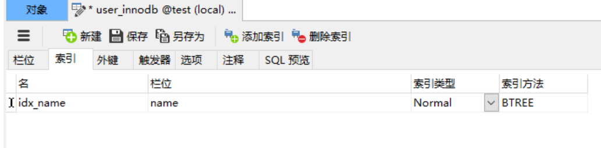
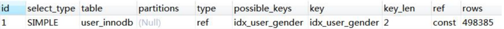
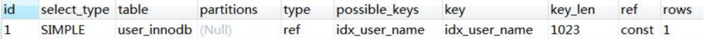
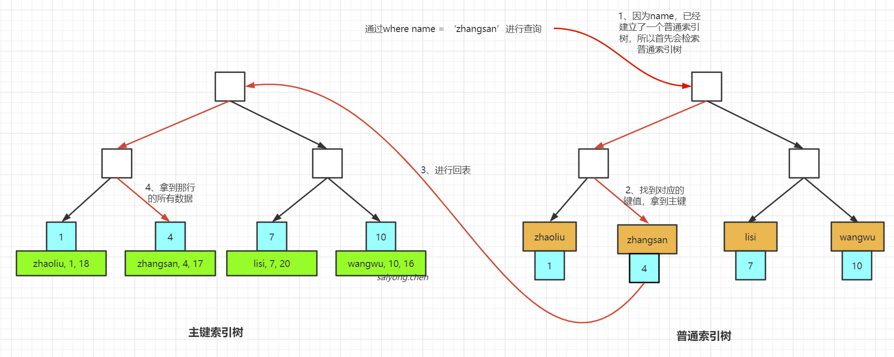
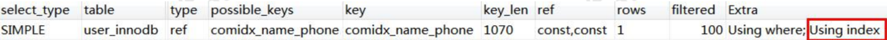
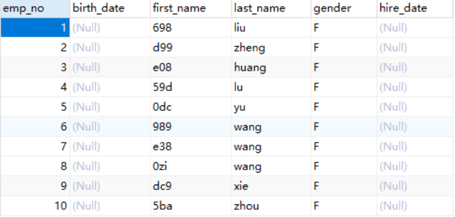
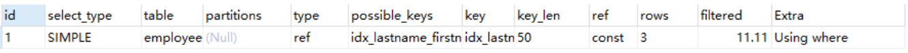
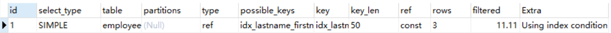

## 1、 索引的创建与使用

### 1.1 索引的创建




**索引的创建规则：**

1. 在用于where条件、order排序和join的(on)的字段上创建索引
2. 索引的个数不要多
3. 离散度高的字段，例如性别之类的字段不建议创建，离散度太低
4. 频繁更新的字段，不要作为主键和索引
5. 组合索引把离散度高的字段放在前面
6. 创建复合索引，而不是建立很单个索引
7. 不建议使用无需的值作为索引（例如身份证、UUID）


### 1.2 什么时候会用不到索引

1、索引类上使用函数（replace、SUBSTR、CONCAT、sum、count、avg）、表达式和计算

```sql
select * from `t2` where id+1 = 4;
```


2、字符串不加引号，导致隐式转换

```sql
ALTER TABLE user_innodb DROP INDEX comidx_name_phone;
ALTER TABLE user_innodb ADD INDEX comidx_name_phone(name,phone);

select * from `user_innodb` where name = 123;
select * from `user_innodb` where name = '123';
```


3、like条件前面加%

where条件中`like abc%`、`like %abc%`、`like %abc`都用不到索引吗？为什么？

```sql
select * from user_innodb where name like 'wang%';
select * from user_innodb where name like '%wang';
```

过滤开销太大，所以无法使用索引。这个使用使用的是全文索引。


4、负向查询

NOT LIKE 不能

```sql
select * from user_innodb where name not like 'wang';
```


!= (<>)和not in在某些情况下可以

```sql
select * from user_innodb where id not in (1);
select * from user_innodb where id <> 2;
```


**其实用不用索引，最终都是优化器说了算。**

优化器是基于cost开销（Cost Base Optimizer），它不是基于规则（Rule-Based Optimizer），也不是基于语义。而是怎么开销小怎么来。

[The Optimizer Cost Model官方文档](https://dev.mysql.com/doc/refman/5.7/en/cost-model.html)

[Using the Rule-Based Optimizer官方文档](https://docs.oracle.com/cd/B10501_01/server.920/a96533/rbo.htm)


## 2、索引的使用原则

### 2.1 列的离散

当我们在查询条件上建立索引的时候，索引是越多越好吗？这里我们引入一个概念就是列的离散度。

离散度的公式：

```sql
count(distinct(column_name)):count(*)
```

表示列中全部不同值与所有数据行的比例。在数据行相同的情况下，分子越大，列的离散度就越高。简单来说，如果列中重复的值越多，离散度就越低，重复值越少，离散度就越高。如果重复值太多，就需要扫描更多的行。


例如：我们现在有一张user_innodb的表，然后我们在性别gender上建立索引，然后使用EXPLAIN查看一下执行计划：

```sql
ALTER TABLE user_innodb DROP INDEX idx_user_gender;
ALTER TABLE user_innodb ADD INDEX idx_user_gender(gender);

EXPLAIN SELECT * FROM `user_innodb` WHERE gender = 0;
```


查看扫描行数rows：




然后再使用离散度高的列，比如name建立索引，查看一下：

```sql
ALTER TABLE user_innodb DROP INDEX idx_user_name;
ALTER TABLE user_innodb ADD INDEX idx_user_name(name);

EXPLAIN SELECT * FROM `user_innodb` WHERE name = 'sinclair';
```


查看扫描行数rows：




所以当我们建立索引的时候一定要选择离散度高的，也就是重复值少的列建议索引。


### 2.2 联合索引的最左匹配原则

有的时候我们需要的时候多条件查询，就可以建立联合索引。联合索引在B+树中是一种复合的数据结构，它是按照从左到右的顺序来建立搜索树的。


比如：我们在user_innodb表上面，给name和phone建立一个联合索引（这里name在左边，phone在右边）

```sql
ALTER TABLE user_innodb DROP INDEX comidx_name_phone;
ALTER TABLE user_innodb ADD INDEX comidx_name_phone(name,phone);
```


**什么时候可以用到联合索引？**（比如，上述按name和phone建立的索引）

1. 按建立索引的顺序，使用两个字段的时候
2. 只使用name字段，也就是左边那个字段的时候


所以当查询的时候，比如where name = ‘sinclair’ and phone = ‘132xxxx'，会先检索name，然后再检索phone。如果你的查询条件中没有name，比如只有一个phone，就不会用到这个索引。如果你的查询条件中只有一个name，可以用到这个索引。


### 2.3 覆盖索引

回表：非主键的索引，通过这个索引找到主键索引的键值，再通过主键索引拿到完整的数据的这个过程。它比直接使用主键索引多扫描了一颗索引树。


例如：

```sql
select * from user_innodb where name = 'zhangsan';
```




而覆盖索引就是不管是单列索引，还是联合索引，如果需要检索的数据，不需要进行回表就能拿到想要检索的数据，这个时候使用的索引就是覆盖索引。


**如何查看我们是否用的覆盖索引？**

可以使用EXPLAIN执行计划：



在Extra这个列中：如果出现的是Using Index，就表示是覆盖索引。主要注意的是，select * 的时候是用不到覆盖索引的。


**覆盖索引的优点：**

减少了IO次数，就减少了数据的访问量，从而提高了查询的效率。


### 2.4 索引条件下推

[MySQL索引条件下推官方文档](https://dev.mysql.com/doc/refman/5.7/en/index-condition-pushdown-optimization.html)

首先我们准备一张employees的表：

```sql
CREATE TABLE `employees` ( 
	`emp_no` int(11) NOT NULL, 
	`birth_date` date NULL,
	`first_name` varchar(14) NOT NULL,
	`last_name` varchar(16) NOT NULL, 
	`gender` enum('M','F') NOT NULL, 
	`hire_date` date NULL,
	PRIMARY KEY (`emp_no`)
) ENGINE=InnoDB DEFAULT CHARSET=utf8;
```


然后在`last_name`和`first_name`上建立一个联合索引：

```sql
alter table employees add index idx_lastname_firstname(last_name,first_name);
```


再插入一些数据：




现在我们要查询所有last_name = wang的，并且first_name的最后一个是zi的员工：

```sql
select * from employees where last_name='wang' and first_name LIKE '%zi';
```


先分析一下这条SQL的两种执行方式：

1. 根据联合索引查出所有last_name = wang的二级索引数据，然后回表到主键索引上查询全部符合条件的数据（总共有3条），然后返回server层过滤出first_name以zi结尾的数据（只有1条）
2. 根据联合所有查出last_name = wang的二级索引数据，然后从二级索引数据中筛选出fisrt_name以zi结尾的索引，然后回表到主键索引上拿到符合条件的数据，返回给server层


**需要注意的是：索引的比较在存储引擎进行，而数据比较是在server层进行的。**


所以当使用第一种方式的时候，会取到3条数据，然后交给server筛选，最后选出符合条件的1条数据。相当于读取比较了两条没有必要的数据。我们可以关闭ICP查看一下执行计划：

```sql
set optimizer_switch='index_condition_pushdown=off';
```




查看extra，看到显示的是`Using where`。Using where表示的是从存储引擎取回的数据不全部满足条件，需要在server层过滤。


现在我们打开ICP再次查看一下：

```sql
set optimizer_switch='index_condition_pushdown=on';
```




这里显示的是`Using index condition`，就是表示把`first_name LIKE '%zi'`下推给了存储引擎，只取到了1条数据。


从上面分析可以显示：适用于二级索引，为了减少访问表的完整行的读数量，从而 减少IO。


