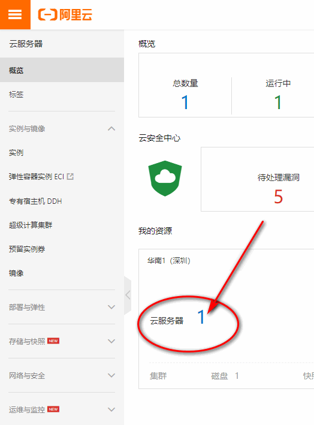
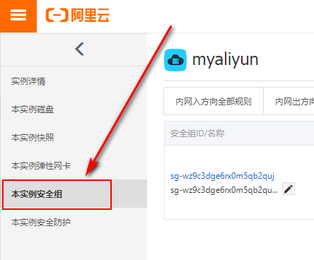
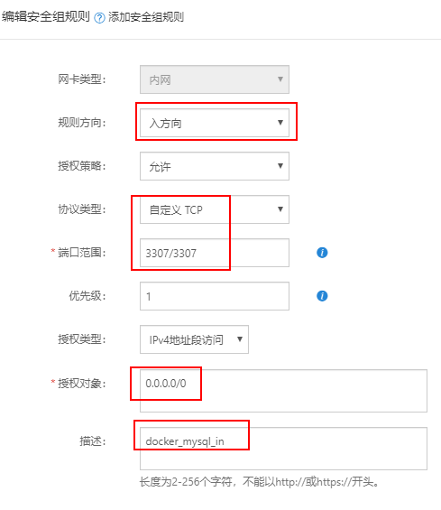

查看MySQL镜像：

```
docker search mysql
```

1、拉取MySQL5.7.28镜像（大小437M）

```
docker pull mysql:5.7.28
```

如果要查看 MySQL Community Server 最新版本，这个链接有最新版本号：
[MySQL Community Downloads](https://dev.mysql.com/downloads/mysql/)

注：如果镜像下载慢按以下步骤配置加速器，分分钟下载完毕：
[centos7将docker的仓库改为aliyun的镜像仓库](https://jingyan.baidu.com/article/9989c7468251caf648ecfe87.html)

2、查看MySQL镜像

```
docker images
```

3、运行docker容器，设置ROOT用户密码
外网建议设置复杂一些的密码

```
docker run --name mysql5.7 -p 3307:3306 -v /data/mysql/datadir:/var/lib/mysql -v /data/mysql/conf.d:/etc/mysql/conf.d -e MYSQL_ROOT_PASSWORD=123456 -d mysql:5.7.28
```

参数说明：
–name mysql5.7 容器别名
-p 3307:3306 端口映射（本机3307端口映射容器3306端口）
-v /data/mysql/datadir:/var/lib/mysql 目录映射（mysql数据目录）
-v /data/mysql/conf.d:/etc/mysql/conf.d 目录映射（mysql配置目录）
-d 后台运行

4、创建自定义用户和数据库
首先进入容器

```
docker exec -it mysql5.7 bash
```

登录root用户

```
mysql -uroot -p123456;
```

上面这两个命令可以通过alias别名简化。

```
vim ~/.bashrc
```

加入一行：

```
alias sql='docker exec -it mysql5.7 mysql -uroot -p123456'
```

编译生效

```
source ~/.bashrc
```

进入MySQL客户端后执行命令：

```
create user 'qingshan'@'%' identified by '123456';
flush privileges;

create database db0 DEFAULT CHARSET utf8mb4 COLLATE utf8mb4_general_ci;

grant all privileges on db0.* to 'qingshan'@'%' identified by '123456';


flush privileges;
```

8.0版本的授权语句不一样：

```
grant all privileges on *.* to 'qingshan'@'localhost' with grant option;
```

5、配置安全组规则允许外网访问
我的资源，进入ECS实例



从“管理”进入本实例安全组，配置规则



添加安全组规则
自定义TCP端口，3307

