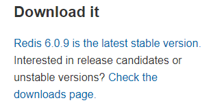

## 1、下载redis

下载地址在：redis.io 首页



如果从官网下载慢，可以把链接贴到迅雷下载，再传到虚拟机：

```
cd /usr/local/soft/
wget https://download.redis.io/releases/redis-6.0.9.tar.gz
```

## 2、解压压缩包

```
tar -zxvf redis-6.0.9.tar.gz
```

## 3、安装gcc依赖

Redis是C语言编写的，编译需要GCC。
Redis6.x.x版本支持了多线程，需要gcc的版本大于4.9，但是CentOS7的默认版本是4.8.5。
查看gcc的版本：

```
gcc -v
```

升级gcc版本：

```
yum -y install centos-release-scl

yum -y install devtoolset-9-gcc devtoolset-9-gcc-c++ devtoolset-9-binutils

scl enable devtoolset-9 bash

echo "source /opt/rh/devtoolset-9/enable" >>/etc/profile
```

确认gcc的版本（在同一个窗口中！）：

```
gcc -v
```

## 4、编译安装

```
cd redis-6.0.9/src
make install
```

安装成功的结果是src目录下面出现服务端和客户端的脚本
redis-server
redis-cli
redis-sentinel

## 5、修改配置文件

默认的配置文件是/usr/local/soft/redis-6.0.9/redis.conf
后台启动，不然窗口一关服务就挂了

```
daemonize no
```

改成

```
daemonize yes
```

下面一行必须改成 bind 0.0.0.0 或注释，否则只能在本机访问

```
bind 127.0.0.1 
```

如果需要密码访问，取消requirepass的注释，在外网（比如阿里云）这个必须要配置！

```
requirepass yourpassword
```

## 6、使用指定配置文件启动Redis

```
/usr/local/soft/redis-6.0.9/src/redis-server /usr/local/soft/redis-6.0.9/redis.conf
```

查看端口是否启动成功：

```
netstat -an|grep 6379
```

## 7、进入客户端

```
/usr/local/soft/redis-6.0.9/src/redis-cli
```

## 8、停止redis（在客户端中）

```
redis> shutdown
```

或

```
ps -aux | grep redis
kill -9 xxxx
```

## 9、配置别名的步骤

```
vim ~/.bashrc
```

添加两行：

```
alias redis='/usr/local/soft/redis-6.0.9/src/redis-server /usr/local/soft/redis-6.0.9/redis.conf'
alias rcli='/usr/local/soft/redis-6.0.9/src/redis-cli'
```

编译生效：

```
source ~/.bashrc
```

这样就可以用`redis`启动服务，`rcli`进入客户端了