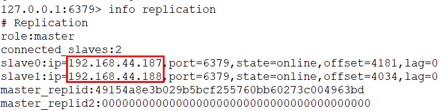

安装一个Redis服务之后，可以克隆出来3台机器，避免重复安装。

开启哨兵模式，至少需要3个Sentinel实例（奇数个，否则无法选举Leader）。
本例通过3个Sentinel实例监控3个Redis服务（1主2从）。

```
IP地址	          节点角色&端口
192.168.44.186	Master：6379 / Sentinel : 26379
192.168.44.187	Slave ：6379 / Sentinel : 26379
192.168.44.188	Slave ：6379 / Sentinel : 26379
```

**防火墙记得关闭！！!**

网络结构图：


在187和188的redis.conf配置中找到被注释的这一行

```
# replicaof <masterip> <masterport>
replicaof 192.168.44.186 6379
```

在186、187、188创建sentinel配置文件（单例安装后根目录下默认有sentinel.conf，可以先备份默认的配置）

```
cd /usr/local/soft/redis-6.0.9
mkdir logs
mkdir rdbs
mkdir sentinel-tmp
cp sentinel.conf sentinel.conf.bak
>sentinel.conf
vim sentinel.conf
```

sentinel.conf配置文件内容，三台机器相同

```
daemonize yes
port 26379
protected-mode no
dir "/usr/local/soft/redis-6.0.9/sentinel-tmp"
sentinel monitor redis-master 192.168.44.186 6379 2
sentinel down-after-milliseconds redis-master 30000
sentinel failover-timeout redis-master 180000
sentinel parallel-syncs redis-master 1
```

配置解读：

| 配置                              | 作用                                                         |
| --------------------------------- | ------------------------------------------------------------ |
| protected-mode                    | 是否允许外部网络访问，yes不允许                              |
| dir                               | sentinel的工作目录                                           |
| sentinel monitor                  | sentinel监控的redis主节点                                    |
| down-after-milliseconds（毫秒）   | master宕机多久，才会被Sentinel主观认为下线                   |
| sentinel failover-timeout（毫秒） | 1 同一个sentinel对同一个master两次failover之间的间隔时间。2. 当一个slave从一个错误的master那里同步数据开始计算时间。直到slave被纠正为向正确的master那里同步数据时。3.当想要取消一个正在进行的failover所需要的时间。 4.当进行failover时，配置所有slaves指向新的master所需的最大时间。 |
| parallel-syncs                    | 这个配置项指定了在发生failover主备切换时最多可以有多少个slave同时对新的master进行 同步，这个数字越小，完成failover所需的时间就越长，但是如果这个数字越大，就意味着越 多的slave因为replication而不可用。可以通过将这个值设为 1 来保证每次只有一个slave 处于不能处理命令请求的状态。 |

在3台机器上分别启动Redis和Sentinel

```
cd /usr/local/soft/redis-6.0.9/src
./redis-server ../redis.conf
./redis-sentinel ../sentinel.conf
```

哨兵节点的另一种启动方式：

```
./redis-server ../sentinel.conf --sentinel
```

在3台机器上查看集群状态：

```
$ /usr/local/soft/redis-6.0.9/src/redis-cli
redis> info replication
```



模拟master宕机，在186执行：

```
redis> shutdown
```

注意看sentinel.conf里面的redis-master被修改了，变成了当前master的IP端口。

```
$ /usr/local/soft/redis-6.0.9/src/redis-cli
redis> info replication
```

这个时候会有一个slave节点被Sentinel设置为master。
再次启动master，它不一定会被选举为master。


slave宕机和恢复测试省略。

**注意遇到了坑：**
1. slave可以显示master信息，而master没有slave信息。
2. master宕机后slave没有被提升为master。

可能有几个主要原因：
1. master信息配置不正确。
2. 还有需要配置auth-pass。