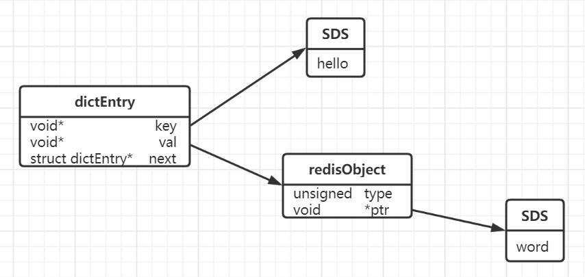

## 存储类型

- 字符串

- 整数

- 浮点数


## 操作命令

**设置/获取1个值**

```
set key value
get key
```


**设置/获取多个值**

```
mset key1 value1 key2 value2
mget key1 key2
```


**设置值，如果key存在，则设置不成功**

```
setnx key 
```

可以通过这个来实现分布式锁。用`del key`来释放锁


**值递增**

```
incr key
incrby key value
```


**值递减**

```
decr key
decr key value
```


**浮点数增量**

```
set f 2.6 
incrbyfloat f 7.3
```


**获取值得长度**

```
strlen key
```


**字符串追加内容**

```
append key value
```


**获取指定范围的字符串**

```
getrange key 0 8
```


## 应用场景

### 缓存

可以提高热点数据的访问速度


### 数据共享分布式

因为Redis是分布式的独立服务，可以在多个应用之间共享。

例如：分布式Session

```
<dependency>
	<groupId>org.springframework.session</groupId>
    <artifactId>spring-session-data-redis</artifactId>
</dependency>
```


### 分布式锁

使用setnx命令，只有不存在的时候才能添加成功，返回true


### 全局ID

INT类型，INCRBY，利用原子性

```
incrby userid 1000
```


### 计数器

INT类型，INCR方法

例如：文章的阅读量，微博的点赞数，允许一定的延迟，先写入Redis在定时同步到数据库


### 限流

INT类型，INCR方法

以访问者的IP和其他信息作为key，访问一次增加一次计数，超过次数则返回false


### 位统计

BITCOUNT

字符是以8位二进制存储的

```
set k1 a
setbit k1 6 1 		//在第6位插入1  c
setbit k1 7 0 		//在第7位插入0  b
get k1  			//b
```

- a对应的ASCII码是97，转换成二进制就是01100001
- b对应的ASCII码是98，转换成二进制就是01100010


因为bit非常的节省空间（1MB=8388608 bit），所以可以用来做大数据量的统计。

例如：在线用户的统计，留存用户的统计

```
setbit onlineusers 0 1
setbit onlineusers 1 1
setbit onlineusers 2 0
```


支持按位与、按位或等等操作

```
BITOP AND destkey key [key ...] 	//对一个或多个key求逻辑并，并将结果保存到destkey。
BITOP OR destkey key [key ...] 		//对一个或多个key求逻辑或，并将结果保存到destkey。
BITOP XOR destkey key [key ...] 	//对一个或多个 key 求逻辑异或，并将结果保存到destkey。
BITOP NOT destkey key 				//对给定key求逻辑非，并将结果保存到destkey。
```

计算7天在线的用户

```
BITTOP "AND" "7_days_both_online_users" "day_1_online_users" "day_2_online_users" ... "day_7_online_users"
```


## 存储原理

### 数据模型

​	`set hello word`为例，因为Redis是kv的数据库，它是通过hashtable来实现的（一般我们成为外层hash）。所以每个键值对都会有一个`dictEntry`（源码位置：dict.h）里面指向了key和value的执政。next指向下一个dictEntry。

```c
typedef struct dictEntry {
	void *key; /* key 关键字定义   */ 
    union {
		void *val;
        uint64_t u64; /* value  定义   */ 
        int64_t s64; 
        double d;
	} v;
	struct dictEntry *next; /*   指向下一个键值对节点   */ 
} dictEntry;
```





- key是字符串，但是redis中没有直接使用C的字符数组，而是存在自定义的SDS（Simple Dynamic String 简单动态字符串）中
- value，既不是直接作为字符串存储的，也不是直接存储在SDS中的，而是存储在redisObject中。

实际上五种常用的数据类型的任何一种，都是通过redisObject来存储的


### redisObject

redisObject定义在src/server.h文件中

```c
typedef struct redisObject {
    unsigned type:4; /*   对象的类型，包括：OBJ_STRING、OBJ_LIST、OBJ_HASH、OBJ_SET、OBJ_ZSET  */
    unsigned encoding:4;  /*   具体的数据结构   */
    unsigned lru:LRU_BITS; /* 24 位，对象最后一次被命令程序访问的时间，与内存回收有关   */
    int refcount; /*   引用计数。当 refcount  为 0 的时候，表示该对象已经不被任何对象引用，则可以进行垃圾回收了 */
    void *ptr;  /*   指向对象实际的数据结构   */ 
} robj;
```


可以使用`type`命令来查看对外的类型

```
type key
```


### 字符串类型的内部编码：

1. int，存储8个字节的长整形（long, 2^63-1)
2. embstr，代表embstr格式的SDS，存储小于44个字节的字符串。
3. raw，存储大于44个字节的字符串

#### 问题

##### 1. 什么是SDS？

Redis中字符串的实现。

在3.2以后的版本中，SDS由由多种结构（sds.h): 用于存储不同的长度的字符串

- sdshdr5：2^5 = 32byte
- sdshdr8：2^8 = 256byte
- sdshdr16：2^32 = 64kb
- sdshdr32：
- sdshdr64：


##### 2.为什么Redis要用SDS实现字符串？

​	首先，c语言中是没有字符串类型的（只能通过字符数据char[]实现）

1. 使用字符数组必须要先给目标变量分配足够逇空间，否则会溢出
2. 如果要获取字符长度，必须遍历字符数组，时间复杂度为O(n)
3. c字符串的长度变更会需要重新分配存储
4. 通过从字符串开始到结尾第一个`‘\0’`来标记字符串的结束，因此不能存图片、音频、视频、压缩文件等二进制保存的内容


SDS的特点：

1. 不用担心内存溢出的问题，如果需要会对SDS进行扩容
2. 获取字符串长度复杂度为O(1)，因为定义了len属性
3. 通过“空间预分配”和“惰性空间释放”，防止多次重新分配内存
4. 判断是否结束的标志是len属性


##### 3.embstr和raw的区别？

​	embstr的使用值分配一次内存空间（因为RedisObject和SDS是连续的），而raw需要分配两次内存空间（RedisObject和SDS内存不连续）

​	所以和raw相比，embstr的好处在于创建的时候少一次分配空间，删除的时候少一次释放空间，对象中的所有数据连在一起，方便查找

​	同时与raw相比，embstr的坏处在于因为embstr是只读的，所以只要对它进行修改就需要转换成raw，就会需要重新分配redisObject和sds的空间。


##### 4.int和embstr什么时候转换成raw？

​	当int类型的数据不在是整数的时候，或者操作long的范围时，自动转换为embstr


##### 5.明明没有超过阈值，为什么变成了raw？

​	对于embstr，由于这个是只读的，所以在对embstr对象进行修改的时候都会转换成raw再进行修改。因此只要进行过修改的embstr对象，修改后的对象一定是raw的，无论是否已经达到了44个字节


##### 6.当长度小于阈值，会还原吗？

​	Redis内部变化的转换，符合一下规律：编码装换在Redis写入数据时完成，且转换过程不可逆，只能从小内存编码到大内存编码（不包括重新set）


##### 7. 为什么要对底层的数据结构进行一层包装呢？

​	通过封装，可以根据对象的类型动态的选择存储结构和可以使用的命令，实现节省空间和优化查询速度