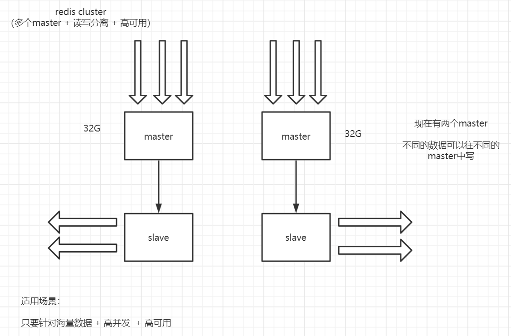
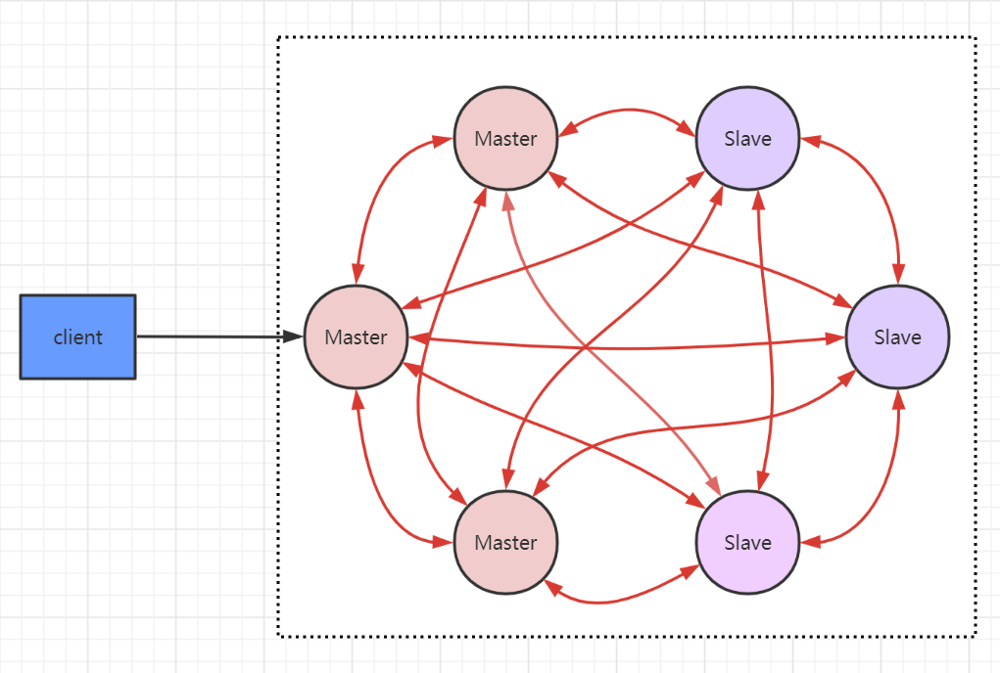
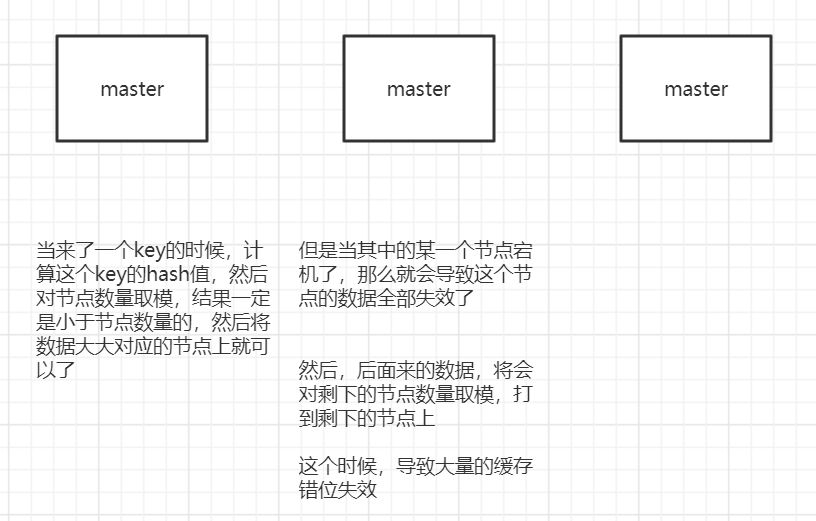
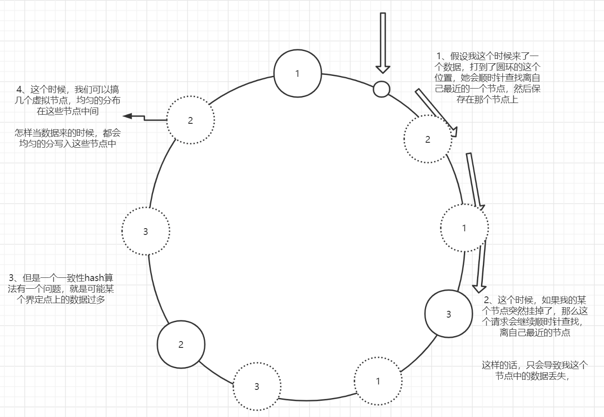
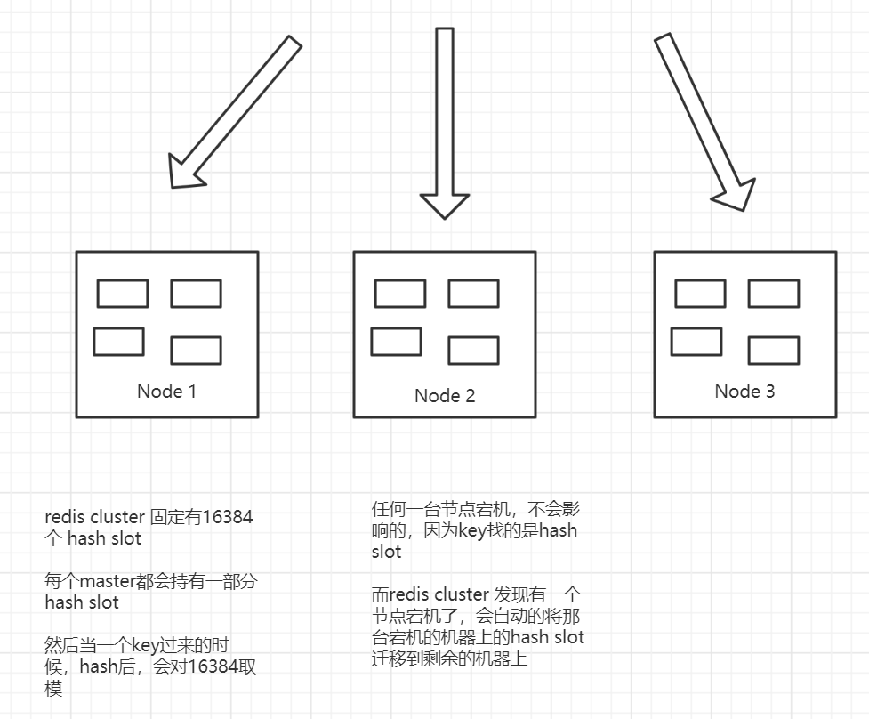

Redis 主从复制+Sentinel的这种方式，没有办法实现数据的水平扩容。	

Redis Cluster是在Redis 3.0 版本正式推出的，用来解决分布式的需求，同时可以实现高可用。它是去中心化的，客户端可以连接到任意一个可用的节点。





​	数据分片的问题：

	1. 数据怎么相对均匀的分片
 	2. 客户端怎么访问到响应的节点和数据
 	3. 重新分片的过程，怎么保证正常服务


## 1. Redis Cluster的架构

​	Redis Cluster可以看成是多个Redis实例组成的数据集合。客户端不需要关注数据的子集到底存储在哪个节点上，只需要关注整个集合。

​	以3主3从为例，节点之间两两交互，共享数据分片、节点状态等信息





## 2. 数据的分布

### 2.1 哈希取模

​	例如：hash(key)%N，根据余数，决定映射到哪个节点。这种方式比较简单，属于静态的分片规则。但是一旦节点数量发生变化，新增或者减少，由于取模的N发生变化，数据需要重新分布。





### 2.2 一致性hash

​	把所有的哈希值空间组成一个虚拟的环（哈希环），整个空间按顺时针方向组织。因为是环形空间，0和2^32-1是重叠的。





​	一致性哈希解决了动态增减节点时，数据都需要重新分布的问题，它只会影响到下一个相邻的节点，对其他节点没有影响。


​	同时，如上图一致性哈希有一个问题，当节点数量比较少的时候，会导致数据不能得到均匀的分布。解决方案就是引入虚拟节点


### 2.3 Redis 虚拟槽分区

​	在Redis即没有用哈希取模，也没有用一致性hash，而是用虚拟槽来实现了。

​	Redis创建了`16384`个槽（slot），每个节点负责一定区间的slot。





​	Redis的每个master节点维护一个16384位的位序列。比如：序列的第0位是1，就代表第一个slot就是它负责；序列的第1位是0，就代表第二个slot不是它负责。


​	对象分不到Redis节点上是，对key用CRC16算法在%16384，得到一个slot的值，数据落到负责的这个slot的Redis节点上。


​	查看key属于哪个slot：

```
redis>cluster keyslot k1
```

​	**注意：key和slot的关系是永远不会变的，变得只有是slot和redis节点的关系**


### 2.4 问题

#### 2.4.1 如何让相关的数据落到同一个节点上？

​	在key里面加入`{hash tag}`即可。Redis在计算槽编号的时候只会从`{}`之间的字符串进行槽编号的计算。只要`{}`里面的字符串是相同的，他们就可以被计算出相同的槽

```
127.0.0.1:7291>set a{qs}a 1
OK
127.0.0.1:7291>set a{qs}b 1
OK
127.0.0.1:7291>set a{qs}c 1
OK
127.0.0.1:7291>set a{qs}d 1
OK
127.0.0.1:7291>set a{qs}e 1
OK
```


#### 2.4.2 客户端连接到哪一台服务器？访问的数据不在当前节点怎么办？

```
127.0.0.1:7291>set k1 1
(error)MOVED 13724 127.0.0.1:7293
```

​	服务端返回MOVED，就是按照key计算出来的slot不归7291这个节点管理，而是属于7293这个节点，所以服务端返回告诉去7293这个节点操作。

​	这个时候需要跟换端口，用`redis-cli -p 7293`，才会返回OK，或者使用`./redis-cli -c -p prot` 的命令（c代表cluster）。这样客户端需要连接两次


​	Jedis等客户端会在本地维护一份slot——node的映射关系，大部分的时候不需要重定向，所以叫做Smart jedis


#### 2.4.3 新增或者下线了master节点，数据怎么迁移？

​	因为key和slot的关系是永远不会变得，当新增了节点的时候，需要把原有的slot分配给新的节点负责，并且把相关的数据迁移过来。

​	

​	1、添加新节点:

```
3 第一个ip:port 为需要添加的节点ip和端口，第二个ip:port为当前集群中的节点和端口
redis-cli --cluster add-node 172.26.237.83:7002 172.26.237.83:7000
```


​	2、新增的节点没有slot，不能分布数据，在原来的任意一个节点上执行：

```
# ip:port 为当前redis集群任意节点ip和port
redis-cli --cluster reshard 127.0.0.1:7291
```


​	3、输入需要分配的slot的数量

```
How many slots do you want to move (from 1 to 16384)? 1000
```


​	4、slot的来源 （两种方式：all或者节点id）

```
# 输入all 需要分配给目标节点的哈希槽来着当前集群的其他主节点
Source node #1: all

## 节点id
```


#### 2.4.4 只有主节点可以写，一个主节点挂了，从节点怎么变成主节点？（高可用主从切换原理）

​	当slave发现自己的master变为Fail状态时，会尝试进行failover，成为新的master。由于挂掉的master可能会有多个slave，从而存在多个slave竞争成为master的过程，具体过程如下：

1. slave发现自己的master变为Fail
2. 将自己记录的集群`currentEpoch`加1，并广播`FAILOVER_AUTH_REQUEST`信息
3. 其他节点受到该信息，只有master响应，判断请求的合法性，并发送`FAILOVER_AUTH_ACK`，对每一个epoch只发送一次ack
4. 尝试failover的slave收集`FAILOVER_AUTH_ACK`，超过半数后变成master


## 3. 总结

### 3.1 优势

1. 无中心架构
2. 数据按照slot存储分布在多个节点，节点之间数据共享，可以动态调整数据分布
3. 可扩展性：可线性扩展到1000个节点（官方推荐不超过1000个），节点可以动态添加和删除
4. 高可用：部分节点不可用时，集群仍可用。通过增加slave做standby数据副本，能够实现故障自动failover，节点之间通过gossip协议交换状态信息，用投票机制完成slave到master的角色提升。
5. 降低运维成本


### 3.2 不足

1. client实现复杂，驱动要求实现smart client，缓存slot mapping信息并及时更新，提高了开发难度，客户端的不成熟影响业务的稳定性
2. 节点会因为某些原因发生阻塞（阻塞时间大于`cluster-node-timeout`），被判断下线，这个failover是没有必要的
3. 数据通过异步复制，不能保证数据的强一致性
4. 多个业务使用同一套集群时，无法根据统计区分冷热数据，资源隔离性较差，容易出现相互影响的情况。

