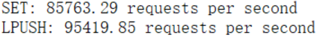
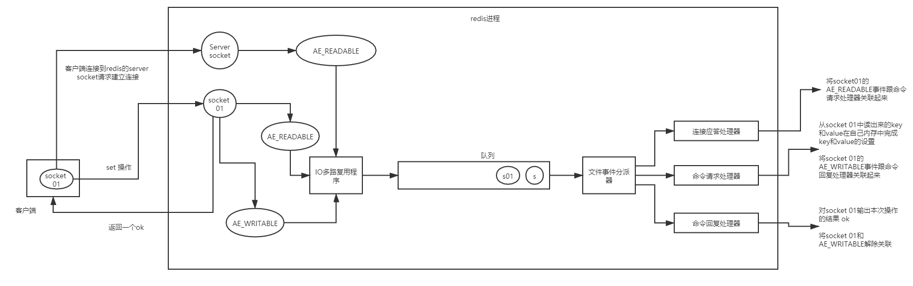

## 1. Redis到底有多快？

我们可以先进行测试看看redis到底有多快，具体命令可以查看[官网](https://redis.io/topics/benchmarks)

```
redis-benchmark -t set,lpush -n 100000 -q
```

结果：（个人阿里云服务器）





- 每秒处理8w多次的set请求
- 每秒处理9w多次的lpush请求


```
redis-benchmark -n 100000 -q script load "redis.call('set','foo','bar')"
```


- 每秒处理接近9w次lua脚本调用


## 2. Redis为什么这么快？

​	先给结论：

1. 纯内存结构
2. 单线程
3. 多路复用

### 2.1 内存

​	KV结构的内存数据库，时间复杂度O(1)


### 2.2 单线程

1. 没有创建线程、销毁线程带来的开销
2. 避免了上下文切换导致的cpu消耗
3. 避免了线程之间带来的竞争问题


### 2.3 多路复用

​	异步非阻塞I/0，多路复用处理并发连接


## 3. Redis为什么是单线程的？

​	[官网FAQ](https://redis.io/topics/faq) # Redis is single threaded. How can I exploit multiple CPU / cores?

​	因为单线程已经够用了，redis的瓶颈最有可能的是内存或者网络带宽，而不是cpu。而且单线程容易实现，所以就采用了单线程


### 4. I/O多路复用

​	I/O：指的是网络I/O

​	多路：指的是多个TCP连接（socket或者channel）

​	复用：指的是复用一个或多个线程




​	客户端在操作的时候，会产生具有不同时间类型的socket。

​	服务端，I/O多路复用程序会将消息放到队列中，然后通过文件时间分派器，转发给不同的事件处理器中

