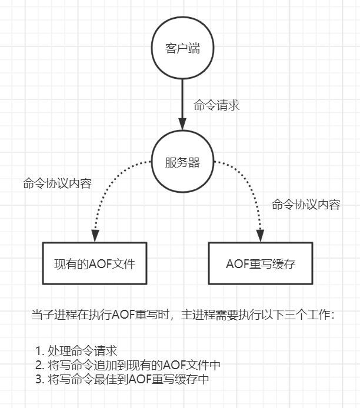

​	Redis速度快的很大一部分原因是因为它所有的数据都存储在内存中。这样会存在一定的问题，如果发生断电或者宕机，内存中的数据都会丢失。为了实现重启后数据不丢失，Redis提供了两种持久化的方案：

1. RDB快照
2. AOF(Append Only File)


## 1. RDB

​	RDB是Redis默认的持久化方案，当满足一定条件的时候，会把当前内存中的数据生成一个快照文件dump.rdb 写入到磁盘中。当Redis重启的时候会加载这个文件来实现数据恢复。


### 1.1 RDB的触发

#### 1.1.1 自动触发

1. 配置规则触发

   redis.conf，SNAPSHOTTING，其中定义了触发吧数据保存到磁盘的触发频率

   ```
   save 900 1		# 900秒内至少有一个key被修改
   save 300 10		# 400秒内至少有10个key被修改
   save 60 10000	# 60秒内至少有10000个key被修改
   ```

   如果不需要RDB方案，注释save后者配置成空字符串

   **注意：**上面的配置是不冲突的，只要满足任何一个都会触发


​	**RDB文件位置和目录：**

```
# 文件路径，默认在启动目录下（相对路径）
dir ./
# 文件名称
dbfilename  dump.rdb
# 是否是 LZF 压缩 rdb 文件， 会消耗一些cpu资源， 默认开启
rdbcompression yes
# 开启数据校验 
rdbchecksum yes
```


2. shutdown触发，正常关闭服务器
3. flushall，RDB文件是空的，没有什么意义


#### 1.1.2 手动触发

​	如果我们需要重启服务或者迁移数据，这个时候就需要手动触发RDB快照保存，Redis中提供了两个命令：

1. save：在生成快照的时候胡阻塞当前redis服务器，redis不能处理其他命令。如果内存中的数据比较多，会造成长时间的阻塞

2. bgsave：redis主进程会fork一个子进程，通过这个子进程来进行rdb操作，一般阻塞只会发生在fork阶段。

   

### 1.2 RDB文件的优势和劣势

#### 优势

1. RDB是一个非常紧凑的文件，它保存了redis在某个时间点上的数据集。这种文件非常适合用于进行备份和灾难恢复
2. 生成RDB文件的时候，redis主进程会fork一个子进程来处理所有的保存工作，主进程不需要进行任何磁盘IO操作
3. RDB在恢复大数据集的速度比AOF恢复的速度快


#### 劣势

1. RDB这种方式没有办法做到实时的持久化/秒级别的持久化。因为bgsave每次运行都要fork操作创建子进程，频繁执行的话成本比较高
2. 在一定间隔时间做一次备份，所以如果redis意外down掉的话，就会丢失最后一次快照之后的所有修改


## 2. AOF

​	AOF采用日志的形式来记录每个写操作，并追加到文件中。默认不开启。

​	Redis重启时会根据日志文件的内容把写指令从前到后执行一次完成数据的恢复工作


### 2.1 AOF配置

​	redis.conf

```
# 开关
appendonly no
# 文件名
appendfilename "appendonly.aof"
```


**数据都是实时持久化到磁盘的吗？**

​	由于操作系统的缓存机制，AOF数据并没有真正的写入到磁盘，而是进入了系统的硬盘缓存。


**什么时候吧缓冲区冲的数据写入到AOF文件？**

| 参数                 | 说明                                                         |
| -------------------- | ------------------------------------------------------------ |
| appendfsync everysec | AOF持久化策略，默认everysec<br />1. no：表示不执行fsync，由操作系统保证数据同步到磁盘，速度最快，但是不安全<br />2. always：表示每次写入都执行fsync，以保证数据实时同步到磁盘，效率低<br />3. everysec：表示每秒执行一次fsync，可能会导致丢失这1s数据。通常选择everysec，兼顾安全和效率。 |


**文件越来越大怎么办？**

​	由于AOF持久化是Redis不断将写命令追加到AOF文件中，这样会导致AOF文件不断变大。为了解决这个问题Redis提供了重写机制，当AOF文件的大小超过所设定的阈值就会触发这个机制对AOF文件中的内容进行压缩，只保留可以恢复数据的最小指令集。

​	可以使用`bgrewriteaof`命令来重写

​	AOF文件重写并不是对源文件进行重新整理，而是直接读取服务器现有的键值对，然后用一条命令去代替之前记录这个兼职对的很多条命令，生成一个新的文件然后去替换原来的AOF文件

```
# 重写触发机制
auto-aof-rewrite-percentage 100 
auto-aof-rewrite-min-size 64mb
```

- auto-aof-rewrite-percentage：aof自动重写配置，默认值100。当目前的aof文件大小超过上一次重写的aof文件大小的百分之多少进行重写。设置为100表示当前sof文件的大小是上次日志重写得到aof文件大小的两倍时，自动启动日志重写过程。
- auto-aof-rewrite-min-size：设置允许重写的最小aof文件大小，避免达到约定百分比但尺寸仍然很小的情况还要重写的情况。默认位64M


**重写的过程中AOF文件被更改了怎么办？**


​		


有两个相关的AOF参数：

- no-appendfsync-on-rewrite：在aof重写或者写入RDB文件的时候，会执行大量的IO，此时对于everysec和always的aof模式来说，执行fsync会造成阻塞时间过长。这个值，默认位no。如果对于延迟要求很高的引用来说，可以设置为yes。设置为yes表示rewrite期间对新的写命令不fsync，暂时存在内存中，等rewrite完成后再写入。建议修改成yes。
- aof-load-truncated：aof文件尾部的数据可能是不完整的。这个指令表示忽略最后一条可能存在问题的指令。默认为yes，当redis启动的时候，aof文件数据会被加载到内存中。当遇到不完整的数据的时候会log。如果为no，则恢复失败。


### 2.2 AOF文件的优势和劣势

#### 优势：

​	AOF持久化的方法提供了多种的同步频率，即使使用默认的同步频率每秒同步一次，redis最多也就丢失1秒的数据

#### 劣势：

1. 对于具有相同数据的redis，AOF文件通常会比RDB文件体积更大
2. 在高并发的情况下，RDB比AOF具有更好的性能保证


## 3. 两种方案比较

1. 如果可以忍受一小段时间内数据的丢失，使用RDB是最好的选择，定时生成RDB快照分厂便于进行数据备份，并且恢复速度也比AOF快。
2. 如果不能忍受数据的丢失就选择AOF。
3. 通常来说都是同时开启