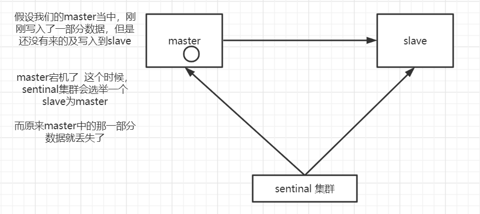

## 1. Redis主从复制

### 1.1 主从复制原理

#### 1.1.1 连接阶段

1. slave node 启动时，会在自己本地保存master node的信息，包括master node的hsot和ip
2. slave node 内部有个定时任务 replicationCron，每隔1秒钟检查是否有新的master node要连接和复制，如果有就和master node建立socket连接。连接成功后，slave node会为该socket连接建立一个专门处理复制工作的文件事件处理器，复制后续的复制工作。


#### 1.1.2 数据同步阶段

3. master node 第一次执行全量复制，通过bgsave命令在本地生成一个RDB快照，将这个快照发送给slave node（如果超时会重连，可以调大`repl-timeout`这个参数的值）
4. slave node会首先清除自己的旧数据，然后用RDB文件加载数据。


**如果在生成RDB文件期间，master接收到的命令如何处理？**

在开始生成RDB文件时，master会把所有新的写命令缓存在内存中。当slave node保存了RDB文件之后，再讲新的写命令复制给slave node


#### 1.1.3 命令传播阶段

5. master node 持续讲写命令，异步复制给slave node


延迟配置：

```
repl-disable-tcp-nodelay no
```

- 当设置为yes的时候，Tcp会对包进行合并从而减少带宽，但是发送的频率会降低，从节点数据延迟增加，一致性变差。具体发送频率和Linux内核有关，默认为40ms。
- 当设置为no的时候，Tcp会立马将主节点的数据发送给从节点，带宽增加但延迟减少


​	如果从节点有一段时间与主节点断开了连接，要不要重新进行全量复制？

​	当从节点重新连接后，不会进行全量复制，而是进行增量复制。具体从什么地方开始复制，会有一个偏移量`master_repl-offset`记录。

​	可以通过下面的命令查看：

```
redis>info replication
```


#### 1.1.4 总结


### 1.2 主从复制的不足

1. RDB文件过大的情况下，同步非常耗时
2. 在一主一从或者一主多从的情况下，如果主服务器挂掉后，就不可对外提供服务了。


## 2. Sentinel

### 2.1 Sentinel原理

​	从Redis 2.8 版本开始，提供了一个稳定版本的Sentinel（哨兵），用来解决高可用问题。它是一个特殊状态的redis实例。

​	具体可以查看：[官方文档](https://redis.io/topics/sentinel)

​	我们会启动一个或者多个Sentinel服务，它本质上知识一个运行在特殊模式下的Redis，Sentinel通过`info`命令得到被监控Redis服务的master和slave的信息


​	一般来说为了保证监控服务的可用性，我们也会对Sentinel做集群的部署。Sentinel即监控所有的Redis服务，同时，Sentinel之间也会相互监控。

​	**注意：Sentinel本身没有主从之分，只有Redis节点有主从之分**


#### 2.1.1 服务下线

​	Sentinel默认每秒钟向Redis服务节点发送一次Ping命令，如果在`down-after-milliseconds`内没有收到回复，Sentinel会将该服务标记为下线（<font color='red'>主观下线</font>）

​	sentinel.conf配置：

```
sentinel down-after-milliseconds <master-name> <milliseconds>
```

​	这个时候Sentinel节点会继续询问其他Sentinel节点，确认这个节点是否下线。如果多数的Sentinel节点都认为这个节点下线（<font color='red'>客观下线</font>）


#### 2.1.2 故障转移

​	如果master被标记为下线，就需要进行故障转移。

​	故障转移的第一步是在Sentinel集群中选择一个Leader，由这个Leader完成故障转移的流程。

​	Sentinel通过`Raft算法`，实现Sentinel的Leader选举的。


**故障流程：**

1. 选出Leader之后，由Sentinel Leader向某个节点发送 `slaveof no one`命令，让它成为独立节点
2. 然后向其他节点发送`slaveof x.x.x.x xxxx`(独立节点的地址和端口)，让其他节点成为这个独立节点的子节点。完成故障转移


**master节点的选举因素**：

1. 如果与哨兵连接断开的比较久，超过了某个阈值，直接失去选举权
2. 如果拥有选举权，看谁的优先级高，这个在配置文件中可以设置（`replica-priority 100`），数值越小优先级越高
3. 如果优先级相同，就看哪个节点从master中复制的数据最多（偏移量最大的那个），选最多的
4. 如果复制量相同，就选进程id最小的那个


### 2.2 Raft算法

​	在分布式存储系统中，通常通过维护多个副本来提高系统的可用性，那么多个节点之间必须要面对数据一致性的问题。Raft的目的就是通过复制的方式，使所有的节点达成一致。

​	Raft是一个共识算法（consensus algorithm）。比如比特币之类的加密货币，就需要共识算法。在Spring cloud的注册中心解决方案Consul也用到了Raft。

​	Raft的核心思想：先到先得，少数服从多数

​	[Raft算法演示](http://thesecretlivesofdata.com/raft/)


​	Sentinel 的Raft算法和Raft论文略有不同：

1. master客观下线触发选举，而不是过了election timeout时间开始选举
2. Leader 并不会吧自己成为Leader的消息发送给其他Sentinel。其他Sentinel的带Leader从slave选出master后，检测到新的master工作后，就会去掉客观下线的标识，从而不需要进入故障转移流程。


### 2.3 Sentinel功能总结

- 监控：Sentinel会不断的检查主节点和从节点是否正常运行
- 通知：如果某个节点出了问题，Sentinel可以通过API发出通知
- 自动故障转移：如果主节点发生故障，Sentinel可以启动故障转移。把某个从节点升级为主节点，并发出通知
- 配置管理：客户端连接到Sentinel，获取当前Redis主节点的地址


### 2.4 Sentinel的不足

1、 主从切换的过程中会丢失数据





2、没有解决水平扩容的问题


3、集群如果发生脑裂，导致数据丢失的问题


### 2.5 Sentinel连接使用

​	1、 Jedis连接Sentinel

```java
private static JedisSentinelPool createJedisPool() {
	String masterName = "redis-master";
    Set<String> sentinels = new HashSet<String>();
    sentinels.add("192.168.8.203:26379");
    sentinels.add("192.168.8.204:26379");
    sentinels.add("192.168.8.205:26379");
    pool = new JedisSentinelPool(masterName, sentinels);
    return pool;
}
```


​	2、 Spring Boot连接Sentinel

```properties
spring.redis.sentinel.master=redis-master
spring.redis.sentinel.nodes=192.168.8.203:26379,192.168.8.204:26379,192.168.8.205:26379
```


无论是Jedis还是Spring Boot（2.x版本默认的是Lettuce），都需要配置全部的哨兵地址


### 2.6 Sentinel获取连接原理

Jedis连接Sentinel的时候，我们配置的是全部哨兵的地址。Sentinel是如何返回可用master地址的呢？


构造方法：

```java
pool = new JedisSentinelPool(masterName, sentinels);
```


调用了：

```java
HostAndPort master = initSentinels(sentinels, masterName);
```


initSentinels源码：

```java
private HostAndPort initSentinels(Set<String> sentinels, final String masterName) {
	HostAndPort master = null; 
    boolean sentinelAvailable = false;

    log.info("Trying to find master  from available Sentinels..."); 
    // 有多个 sentinels,遍历这些个 sentinels
	for (String sentinel : sentinels) {
		// host:port 表示的 sentinel 地址转化为一个 HostAndPort  对象。
        final HostAndPort hap = HostAndPort.parseString(sentinel);
		
        log.fine("Connecting to Sentinel " + hap);
        
        Jedis jedis = null;
		try {
			//连接到 sentinel
			jedis = new Jedis(hap.getHost(), hap.getPort());
			// 根据 masterName 得到 master 的地址，返回一个 list，host= list[0], port =// list[1]
            List<String> masterAddr = jedis.sentinelGetMasterAddrByName(masterName);
			
            // connected to sentinel... 
            sentinelAvailable = true;
            
			if (masterAddr == null || masterAddr.size() != 2) {
				log.warning("Can not get master addr, master name: " + masterName + ". Sentinel: " +  hap + ".");
				continue;
            }
			//   如果在任何一个 sentinel 中找到了 master，不再遍历 
            sentinels master = toHostAndPort(masterAddr);
			log.fine("Found Redis master at " +  master);
            break;
		} catch (JedisException e) {
			// resolves #1036, it should handle JedisException there's  another chance 
            // of raising JedisDataException
			log.warning("Cannot get master address from sentinel running @ " + hap + ". Reason: " + e + ". Trying next one.");
		} finally {
			if (jedis !=  null) { 
                jedis.close();
			} 
        }
	}
    
    //到这里，如果 master为 null，则说明有两种情况，一种是所有的 sentinels 节点都 down 掉了，一种是 master 节点没有被存活的 sentinels 监控到
	if (master  == null) { 
        if (sentinelAvailable) {
			// can connect to sentinel, but master  name  seems  to not 
            // monitored
			throw new JedisException("Can connect to sentinel, but " + masterName + " seems  to be not monitored...");
		} else {
			throw new JedisConnectionException("All sentinels down, cannot determine where is " + masterName + " master  is running...");
		}
    }
    
	// 如果走到这里，说明找到了 master  的地址
	log.info("Redis master running at " +  master + ", starting Sentinel listeners...");

    // 启动对每个 sentinels 的监听为每个 sentinel 都启动了一个监听者 MasterListener。MasterListener 本身是一个线 程，它会去订阅 sentinel 上关于 master 节点地址改变的消息。
	for (String sentinel : sentinels) {
		final HostAndPort hap = HostAndPort.parseString(sentinel);
		MasterListener masterListener = new MasterListener(masterName, hap.getHost(), hap.getPort());
        
        // whether MasterListener threads are  alive  or not, process can be  stopped
		masterListener.setDaemon(true);
		masterListeners.add(masterListener);
		masterListener.start();
    }
	return master; 
}
```

