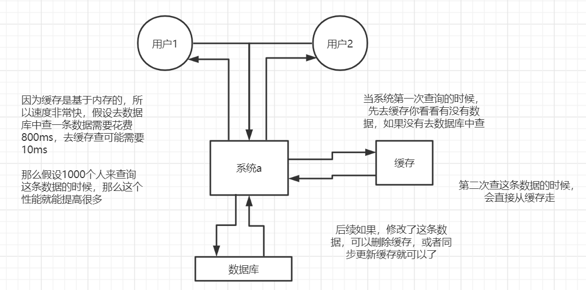
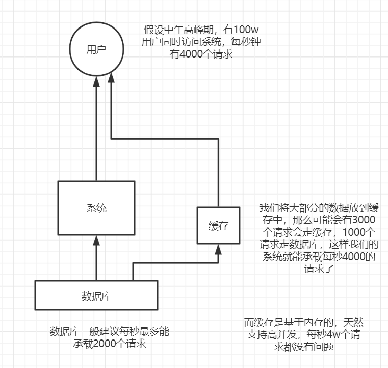

## 1. 为什么要使用缓存

一般来说在针对读多写少的高并发场景，我们会使用缓存来提升查询的速度。


1、缓存如何实现高性能





2、 缓存如何实现高并发





## 2. 一致性问题的定义

一般来说缓存的数据都是很少修改的，因为如果修改过多返回导致大部分情况无法命中缓存反而影响了性能。但是这个数据不是一直不变的，当某个缓存的数据发生变化了，我们既要操作数据库，又要操作Redis。这个时候就会有两种选择：

1. 先操作数据库，在操作Redis
2. 先操作Redis，在操作数据库


不管我们选择哪个方案，都要保证数据的一致性，也就是这个操作要么同时成功，要么同时失败。但是Redis和数据库这两个不可能通过使用事务来达到统一，所以我们需要根据应用场景和需求在数据一致性和性能之间权衡。


## 3 方案的选择

### 3.1 Redis：是删除还是更新？

​	更新的话，一旦更新失败就会导致数据不一致的情况。所以一般来说我们会直接删除缓存，因为这样的方式比较简单。


### 3.2 先更新数据库，再删除缓存

正常情况：

- 更新数据库成功，删除缓存失败


异常情况

1. 更新数据库失败，这个时候不会执行后续对redis的操作，所以不会出现数据不一致的情况
2. 更新数据库成功，删除缓存失败。数据库中的是新的数据，但是缓存中是旧数据，发生了不一致的情况。


当遇到上述情况，我们一般会提供一个<font color='red'>**重试的机制**</font> ：

比如删除缓存失败，我们可以捕获这个异常，然后把需要删除的key发送到消息队列中，然后创建一个消费者，再次尝试删除这个key


### 3.3 先删除缓存，再更新数据库

正常情况：

- 删除缓存成功，更新数据库失败


异常情况：

1. 删除缓存失败，捕获异常，不会执行下一步，不会发生数据不一致的情况
2. 删除缓存成功，更新数据库失败。因为以数据库的数据为准，所以也不会出现数据不一致的情况。


但是在并发的情况下可能会发生以下情况：

1、线程A需要更新数据，先删除Redis缓存成功

2、线程B这个时候来查询数据，发现Redis中没有数据，去数据库中查，将数据同步写入到了Redis中

3、线程A更新了数据库中的数据

这个时候Redis中的时候旧数据，但是数据库中的是新的数据。发生了数据不一致的情况。


这种问题的解决方案：<font color='red'>**延时双删**</font>

就是在更新数据库成功之后，再去删一次缓存。

伪代码演示：

```java
public void updateData(String key, Object data) {
    redis.delKey(key);
    db.updateData(data);
    Thread.sleep(500);
    redis.delkey(key);
}
```

