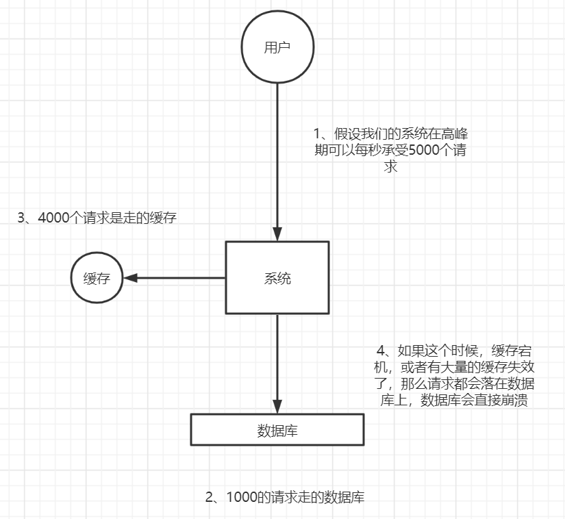
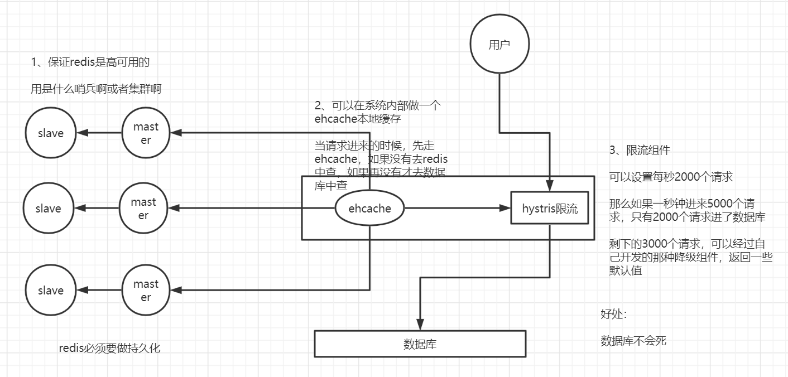
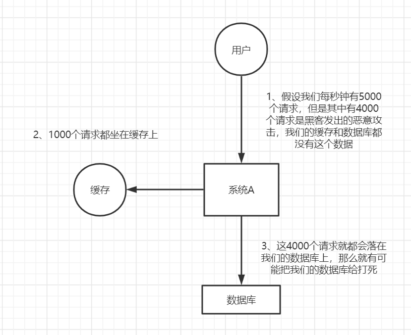
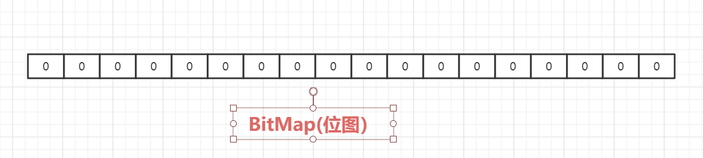
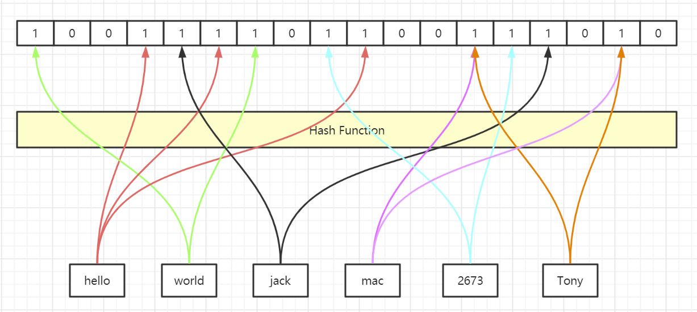
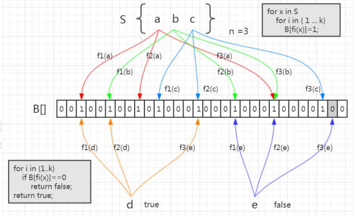
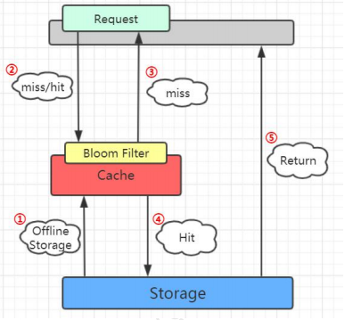

## 1. 缓存雪崩

### 1.1 什么是缓存雪崩

缓存雪崩就是Redis中的大量热点数据同时过期（失效），一般来说是因为设置了相同的过期时间，刚好这个时候Redis请求的并发量有很大，导致所有的请求都落到数据库上，导致数据库宕机。





### 1.2 缓存雪崩的解决方案

首先要保证Redis服务的高可用性：

1. 如果需要设置过期时间，设置不同的过期时间避免同时失效
2. 不要设置过期时间
3. 缓存定时预更新
4. 加锁或者限流，避免mysql宕机





## 2. 缓存穿透

### 2.1 什么是缓存穿透

大量的请求查询数据，但是这个数据在数据库和Redis中没有，可能是一次错误的查询。（一般常见于恶意请求）。导致大量的请求先去查了Reids，发现没有。又去查了一次数据库。





### 2.2 解决方案：

1、 针对如果查询的是同一个id的数据，可以在缓存中设置一个空置或者其他字符都可以。

2、如果针对不同的id，可以使用布隆过滤器。


### 2.3 布隆过滤器

​	针对缓存穿透这个问题，我们可以避免请求去数据库中查询不存在的数据。我们可以将已经存在的数据放到内存中，然后当请求来查询的时候我们现在内存中查询这个数据有没有，如果没有直接返回。一般数据库中的数据有很多，如果正常使用List、Map等数据结构，可能我们的内存根本不够用。

​	所以，我们需要一种非常简单的最节省空间的数据结构，用来标记这个数据到底有没有。这种数据结构我们一般称为位图。它是一个有序的数组，只有两个值，0和1。0代表不存在，1代表存在。


#### 2.3.1 位图





现在我们如何将数据库中所有的数据，映射到这个位图上呢？

我们需要有映射的方法


针对这个映射方法需要有几点要求：

1. 因为我们数据库中数据的长度是不固定的，但是我们希望得到固定长度的输出
2. 转换成下标的时候，我希望它在这个位图中能够均匀的分布


那么这个方式就是使用哈希函数了，比如MD5、SHA-1等





#### 2.3.2 哈希碰撞

如上图，我们发现mac 和 Tony计算后得到的hash值得一样的，这种一般我们成为hash碰撞。只要是用hash函数，hash碰撞是无法避免的。那肯定是对我们的服务有影响的，那么如何才能降低碰撞的概率呢？

1. 就是扩大数组的长度，也就是位图的容量。容量越大，hash分布的越均匀，发生碰撞的概率越小
2. 使用多层hash

但是数组的长度和hash的层数，肯定不是越多越好的。那么为了减少hash碰撞，我们到底需要多大的位图和多少层hash运算呢？

早 在1970年的时候，有一位叫做布隆的前辈就对此进行了研究，，并发表了一篇论文，提出了这个容器就叫做布隆过滤器。


#### 2.3.3 布隆过滤器的原理

布隆过滤器的本质就是一个位图和多个hash函数组成的。





如图：集合中有3个元素，将他存入位图，需要经过3次hash运算。 当我们判断这个值是否存在的时候，需要同样的三个hash函数计算。


**布隆过滤器的特性：**

因为hash碰撞不可避免，所以一定会存在误判的情况。

如果将不存在布隆过滤器中的元素判断为存在，我们成为假阳性（False Positive Probability， FPP)


#### 2.3.4 总结

从容器的角度来首：

1、 如果布隆过滤器判断元素在集合中存在，不一定存在

2、如果布隆过滤器判断元素在集合中不存在，那就一定不存在


从元素的角度来说：

1、如果元素实际存在，布隆过滤器一定判断存在

2、如果元素不存在，布隆过滤器可能判断存在


### 2.4 Guava实现布隆过滤器

在Guava中提供了一个现成的布隆过滤器

1、 引入

```
<dependency>
	<groupId>com.google.guava</groupId>
    <artifactId>guava</artifactId>
    <version>21.0</version>
</dependency>
```


2、创建布隆过滤器

```
BloomFilter<String> bf = BloomFilter.create(Funnels.stringFunnel(Charsets.UTF_8), insertions);
```


3、布隆过滤器提供的存放元素的方法是`put()`


4、布隆过滤器提供判断元素的是否存在的方法是`mightContain()`

```
if (bf.mightContain(data)) {
    if (sets.contains(data)) {
        //   判断存在实际存在的时候，命中 
        right++;
        continue; 
    }
    //   判断存在却不存在的时候，错误 
    wrong++;
}
```


3、 设置误判率（默认为0.03)，可以在创建的时候指定

```
public static <T> BloomFilter<T> create(Funnel<? super T> funnel, long expectedInsertions)  { 
	return create(funnel, expectedInsertions, 0.03D);
}
```


4、位图的容量是基于元素个数和误判率计算出来的

```
long numBits = optimalNumOfBits(expectedInsertions, fpp);
```


5、hash函数的个数，是根据位图数组的大小计算出来的

```
int numHashFunctions = optimalNumOfHashFunctions(expectedInsertions, numBits);
```


一般来说存储100w个元素值占用了0.87M的内存，生成了5个Hash函数，具体可以查看[文档](https://hur.st/bloomfilter/?n=1000000&p=0.03&m=&k=)


### 2.5 布隆过滤器在项目中的使用





因为要判断数据库中的值是否存在，所以第一步是加载数据库中所有的数据，然后再去Redis查询之前，先在布隆过滤器中查询，如果布隆过滤器说没有，那么数据库中肯定没有，也就不用查了。

