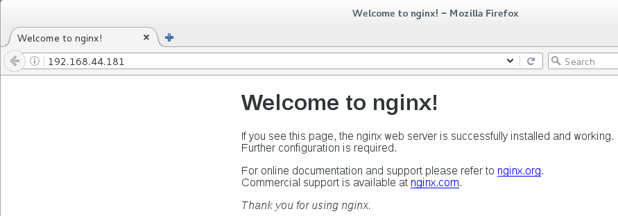

## 软件安装方式

同一个软件有很多种不同的安装方式，Linux操作系统中安装软件有几种常见方式：
1、源码编译安装：一般需要解压然后用make 、make install等命令，这种方式步骤比较复杂，编译时间长，而且结果不可控
2、RPM（RedHat Package Manager）是一个软件管理包，安装卸载变得简单了，但是无法解决软件包之间的依赖关系问题
3、YUM（Yellow dog Updater, Modified）是一个RPM的前端程序，可以自动解决软件的依赖关系。但是要注意版本的问题，默认从仓库中获取安装的不一定是最新版本
4、不需要安装只要配置环境变量的（解压就可以使用）

## 下载

地址从`http://nginx.org/en/download.html`复制

```
cd /usr/local/soft
wget http://nginx.org/download/nginx-1.18.0.tar.gz
```

## 解压

```
tar -xzvf nginx-1.18.0.tar.gz
```

## 安装依赖环境

gcc环境：基本运行环境
pcre：用于nginx的http模块解析正则表达式
zlib：用户进行gzip压缩
openssl：用于nginx https协议的传输

```
yum install -y gcc-c++ pcre pcre-devel zlib zlib-devel openssl openssl-devel
```

## 编译安装

–prefix=/usr/local/soft/nginx 的意思是把nginx安装到/usr/local/soft/nginx
所以后面会有一个源码目录nginx-1.18.0，一个编译安装后的目录nginx

```
cd /usr/local/soft/nginx-1.18.0
./configure --prefix=/usr/local/soft/nginx 
make && sudo make install
cd /usr/local/soft/nginx/
```

测试配置是否成功：

```
/usr/local/soft/nginx/sbin/nginx -t -c /usr/local/soft/nginx/conf/nginx.conf
```

## 启动Nginx

```
/usr/local/soft/nginx/sbin/nginx
```

浏览器直接访问IP（HTTP协议默认80端口，不需要输入）：


## copy vimfile

为了让VIM查看nginx配置文件时语法高亮，需要把相应文件copy到VIM目录。
先确定本机的vimfiles目录在哪个位置。

```
find / -name vimfiles
cd /usr/local/soft/nginx-1.18.0
cp -r contrib/vim/* /usr/share/vim/vimfiles/
```

## 常用命令

```
nginx -s reopen #重启Nginx

nginx -s reload #重新加载Nginx配置文件，然后以优雅的方式重启Nginx

nginx -s stop #强制停止Nginx服务

nginx -s quit #优雅地停止Nginx服务（即处理完所有请求后再停止服务）

nginx -t #检测配置文件是否有语法错误，然后退出

nginx -?,-h #打开帮助信息

nginx -v #显示版本信息并退出

nginx -V #显示版本和配置选项信息，然后退出

nginx -t #检测配置文件是否有语法错误，然后退出

nginx -T #检测配置文件是否有语法错误，转储并退出

nginx -q #在检测配置文件期间屏蔽非错误信息

nginx -p prefix #设置前缀路径(默认是:/usr/share/nginx/)

nginx -c filename #设置配置文件(默认是:/etc/nginx/nginx.conf)

nginx -g directives #设置配置文件外的全局指令

killall nginx #杀死所有nginx进程
```