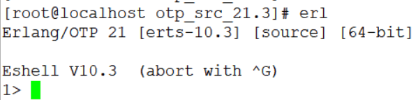
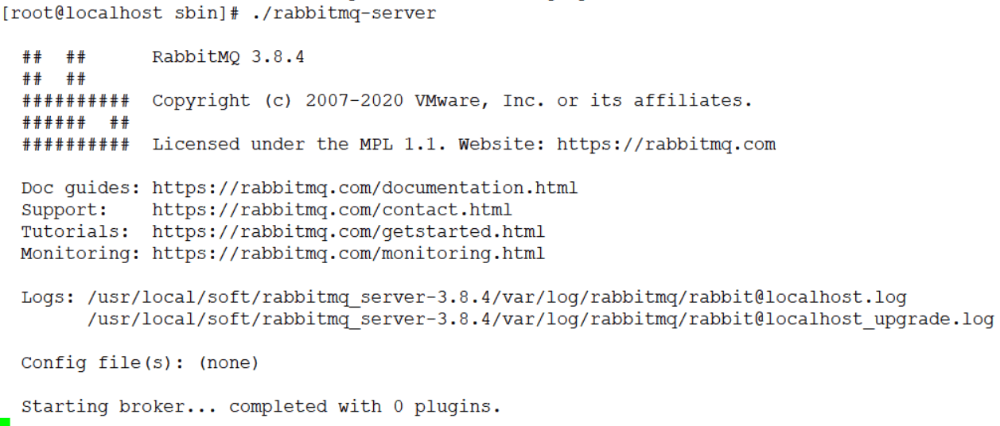
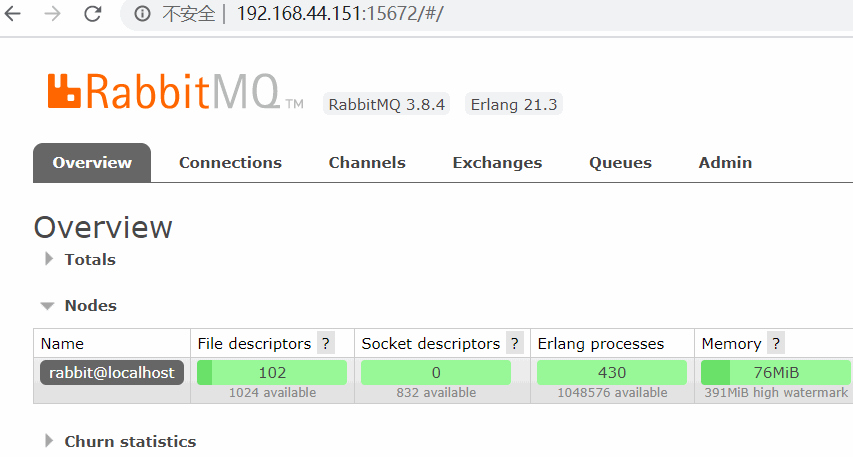

## 软件安装方式

同一个软件有很多种不同的安装方式，Linux操作系统中安装软件有几种常见方式：
1. 源码编译安装：一般需要解压然后用make 、make install等命令，这种方式步骤比较复杂，编译时间长，而且结果不可控
2. RPM（RedHat Package Manager）是一个软件管理包，安装卸载变得简单了，但是无法解决软件包之间的依赖关系问题
3. YUM（Yellow dog Updater, Modified）是一个RPM的前端程序，可以自动解决软件的依赖关系。但是要注意版本的问题，默认从仓库中获取安装的不一定是最新版本
4. 不需要安装只要配置环境变量的（解压就可以使用）

CentOS是RedHat的分支，所以rpm和yum都可以使用。


## 版本关系

在RabbitMQ中需要注意两点：
1、RabbitMQ依赖于Erlang，需要先安装Erlang
2、Erlang和RabbitMQ版本有对应关系
http://www.rabbitmq.com/which-erlang.html


## 安装Erlang 21.3

先安装一些必要的依赖：

```
yum -y install gcc glibc-devel make ncurses-devel openssl-devel xmlto perl wget
```

注意：因为每个人的操作系统环境是不一样的，缺少的依赖不同，根据提示安装即可。

https://www.erlang.org/downloads/21.3
如果下载太慢了，可以把地址贴到迅雷里面，下载到本机，再上传到虚拟机

```
wget http://erlang.org/download/otp_src_21.3.tar.gz
tar -xvf otp_src_21.3.tar.gz
cd otp_src_21.3
./configure --prefix=/usr/local/erlang
```

configure的过程如果有err，要解决依赖的问题。
如果有APPLICATIONS INFORMATION，DOCUMENTATION INFORMATION，没有影响。

```
make && make install
```

如果提示缺少socat

```
yum install -y socat
```


## 配置Erlang环境变量

```
vim /etc/profile
```

加入一行

```
export PATH=$PATH:/usr/local/erlang/bin
```

编译生效

```
source /etc/profile
```


## 验证Erlang是否安装成功

输入`erl`，会出现版本信息，即安装成功




## 安装RabbitMQ 3.8.4

https://github.com/rabbitmq/rabbitmq-server/releases

```
wget https://dl.bintray.com/rabbitmq/all/rabbitmq-server/3.8.4/rabbitmq-server-generic-unix-3.8.4.tar.xz
xz -d rabbitmq-server-generic-unix-3.8.4.tar.xz
tar -xvf rabbitmq-server-generic-unix-3.8.4.tar 
```


## 配置RabbitMQ环境变量

假设下载的目录在 /usr/local

```
vim /etc/profile
```

添加一行：

```
export PATH=$PATH:/usr/local/rabbitmq_server-3.8.4/sbin
```

编译生效

```
source /etc/profile
```


## 启动RabbitMQ

```
# 后台启动rabbitmq服务
cd /usr/local/soft/rabbitmq_server-3.8.4/sbin
./rabbitmq-server -detached
```

或者

```
./rabbitmq-server start
```

或者

```
service rabbitmq-server start
```

启动的常见问题是端口被占用，kill rabbitmq 重启即可

```
ps -ef | grep rabbit
kill -9 进程号
./rabbitmq-server start
```

看到兔子头像就启动成功了



## 添加其他用户

因为`guest`用户只能在本机访问，添加一个`admin`用户，密码也是`admin`

```
./rabbitmqctl add_user admin admin
./rabbitmqctl set_user_tags admin administrator
./rabbitmqctl set_permissions -p / admin ".*" ".*" ".*"
```


## RabbitMQ中的角色

### no

不能访问management plugin


### management

用户可以通过AMQP做任何事，同时还可以：

1. 列出自己可以通过AMQP登入virtual hosts
2. 查看自己的virtual hosts中的queues， exchanges和bindings
3. 查看和关闭自己的channels和connections
4. 查看有关自己的virtual hosts的“全局”的统计信息，包含其他用户在这些virtual hosts中的活动


### policymaker

management可以做的任何事外，还可以：

- 查看、创建和删除自己的virtual hosts所属的policies和parameters


### monitoring

management可以做的任何事外，还可以：

1. 列出所有virtual hosts，包括他们不能登录的virtual hosts
2. 查看其他用户的connnections 和 channels
3. 查看节点级别的数据，如：clustering和memroy使用情况
4. 查看真正的关于所有virtual hosts的全局的统计信息


### administrator

policymaker和monitoring可以做的任何事外，还可以：

1. 创建和删除virtual hosts
2. 查看、创建和删除users
3. 查看创建和删除permisssions
4. 关闭其他用户的connections


## 启用管理插件

```
./rabbitmq-plugins enable rabbitmq_management
```

访问：
http://虚拟机IP:15672




## RabbitMQ基本配置

RabbitMQ有一套默认的配置，能够满足日常开发需求，如果需要修改，需要自己创建一个配置文件

```
touch /etc/rabbitmq/rabbitmq.conf
```


[配置文件示例：](https://github.com/rabbitmq/rabbitmq-server/blob/master/deps/rabbit/docs/rabbitmq.conf.example)

[配置文件说明：](https://www.rabbitmq.com/configure.html#config-items)

