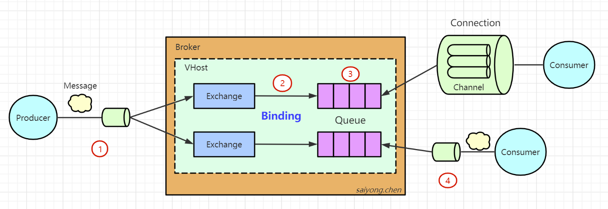

## 1、什么是可靠性投递

也就是我们在使用RabbitMQ实现异步通信的时候，消息丢了怎么办，消息重复消费了怎么办？


在RabbitMQ中提供了很多保证消息可靠性投递的机制，这也是RabbitMQ的一个特性。


但是首先我们要明确的一点就是效率和可靠性是无法兼得的。如果要保证每一个环节都要成功，必然会对消息的收发效率造成影响。所以对于一些业务的实时一致性要求不是很高的场合，我们可以相应的牺牲一些可靠性来换取效率。比如记录日志这种场景。


为了保证消息的可靠性，我们可以从RabbitMQ工作模型分析：




1、生产者将将消息发送到RabbitMQ Broker，生产者怎么知道自己的消息已经被Broker成功接受了

2、Exchange路由到Queue，如果消息没有被正确的路由到Queue该怎么处理

3、消息存储在Queue中，但是队列是一个独立运行的服务，有自己的数据库（Mnesia）。它是用来存储消息的。如果没有消费者来消费，消费者出现了问题了，消息会丢失，如何保证消息稳定的存储在队列中呢？

4、消费者消费消息，我们知道队列的特性是FIFO。队列中的消息是一条一条投递的，只要上一条消息被消费者接受以后，上一条消息被删除，然后投递下一条消息。那么Broker怎么知道消费者已经成功消费消息了?


## 2. 生产者发送消息到RabbitMQ服务器

在RabbitMQ中为了保证生产者可能因为网络或者Broker的问题导致消息没有正确的投递到RabbitMQ服务器，提供了两种服务端确认机制。

### 2.1 Transaction模式

需要把信道设置成事务模式，然后在进行消息的投递

```java
channel.txSelect();
```


如果消息投递成功，就会回调channel.txCommit();方法。


如果消息投递失败，我们可以进行将其捕获，并进行回滚或者再次发送这条消息。

```java
try{  
	//发送消息
}catch(Exception e){  
    channel.txRollback();  
   	//再次重试发送这条消息
}
```


但是事务模式有一个缺点，如果上一条消息没有被确认，就会一直处于阻塞状态。从而极大的影响了RabbitMQ的性能。一般不建议在生产模式中使用。


在SpringBoot中的设置：

```java
rabbitTemplate.setChannelTransacted(true);
```


### 2.2 Confirm模式

确认模式有三种方式：

#### 2.2.1 普通确认

生产者需要将信道设置为confirm模式

```java
channel.confirmSelect();
```


然后发送消息，一旦消息被投递到锁匹配的队列中之后。RabbitMQ就会发送一个确认（Basic.Ack）给生产者，也就是调用`channel.waitForConfirms();`方法返回true，这样生产者就知道消息被服务端接收了。


这种方式的缺点是，发送一条消息确认一条消息，效率还是不太高。


#### 2.2.2 批量确认

开启confirm模式后，发送一批消息，只要`channel.waitForConfirmsOrDie();`方法没有抛出异常，就代表消息都被服务端接收了。


批量确认的方式要比单条确认的方式效率高，但是会带来两个问题：

1. 批量数量的确定，对于不同的业务，到底发送多少条消息确认一次？
2. 如果有一条消息没有被成功接收，所有的消息都要重发


#### 2.2.3 异步确认 

异步确认需要添加一个ConfirmListener，并且用一个SortedSet来维护没有被确认的消息。


SpringBoot:

1、修改配置文件

```yaml
spring:
	rabbitmq:
		publisher-confirm-type: correlated
```


2、RabbitTemplate对Channel进行封装：

```java
rabbitTemplate.setConfirmCallback(new RabbitTemplate.ConfirmCallback() { 
    @Override
	public void confirm(CorrelationData correlationData, boolean ack, String cause) { 
        if (!ack) {
			System.out.println("发送消息失败：" +  cause);
            throw new RuntimeException("发送异常：" +  cause);
		}
    }
});
```


## 3. 消息从交换机到队列

如果路由键不正确，或者队列不存在。会导致消息没有办法正确的从交换机路由到队列。


一般对于这种通常有两种方式处理：重发消息和建立一个备份的交换机


### 3.1 重发消息

使用`mandatory`参数和`ReturnListener`（在Spring AMQP中是RenturnCallBack）

```java
// 如果消息没有路由到队列，需要将消息返回给发送方
rabbitTemplate.setMandatory(true);

//设置回调接口方法
rabbitTemplate.setReturnCallBack(new RabbitTemplate.ReturnCallBack() {
    
    /**
    * @param message    消息对象
    * @param replyCode  错误码 
    * @param replyText  错误信息 
    * @param exchange   交换机 
    * @param routingKey 路由键 
    */
    public void returnedMessage(Message message,
                               int replyCode,
                               String replyText,
                               String exchange,
                               String routingKey) {
        System.out.println("回发的消息：" + message);
        System.out.println("replyCode：" + replyCode);
        System.out.println("replyText:" + replyText);
        System.out.println("exchange:" + exchange);
        System.out.println("routingKey：" + routingKey);
    }
});
```


### 3.2 备份交换机

在创建交换机的时候，从属性中指定备份交换机

```java
Map<String,Object> arguments = new HashMap<String,Object>();
// 指定交换机的备份交换机 
arguments.put("alternate-exchange","ALTERNATE_EXCHANGE"); channel.exchangeDeclare("TEST_EXCHANGE","topic", false, false, false, arguments);
```


<font color='red'>**注意：队列可以指定死信交换机，交换机可以指定备份交换机**</font>


## 3. 消息存储在队列中

如果RabbitMQ的服务或者硬件发送故障，如：宕机、重启等等。可能会导致内存中的消息丢失。所以我们需要将消息本身和元数据（队列、交换机和绑定关系）持久化到磁盘。


### 3.1 队列持久化

```java
@Bean("TestQueue")
public Queue TestQueue() {
	return new Queue("TEST_QUQUE", true, false ,false, new HashMap<>());
}
```


### 3.2 交换机持久化

```java
@Bean("TestExchange")
public DirectExchange() {
    return new DirectExchange("TEST_EXCHANGE", true, false, new HashMap<>());
}
```


### 3.3 消息持久化

```java
MessageProeperties messageProperties = new MessageProperties();
messageProperties.setDeliveryMode(MessageDeliveryMode.PERSISTENT);
Message message = new Message("持久化消息".getBytes(), messageProperties);

rabbitTemplate.send("TEST_EXCHANGE", "test", message);
```


### 3.4 集群

如果只有一个RabbitMQ的节点，即使我们做了交换机、队列和消息的持久化，如果服务发生崩溃后者硬件发生故障，RabbitMQ的服务一样是不可用的，所以为了提高MQ服务的可用性，保障消息的传输，就需要使用集群部署。


## 4. 消费者消费消息

如果消费者收到消息后没有来得及处理就宕掉了，或者在处理的过程中发生了异常，那就没有正确的消费这条消息。对于以上情况，RabbitMQ提供了消费者消息的确认机制，消费者可以自动或者手动发送ACK给RabbitMQ服务端确认消息。


消费者在订阅队列的时候，可以指定`autoAck`参数，当`autoAck`等于false时，RabbitMQ会等待消费者显式地回复确认信号后才从队列中删除消息。


消费端确认消息分为：

- NONE：不确认
- MANUAL：手动ACK
- AUTO：自动ACK


如何手动设置ACK?

SimpleRabbitListenerContainer或者SimpleRabbitListenerContainerFactory

```java
factory.setAcknowledgeMode(AcknowledgeMode.MANUAL);
```


application.properties

```properties
spring.rabbitmq.listener.direct.acknowledge-mode=manual
spring.rabbitmq.listener.simple.acknowledge-mode=manual
```


yml配置：

```YAML
spring:
	rabbitmq:
		listener:
			simple:
				acknowledge-mode: MANUAL
```


springboot：

```java
public class SecondConsumer {
	@RabbitHandler
    public void process(String msgContent, Channel channel, Message message) {
        System.out.println("Second Queue received msg: " + msgContent);
        channel.basicAck(message.getMessageProperties().getDeliveryTag(), false);
    }
}
```


## 5. 消息的幂等性

如果消费者或者RabbitMQ服务端每次接收生产者的消息都成功了，只是在响应ACK的时候出现了网络等问题，导致RabbitMQ服务端或者生产者没有接收到ACK，触发重试。


为了避免相同的消息被处理，一般处理方式有两种：

1. 使用数据库主键
2. 在发送消息的时候，比如在redis/日志中也插入一条，如果消息被成功消费了就修改一下redis/日志中的状态。当触发重试的的时候，先去redis中判断一下


## 6. 消息的顺序性

消息的顺序性是指消费者在消费消息的顺序是和生产者生产消息的顺序是一致的。


一般处理方式：

1. 将同一类的需要保证顺序性的消息，发送到同一个队列中，同时要求只有一个消费者，开启一个线程消费这个队列

