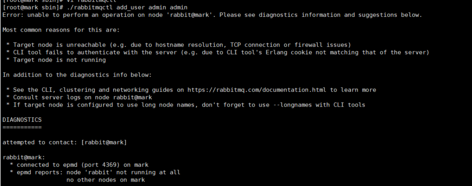

**启动有问题，先查看启动日志！**
**某一些命令不能使用，可能是因为服务没有正常启动**

## 1、服务无法启动（5672端口未启动）

RabbitMQ的服务是默认开机自启动的

1）用不同方式启动RabbitMQ服务，命令行或者Windows本地服务管理
比如windows：
在cmd中进入sbin目录（不要用powershell）
先停再起

```
 .\rabbitmq-server.bat stop
 .\rabbitmq-server.bat start
```

2）可能是版本问题，注意Erlang和RabbitMQ版本要对应。
高版本的RabbitMQ无法安装在低版本的Erlang环境之上。
卸载重装，或者降低RabbitMQ版本。

3）Erlang环境变量没有配置，erl命令没有结果。配置环境变量。

4）syz同学补充：可能是启动的用户没有管理员权限问题，以管理员启动

5）windows下重启失败可能是cmd没有管理员运行。

6）端口启动了服务没有启动
Linux

```
rabbitmq-service stop
rabbitmq-service start
```

## 2、管理界面不能访问 15672端口未启动

先确定端口是否启动正常
Linux 命令：

```
netstat -an|grep 15672
```

windows cmd命令：

```
netstat -an|findstr 15672
```

正常情况下可以看到：

```
 TCP    0.0.0.0:15672          0.0.0.0:0              LISTENING
```

1）RabbitMQ服务没有启动，5672端口没有启动，看上一步

2）插件enable了吗？

```
"C:\Program Files\RabbitMQ Server\rabbitmq_server-3.8.9\sbin\rabbitmq-plugins.bat" enable rabbitmq_management
```

3）guest用户默认只能在本机访问。如果是本机访问虚拟机的服务，需要添加其他用户（比如admin），分配vhost权限才能远程访问

```
./rabbitmqctl add_user admin admin
./rabbitmqctl set_user_tags admin administrator
./rabbitmqctl set_permissions -p / admin ".*" ".*" ".*"
```

## 3、加入集群失败

1. 主节点是否启动成功，网络连接是否正常，ping hostname能不能ping通？
2. 25672端口，防火墙是否允许
3. erlang.cookie是否一致

## 4、添加用户失败



根据提示，可能有几个原因：
1. hostname配置有问题
2. erlang.cookie有问题
3. 服务没启动成功