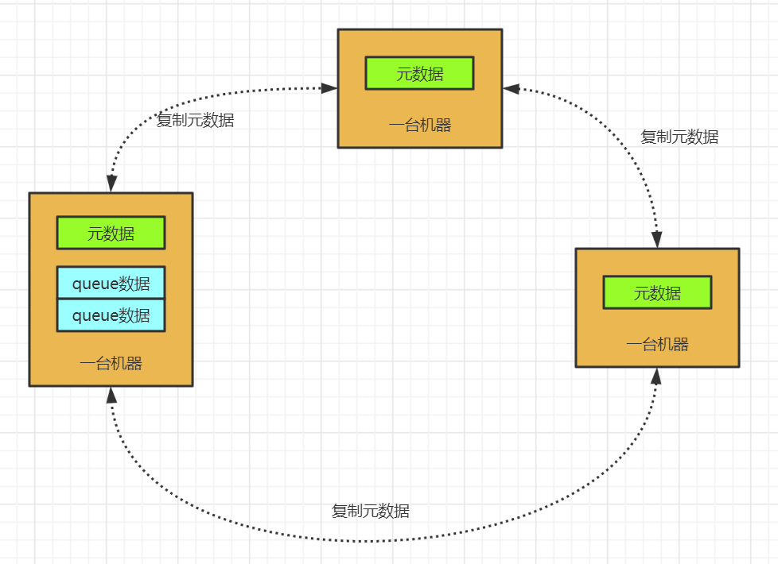
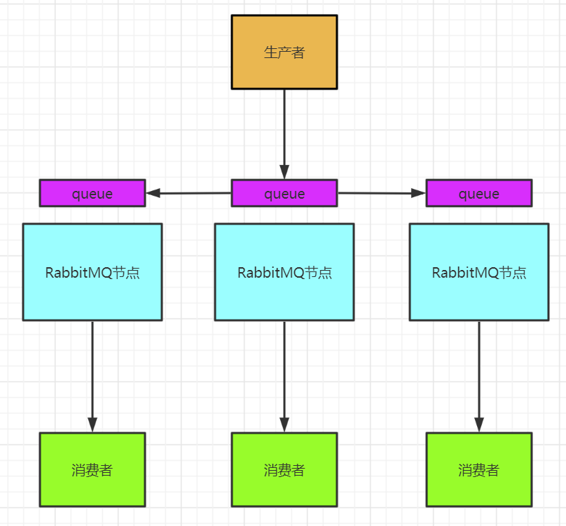
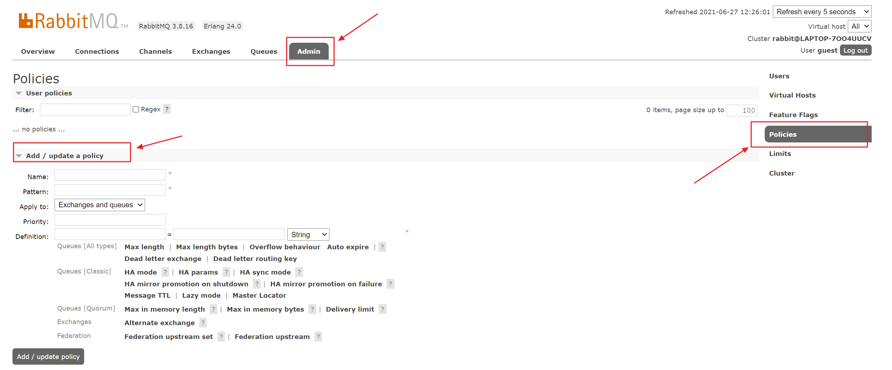

## 1. 集群

### 1.1 为什么要使用集群

集群主要用于实现高可用和负载均衡

- 高可用：如果集群中的某些MQ服务器不可用，客户端还可以连接到其他的MQ服务器上
- 负载均衡：在高并发的场景下，单台MQ服务器能处理的消息是有限的，可以分发给多台MQ服务


### 1.2 RabbitMQ是如何支持集群模式的？

做集群主要的问题就是数据同步和通信的问题。因为Erlang语言是具备分布式特性的，所以RabbitMQ天然支持集群，不需要通过引入第三方组件，如zookeeper或者数据库等来实现数据的同步。


RabbitMQ通过`/var/lib/rabbitmq/.erlang.cookie`来验证身份，所以搭建集群的时候需要保证他们是保持一致的。


### 1.3 RabbitMQ的节点类型

RabbitMQ集群节点类型有两种：

1. 磁盘节点（Disc Node）：将元数据（包括队列名字属性、交换机的类型名字属性、绑定关系、vhost）放在磁盘中
2. 内存节点（RAM Node）：将元数据放在内存中


集群中至少需要一个磁盘节点用来持久化元数据，否则当所有的内存节点崩溃后，就没有办法同步元数据。未指定类型的情况下，默认为磁盘节点


一般我们会将应用连接到内存节点（读写快），磁盘节点用来备份。


集群通过25672端口进行两两通信，需要开放防火墙的端口。

需要注意的是，RabbitMQ集群无法搭建在广域网上，除非使用Federation或者shovel等插件（不过一般也没有这个必要）


### 1.4 RabbitMQ的集群

#### 1.4.1 普通集群

RabbitMQ的普通集群只会相互同步元数据，不会同步队列中的消息数据





**为什么不直接把队列中的数据在所有的节点上复制一份？**

主要是因为存储和同步数据的网络开销问题


但是这个集群无法保证高可用，因为如果存储队列数据的那个节点失效，这个集群就不可用了。


#### 1.3.2 镜像集群

镜像集群，队列中的消息会在镜像节点之间同步，每个节点上都有这个queue的一个完整镜像，就是包含了这个queue的全部数据，可用性高。


[官方文档](https://www.rabbitmq.com/ha.html#mirroring-arguments)





优点是任何一个节点宕机了，消费者还是可以连接到其他的服务节点获取数据。

但是同样代价非常高，因为需要同步队列消息，所以网络开销大。


**开启镜像模式需要在管理页面中添加策略**

1、进入管理页面 -> Admin -> Policies（在页面右侧） -> Add/update a policy





2、 在表单中填入信息

```
ame: ha-all
Pattern: ^ 
Apply to: Queues
Priority: 0
Definition: ha-mode = all
```

> 参数说明：
>
> name：策略名称，如果使用已有的名称，保存后将会修改原来的信息
>
> Pattern：策略应用到对象时，对象名称的匹配规则（正则表达式）
>
> Apply to：策略引用到什么对象上
>
> Priority：优先级，数值越大，优先级越高，相同优先级取最后一个
>
> Definition：策略定义的内容，对于镜像队列的配置来说，只需要包含3个部分：`ha-mode`、`ha-params`、`ha-sync-mode`


 `ha-sync-mode`是自动还是手动的同步方式，默认是自动的


`ha-mode`和`ha-params`是组合使用的：

| ha-mode | ha-params | 说明                                                         |
| ------- | --------- | ------------------------------------------------------------ |
| all     |           | 队列镜像到集群中所有节点                                     |
| exactly | count     | 队列镜像到集群内指定数量的节点。如果集群内节点数少于此数值，队列将镜像同步到所有节点。如果大于此数值，而且一个包含镜像的节点，则新的镜像不会在其他节点上创建 |
| nodes   | nodename  | 队列镜像到指定节点，指定的接地那不在集群中不会报错。当队列声明时，如果指定的节点不在线，则队列会被创建在客户端所连接的节点上 |


## 2. 高可用

待更新....

