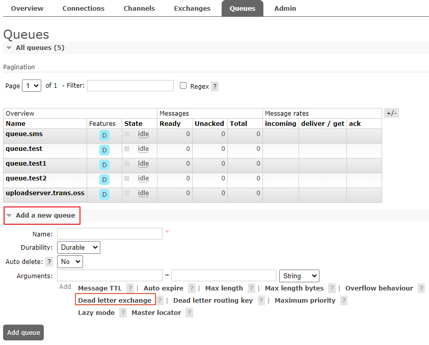

## 1. Java API编程

### 1.1 引入创建Maven工程，引入依赖

```xml
<dependency>
	<groupId>com.rabbitmq</groupId> 
	<artifactId>amqp-client</artifactId>
    <version>5.6.0</version>
</dependency>
```


### 1.2 编写生产者

```java
package com.sinclair.rabbitmq;

import com.rabbitmq.client.Channel;
import com.rabbitmq.client.Connection;
import com.rabbitmq.client.ConnectionFactory;

public class MyProducer {
    private final static String EXCHANGE_NAME = "SIMPLE_EXCHANGE";

    public static void main(String[] args) throws Exception {
        ConnectionFactory factory = new ConnectionFactory();
        // 连接IP
        factory.setHost("127.0.0.1");
        // 连接端口
        factory.setPort(5672);
        // 虚拟机
        factory.setVirtualHost("/");
        // 用户
        factory.setUsername("guest");
        factory.setPassword("guest");

        // 建立连接
        Connection conn = factory.newConnection();
        // 创建消息通道
        Channel channel = conn.createChannel();

        // 发送消息
        String msg = "Hello world, Rabbit MQ";

        // String exchange, String routingKey, BasicProperties props, byte[] body
        channel.basicPublish(EXCHANGE_NAME, "test.best", null, msg.getBytes());

        channel.close();
        conn.close();
    }
```


### 1.3 编写消费者

```java
package com.sinclair.rabbitmq;

import com.rabbitmq.client.*;
import java.io.IOException;

public class MyConsumer {
    private final static String EXCHANGE_NAME = "SIMPLE_EXCHANGE";
    private final static String QUEUE_NAME = "SIMPLE_QUEUE";

    public static void main(String[] args) throws Exception {
        ConnectionFactory factory = new ConnectionFactory();
        // 连接IP
        factory.setHost("127.0.0.1");
        // 默认监听端口
        factory.setPort(5672);
        // 虚拟机
        factory.setVirtualHost("/");

        // 设置访问的用户
        factory.setUsername("guest");
        factory.setPassword("guest");
        // 建立连接
        Connection conn = factory.newConnection();
        // 创建消息通道
        Channel channel = conn.createChannel();

        // 声明交换机
        // String exchange, String type, boolean durable, boolean autoDelete, Map<String, Object> arguments
        channel.exchangeDeclare(EXCHANGE_NAME,"direct",false, false, null);

        // 声明队列
        // String queue, boolean durable, boolean exclusive, boolean autoDelete, Map<String, Object> arguments
        channel.queueDeclare(QUEUE_NAME, false, false, false, null);
        System.out.println(" Waiting for message....");

        // 绑定队列和交换机
        channel.queueBind(QUEUE_NAME,EXCHANGE_NAME,"test.best");

        // 创建消费者
        Consumer consumer = new DefaultConsumer(channel) {
            @Override
            public void handleDelivery(String consumerTag, Envelope envelope, AMQP.BasicProperties properties,
                                       byte[] body) throws IOException {
                String msg = new String(body, "UTF-8");
                System.out.println("Received message : '" + msg + "'");
                System.out.println("consumerTag : " + consumerTag );
                System.out.println("deliveryTag : " + envelope.getDeliveryTag() );
            }
        };

        // 开始获取消息
        // String queue, boolean autoAck, Consumer callback
        channel.basicConsume(QUEUE_NAME, true, consumer);
    }
}
```


### 1.4 参数解析

1、 声明交换机的参数

```
String type：交换机的类型，direct、topic、fanout中的一种
boolean durable：是否持久化
```


2、声明队列的参数

```
boolean durable：是否持久化
boolean exclusive：是否排他性队列，排他性队列只能在声明它的Conenection中使用，连接断开时会自动删除
boolean autoDelete：是否自动删除。如果为true，至少有一个消费者连接到这个队列，之后所有与这个队列连接的消费者断开时，队列会自动删除
Map<String, Object> arguments：队列的其他属性
```


**队列的其他属性**

| 属性                      | 含义                                           |
| ------------------------- | ---------------------------------------------- |
| x-message-ttl             | 队列中消息的存活时间，单位毫秒                 |
| x-expires                 | 队列中多久没有消费者访问以后会被删除           |
| x-max-length              | 队列的最大消息数                               |
| x-max-length-bytes        | 队列的最大容量，单位Bytes                      |
| x-dead-letter-exchange    | 队列的死信交换机                               |
| x-dead-letter-routing-key | 死信交换机的路由键                             |
| x-max-priority            | 队列中消息的最大优先级，消息的优先级不能超过它 |


3、消息属性（BasicProperties）

| 参数                 | 含义                          |
| -------------------- | ----------------------------- |
| Map<String, Object>  | 消息的其他自定义属性          |
| Integer deliveryMode | 2 持久化，其他：瞬态          |
| Integer pririty      | 消息的优先级                  |
| String correlationId | 关联ID，方便RPC响应与请求关联 |
| String replyTo       | 回调队列                      |
| String expiration    | TTL，消息过期时间，单位毫秒   |


## 2. UI管理界面的使用

RabbitMQ可以通过命令（RabbitMQ CLI），HTTP API管理，也可以通过可视化见面管理，这个网页就是managment插件。


### 2.1 启用管理插件

#### 2.1.1 Windows启用管理插件

```
# 进入安装目录下的sbin目录
rabbitmq-plugins.bat enable rabbitmq_management
```


#### 2.1.2 Linxu启用管理插件

```
# 进入安装目录下的bin目录
./rabbitmq-plugins enable rabbitmq_management
```


### 2.2 访问管理页面

默认端口是`15672`，默认用户是`guest`，密码也是`guest`

注意：`guest`用户默认只能在本机访问，远程用户需要创建其他的用户


## 3. 进阶使用

### 3.1 TTL

消息的过期时间


**两种设置方式：**

1、通过队列属性设置消息过期时间：所有队列中的消息超过时间未被消费，都会过期

```java
@Bean("ttlQueue")
public Queue queue() {
	Map<String, Object> map = new HashMap<String, Object>();
	// 队列中的消息未被消费 11 秒后过期
	map.put("x-message-ttl", 11000);
    return new Queue("MY_TTL_QUEUE", true, false, false, map);
}
```


2、单条消息的过期时间设置：发送消息的时候指定消息属性

```java
MessageProperties messageProperties = new MessageProperties();
// 消息的过期属性，单位 ms
messageProperties.setExpiration("4000");
Message message = new Message("这条消息 4 秒后过期".getBytes(), messageProperties); rabbitTemplate.send("MY_TTL_EXCHANGE", "test.ttl", message);
```


**注意：如果同时指定了队列属性和消息属性的TTL，那么小的那个时间 生效。**


### 3.2 死信队列

消息在某些情况下回变成死信（Dead letter)


**什么情况消息会变成死信？**

1. 消息被消费者拒绝并且没有设置重回队列：（NACK||Reject）&& requeue == false
2. 消息过期
3. 队列达到最大长度，超过了Max length或者Max length bytes，最先入队的消息会被发送到死信队列


**如何使用死信队列？**

队列在创建的时候可以指定一个死信队列交换机（Dead Letter Exchange）。和死信交换机绑定的队列，称为死信队列（Dead Letter Queue）




示例：

1、声明一个原交换机和原队列，在原队列上设置消息的过期时间和死信交换机

```java
@Bean("originalExchange") 
public DirectExchange exchange()  {
	return new DirectExchange("ORIGINAL_EXCHANGE", true, false, new HashMap<>());
}

@Bean("originalQueue")
public Queue queue() {
	Map<String, Object> map = new HashMap<String, Object>();
    // 设置10s后过期
    map.put("x-message-ttl", 10000); 
    // 设置队列中的消息过期后，进入死信交换机
	map.put("x-dead-letter-exchange", "DEAD_LETTER_EXCHANGE"); 
	return new Queue("ORIGINAL_QUEUE", true, false, false, map);
}

@Bean
public Binding binding(@Qualifier("originalQueue") Queue queue, @Qualifier("originalExchange") DirectExchange exchange) {
	return BindingBuilder.bind(queue).to(exchange).with("test.dlx");
}
```


2、声明死信交换机和死信队列

```java
@Bean("deatLetterExchange")
public TopicExchange deadLetterExchange() {
	return new TopicExchange("DEAD_LETTER_EXCHANGE", true, false, new HashMap<>());
}

@Bean("deatLetterQueue") 
public Queue deadLetterQueue() {
	return new Queue("DEAD_LETTER_QUEUE", true, false, false, new HashMap<>());
}

@Bean
public Binding bindingDead(@Qualifier("deatLetterQueue") Queue queue, @Qualifier("deatLetterExchange") TopicExchange exchange) {
    // # 无条件路由
	return BindingBuilder.bind(queue).to(exchange).with("#"); 
}
```


3、消费者监听死信队列

4、生产者发送消息


**消息流转图：**


### 3.3 延迟队列

在实际业务中，有一些需要演示发送消息的场景，如未付款15分钟后关闭。


RabbitMQ本身不支持延迟队列，但是有三种实现方案：

1. 先存到数据库，用定时任务扫描
2. 利用RabbitMQ的死信队列实现
3. 利用rabbitmq-delayed-message-exchange插件


#### 3.3.1 基于延时队列插件

在RabbitMQ 3.5.7 及以后的版本提供了一个插件（rabbitmq-delayed-message-exchange）来实现延时队列的功能。同时插件依赖Erlang/OPT 18.0及以上

[插件源码地址](https://github.com/rabbitmq/rabbitmq-delayed-message-exchange)  [插件下载地址](https://bintray.com/rabbitmq/community-plugins/rabbitmq_delayed_message_exchange)


1、进入插件目录下载插件

```
wget https://bintray.com/rabbitmq/community-plugins/download_file？file_path=rabbitmq_delayed_message_exchange-0.0.1.ez
```


2、启用插件

```
rabbitmq-plugins enable rabbitmq_delayed_message_exchange
```


3、停用插件

```
rabbitmq-plugins disable  rabbitmq_delayed_message_exchange
```


4、使用插件

声明一个 x-delayed-message 类型的 Exchange 来使用 delayed-messaging 特性。

x-delayed-message 是插件提供的类型，并不是 rabbitmq 本身的。


### 3.4 服务端限流

[官方文档：流控](https://www.rabbitmq.com/flow-control.html)

当RabbitMQ生产端生产消息的书读远远大于消费端消费消息的速度的手，会产生大量的消息堆积，占用系统资源，从而导致机器性能的下降。


**如何控制服务端接受消息的数量呢？**

队列有两个控制长度的属性：

- x-max-length：队列可以存储最大的消息数，超过这个数，队列头部的消息会被丢弃。
- x-max-length-bytes：队列可以存储的最大消息容量（单位bytes），超过这个容量，队列头部的消息会被丢弃。


注意：这两个参数只有在消息堆积的情况下，才有意义。并且会删除先入队的消息，不能实现真正的服务端限流。


#### 3.4.1 内存控制

[官方文档：内存警报](https://www.rabbitmq.com/memory.html)

RabbitMQ在启动的时候会检测机器的物理内存数值。当RabbitMQ占用内存超过内存阈值0.4，也就是说占用内存超过40%时，会主动抛出一个内存警告并阻塞所有连接（Connections）。来保证服务避免崩溃，客户端与服务端的心跳检测也会失效。


1、可以通过rabbitmq.config文件来调整这个内存的阈值。

```
vm_memory_high_watermark.relative=0.4
# vm_memory_high_watermark.absolute=1G
```

- relative：相对值，建议取值在0.4~0.66之间，不建议超过0.7
- absolute：单位为KB、MB、GB


2、通过命令动态设置，如果设置为0，则所有的消息都不能发布

```
rabbitmqctl set_vm_memory_high_watermark 0.3
```

通过这个命令修改的阈值，在Broker重启后失效。


#### 3.4.2 内存换页

在某个Broker节点触及内存并阻塞生产者之前，它会尝试将队列中的消息换页到磁盘以释放内存空间。持久化和非持久化的消息都会存储到磁盘中，其中持久化的消息本身就在磁盘中有一份副本，这里会将持久化的消息从内存中清除掉。


默认情况，在内存到达内存阈值的50%时会进行换页动作。也就是，在默认的内存阈值0.4的情况下，但该内存超过0.4*0.5=0.2时进行换页动作。


可以通过在配置文件中配置：

```
vm_memory_high_watermark.relative=0.4
vm_memory_high_watermark_paging_ratio=0.75
```

> 以上配置将会在RabbitMQ内存使用率达到30%时进行换页动作，并在40%时阻塞生产者。
>
> 当vm_memory_high_watermark_paging_ratio的值大于1时，禁用此功能


#### 3.4.3 磁盘控制

[官方文档：可用磁盘空间警报](https://www.rabbitmq.com/disk-alarms.html)

另一种方式就是通过磁盘来控制消息的发布。当可用磁盘空间空间低于50M（默认大小）时，触发流控。阻塞消费者，这样可以避免因非持久化的消息持续换页而耗尽磁盘空间导致服务崩溃。


默认磁盘阈值为50mb：表示当磁盘空间低于50MB时会阻塞生产者并停止内存中消息的换页动作。

这个阈值的设置可以减小，但是不能完全消除因磁盘耗尽而导致服务崩溃的可能性。比如在两次磁盘空间检测期间，磁盘空间从大于50MB减少到0MB


一般建议将磁盘阈值设置为与操作系统内存一样的大小。


通过命令临时调整：

```
rabbitmqctl set_disk_free_limit <disk_limit>
rabbitmqctl set_disk_free_limit mem_relative <fraction>
```

- disk_limit：固定大小，单位为KB、MB、GB
- fraction：相对比值，建议取值为1.0~2.0之间


配置文件设置：例如设置为磁盘的30%或者2GB

```
disk_free_limit.relative = 3.0
disk_free_limit.absolute = 2GB
```


### 3.5 消费端限流

[官方文档](https://www.rabbitmq.com/consumer-prefetch.html)

默认情况下，RabbitMQ会尽可能的将队列中的消息发送到消费者。但是消费者会在本地缓存消息，因为消费端处理消息的能力有限，如果消息数量过多，可能会导致OOM或者影响其他进程的正常运行。所以我们希望在一定数量消息消费完成之前，不要再推送消息过来。


可以基于Consumer或者channel设置`prefetch count`的值，含义为消费端的最大unacked messages的数目。当超过这个数值的消息没有被确认时，RabbitMQ会停止投递新的消息给这个消费者。


```
channel.basicQos(5);	//如果超过5条消息没有发送ack，当前消费者不再接受新的消息
channel.basicConsumer(QUEUE_NAME, false, consumer);
```


SimpleMessageListenerContainer

```
container.setPrefetchCount(5);
```


spring boot的配置：

```
spring.rabbitmq.listener.simple.prefetch=5
```

