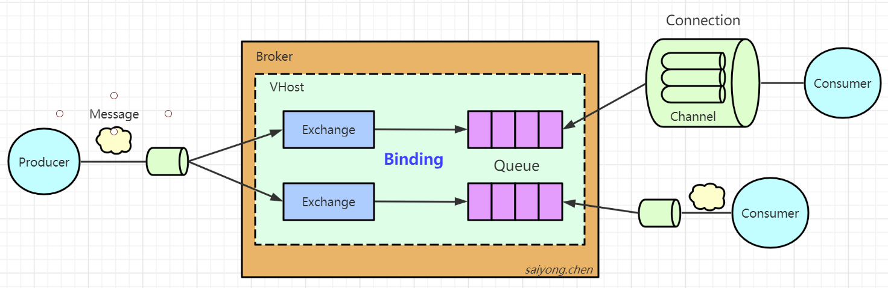
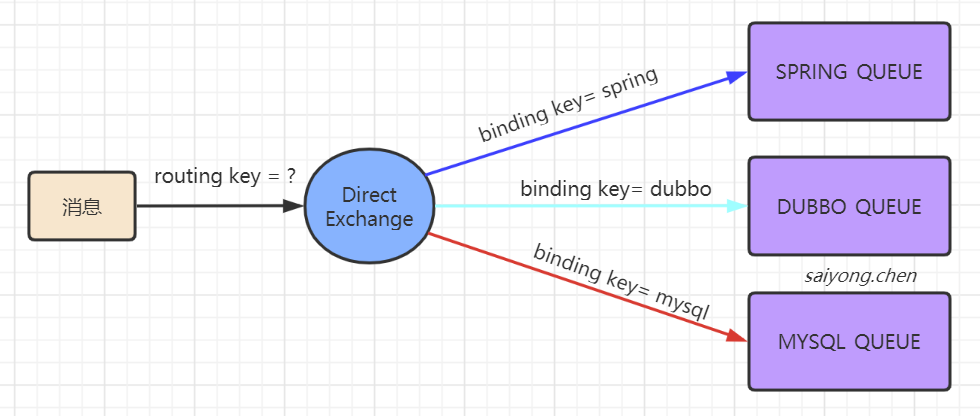
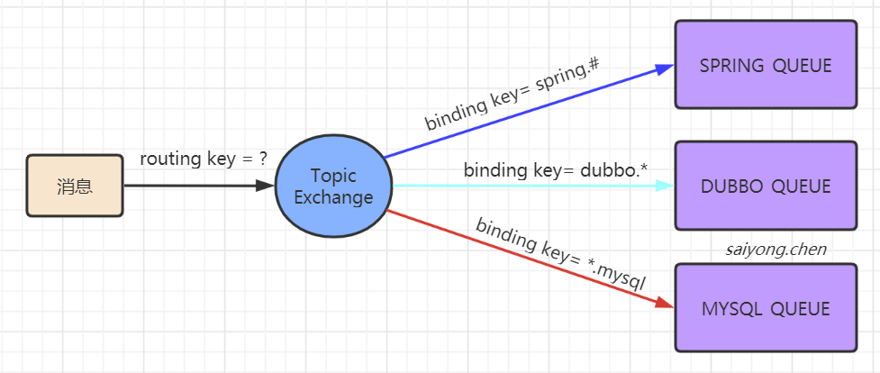
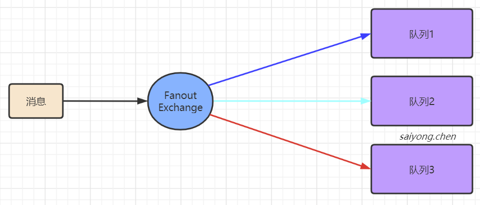

## 1. 什么是RabbitMQ?

RabbitMQ是一款使用Erlang语言编写的实现了高级消息队列协议（AMQP)的开元消息中间件。

[官网](https://www.rabbitmq.com/getstarted.html)


### 1.1 基本特性

1. 可靠性（Reliability）：RabbitMQ 提供了如持久化、传输确认、发布确认等来保证消息的可靠性。
2. 灵活的路由（Flexible Routing）：通过 Exchange 来路由消息的。
3. 消息集群（Clustering）：多个 RabbitMQ 服务器可以组成一个集群，形成一个逻辑 Broker 。
4. 高可用（Highly Available Queues）：队列可以在集群中的机器上进行镜像，使得在部分节点出问题的情况下队列仍然可用。
5. 支持多种协议（Multi-protocol）：RabbitMQ 支持多种消息队列协议，比如 STOMP、MQTT ， Http and WebSockets。
6. 多语言客户端（Many Clients）：RabbitMQ对所有主流的开发语言都有客户端的实现，比如 Java、Golang、Ruby 等等。
7. 拥有管理界面（Management UI）：RabbitMQ 提供了一个简单易用的管理界面
8. 支持插件机制（Plugin System）：RabbitMQ 提供了许多插件来进行扩展，也可以自定义插件。


### 1.2 AMQP协议

AMQP：高级消息队列协议，是一个工作与应用层的协议

[AMQP协议文档](http://www.amqp.org/sites/amqp.org/files/amqp.pdf)


除了  RabbitMQ  之外，AMQP 的实现还有  OpenAMQ、Apache  Qpid等等


## 2. 工作模型

由于RabbitMQ实现了AMQP协议，所以RabbitMQ的工作模型也是基于AMQP的。




### 2.1 Broker

​	我们要使用RabbitMQ来收发消息，必须要安装一个RabbitMQ的服务，可以安装在Windows/Linux上，默认端口是`5672`。这台RabbitMQ服务器我们就称为Broker。中文翻译为代理/中介，因为MQ服务器帮我们做的事情就是存储和转发消息。


### 2.2 Connection

无论是生产者发送消息，还是消费者消费消息，都必须要和Broker建立一个连接，这个连接是一个TCP的长连接。


### 2.3 Channel

如果所有的生产者发送消息和消费者消费消息，都是直接创建和释放TCP长连接的话，会给Broker带来很大的性能开销。

所以在AMQP中引入了channel的概念，它是一个`虚拟的连接`。翻译为通道，这样我们可以在TCP长连接里面去创建和释放Channel，从而大大减少性能上的开销。

Channel是RabbitMQ原生API中一个最重要的编程接口，我们定义交换机、队列、绑定关系、发送消息和消费消息，调用的都是Channel接口上的方法。


[stackoverflow上关于connection和channel关系的解答](https://stackoverflow.com/questions/18418936/rabbitmq-and-relationship-%20between-channel-and-connection)


### 2.4 Exchange

在RabbitMQ中消息不会直接发送给队列，因为在AMQP中引入了交换机（Exchange）的概念，用来实现消息的灵活路由。

交换机是一个绑定列表，用来查找匹配绑定关系

队列使用绑定键（Binding key）和交换机建立绑定关系

生产者发送消息的时候需要携带路由键（Routing Key），交换机接收到消息后会根据它绑定列表中的绑定关系，将消息发送到对应的队列上


**注意：交换机和队列、队列和消费者都是多对多的关系**


### 2.5 Queue

队列是用来存储消息的，是一个独立运行的进程，有自己的数据库（Mnesia）。


消费者获取消息的两种模式：

1. Push模式：只要生产者将消息发送到服务器，就马上推送给消费者
2. Pull模式：消息存放在服务器上，只要消费者主动获取才能拿到消息。


由于队列有FIFO的特性，只有确定钱一条消息别消费者消费之后，才会将这条消息从数据库中删除，然后继续投递下一条消息。


### 2.6 Vhost

Vhost虚拟主机，可以用来提高硬件资源的利用率，实现资源的隔离和权限控制。

比如：针对不同的业务系统，可以创建不同的虚拟主机来实现资源隔离。


## 3. 路由方式

### 3.1 Direct 直连

队列与直连类型的交换机绑定，需要指定一个精确的绑定键

生产者发送消息的时候，携带的路由键必须和绑定键完全匹配才会将这条消息路由到对应的队列上。





例如：

```java
//只有SPRING_QUEUE这个队列能收到这条消息
channel.basicPublish("MY_DIRECT_EXCHANGE", "spring", "msg-1");
```


### 3.2 Topic 主题

队列和主题类型的交换机绑定时，可以在绑定键中使用通配符。

两个通配符类型：

1. \#：匹配0个或多个单词
2. \*：匹配一个单词

单词：指的是用英文的“`.`”隔开的字符。如：abc.def是两个单词





> spring.#：表示支持路由键以spring开头的，后面的单词可以有，也可以没有
>
> dubbo.*：表示支持以dubbo开头，后面跟一个单词的路由键
>
> *.mysql：表示支持以mysql结尾，前面加一个单词的路由键


例如：

```java
//只有SPRING_QUEUE能收到消息
channel.basicPublish("MY_TOPIC_EXCHANGE", "spring.abc.ref", "msg-2");

//Spring_QUEUE和MYSQL_QUEUE都能收到消息
channel.basicPublish("MY_TOPIC_EXCHANGE", "spring.mysql", "msg-3");
```


### 3.3 Fanout 广播

广播类型的交换机与队列绑定的时候不需要指定绑定键，同时因为生产者发送的消息是广播到与之绑定的交换机上，所以也不需要路由键。





例如：

```java
//三个队列都会收到消息
channel.basicPublish("MY_FANOUT_EXCHANGE", "", "msg-4");
```

