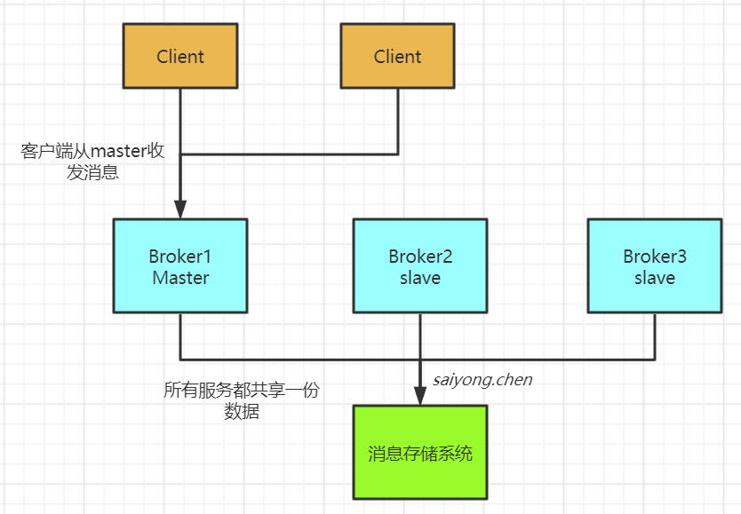
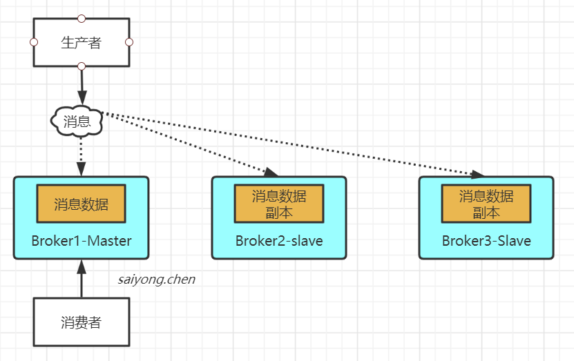
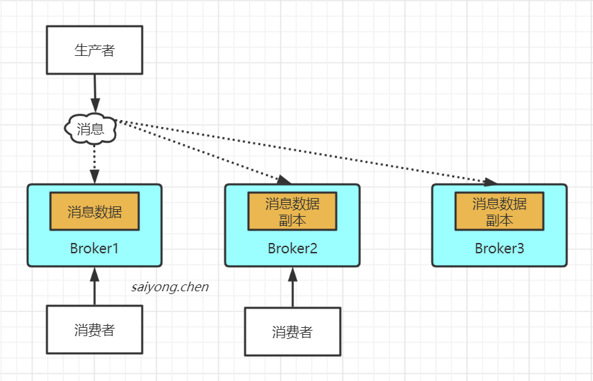
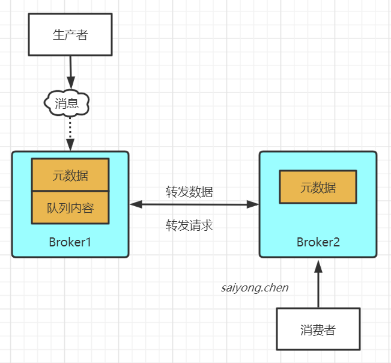
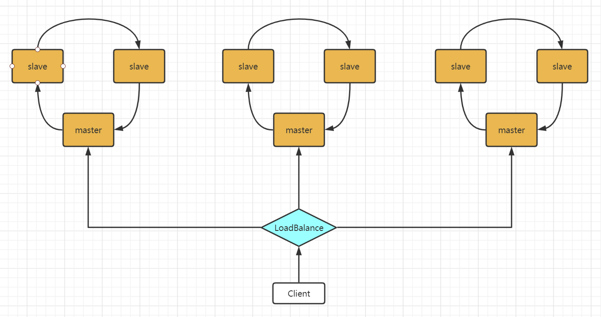

## 1. 什么是MQ（Message Queue）

消息队列，又叫消息中间件。指用高效可靠的消息传递机制进行与平台无关的数据交流，并基于数据同行来进行分布式系统的集成。通过同消息传递和消息队列模型，可以在分布式环境下扩展进程的通信。

所以MQ就是用来解决通信问题的，主要有以下几个特点：

1. 是一个独立运行的服务，生产者发送消息，消费者消费消息，需要与它先建立连接。
2. 采用队列作为数据结构，有先进先出的特点
3. 具有发布订阅的模型，消费者可以后去自己需要的消息。

我们可以把MQ想象成邮局，它是用来帮我们存储和转发消息的。

**Java中有很多队列的实现，为什么还需要另外使用MQ呢？**

java中的Queue不能跨进程，不成在分布式系统中使用，也没有持久化机制等等。

## 2. MQ的组成

### 2.1 协议

#### 2.1.1 AMQP协议

（Advanced Message Queuing Protocal ）是高级消息队列协议 04年 JPmorgan Chase（摩根大通） 联合其他公司共同设计

**特性：** 

1. 事务支持
2. 持久化支持
3. 高可靠性

#### 2.1.2 MQTT协议

（Message Queuing Telemetry Transport）消息队列遥测传输，是IBM开发的一个即时通讯协议，物联网系统架构中的重要组成部分

**特性：**

1. 轻量
2. 结构简单
3. 传输快
4. 没有事务支持
5. 没有持久化相关设计

**应用场景：**

适用于计算能力有限，低宽带，网络不稳定的场景

#### 2.1.3 OpenMessage协议

由阿里发起，与雅虎、滴滴出行，Streamlio等公司共同参与创立的分布式消息中间件、流处理领域的应用开发标准。

**特性：**

1. 结构简单
2. 解析快
3. 支持事务
4. 支持持久化

#### 2.1.4 kafka协议

基于TCP的二进制协议。消息内部是通过长度来分割，由一些基本数据类型组成

特性：

1. 结构简单
2. 解析快
3. 支持持久化
4. 不支持事务

### 2.2 持久化

简单来说就是将数据存入磁盘，而不是存在内存中，避免随着服务的宕机重启导致数据丢失。

**常用的消息中间件的持久化方式：**

|          | ActiveMQ | RabbitMQ | kafka | RocketMQ |
| :------: | :------: | :------: | :---: | :------: |
| 文件系统 |   支持   |   支持   | 支持  |   支持   |
|  数据库  |   支持   |    /     |   /   |    /     |

### 2.3 消息分发

**常用消息中间件的分发策略：**

|          | ActiveMQ | RabbitMQ | kafka | RocketMQ |
| :------: | :------: | :------: | :---: | :------: |
| 发布订阅 |   支持   |   支持   | 支持  |   支持   |
|   轮询   |   支持   |   支持   | 支持  |    /     |
| 公平分发 |    /     |   支持   | 支持  |    /     |
|   重发   |   支持   |   支持   |       |   支持   |
| 消息拉去 |    /     |   支持   | 支持  |    /     |

### 2.4 高可用

在规定的条件和时间区间内处于可用状态。简单来说就是当业务量大，一台消息中间件服务器可能无法满足需求，就需要消息中间件能够集群部署，来达到高可用的目的。

**常用的高可用部署方式：**

**1、Master-Slave主从共享部署方式：**

**2、Master-Slave主从同步部署方式：**

**3、 Cluster多主集群同步部署方式：**

**4、 Cluster多主集群转发部署方式：**

**5、Master-Slave和Cluster结合：**

### 2.5 高可靠

保证消息中间件的可靠性，主要有两个方面：

- **消息传输可靠：**通过协议来保证系统间数据解析的正确性。
- **消息存储可靠：**通过持久化来保证消息的存储可靠性。

## 3. 为什么要使用MQ？

### 3.1 实现系统解耦

首先我们看一下没有使用MQ，系统之间的关系：

使用了MQ实现系统之间解耦的场景：

### 3.2 实现异步通信

先看一下在不使用MQ同步高延时的请求场景：

> 当用户发起一个请求，这个请求依次请求了系统a-b-c-d
>
> 4个步骤下来，完成这个请求的总时长是：350ms
>
> 假如我们将每个系统的执行耗时加长，b系统花费了300ms，c系统花费了450ms，d系统花费了200ms。
>
> 那么现在一个请求的耗时将边长为970ms
>
> 一般互联网企业，对一个用户的直接的操作，一般要求是每个请求都必须在200ms以内完成，对用户几乎是无感知的

在看一下使用了MQ实现了异步通信的场景：

> 如上图，当用户发送一个请求后，这个请求经过系统A，系统A在将消息发送给MQ成功后，直接返回。不用管下游的服务到底执行了多长时间。

### 3.3 实现流量削峰

先看一下没有使用MQ进行削峰，当大量请求进来导致系统服务宕机的场景：

我们知道MQ是队列，那就具有队列的特性：先进先出，我们可以使用MQ将所有的请求都承接下来，然后慢慢消费：

### 3.4 总结：

1. 对于数据量大或者处理耗时长的操作，我们可以引入MQ实现异步通信，减少客户端的等待时间，提升响应速度
2. 对于改动影响大的系统，可以引入MQ实现解耦，减少系统之间的耦合
3. 对于会瞬间出现流量峰值的系统，可以引入MQ实现流量削峰，来保护应用系统和数据库

## 4. 引入MQ会带来的问题

## 5. MQ的选型

|          特性           |                   ActiveMQ                   |                   RabbitMQ                   |                           RocketMQ                           |                            Kafka                             |
| :---------------------: | :------------------------------------------: | :------------------------------------------: | :----------------------------------------------------------: | :----------------------------------------------------------: |
|       单机吞吐量        | w级别，吞吐量比RocketMQ和kafka低了一个数量级 | w级别，吞吐量比RocketMQ和kafka低了一个数量级 |                      10w级别，吞吐量高                       | 10w级别，吞吐量高  一般配合大数据系统进行实时计算、日志采集等场景 |
| topic数量对吞吐量的影响 |                                              |                                              | topic可以达到几百、几千个的级别，吞吐量会有较小幅度的下降  这是RocketMQ的一个优势，在同等机器的条件下，可以支持大量的topic | topic从几十到几百个的时候，吞吐量会大量下降  在同等机器的条件下topic的数量不要过多，如果要支撑大规模的topic，需要更加相应的机器 |
|         时效性          |                     ms级                     |        微秒级，这是RabbitMQ的一大特点        |                             ms级                             |                        延迟在ms级以内                        |
|         可用性          |            高，基于主从实现高可用            |            高，基于主从实现高可用            |                      非常高，分布式架构                      | 非常高，分布式架构 一个机器多个副本，少数机器宕机不会丢失数据，不会导致不可用 |
|       消息可靠性        |             有较低的概率丢失数据             |                                              |               经过参数的优化配置可以做到0丢失                |               经过参数的优化配置可以做到0丢失                |
|        功能支持         |             MQ领域的功能及其完备             | 基于erlang语言开发，并发能力很高，性能及其好 |                   MQ功能较为完善，扩展性好                   |              功能较为简单，主要支持简单的MQ功能              |

**总结：**

- ActiveMQ
  - 非常成熟，功能强大。
  - 社区维护越来越少
  - 国内应用越来越少
- RabbitMQ
  - erlang语言开发，性能好，延时低
  - 吞吐量为万级别，MQ功能完善
  - 开源提供管理界面使用方便，国内应用较多
  - 社区活跃
- RocketMQ
  - 接口简单易用
  - 日处理消息达到百亿，可以做大规模吞吐，性能好
  - 分布式扩展方便
  - 支持大规模的topic数量和复杂的MQ业务场景
  - 基于java开发
- kafka
  - 核心功能较少
  - 支撑较少的topic数量保证高吞吐量、ms级的延迟
  - 高可用性和可靠性
  - 可能会导致消息的重复消费
  - 一般用于大数据领域和日志采集中
