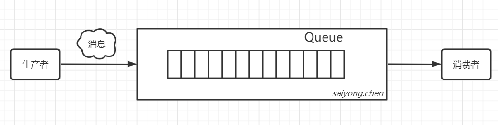
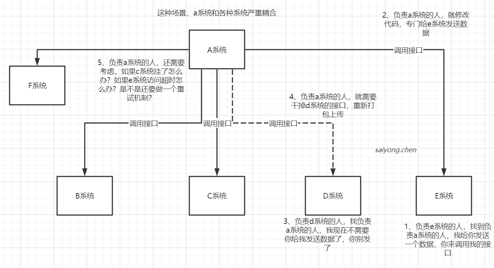
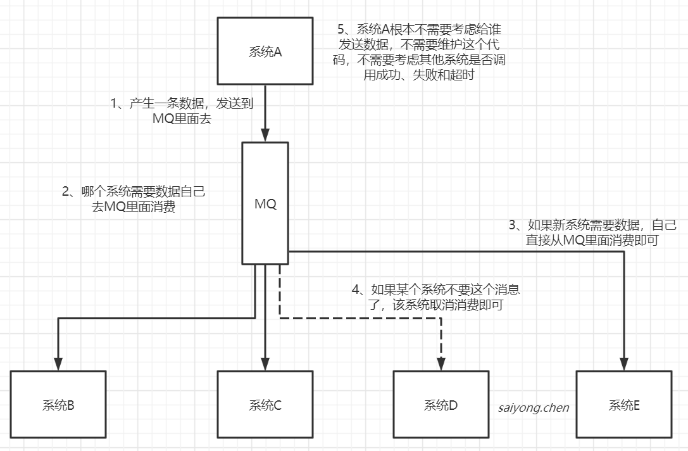
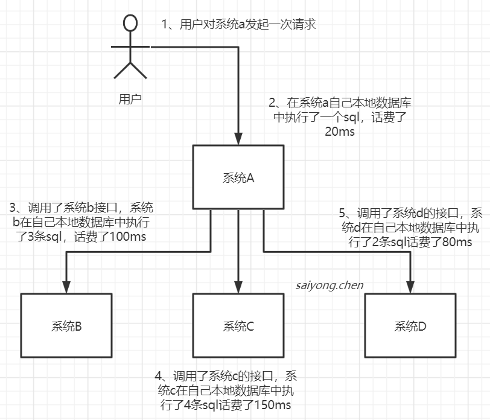
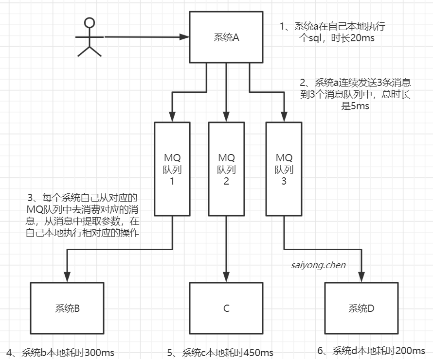
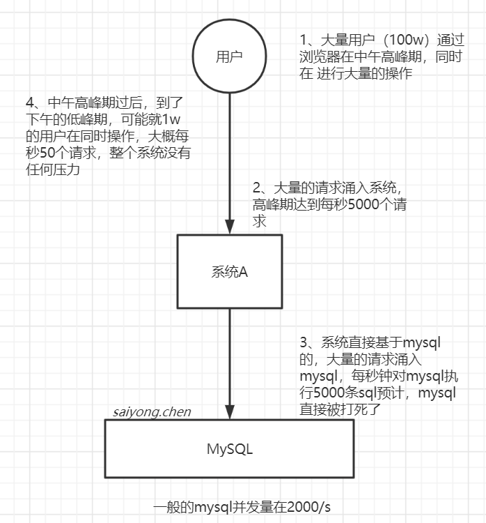
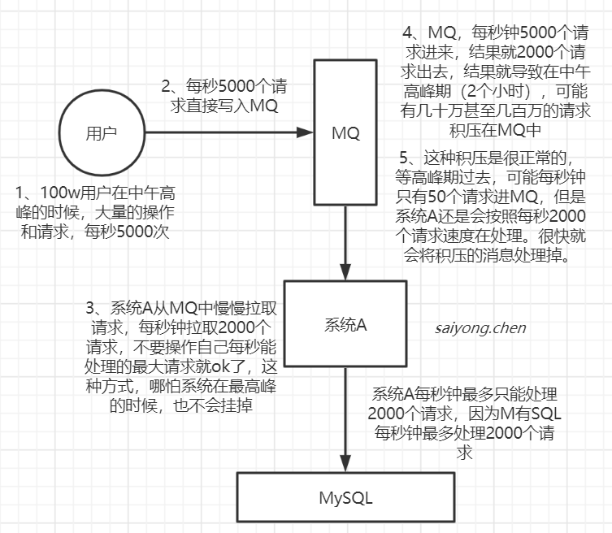
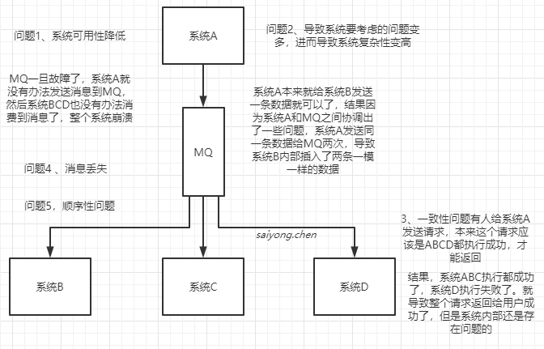

## 1. 什么是MQ（Message Queue）

消息队列，又叫消息中间件。指用高效可靠的消息传递机制进行与平台无关的数据交流，并基于数据同行来进行分布式系统的集成。通过同消息传递和消息队列模型，可以在分布式环境下扩展进程的通信。

所以MQ就是用来解决通信问题的，主要有以下几个特点？

1. 是一个独立运行的服务，生产者发送消息，消费者消费消息，需要与它先建立连接。
2. 采用队列作为数据结构，有先进先出的特点
3. 具有发布订阅的模型，消费者可以后去自己需要的消息。

我们可以把MQ想象成邮局，它是用来帮我们存储和转发消息的。

**Java中有很多队列的实现，为什么还需要另外使用MQ呢？**

java中的Queue不能跨进程，不成在分布式系统中使用，也没有持久化机制等等。

## 2. 为什么要使用MQ？

### 2.1 实现系统解耦

首先我们看一下没有使用MQ，系统之间的关系：

使用了MQ实现系统之间解耦的场景：

### 2.2 实现异步通信

先看一下在不使用MQ同步高延时的请求场景：

> 当用户发起一个请求，这个请求依次请求了系统a-b-c-d
>
> 4个步骤下来，完成这个请求的总时长是：350ms
>
> 假如我们将每个系统的执行耗时加长，b系统花费了300ms，c系统花费了450ms，d系统花费了200ms。
>
> 那么现在一个请求的耗时将边长为970ms
>
> 一般互联网企业，对一个用户的直接的操作，一般要求是每个请求都必须在200ms以内完成，对用户几乎是无感知的

在看一下使用了MQ实现了异步通信的场景：

> 如上图，当用户发送一个请求后，这个请求经过系统A，系统A在将消息发送给MQ成功后，直接返回。不用管下游的服务到底执行了多长时间。

### 2.3 实现流量削峰

先看一下没有使用MQ进行削峰，当大量请求进来导致系统服务宕机的场景：

我们知道MQ是队列，那就具有队列的特性：先进先出，我们可以使用MQ将所有的请求都承接下来，然后慢慢消费：

### 2.4 总结：

1. 对于数据量大或者处理耗时长的操作，我们可以引入MQ实现异步通信，减少客户端的等待时间，提升响应速度
2. 对于改动影响大的系统，可以引入MQ实现解耦，减少系统之间的耦合
3. 对于会瞬间出现流量峰值的系统，可以引入MQ实现流量削峰，来保护应用系统和数据库

## 3. 引入MQ会带来的问题

